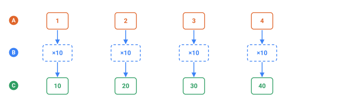
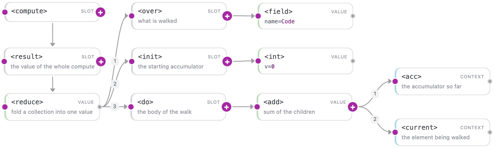
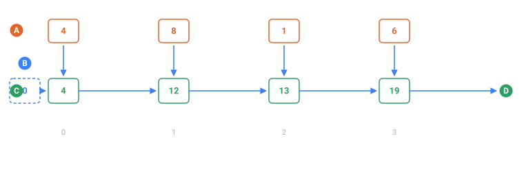

<a name="top"></a>

**English** · [Русский](../ru/compute/lists.md#top) · [Español](../es/compute/lists.md#top)

📖 **[Read this on the documentation site →](https://nickliapin.github.io/tdcv2/docs/compute/lists)**

← Previous: [Arithmetic](./arithmetic.md#top) · **[Contents](../README.md#top)** · Next: [Strings & formatting](./strings.md#top) →

---

# Lists & iteration

`list` is the third value type in the compute language, alongside `int` and `str`. You
build one with [`<list>`](#list--a-literal-list-of-values), walk it with
[`<each>`](#each--map-over-a-list) or [`<reduce>`](#reduce--fold-to-one-value), and turn
it back into a value with [`<join>`](#join--a-list-to-a-string),
[`<at>`](#at--index-into-a-list), or [`<length>`](#length--measure-a-string-or-list).

Two rules shape everything on this page:

- **A list can never leave `<compute>` on its own.** A sequence's value is a string, so a
  bare list has to be folded first — with `<join>` (to a string), `<reduce>` (to one
  value), or `<at>` (one element). This is why `<each>` almost always has a `<join>` or
  `<reduce>` wrapped around it.
- **A string iterates one character at a time.** A
  [`<field name="Base"/>`](../core-concepts/sequences.md#top) holding `"5120"` walks as
  `5, 1, 2, 0`, and each single digit auto-converts to an `int` for arithmetic. That is
  what makes checksums — which walk a value digit by digit — expressible here at all.
  Letters walk the same way: `"abc"` gives `a, b, c`.

Because every loop runs over a finite string or list, the language always terminates:
there are no unbounded loops.

## Where a list comes from

There are four sources, and only four. Every list on this page is one of them.

1. **Written out** — `<list v="10,20,30"/>`.
2. **A string, walked by character** — the `<over>` slot accepts a string and stands in
   for the list of its characters. This is the one that surprises people: nothing in the
   config says "split", the `<over>` slot simply accepts a string.
3. **The result of `<each>`** — a list in, a list out.
4. **A string cut on a separator** — `<split sep="|">`, the inverse of `<join>`, and the
   way to read back a column that `repeat=` glued together.

All three in one config:

```xml
<tdc>
    <env count="1" seed="src" local="en">
        <sequence name="Code"><gen type="text" value="4816"/></sequence>

        <sequence name="FromLiteral">
            <compute><result><join sep="-"><in><list v="10,20,30"/></in></join></result></compute>
        </sequence>

        <sequence name="FromString">
            <compute><result><join sep="-"><in>
                <each><over><field name="Code"/></over><do><current/></do></each>
            </in></join></result></compute>
        </sequence>

        <sequence name="FromEach">
            <compute><result><join sep="-"><in>
                <each><over><list v="1,2,3"/></over><do><multiply><current/><int v="10"/></multiply></do></each>
            </in></join></result></compute>
        </sequence>
    </env>
    <block><line><data>literal: ${{FromLiteral}} | string: ${{FromString}} | each: ${{FromEach}}</data></line></block>
</tdc>
```

`./run sources.tdc`

```
literal: 10-20-30 | string: 4-8-1-6 | each: 10-20-30
```

The middle one is the interesting column: `Code` is the string `4816`, and `<over>`
handed `<each>` four separate characters.

| Tag                                             | What it does                                                |
| :---------------------------------------------- | :---------------------------------------------------------- |
| [`<list>`](#list--a-literal-list-of-values)     | a literal list: `<list v="2,4,10"/>` or built from children |
| [`<each>`](#each--map-over-a-list)              | apply a body to each element → a new list                   |
| [`<reduce>`](#reduce--fold-to-one-value)        | fold a list into one value, through an accumulator          |
| [`<join>`](#join--a-list-to-a-string)           | a list → a string (attribute `sep`)                         |
| [`<at>`](#at--index-into-a-list)                | one element by index (attribute `default` if out of range)  |
| [`<length>`](#length--measure-a-string-or-list) | the length of a string or a list                            |

Example outputs on this page are illustrative — the exact values depend on the seed and
the core version — but each derived value is computed exactly from the input shown
beside it.

## `<list>` — a literal list of values

**Takes** `v=` with comma-separated **integers**, or child expressions → **gives** a list. Letters in `v=` are refused: `<list v="a,b"/>` fails with `"a" is not an integer`. For a list of words, build it from `<str>` children.

`<list>` is the list literal. It comes in two forms:

- **Short form** — comma-separated integers in the `v` attribute: `<list v="2,4,10"/>`.
  Surrounding spaces are trimmed and empty pieces are dropped (`" 2, ,4 "` → `2,4`); a
  non-integer piece is an error.
- **Children form** — a `<list>` with nested expression tags collects their values:
  `<list><int v="1"/><str v="a"/><field name="X"/></list>`. This is how a list can hold
  strings, not just numbers.

Use the short form for a fixed lookup table (the weights of a checksum); use the children
form to gather several fields or computed pieces before folding them.

### From expressions → a string

The children form gathers two fields into a list, and [`<join>`](#join--a-list-to-a-string)
renders it (the list itself can't be the result — only the joined string can):

```xml
<sequence name="A"><gen type="number" value="1..9"/></sequence>
<sequence name="B"><gen type="number" value="1..9"/></sequence>
<sequence name="Pair">
  <compute>
    <result>
      <join sep=",">
        <list>
          <field name="A"/>
          <field name="B"/>
        </list>
      </join>
    </result>
  </compute>
</sequence>
```

Each line is `${{Pair}}`:

`./run pair.tdc`

```
1,8
7,3
6,8
5,2
5,5
```

### As a weight table

The short form is a fixed table shared by every row; [`<at>`](#at--index-into-a-list)
pulls one element out by position:

```xml
<sequence name="Idx"><gen type="number" value="0..4"/></sequence>
<sequence name="Weight">
  <compute>
    <result>
      <at>
        <in><list v="7,3,1,9,5"/></in>
        <index><field name="Idx"/></index>
      </at>
    </result>
  </compute>
</sequence>
```

Each line is `idx ${{Idx}} -> weight ${{Weight}}`:

`./run weight.tdc`

```
idx 1 -> weight 3
idx 0 -> weight 7
idx 0 -> weight 7
idx 3 -> weight 9
idx 1 -> weight 3
```

The list `7,3,1,9,5` is identical for every row; only the index changes.

## `<each>` — map over a list



*One <do>, run once per element: four elements in, four out.*

- **A** — the list <over> walks — one element per column
- **B** — the <do> expression, the same one at every step, drawn dashed because it is one tag and not four
- **C** — the list <each> gives back, in the same order

**Takes** the slots `<over>` (the list) and `<do>` (what to make of one element) → **gives** a **list**, not a string. That is why a `<join>` or a `<reduce>` almost always wraps it: putting the result straight into a string fails with `cannot use a list where a string is expected`.

`<each>` walks a collection, applies the `<do>` body to **each** element, and collects the
results into a **new list of the same length** — the "map" of the compute language.

- It takes two wrappers: `<over>` (what to iterate over) and `<do>` (what to compute). A
  missing wrapper is a tree error (`TDC187`).
- Inside `<do>`, `<current/>` is the element and `<current_index/>` is its zero-based
  position.
- The collection is a **string** (each element is a one-character string; a lone digit
  auto-converts to an `int` for arithmetic) or a **list**.
- The output is **always a list**, so before it leaves `<compute>` you fold it with
  [`<reduce>`](#reduce--fold-to-one-value) or render it with
  [`<join>`](#join--a-list-to-a-string).

`<each>` takes no attributes — everything is set by `<over>` and `<do>`.

### Shift every digit

Add one to each digit and take it mod 10 (so `9` wraps to `0`), then glue the digits back
with [`<join>`](#join--a-list-to-a-string):

```xml
<sequence name="Pin"><gen type="number" value="1000..9999"/></sequence>
<sequence name="Shift">
  <compute>
    <result>
      <join sep="">
        <each>
          <over><field name="Pin"/></over>
          <do><mod><add><current/><int v="1"/></add><int v="10"/></mod></do>
        </each>
      </join>
    </result>
  </compute>
</sequence>
```

Each line is `${{Pin}} -> ${{Shift}}`:

`./run shift.tdc`

```
3115 -> 4226
9917 -> 0028
5120 -> 6231
5815 -> 6926
9444 -> 0555
```

`Pin` iterates character by character: each digit is a one-character string, so
[`<add>`](arithmetic.md#top) accepts it without [`<to_number>`](arithmetic.md#top). [`<mod>`](arithmetic.md#top) with `10` keeps the
result a single digit. `<each>` yields the list of shifted digits, and `<join sep="">`
concatenates them with no separator.

### Tag each element with its index

Inside `<do>`, `<current_index/>` gives the element's position. Build `index:char` pieces
and join them with a space:

```xml
<sequence name="Base"><gen type="number" value="100..900"/></sequence>
<sequence name="Labeled">
  <compute>
    <result>
      <join sep=" ">
        <each>
          <over><field name="Base"/></over>
          <do><concat><current_index/><str v=":"/><current/></concat></do>
        </each>
      </join>
    </result>
  </compute>
</sequence>
```

Each line is `${{Base}} -> ${{Labeled}}`:

`./run labeled.tdc`

```
541 -> 0:5 1:4 2:1
436 -> 0:4 1:3 2:6
567 -> 0:5 1:6 2:7
214 -> 0:2 1:1 2:4
597 -> 0:5 1:9 2:7
```

**Use it when** you need a per-element transform — shift or mask each digit, encode each
character with [`<encode>`](arithmetic.md#top), or build the list of terms a checksum will
later sum.

## `<reduce>` — fold to one value

**Takes** the slots `<over>`, `<init>` and `<do>` → **gives** one value.

### The four parts, as a piggy bank

You walk along a list holding a jar. At each step you look at the item in your hand and
decide what goes into the jar. When the list ends, the jar is the answer.

| Tag               | The jar version                     | What it holds                             |
| :---------------- | :---------------------------------- | :---------------------------------------- |
| `<init>`          | what is in the jar before you start | the starting value                        |
| `<over>`          | the shelf you walk along            | the list or string                        |
| `<do>`            | what you do at each step            | an expression, evaluated once per element |
| `<acc>`           | what is in the jar right now        | the value `<do>` produced last time       |
| `<current>`       | the item in your hand               | the element at this step                  |
| `<current_index>` | which step this is, counting from 0 | a number                                  |

`<over>`, `<init>` and `<do>` are slots: three different jobs, so three different names.
Their order in the file does not matter, but leaving one out does — all three are
required.



*The same fold on the Studio canvas — the three slots hang off the fold itself, while the accumulator and the current element arrive as context of the walk.*

### Step by step



*Summing the digits of 4816. The jar is handed from step to step; the digit above joins it.*

- **A** — the characters <over> walks, one per step, numbered from 0 underneath
- **B** — what <init> puts in the jar before the first step, drawn dashed because it is a starting value and not a step
- **C** — the jar after each step — this is what <acc/> reads on the next one
- **D** — the jar after the last step, which is what <reduce> gives back

Summing the digits of `4816`:

```xml
<tdc>
    <env count="1" seed="r" local="en">
        <sequence name="Code"><gen type="text" value="4816"/></sequence>
        <sequence name="Sum">
            <compute>
                <result>
                    <reduce>
                        <over><field name="Code"/></over>
                        <init><int v="0"/></init>
                        <do><add><acc/><current/></add></do>
                    </reduce>
                </result>
            </compute>
        </sequence>
    </env>
    <block><line><data>${{Code}} → ${{Sum}}</data></line></block>
</tdc>
```

`./run sum.tdc`

```
4816 → 19
```

Four steps, one row each. `acc` before a step is whatever the previous step returned;
`<init>` supplies the very first one.

| Step | `<current_index/>` | `<current/>` | `<acc/>` before | `<do>` computes | `<acc/>` after |
| ---: | -----------------: | -----------: | --------------: | :-------------- | -------------: |
|    1 |                  0 |            4 |               0 | 0 + 4           |              4 |
|    2 |                  1 |            8 |               4 | 4 + 8           |             12 |
|    3 |                  2 |            1 |              12 | 12 + 1          |             13 |
|    4 |                  3 |            6 |              13 | 13 + 6          |             19 |

The jar after the last step — `19` — is what `<reduce>` gives back.

`<reduce>` walks a collection and **folds** it into a single value: it seeds an accumulator,
then recomputes it for every element. Unlike [`<each>`](#each--map-over-a-list), which
returns a list, `<reduce>` produces **one** value (an `int` or a `str`) that can come
straight out of `<compute>`. This is how checksums are built — a Luhn card digit, a
weighted mod-11 ID digit, an IBAN mod-97.

- It takes three wrappers: `<over>` (the collection), `<init>` (the accumulator's starting
  value), and `<do>` (the per-element body). A missing wrapper is a tree error (`TDC187`).
- Inside `<do>` you get `<acc/>` (what's accumulated so far), `<current/>` (the element),
  and `<current_index/>` (its zero-based position).
- The collection is a **string** (walked character by character; a lone digit auto-converts)
  or a **list**.
- The accumulator isn't limited to a sum — it can hold a maximum, a product, even a string.
  It's whatever you put back into `<acc/>` each step.

`<reduce>` takes no attributes — everything is set by `<over>`, `<init>`, and `<do>`.

### Sum the digits

The most common case: start at `0`, add each digit to the accumulator:

```xml
<sequence name="Pin"><gen type="number" value="1000..9999"/></sequence>
<sequence name="DigitSum">
  <compute>
    <result>
      <reduce>
        <over><field name="Pin"/></over>
        <init><int v="0"/></init>
        <do><add><acc/><current/></add></do>
      </reduce>
    </result>
  </compute>
</sequence>
```

Each line is `${{Pin}} -> sum ${{DigitSum}}`:

`./run digitsum.tdc`

```
3115 -> sum 10
9917 -> sum 26
5120 -> sum 8
5815 -> sum 19
9444 -> sum 21
```

`3 + 1 + 1 + 5 = 10`, `9 + 9 + 1 + 7 = 26`. Each digit arrives as a one-character string
and auto-converts to a number, so no `<to_number>` is needed.

### A weighted check digit

This is the classic case, and the pattern that finishes off many account and national-ID
numbers. Each position has its own weight; pull the weight by index with
[`<at>`](#at--index-into-a-list), multiply it by the digit, sum everything, then turn the
sum into a check digit with a double [`<mod>`](arithmetic.md#top) (`% 11`, then `% 10`) and
[`<concat>`](strings.md#top) it onto the base:

```xml
<sequence name="Base"><gen type="number" value="100000000..999999999"/></sequence>
<sequence name="Account">
  <compute>
    <let name="check">
      <mod><mod>
        <reduce>
          <over><field name="Base"/></over>
          <init><int v="0"/></init>
          <do><add><acc/><multiply><current/>
            <at><in><list v="2,4,10,3,5,9,4,6,8"/></in><index><current_index/></index></at>
          </multiply></add></do>
        </reduce>
        <int v="11"/></mod><int v="10"/></mod>
    </let>
    <result><concat><field name="Base"/><var name="check"/></concat></result>
  </compute>
</sequence>
```

Each line is `${{Base}} -> ${{Account}}`:

`./run account.tdc`

```
596215738 -> 5962157388
478374300 -> 4783743000
625770577 -> 6257705772
228098087 -> 2280980875
659123186 -> 6591231869
```

`<reduce>` accumulates the weighted sum: `<current_index/>` selects the weight from
`2,4,10,…`, `<multiply>` scales the digit, and `<add>` folds it into `<acc/>`. The sum
becomes a check digit, and `<concat>` appends it to the base — a correct ten-digit number.

### An accumulator that isn't a sum

The accumulator holds the largest digit seen so far; each step uses
[`<choose>`](conditionals.md#top) to keep whichever is greater, the digit or the accumulator:

```xml
<sequence name="Pin"><gen type="number" value="1000..9999"/></sequence>
<sequence name="MaxDigit">
  <compute>
    <result>
      <reduce>
        <over><field name="Pin"/></over>
        <init><int v="0"/></init>
        <do>
          <choose>
            <when><test><greater_than><current/><acc/></greater_than></test>
                  <then><current/></then></when>
            <otherwise><acc/></otherwise>
          </choose>
        </do>
      </reduce>
    </result>
  </compute>
</sequence>
```

Each line is `${{Pin}} -> max ${{MaxDigit}}`:

`./run maxdigit.tdc`

```
3115 -> max 5
9917 -> max 9
5120 -> max 5
5815 -> max 8
9444 -> max 9
```

Starting at `0` works because digits are non-negative. Each step compares `<current/>`
against `<acc/>` and keeps the larger — proof that `<reduce>` does more than add things
up.

**Use it when** you need a single value out of a list: a checksum, a total, a product, a
running max or min. When you want a **list** of results instead, reach for
[`<each>`](#each--map-over-a-list).

## `<join>` — a list to a string

**Takes** the slot `<in>` (the list) plus `sep=` → **gives** a string. With no `sep=` the elements are glued with nothing between them.

`<join>` turns a **list** into a **string**: it renders each element to text and connects
them with the `sep` separator. It's the main way to **get a list out of `<compute>`** — a
bare list can't become a sequence value, but after `<join>` it's an ordinary string. It
usually sits right after [`<each>`](#each--map-over-a-list).

- Each element is rendered to text: a number becomes its decimal form, a string stays as is.
- The input **must be a list** — a lone number or string is an error.

| Attribute | Required | Default      | What it sets                          |
| :-------- | :------- | :----------- | :------------------------------------ |
| `sep`     | no       | `""` (empty) | the separator placed between elements |

### Build a compound value

Put three numbers in a [`<list>`](#list--a-literal-list-of-values) and join them with dots
to form `major.minor.patch`. The field values are strings, so wrap them in
[`<to_number>`](arithmetic.md#top) to make the list numeric:

```xml
<sequence name="A"><gen type="number" value="10..99"/></sequence>
<sequence name="B"><gen type="number" value="10..99"/></sequence>
<sequence name="C"><gen type="number" value="10..99"/></sequence>
<sequence name="Ver">
  <compute>
    <result>
      <join sep=".">
        <list>
          <to_number><field name="A"/></to_number>
          <to_number><field name="B"/></to_number>
          <to_number><field name="C"/></to_number>
        </list>
      </join>
    </result>
  </compute>
</sequence>
```

Each line is `${{Ver}}`:

`./run version.tdc`

```
10.83.55
73.32.50
67.82.98
59.29.97
56.58.26
```

### Space out digits (`<join>` after `<each>`)

The common pair: [`<each>`](#each--map-over-a-list) turns a string into the list of its
characters, and `<join>` reassembles them — now with a separator:

```xml
<sequence name="Card"><gen type="number" value="10000000..99999999"/></sequence>
<sequence name="Spaced">
  <compute>
    <result>
      <join sep=" ">
        <each>
          <over><field name="Card"/></over>
          <do><current/></do>
        </each>
      </join>
    </result>
  </compute>
</sequence>
```

Each line is `${{Card}} -> ${{Spaced}}`:

`./run spaced.tdc`

```
76899955 -> 7 6 8 9 9 9 5 5
96915004 -> 9 6 9 1 5 0 0 4
71643027 -> 7 1 6 4 3 0 2 7
27885493 -> 2 7 8 8 5 4 9 3
46564820 -> 4 6 5 6 4 8 2 0
```

**Use it when** you're getting a list out of `<compute>` (almost always after `<each>`), or
assembling a compound value — a version, a path, coordinates. For fixed right-to-left
grouping of a single string, [`<group>`](strings.md#top) is simpler; `<join>` works on list
elements.

## `<split>` — a string to a list

**Takes** the slot to cut plus `sep=` → **gives** a list of strings.

The exact inverse of [`<join>`](#join--a-list-to-a-string), and the **fourth** source of a
list. It exists for one shape in particular: a column built with
[`repeat=`](../generators/overview.md#top) arrives as its elements glued into a single string,
and until `<split>` there was no way to read them back apart. "Sum quantity × price over the
lines of this order" could not be written at all unless the two lists happened to be the same
length.

| Attribute | Required | Default | What it sets                       |
| :-------- | :------- | :------ | :--------------------------------- |
| `sep`     | **yes**  | —       | the separator to cut on            |

- The pieces are **strings**, like every other piece of text in this layer. Wrap one in
  [`<to_number>`](./arithmetic.md#top) to do arithmetic with it.
- `sep=` is one separator, not a set of characters: `sep=", "` cuts on comma-space.
- An **empty piece is kept**. `a||c` is three elements with a blank in the middle — dropping
  it would slide every later element into the wrong position.
- A separator that does not occur gives the whole string as **one** piece.
- `sep=""` is **refused**. Walking a string character by character is what `<over>` does with
  a plain string, and an empty separator would have to mean the same thing — spelled a second
  way, differently in each language.

### Σ quantity × price over the lines of one order

```xml
<sequence name="Qty"><gen type="number" value="1..5" repeat="3" separator="|"/></sequence>
<sequence name="Price"><gen type="number" value="10..99" repeat="3" separator="|"/></sequence>
<sequence name="Total">
    <compute><result>
        <reduce>
            <over><split sep="|"><field name="Qty"/></split></over>
            <init><int v="0"/></init>
            <do>
                <add>
                    <acc/>
                    <multiply>
                        <to_number><current/></to_number>
                        <to_number>
                            <at>
                                <in><split sep="|"><field name="Price"/></split></in>
                                <index><current_index/></index>
                            </at>
                        </to_number>
                    </multiply>
                </add>
            </do>
        </reduce>
    </result></compute>
</sequence>
```

`./run order.tdc (3 rows)`

```
5|1|1 @ 22|14|77 -> 201
4|3|3 @ 58|91|62 -> 691
2|5|2 @ 42|13|72 -> 293
```

`<current_index/>` is what pairs the two lists: element *k* of the quantities multiplies
element *k* of the prices.

### Counting and indexing

```xml
<sequence name="Tags"><gen type="text" value="red;green;blue"/></sequence>
<sequence name="Count">
    <compute><result><length><split sep=";"><field name="Tags"/></split></length></result></compute>
</sequence>
<sequence name="Second">
    <compute><result><at>
        <in><split sep=";"><field name="Tags"/></split></in>
        <index><int v="1"/></index>
    </at></result></compute>
</sequence>
```

`./run tags.tdc (1 row)`

```
3 tags, the second is "green"
```

## `<at>` — index into a list

**Takes** the slots `<in>` (the list) and `<index>` (a number, counting from 0) → **gives** one element. An index past the end is an error unless a default is set.

`<at>` pulls one element out of a list by its **zero-based** position. It's ideal for
**lookup tables**: an index in, a finished value out (a checksum weight, a region name,
a tax rate).

- It takes two wrappers: `<in>` (which list) and `<index>` (which position). A missing
  wrapper is a tree error (`TDC187`).
- The index is coerced to an `int`: a one-character digit string (a field holding `"3"`)
  works as is; wrap a multi-digit string in [`<to_number>`](arithmetic.md#top) first.
- `<in>` must be a **list** ([`<list>`](#list--a-literal-list-of-values) or the result of
  [`<each>`](#each--map-over-a-list)).
- **Out of range:** if the `default` attribute is set, it's returned; without `default`,
  it's an error. That's how a table gets a fallback value.

| Attribute | Required | Default | What it sets                                        |
| :-------- | :------- | :------ | :-------------------------------------------------- |
| `default` | no       | —       | the integer returned when the index is out of range |

### A lookup table

A list of names and an index from a field. `Idx` is a single digit `0..4`, so it needs no
[`<to_number>`](arithmetic.md#top):

```xml
<sequence name="Idx"><gen type="number" value="0..4"/></sequence>
<sequence name="City">
  <compute>
    <result>
      <at>
        <in><list>
          <str v="New York"/>
          <str v="Chicago"/>
          <str v="Houston"/>
          <str v="Phoenix"/>
          <str v="Denver"/>
        </list></in>
        <index><field name="Idx"/></index>
      </at>
    </result>
  </compute>
</sequence>
```

Each line is `${{Idx}} -> ${{City}}`:

`./run city.tdc`

```
1 -> Chicago
0 -> New York
0 -> New York
3 -> Phoenix
1 -> Chicago
```

The list of strings is built with the children form of
[`<list>`](#list--a-literal-list-of-values), and `<at>` returns the element at `Idx` —
a substitution table in a handful of lines.

### A fallback for out-of-range access

The list has three prices (positions `0..2`), but the index comes from `0..6`. For `3..6`
there's no element, so `default="0"` kicks in:

```xml
<sequence name="Idx"><gen type="number" value="0..6"/></sequence>
<sequence name="Price">
  <compute>
    <result>
      <at default="0">
        <in><list v="100,200,300"/></in>
        <index><field name="Idx"/></index>
      </at>
    </result>
  </compute>
</sequence>
```

Each line is `idx ${{Idx}} -> ${{Price}}`:

`./run price.tdc`

```
idx 2 -> 300
idx 0 -> 100
idx 0 -> 100
idx 4 -> 0
idx 1 -> 200
idx 1 -> 200
```

Indexes `0..2` hit a price; `idx 4` is past the end, so instead of raising an error it
returns `default` — here, `0`. Without `default`, that row would fail at generation time.

**Use it when** you need a lookup table (a checksum weight by position, a code, a rate by
tier) or safe indexed access where `default` replaces "no such element" with a sensible
value.

## `<length>` — measure a string or list

**Takes** one string or list → **gives** a number: characters in a string, elements in a list. It counts characters, not bytes — `👍ab` is 3.

`<length>` returns a **length** — the number of characters if its child is a string, the
number of elements if its child is a list. The result is always an `int`, so you can keep
computing with it: compare it, divide by it, pad to it.

- `<length>STRING</length>` — the count of characters (code points) in the string.
- `<length>LIST</length>` — the count of elements in the list (for example, the result of
  [`<each>`](#each--map-over-a-list)).
- The input must be a string or a list — a number is an error.

`<length>` takes no attributes — it measures its single child.

### Characters in a string

The field value is a string, and `<length>` counts its characters:

```xml
<sequence name="City"><gen type="text" value="Reno,Boston,Ada,Sacramento,Chicago"/></sequence>
<sequence name="Len">
  <compute>
    <result>
      <length><field name="City"/></length>
    </result>
  </compute>
</sequence>
```

Each line is `${{City}} -> ${{Len}} letters`:

`./run length.tdc`

```
Boston     -> 6 letters
Reno       -> 4 letters
Ada        -> 3 letters
Sacramento -> 10 letters
Chicago    -> 7 letters
```

Each character is one code point, so `Sacramento` gives `10`.

### Length as a denominator

A realistic case: divide the digit sum from [`<reduce>`](#reduce--fold-to-one-value) by the
digit count — `<length>` supplies the denominator. [`<divide>`](arithmetic.md#top) is integer
division (rounding down):

```xml
<sequence name="Pin"><gen type="number" value="1000..9999"/></sequence>
<sequence name="Avg">
  <compute>
    <result>
      <divide>
        <reduce>
          <over><field name="Pin"/></over>
          <init><int v="0"/></init>
          <do><add><acc/><current/></add></do>
        </reduce>
        <length><field name="Pin"/></length>
      </divide>
    </result>
  </compute>
</sequence>
```

Each line is `${{Pin}} -> avg ${{Avg}}`:

`./run avg.tdc`

```
3115 -> avg 2
9917 -> avg 6
5120 -> avg 2
5815 -> avg 4
9444 -> avg 5
```

For `3115`: sum `10`, length `4`, `10 / 4 = 2` (the fractional part is dropped).

### Elements in a list

`<length>` measures lists too. [`<each>`](#each--map-over-a-list) turns a string into the
list of its characters, and `<length>` counts how many it produced:

```xml
<sequence name="Num"><gen type="number" value="[1..9],[10..99],[1000..99999]"/></sequence>
<sequence name="Count">
  <compute>
    <result>
      <length>
        <each>
          <over><field name="Num"/></over>
          <do><current/></do>
        </each>
      </length>
    </result>
  </compute>
</sequence>
```

Each line is `${{Num}} -> ${{Count}} elements`:

`./run count.tdc`

```
79 -> 2 elements
67 -> 2 elements
30181 -> 5 elements
8 -> 1 elements
90 -> 2 elements
```

`<each>` returns the list of characters, and `<length>` counts its elements — here that
equals the number of digits in the input.

**Use it when** an algorithm's shape depends on the input size: length-dependent weights, an
average or ratio, a check that compares the length to a target with
[`<choose>`](conditionals.md#top).

## See also

- **[Arithmetic](arithmetic.md#top)** — the integer operations you fold and index with.
- **[Strings & formatting](strings.md#top)** — `<concat>`, `<group>`, and the rest.
- **[Conditionals](conditionals.md#top)** — `<choose>` and the predicates used above.
- **[Compute overview](overview.md#top)** — `<reduce>` inside a full checksum.
- **[Compute functions reference](../reference/compute.md#top)** — the full alphabetical catalog.

---

← Previous: [Arithmetic](./arithmetic.md#top) · **[Contents](../README.md#top)** · Next: [Strings & formatting](./strings.md#top) →

📖 **[Read this on the documentation site →](https://nickliapin.github.io/tdcv2/docs/compute/lists)**
