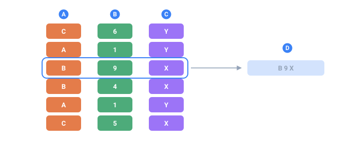

<a name="top"></a>

**English** · [Русский](../ru/core-concepts/sequences.md#top) · [Español](../es/core-concepts/sequences.md#top)

📖 **[Read this on the documentation site →](https://nickliapin.github.io/tdcv2/docs/core-concepts/sequences)**

← Previous: [Configuration structure](./configuration.md#top) · **[Contents](../README.md#top)** · Next: [Output & formatting](./output-formatting.md#top) →

---

# Sequences

A `<sequence>` declares a named column of values, `count` rows long. Think of it as a
finished column that exists before rendering starts: the
[generator](../generators/overview.md#top) fills every row, and as each output row is
rendered you pull a value out by name, either with
[interpolation](output-formatting.md#top) `${{Name}}` or inside an `if` condition.

That is the **logical** model, and everything on this page follows from it. Whether the
column is really held in memory is a separate question the engine answers for you: the
default engine computes each value from its row number as the row streams past and never
holds the column at all, while `mode="memory"` and the object API do build the array. The
values are the same either way — see [Large outputs](../guides/large-outputs.md#top).

Sequences live in `<env>`, right next to `count` and `seed`. The row layout (in
`<block>`) never generates anything itself — it only reads the columns your sequences
have already produced.

The example outputs below are **illustrative**: they show the shape of the result and
can differ between core versions.



*Six rows of a real run. Each sequence fills its own column, and a row is what you get by reading across them.*

- **A** — one sequence — one column, filled independently
- **B** — a second sequence, which knows nothing about the first
- **C** — a third
- **D** — one row: the same position taken from every column and assembled into a line of output

## Attributes

| Attribute | Required | What it does                                                        |
| :-------- | :------- | :------------------------------------------------------------------ |
| `name`    | **yes**  | The sequence's name — how you reference it, e.g. `${{City}}`        |
| `parent`  | no       | Restricts this sequence to a subset of rows. Syntax: `Parent.Value` |
| `comment` | no       | A free-text note; ignored by the engine                             |

Every sequence needs at least one [`<gen>`](../generators/overview.md#top) child — that's
what produces the actual values.

## A simple sequence

**Use it when** you need a single column you can reference by name from anywhere in
the layout. Declare it once in `<env>`, then read it with `${{City}}`:

```xml
<tdc>
    <env count="5" seed="demo">
        <sequence name="City">
            <gen type="text" value="Austin,Denver,Boston"/>
        </sequence>
    </env>
    <block>
        <line><data>${{City}}</data></line>
    </block>
</tdc>
```

`./run city.tdc (count=5, seed=demo)`

```
Denver
Austin
Boston
Denver
Boston
```

By default the values are picked **randomly** from the list, and the
[`seed`](determinism.md#top) fixes exactly which ones you get. For strict list order instead,
add `order="sequential"`, described in [Masks & case](../guides/masks-and-case.md#top).

What makes a sequence "simple" is having **exactly one unnamed** `<gen>`. You read it as
`${{SequenceName}}`.

### With proportions

The same one-column shape handles weighted picks. Give the
[`text`](../generators/text.md#top) generator a `percent` list and the values come out in
exact proportions:

```xml
<sequence name="Gender">
    <gen type="text" value="Male,Female" percent="60,40"/>
</sequence>
```

Over `count=100` that gives you exactly 60 `Male` and 40 `Female` — `percent` is an
exact split across the run, not a per-row probability. See
[Determinism & proportions](determinism.md#top) for how it's enforced.

`./run gender.tdc (count=100)`

```
Male     60
Female   40
```

## A composed sequence

**Use it when** one value is built out of several — a full name from a first name,
a space and a last name. Leave the `<gen>`s **unnamed** and put the literal text
between them:

```xml
<sequence name="FullName">
    <gen type="template" value="person.male.firstName"/>
    <data> </data>
    <gen type="template" value="person.lastName"/>
</sequence>
```

`./run people.tdc`

```
Robert Williams
James Johnson
John Smith
```

`${{FullName}}` is one value, so it goes into a card, a CSV column or a Parquet
column as it stands — there is nothing to join at the output.

Named and unnamed `<gen>`s can share one body. The unnamed ones build the
sequence's own value; a named one is a field beside it, reached as
`${{Name.Field}}` and contributing nothing to the concatenation.

## A compound sequence

**Use it when** one entity has several related fields — first name, last name, age —
that belong together. Group them into a single sequence instead of three separate ones,
and give **every** `<gen>` a `name`:

```xml
<sequence name="Person">
    <gen name="FirstName" type="template" value="person.male.firstName"/>
    <gen name="LastName"  type="template" value="person.lastName"/>
    <gen name="Age"       type="number"   value="18..60"/>
</sequence>
```

Refer to the fields with a dot:

```xml
<line><data>${{Person.FirstName}} ${{Person.LastName}}, age ${{Person.Age}}</data></line>
```

`./run people.tdc`

```
James Anderson, age 34
Robert Williams, age 51
Michael Brown, age 27
```

### A constant field

A `<data>` with a `name` is a **constant field** — and, unlike a one-value
generator, it costs **no draw**:

```xml
<sequence name="Row">
    <gen name="id"     type="increment" value="1"/>
    <data name="source">import-2026</data>
</sequence>
```

`${{Row.source}}` is `import-2026` on every record.

> [!TIP]
> **Why not `<gen type="text" value="import-2026"/>`**
>
> It produces the same value and still takes one draw per row, so dropping it into
> an existing config shifts **every column declared after it**. A named `<data>`
> takes none, which makes it the only way to add a constant to a config someone is
> already using.

### Compound rules

- A `<gen>` with a `name` is a **field**; one without is part of the sequence's own
  value (see [a composed sequence](#a-composed-sequence) above). A body where every
  `<gen>` is named is a compound and has no value of its own.
- Field names must be **unique** within the sequence (error `TDC111` on a duplicate).
- All the fields share the **same
  [`parent`](../guides/hierarchical-dependencies.md#top) filter**. If a parent is set,
  every field is filled in only on the matching rows and left empty on the rest.
- A reference to a compound sequence **without** a field — `${{Person}}` — is left in
  the output text **as-is**. That untouched placeholder is your hint that you meant
  `${{Person.FieldName}}`.

### Fields in `if` conditions

Dotted names work inside conditions too, not just in `${{...}}`:

```xml
<line if="Person.Age >= 18"><data>adult</data></line>
<line if="Person.Age < 18"><data>minor</data></line>
```

## A conditional sequence

**Use it when** a column's value depends on another column. List several
`<gen if="…">` branches; the **first** one whose condition is true wins. An **unnamed**
`<gen>` (no `if`) acts as the "else":

```xml
<sequence name="Age">
    <gen type="number" value="0..90"/>
</sequence>

<sequence name="AgeGroup">
    <gen if="Age < 18" type="text" value="Minor"/>
    <gen if="Age < 65" type="text" value="Adult"/>
    <gen               type="text" value="Senior"/>
</sequence>
```

Because the branches are tested top to bottom, `Age < 65` only ever sees rows that
already failed `Age < 18`, so it effectively means "18–64". You read the result by
sequence name, `${{AgeGroup}}`:

`./run agegroup.tdc`

```
14  Minor
42  Adult
71  Senior
9   Minor
58  Adult
```

A conditional sequence is still a single column — you read it as `${{AgeGroup}}`, just
like a simple one. The extra `<gen>` tags only decide _which_ value fills each row.

## Dependent sequences (`parent`)

A sequence can depend on another one with `parent="Parent.Value"`. The child is computed
**only** on rows where the parent matches, and any percentages inside it are counted
against that subset rather than the whole `count`. This is the heart of TDC's
hierarchical model:

```xml
<sequence name="Gender">
    <gen type="text" value="Male,Female" percent="50,50"/>
</sequence>

<sequence name="MaleName" parent="Gender.Male">
    <gen type="template" value="person.male.firstName"/>
</sequence>

<sequence name="FemaleName" parent="Gender.Female">
    <gen type="template" value="person.female.firstName"/>
</sequence>
```

`MaleName` materializes only on rows where `Gender == Male`; on every other row it's
empty. The full treatment — nested percentages, multiple levels — is in
**[Hierarchical dependencies](../guides/hierarchical-dependencies.md#top)**.

### A compound sequence with `parent`

Compound sequences and `parent` work together with no special handling. Here each gender
gets its own grouped entity, and the male subset carries an extra `Rank` field:

```xml
<sequence name="Gender">
    <gen type="text" value="Male,Female" percent="50,50"/>
</sequence>

<sequence name="Male" parent="Gender.Male">
    <gen name="FirstName" type="template" value="person.male.firstName"/>
    <gen name="LastName"  type="template" value="person.lastName"/>
    <gen name="Rank"      type="text"     value="Private,Captain" percent="70,30"/>
</sequence>

<sequence name="Female" parent="Gender.Female">
    <gen name="FirstName" type="template" value="person.female.firstName"/>
    <gen name="LastName"  type="template" value="person.lastName"/>
</sequence>

<block>
    <line if="Gender == Male"><data>M: ${{Male.FirstName}} ${{Male.LastName}} (${{Male.Rank}})</data></line>
    <line if="Gender == Female"><data>F: ${{Female.FirstName}} ${{Female.LastName}}</data></line>
</block>
```

`./run ranks.tdc (count=6, seed=demo)`

```
M: James Anderson (Private)
F: Emma Johnson
M: Robert Williams (Captain)
M: Michael Brown (Private)
F: Olivia Davis
F: Sophia Miller
```

What this guarantees:

- All three `Male.*` fields materialize **only** on the male rows and stay empty on the
  female ones (and vice versa).
- `Male.Rank` is split `70% Private, 30% Captain` **within the male subset** — the
  percentages are measured against the number of men, not the total `count`.

## Determinism & field order

The fields of a compound sequence are materialized **in declaration order**, and each
`<gen>` draws from the [PRNG](determinism.md#top) independently. That has one consequence
worth remembering:

**Swapping two `<gen name="…">` tags changes the output at the same seed.** The first
field now drains a different slice of the random stream, so every field after it shifts
too.

```xml
<!-- These two produce DIFFERENT values at the same seed -->
<sequence name="Person">
    <gen name="FirstName" type="template" value="person.male.firstName"/>
    <gen name="Age"       type="number"   value="18..60"/>
</sequence>

<sequence name="Person">
    <gen name="Age"       type="number"   value="18..60"/>
    <gen name="FirstName" type="template" value="person.male.firstName"/>
</sequence>
```

If you need byte-identical output across runs, **settle on a field order and leave it
alone** once you've committed to a seed. For more on what the seed does and doesn't
guarantee, see [Determinism & proportions](determinism.md#top).

## Related value sources

Two other named sources live alongside `<sequence>` in `<env>`, and you read them with
`${{Name}}` the same way:

- **[`<mix>`](../constructs/mix.md#top)** — a distribution by exact percent, where each
  branch can be a whole compound of literals and generators, not just a single value.
- **[`<switch>`](../constructs/switch.md#top)** — a deterministic key → value lookup table.

When all you need is one column of random or weighted values, `<sequence>` is the right
tool.

## Next

- **[Generators](../generators/overview.md#top)** — the `<gen>` that produces a
  sequence's values.
- **[Determinism & proportions](determinism.md#top)** — how `seed`, `count`, and
  `percent` fit together.
- **[Hierarchical dependencies](../guides/hierarchical-dependencies.md#top)** — the full
  `parent` model.

---

← Previous: [Configuration structure](./configuration.md#top) · **[Contents](../README.md#top)** · Next: [Output & formatting](./output-formatting.md#top) →

📖 **[Read this on the documentation site →](https://nickliapin.github.io/tdcv2/docs/core-concepts/sequences)**
