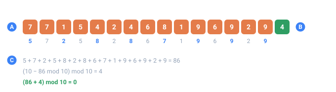
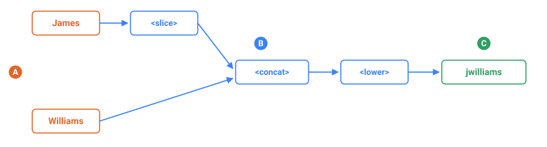
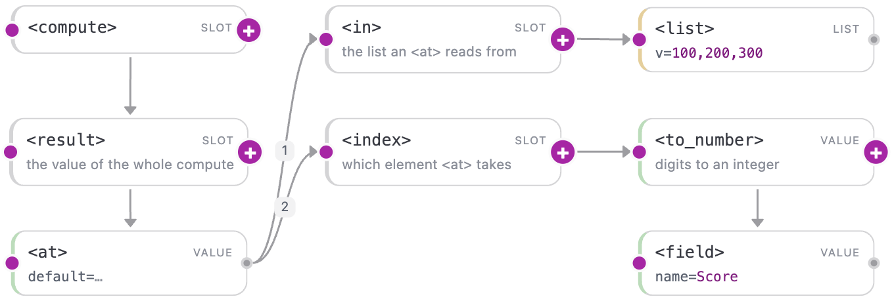

<a name="top"></a>

[English](../../compute/overview.md#top) · [Русский](../../ru/compute/overview.md#top) · **Español**

📖 **[Abrir en el sitio de documentación →](https://nickliapin.github.io/tdcv2/es/docs/compute/overview)**

← Anterior: [Configuraciones que se comprueban solas (assert)](../constructs/self-checking.md#top) · **[Contenido](../README.md#top)** · Siguiente: [Aritmética](./arithmetic.md#top) →

---

# El sublenguaje de cálculo

`<compute>` es una pieza del lenguaje TDC, igual que `<switch>` o `<mix>`, pero enfocada
en el **cálculo**: **deriva un valor a partir de otros valores**. No inventa datos al
azar (de eso se encarga [`<gen>`](../generators/overview.md#top)) — **procesa valores que
usted ya tiene**. Vive dentro del propio config, adentro de una
[`<sequence>`](../core-concepts/sequences.md#top), y así es como se construyen las sumas de
verificación del mundo real: el dígito de Luhn de una tarjeta de crédito, el dígito
verificador de un ISBN, el mod-97 de un IBAN.

- [`<gen>`](../generators/overview.md#top) **produce** un valor (aleatorio, a partir de un
  rango, una lista o una plantilla).
- `<compute>` **deriva** un valor como función pura de otros valores.

`<compute>` lee otras secuencias con `<field name="…"/>` — los mismos nombres que usaría
en [`${{…}}`](../core-concepts/output-formatting.md#top), con una restricción que la
interpolación no tiene: **la secuencia debe estar declarada más arriba que esta**. Un
`<field>` que apunta a una `<sequence>` más abajo en el archivo es `TDC182`, porque la
fila se construye en el orden en que la escribió el config.

> [!CAUTION]
> **Un procesador, no un generador**
>
> `<compute>` **no tiene azar propio** — ninguno. Deles las mismas entradas y devuelve la
> misma respuesta, siempre. Una secuencia cuyo único hijo es un `<compute>` ignora por
> completo el `seed` de la ejecución: cambie la semilla y la columna sale byte a byte
> igual, porque nada en ella se sorteó nunca.
>
> Por eso **`uniq="true"` no se permite en tal secuencia**
> ([`TDC218`](../reference/errors.md#top)). Un procesador no puede prometer unicidad: no tiene
> bolsa de la que tomar sin reposición, ni columnas propias que reordenar, ni dados que
> volver a tirar ante una colisión — `f(x)` es `f(x)`. Que el resultado se repita es una
> propiedad de la fórmula, no de `<compute>`. Pida la unicidad a las secuencias `<gen>` que
> lee, o envuélvalas en [`<uniq>`](../constructs/unique-values.md#top).
>
> Todos los data packs que construyen un identificador funcionan así: los `<gen>` hermanos
> hacen el sorteo y el `<compute>` deriva el dígito de control. De los 188 packs incluidos
> que usan `<compute>`, ninguno prescinde de un `<gen>` al lado.
>
> Por eso una `<sequence>` lleva **una cosa o la otra, nunca las dos**: un `<compute>` junto
> a un `<gen>` es [`TDC219`](../reference/errors.md#top). Mueva el `<compute>` a su propia
> `<sequence>` y lea la sorteada con `<field name="…"/>` — tal como están dispuestos los
> packs.



*Un número de tarjeta real de una corrida: quince dígitos generados y el dígito que compute derivó de ellos.*

- **A** — los dígitos generados
- **B** — el dígito verificador derivado
- **C** — la aritmética: cada segundo dígito se duplica, se suma todo, y se agrega el dígito que lleva el total a un múltiplo de diez

## La tubería

Lea un `<compute>` como una tubería de tres partes.

1. **Entrada.** `<field name="First"/>` trae una columna que ya existe.
2. **Trabajo.** Las operaciones se anidan unas dentro de otras, de adentro hacia afuera.
3. **Salida.** `<result>` sostiene el valor terminado, uno por registro.

`<result>` es obligatorio y hay exactamente uno. Todo lo demás en el bloque es una
ligadura `<let>` o el árbol que vive dentro de ese `<result>`.



*Un login hecho con dos columnas: la primera letra de una, pegada a la otra, en minúsculas.*

- **A** — las columnas que un <compute> lee con <field> — se sortearon en otro lado
- **B** — las operaciones, cada una alimenta a la siguiente; la más interna corre primero
- **C** — el valor terminado, que es lo que sostiene <result>

Esta es la forma entera en su tamaño mínimo — un login hecho con un nombre y un apellido:

```xml
<tdc>
    <env count="3" seed="pipe" local="en">
        <sequence name="First"><gen type="template" value="person.male.firstName"/></sequence>
        <sequence name="Last"><gen type="template" value="person.lastName"/></sequence>
        <sequence name="Login">
            <compute>
                <result>
                    <lower>
                        <concat>
                            <slice from="0" to="1"><field name="First"/></slice>
                            <field name="Last"/>
                        </concat>
                    </lower>
                </result>
            </compute>
        </sequence>
    </env>
    <block><line><data>${{First}} ${{Last}} → ${{Login}}</data></line></block>
</tdc>
```

`./run login.tdc`

```
James Williams → jwilliams
Robert Johnson → rjohnson
John Smith → jsmith
```

Tres operaciones, evaluadas de adentro hacia afuera: `<slice>` toma la primera letra,
`<concat>` la pega al apellido, `<lower>` pasa el resultado a minúsculas. Aquí no se
sortea nada — los dos nombres los sortearon sus `<gen>`, y `<compute>` solo reacomoda lo
que ellos produjeron.

## Ranuras: hijos con un puesto

La mayoría de las etiquetas toman a sus hijos como valores simples, en orden. Algunas
toman **roles con nombre** en su lugar, y a esos hijos se les llama ranuras. `<at>` saca
un elemento de una lista, y necesita dos cosas distintas — una lista y una posición —
así que cada una recibe su propia etiqueta:

```xml
<tdc>
    <env count="3" seed="slot" local="en">
        <sequence name="Score"><gen type="number" value="0..2"/></sequence>
        <sequence name="Grade">
            <compute>
                <result>
                    <at>
                        <in><list v="100,200,300"/></in>
                        <index><to_number><field name="Score"/></to_number></index>
                    </at>
                </result>
            </compute>
        </sequence>
    </env>
    <block><line><data>${{Score}} → ${{Grade}}</data></line></block>
</tdc>
```

`./run at.tdc`

```
1 → 200
2 → 300
0 → 100
```

`<in>` e `<index>` son ranuras de `<at>`. Por sí solas no significan nada, no aparecen en
ningún otro lugar, e intercambiar su orden no cambia nada — el significado lo lleva el
nombre, no la posición. Catorce de las etiquetas de estas páginas son ranuras o variables
de bucle como estas, y cada una se presenta junto a la etiqueta que la posee.



*La misma búsqueda en el canvas de Studio — la lista y la posición cuelgan de puertos con nombre, no de un primer y un segundo hijo. Haga clic para abrirla a tamaño completo.*

## Un ejemplo resuelto — un número de tarjeta válido

Un número de tarjeta de pago es _casi_ aleatorio: el último dígito es el dígito
verificador de [Luhn](https://en.wikipedia.org/wiki/Luhn_algorithm), calculado a partir
del resto. Generamos 15 dígitos aleatorios y dejamos que `<compute>` agregue el único
dígito que vuelve válido al conjunto:

```xml
<tdc>
  <env count="100" seed="demo">
    <sequence name="Base">
      <gen type="number" length="15" first_zero="false"/>   <!-- 15 dígitos aleatorios -->
    </sequence>

    <sequence name="Card">
      <compute>
        <let name="sum">
          <reduce>
            <over><field name="Base"/></over>
            <init><int v="0"/></init>
            <do><add><acc/>
              <choose>
                <when>
                  <test><equals><mod><current_index/><int v="2"/></mod><int v="0"/></equals></test>
                  <then><at><in><list v="0,2,4,6,8,1,3,5,7,9"/></in>
                            <index><current/></index></at></then>
                </when>
                <otherwise><current/></otherwise>
              </choose>
            </add></do>
          </reduce>
        </let>
        <let name="check">
          <mod><subtract><int v="10"/><mod><var name="sum"/><int v="10"/></mod></subtract><int v="10"/></mod>
        </let>
        <result><concat><field name="Base"/><var name="check"/></concat></result>
      </compute>
    </sequence>
  </env>
  <block><line><data>${{Card}}</data></line></block>
</tdc>
```

`./run card.tdc`

```
5651468319671434
4592454318080046
6795599553235471
2342763161342247
6190038560588706
```

Las salidas de ejemplo de esta página son ilustrativas — los valores exactos dependen
de la semilla y de la versión del núcleo, pero cada línea de arriba es un número de 16
dígitos genuinamente válido según Luhn.

Repasando las piezas: [`<reduce>`](lists.md#reduce--plegar-a-un-solo-valor) pliega los
15 dígitos en una sola suma corrida, `sum`. Cada segundo dígito (un
[`<current_index/>`](lists.md#top) par) se «duplica», pero Luhn toma la _suma de los
dígitos_ del valor duplicado, así que en lugar de `<multiply>` lo buscamos en una tabla
pequeña con [`<at>`](lists.md#at--indexar-una-lista). Un
[`<choose>`](conditionals.md#top) elige el valor duplicado o el dígito tal cual. El segundo
paso, `check`, convierte esa suma en el dígito final, y
[`<concat>`](strings.md#top) lo pega a la base.

## Tres tipos de valores

Toda expresión de compute se evalúa a uno de tres tipos.

| Tipo   | Qué es                   | Literal              |
| :----- | :----------------------- | :------------------- |
| `int`  | un entero de 64 bits     | `<int v="10"/>`      |
| `str`  | un string                | `<str v="AB"/>`      |
| `list` | una lista de `int`/`str` | `<list v="2,4,10"/>` |

El valor de un literal va en el **atributo `v`** — en TDC, las etiquetas no pueden
contener texto entre `<tag>` y `</tag>`. No hay números con decimales ni booleanos.

## Nombres conocidos, comportamiento distinto

Varias etiquetas comparten nombre con algo de un lenguaje de programación y luego se
comportan de otra manera. Aquí un nombre conocido es peor que uno desconocido: nadie
relee la documentación de una etiqueta que cree conocer. Cada fila de abajo está medida,
no deducida.

| Usted escribe                        | Lo que puede esperar               | Lo que da TDC                                            |
| :----------------------------------- | :--------------------------------- | :------------------------------------------------------- |
| `<divide>` de 7 entre 2              | `3.5`                              | `3` — división entera, el resto se descarta              |
| `<divide>` de 1 entre 3              | `0.33`                             | `0`                                                      |
| `<mod>` de -7 entre 3                | `-1`, como en C, Java y JavaScript | `2` — el resto nunca es negativo                         |
| `<list v="a,b"/>`                    | una lista de dos strings           | un error: `"a" is not an integer`                        |
| `<replace from="[ab]"/>`             | una expresión regular              | una coincidencia literal, así que no se reemplaza nada   |
| `<replace from="a" to="X"/>` sobre `banana` | la primera `a`            | `bXnXnX` — todas las apariciones                         |
| `<replace from="a"/>` sobre `banana`, sin `to=` | nada, o un error       | `bnn` — cada coincidencia se borra                       |
| `<equals>` de `5` y `"5"`            | tipos distintos, no son iguales    | son iguales                                              |
| `<slice from="99">` sobre `abc`      | un error                           | un string vacío, en silencio                             |
| `<pad width="2">` sobre `12345`      | `12`                               | `12345` — `width` es un mínimo, nunca un recorte         |
| `<each>` donde se espera un string   | un string                          | un error: `cannot use a list where a string is expected` |

Tres de estas merecen más que una fila.

### `<let>` y `<var>` no son dos clases de variable

Son una **declaración** y una **lectura**. `<let name="x">` liga un nombre;
`<var name="x"/>` lo vuelve a leer. En la mayoría de los lenguajes de programación tanto `let` como `var` declaran una
variable, y por eso justamente el par confunde aquí.

De ahí salen tres reglas, y el motor hace cumplir las tres:

| Regla                                                   | Lo que obtiene si la rompe                                               |
| :------------------------------------------------------ | :----------------------------------------------------------------------- |
| Un nombre debe ligarse antes de leerse                  | `TDC182: <var name="x"> is not bound by an enclosing <let>`              |
| Un nombre se liga una vez y no se vuelve a ligar        | `TDC185: <let name="x"> shadows an outer binding of the same name`       |
| Una ligadura solo es visible dentro de su propia ranura | un `<let>` dentro de `<do>` es invisible fuera de él — otra vez `TDC182` |

Dicho simple: `<let>` calcula un valor una sola vez y le pone nombre, y `<var>` es la
forma de volver a pedir ese valor sin rehacer el trabajo. Una vez nombrado, el valor ya
no cambia — para eso sirve ponerle nombre. Es el mismo movimiento que hacer cuentas en
papel: _sea s el puntaje como número_, escrito una vez y usado hasta el final.

### `<divide>` tira el resto

Esta es la que más cuesta, porque nada falla en voz alta. Un porcentaje calculado como
`<divide>` de una parte entre un total da `0` en cada registro, y la columna se ve
plausible hasta que alguien la revisa. Multiplique primero y divida al final, o mantenga
el valor en unidades enteras — centavos en lugar de pesos.

Dividir entre cero se rechaza en vez de saltarse en silencio:
`<divide>: the divisor (second child) must not be zero`.

### Un valor de un `<field>` es un string

`<field name="Score"/>` le entrega un string incluso cuando la columna guarda dígitos. La
aritmética necesita un número, y `<to_number>` está en la frontera entre ambos. Si lo
olvida, el error nombra la etiqueta que recibió el tipo equivocado.

El cruce inverso es automático: un número puesto en `<concat>` se vuelve sus dígitos.

## Las familias de etiquetas

Cada familia tiene su propia página con ejemplos resueltos; el catálogo alfabético
completo está en la [referencia de funciones de compute](../reference/compute.md#top).

### Literales y referencias

Los valores de los que se parte y los nombres que se dan a los resultados intermedios.

| Etiqueta             | Qué hace                                                               |
| :------------------- | :--------------------------------------------------------------------- |
| `<int v="10"/>`      | un entero (`v` es decimal, puede llevar un `-` al inicio)              |
| `<str v="AB"/>`      | un string                                                              |
| `<list v="2,4,10"/>` | una lista de enteros separados por comas                               |
| `<field name="X"/>`  | el valor de la secuencia `X` en el alcance — igual que `${{X}}`        |
| `<var name="X"/>`    | el valor ligado por un `<let name="X">` que lo contiene                |
| `<let name="X">…`    | nombra un resultado intermedio para que lo lean las etiquetas hermanas |
| `<current/>`         | el elemento actual (solo dentro de `<do>`)                             |
| `<current_index/>`   | la posición del elemento actual, empezando en cero                     |
| `<acc/>`             | el acumulador (solo dentro de `<reduce><do>`)                          |

### [Aritmética](arithmetic.md#top)

Matemática de enteros. `<add>` suma sus hijos, `<subtract>` es el primero menos el
resto, `<multiply>` es el producto, `<divide>` es división entera, y `<mod>` es un
residuo **siempre no negativo**. Junto a ellos están `<to_number>` (un string de dígitos
→ int) y `<encode>` (un carácter → un número en alguna base).

### [Listas e iteración](lists.md#top)

`<each>` aplica `<do>` a cada elemento de una lista, `<reduce>` pliega una lista a un
solo valor a través de `<acc>`, `<join>` convierte una lista en un string, `<at>` la
indexa, y `<length>` mide un string o una lista. Los envoltorios `<over>` / `<do>` /
`<init>` / `<in>` / `<index>` marcan exactamente qué hijo cumple cada papel.

### [Strings y formato](strings.md#top)

`<concat>` pega partes; `<upper>` / `<lower>` / `<capitalize>` / `<title>` cambian el
uso de mayúsculas; y `<mask>`, `<slice>`, `<replace>`, `<trim>`, `<group>` y `<pad>`
reacomodan un string. El mismo formato también se alcanza mediante
[atributos de `<gen>` y filtros `${{X|…}}`](../guides/masks-and-case.md#top).

### [Condicionales](conditionals.md#top)

`<choose>` toma el primer `<when>` cuyo `<test>` es verdadero; si no, `<otherwise>` (que
es obligatorio). Los predicados viven solo dentro de `<test>` y no devuelven ningún
valor: `<equals>`, `<greater_than>`, `<less_than>` (comparan dos enteros) e
`<is_digit>` (un carácter `0`–`9`).

```xml
<choose>
  <when><test><greater_than><var name="d"/><int v="9"/></greater_than></test>
        <then><subtract><var name="d"/><int v="9"/></subtract></then></when>
  <otherwise><var name="d"/></otherwise>
</choose>
```

## En los packs: parámetros y `<valid>`

Los generadores de identificadores integrados son packs `.tdc` donde `<compute>` va
junto a [`<gen>`](../generators/overview.md#top). Dos mecanismos ayudan a quien escribe un
pack.

### Parámetros

Cualquier atributo del `<gen type="template" …>` que llama (fuera de los reservados
`type` / `value` / `local`) **sobreescribe con una constante la `<sequence>` local del
mismo nombre** dentro del pack. El autor del pack declara el parámetro como una
secuencia con un valor por omisión; quien llama puede fijarlo:

```xml
<gen type="template" value="usa.docs.ssn" area="078"/>
```

Ahora cada número empieza con el código de área fijo (`area`), y las reglas del pack
siguen aplicándose al resto — el grupo y el serial se generan como siempre.

`./run area.tdc`

```
078090293
078050204
078014168
```

**Úselo cuando** un solo preset deba cubrir muchas variantes concretas: un único pack de
SSN que cualquier código de área pueda manejar, un pack de teléfonos que usted apunta a una
clave de área específica.

### Rechazar y reintentar — `<valid>`

A veces un dígito verificador calculado es _irrepresentable_ en el formato de destino.
Un valor de control 10 en un ISBN-10 se escribe con la letra `X`; si un campo debe
quedarse puramente numérico, esas filas hay que descartarlas. El pack agrega un solo
predicado `<valid>`, y el motor **regenera la base hasta que pase** (con un tope de
seguridad para que una condición imposible no se cicle para siempre):

```xml
<sequence name="check"><compute><result> …dígito verificador… </result></compute></sequence>
<valid><less_than><to_number><field name="check"/></to_number><int v="10"/></less_than></valid>
```

A lo largo de miles de filas, ninguna tendrá un valor de control de 10 — cada ISBN-10
emitido **por este config** son diez dígitos limpios.

El `common.book.isbn10` incluido hace deliberadamente lo contrario: no lleva `<valid>` y
escribe la `X`, porque eso es lo que hace un ISBN-10 real. Cerca de uno de cada diez
termina en `X` — medido, 30 de 300. Añada el predicado de arriba cuando una columna deba
quedar numérica; déjelo fuera cuando quiera el estándar.

`./run isbn.tdc`

```
4188261811
8761685496
2444206142
```

**Úselo cuando** un valor correcto pueda aun así ser _inválido_ para el dominio (un
rango no emitido, un dígito verificador prohibido) y quiera que el pack garantice solo
filas buenas.

## Limitaciones

- **Nada de expresiones en texto** — cada operación es su propia etiqueta.
- **Solo enteros** — un desbordamiento de 64 bits es un error, no una vuelta silenciosa;
  no hay números con decimales ni booleanos.
- **Solo ciclos acotados** (`<each>`, `<reduce>` sobre una entrada finita) — el lenguaje
  siempre termina.
- **Los nombres de etiquetas usan `_`** (como `before_block`): `current_index`,
  `to_number`, `greater_than`, `less_than`, `is_digit`.
- **Los errores de árbol se detectan antes de la corrida** (códigos `TDC180`–`TDC187`):
  una etiqueta desconocida, un `<var>` sin ligar, un `<choose>` sin `<otherwise>`, y así.

## Vea también

- **[Referencia de funciones de compute](../reference/compute.md#top)** — el catálogo completo.
- **[Condicionales](conditionals.md#top)** — `<choose>`, los predicados y `<valid>` a fondo.
- **[Máscaras y mayúsculas](../guides/masks-and-case.md#top)** — el mismo formato mediante
  filtros y atributos de `<gen>`.

---

← Anterior: [Configuraciones que se comprueban solas (assert)](../constructs/self-checking.md#top) · **[Contenido](../README.md#top)** · Siguiente: [Aritmética](./arithmetic.md#top) →

📖 **[Abrir en el sitio de documentación →](https://nickliapin.github.io/tdcv2/es/docs/compute/overview)**
