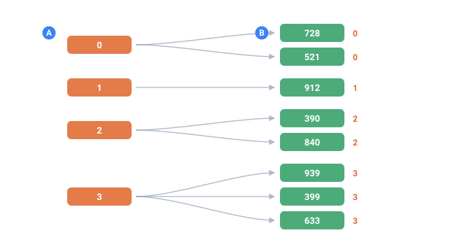

<a name="top"></a>

[English](../../constructs/relational-tables.md#top) · [Русский](../../ru/constructs/relational-tables.md#top) · **Español**

📖 **[Abrir en el sitio de documentación →](https://nickliapin.github.io/tdcv2/es/docs/constructs/relational-tables)**

← Anterior: [Varios valores en una celda (repeat)](./multiple-values.md#top) · **[Contenido](../README.md#top)** · Siguiente: [Unicidad (uniq, distinct)](./unique-values.md#top) →

---

# Tablas relacionales con `each`

**Se usa cuando** un registro representa en realidad **varias filas** — un cliente con
un puñado de pedidos, una factura con sus partidas, una publicación con sus etiquetas —
y usted las quiere como filas separadas en una tabla hija, cada una cargando una llave
foránea de vuelta al padre, todo desde una sola configuración.

El atributo [`each`](../reference/attributes.md#top) repite una
[`<line>`](../core-concepts/output-formatting.md#top) una vez por cada elemento de una
lista. Una tarjeta se convierte en **N filas de salida** — una tabla normalizada, lista
para una base de datos.

> [!NOTE]
> Las salidas de ejemplo que siguen son ilustrativas. Los _valores_ exactos que emite un
> generador pueden cambiar entre versiones del core y entre semillas; lo que la
> característica garantiza son los **conteos** y las **reglas estructurales** (qué filas
> aparecen, cuáles quedan vacías, que las llaves sean únicas).



*Una corrida, cuatro padres y sus hijos, exactamente como salen las filas.*

- **A** — las filas padre, cada una con su propia llave
- **B** — las filas hijas — todas y cada una cargan la llave de su padre, así que nada queda huérfano

## De un vistazo

| Dónde        | Qué                                                                                         |
| :----------- | :------------------------------------------------------------------------------------------ |
| Se aplica en | [`<line>`](../core-concepts/output-formatting.md#top)                                          |
| Valor        | El **nombre** de una secuencia cuyo generador tiene [`repeat`](../reference/attributes.md#top) |
| Efecto       | La línea se emite una vez por cada elemento de esa lista                                    |

La secuencia destino **debe** llevar [`repeat`](../reference/attributes.md#top): eso es lo
que la convierte en una lista recorrible. Apunte `each` a cualquier otra cosa y TDC le
dice por qué (vea la última sección de abajo).

## El problema: una lista embutida en una sola tarjeta

Un cliente hizo tres pedidos. En la tarjeta quedan como una lista:

```
1;VIP;8648,7170,7063
```

Eso no sirve para una base de datos. Usted necesita una tabla `orders` donde **cada
pedido sea su propia fila**, enlazada de vuelta al cliente. Una tarjeta tiene que
producir tres filas, no una fila con una lista adentro.

## La herramienta

Déle a los pedidos su propia lista con [`repeat`](../reference/attributes.md#top) y luego
ponga `each` en la línea del pedido para que se dispare una vez por pedido:

```xml
<env count="4" seed="each-demo" inject="${{%}}" local="es">
    <sequence name="Id"><gen type="increment" value="1"/></sequence>
    <sequence name="Name"><gen type="template" value="person.male.firstName"/></sequence>
    <sequence name="Tier"><gen type="text" value="VIP,normal" percent="50,50"/></sequence>
    <sequence name="VipOrders" parent="Tier.VIP">
        <gen type="number" value="1000..9999" repeat="2..3"/>
    </sequence>
    <sequence name="StdOrders" parent="Tier.normal">
        <gen type="number" value="100..999" repeat="0..2"/>
    </sequence>
</env>
<block>
    <line><data>INSERT INTO customers VALUES (${{Id}}, '${{Name}}', '${{Tier}}');</data></line>
    <line each="VipOrders"><data>INSERT INTO orders VALUES (${{_item_id}}, ${{Id}}, ${{VipOrders}});</data></line>
    <line each="StdOrders"><data>INSERT INTO orders VALUES (${{_item_id}}, ${{Id}}, ${{StdOrders}});</data></line>
</block>
```

## Lo que obtiene

`./run each-demo.tdc`

```
INSERT INTO customers VALUES (1, 'Gregorio', 'normal');
INSERT INTO orders VALUES (4, 1, 433);
INSERT INTO orders VALUES (5, 1, 474);
INSERT INTO customers VALUES (2, 'Rafael', 'normal');
INSERT INTO customers VALUES (3, 'Federico', 'VIP');
INSERT INTO orders VALUES (11, 3, 2460);
INSERT INTO orders VALUES (12, 3, 5137);
INSERT INTO orders VALUES (13, 3, 7717);
INSERT INTO customers VALUES (4, 'Isaías', 'VIP');
INSERT INTO orders VALUES (16, 4, 5249);
INSERT INTO orders VALUES (17, 4, 2324);
```

La línea del pedido está escrita **una sola vez** en la configuración, y sin embargo se
imprime tantas veces como pedidos tenga el cliente. El cliente 2 (`Rafael`) sacó **cero**
pedidos, así que no hay ninguna fila de pedido para él, y tampoco queda un hueco vacío de
relleno. Dos clientes `VIP` sacan de `VipOrders` y los clientes `normal` de `StdOrders`,
y en cada fila se recorre la lista correcta porque
[`parent`](../guides/hierarchical-dependencies.md#top) ya decidió cuál lista está activa.

**Por qué/cuándo:** esta es la manera de emitir, desde una sola configuración, una tabla
padre y su tabla hija juntas y correctamente enlazadas — sin post-procesamiento, sin una
segunda corrida, sin scripts para desplegar la lista.

## Qué se ve dentro de una línea con `each`

Dentro de una línea bajo `each`, el nombre de la secuencia recorrida significa el
**elemento actual**, más dos integrados extra:

| Token            | Qué significa                                                                                    |
| :--------------- | :----------------------------------------------------------------------------------------------- |
| `${{VipOrders}}` | el elemento **actual**. Fuera de la línea con `each`, el mismo nombre es la lista completa unida |
| `${{_item}}`     | la posición dentro de la tarjeta: `1`, `2`, `3`                                                  |
| `${{_item_id}}`  | un número global, único en toda la corrida — su llave primaria                                   |
| todo lo demás    | como siempre: `${{Id}}`, [`${{_count}}`](../reference/builtins.md#top), cualquier otra secuencia    |

Justamente por esto funciona la llave foránea: `${{Id}}` sigue significando el
**cliente** en cada fila de pedido, no el elemento. Si al recorrer se reasignara `Id` al
elemento, cada pedido apuntaría al lugar equivocado. Las columnas del padre se quedan
fijas; solo avanzan el nombre recorrido y `_item` / `_item_id`.

## Sobre los números de pedido

Mire las llaves primarias: `4, 5`, luego `11, 12, 13`, luego `16, 17`. **Suben**, pero
con brincos.

Es a propósito. `_item_id` se calcula a partir del número de la tarjeta, de modo que una
fila puede producirse **sin conocer a sus vecinas** — que es lo que mantiene el
paralelismo de [`--jobs`](../guides/large-outputs.md#top) idéntico byte por byte a una corrida de un
solo hilo. El precio son los brincos donde una tarjeta tiene menos pedidos que el máximo.
Para una llave primaria eso está perfectamente bien: las bases de datos reales tampoco
suelen tener ids sin brincos.

La unicidad sigue siendo a prueba de balas, incluso entre **varias** listas: `StdOrders`
usa `4, 5` mientras `VipOrders` usa `11, 12, 13`, y los dos espacios nunca chocan. En una
verificación más grande, 2000 tarjetas produjeron 3501 pedidos con 3501 llaves distintas,
y cero pedidos apuntando a un cliente inexistente.

**Por qué/cuándo:** confíe en `_item_id` como llave sustituta estable, única y segura en
paralelo. Use `_item` en cambio cuando quiera un número de orden por tarjeta (`1, 2, 3`
que reinicia en cada padre).

## Un ciclo de vida, no solo una lista

Las filas de un registro no tienen que ser un saco de valores sin relación. Pueden ser una
**historia**: un pedido que va `created → paid → shipped → delivered`, una fila por paso, y
nunca un paso fuera de orden.

Lo hacen dos piezas. Un [`<mix>`](mix.md#top) elige qué camino toma este pedido, e
[`if`](../core-concepts/output-formatting.md#top) en cada `<line>` decide si ese paso
pertenece al camino — así los pasos se escriben en el orden en que ocurren y solo se
emiten las líneas del camino elegido:

```xml
<env count="20" seed="lifecycle" local="en">
    <sequence name="OrderId"><gen type="increment" value="1000"/></sequence>

    <mix name="Outcome" percent="60,25,15">
        <case><gen type="text" value="delivered"/></case>
        <case><gen type="text" value="refunded"/></case>
        <case><gen type="text" value="cancelled"/></case>
    </mix>
</env>
<block>
    <line><data>${{OrderId}},1,created</data></line>

    <line if="Outcome.delivered"><data>${{OrderId}},2,paid</data></line>
    <line if="Outcome.delivered"><data>${{OrderId}},3,shipped</data></line>
    <line if="Outcome.delivered"><data>${{OrderId}},4,delivered</data></line>

    <line if="Outcome.refunded"><data>${{OrderId}},2,paid</data></line>
    <line if="Outcome.refunded"><data>${{OrderId}},3,refunded</data></line>

    <line if="Outcome.cancelled"><data>${{OrderId}},2,cancelled</data></line>
</block>
```

`./run lifecycle.tdc`

```
1000,1,created
1000,2,paid
1000,3,shipped
1000,4,delivered
1001,1,created
1001,2,paid
1001,3,refunded
1002,1,created
1002,2,paid
1002,3,shipped
1002,4,delivered
1003,1,created
1003,2,paid
1003,3,shipped
1003,4,delivered
1004,1,created
1004,2,paid
1004,3,refunded
```

Cada pedido toma un camino **legal** — uno enviado se pagó primero, uno cancelado nunca se
envió — y los desenlaces caen en las proporciones exactas que declaró `<mix>`. El número de
paso se escribe en la línea en vez de contarse, porque las líneas de un camino ya se
conocen cuando se escribe el config.

> [!NOTE]
> **No `repeat` + `order="sequential"`**
>
> Una forma corta tentadora es una sola secuencia con el camino entero:
> `<gen type="text" value="created,paid,shipped,delivered" repeat="4" order="sequential"/>`
> más `each` para desplegarla. Esa combinación se **rechaza** (`TDC254`). Cada atributo está
> bien definido por separado y sin definir juntos, y los motores discrepaban sobre lo que
> producían: un config obtenía datos verosímiles que diferían según qué motor respondiera.
> Una lista por fila que recorre su fuente en orden es una función que TDC todavía no tiene.

**legal** — uno enviado se pagó antes, uno cancelado nunca se
envió — y los desenlaces caen en las proporciones exactas que declaró `<mix>`. De las tres
líneas solo se dispara una por registro, porque `parent` deja vacías las otras dos.

**Por qué está hecho así.** Una columna de estado que cambiara «mirando la fila anterior»
obligaría a calcular la ejecución en orden, desde la primera fila. Elegir un camino entero
por adelantado y desplegarlo mantiene cada registro independiente — así que esto funciona
en los motores de streaming y en paralelo, sin cambios.

La misma forma cubre cualquier cosa con un vocabulario fijo de pasos: un ticket de soporte
(`open → assigned → resolved`), un envío, una cola de moderación, un onboarding.

## Dónde no va a funcionar

`each` es estricto sobre lo que puede recorrer, y falla de forma ruidosa en vez de
adivinar:

| Qué                                                                        | Por qué                                                                                                             | Error    |
| :------------------------------------------------------------------------- | :------------------------------------------------------------------------------------------------------------------ | :------- |
| `each` sobre una secuencia **sin** [`repeat`](../reference/attributes.md#top) | no hay nada que recorrer                                                                                            | `TDC207` |
| `each` sobre un nombre que no existe                                       | la secuencia no está declarada                                                                                      | `TDC206` |
| `<data name="…">` dentro de una línea con `each`                           | un `<data>` con nombre es una **columna** para Parquet, y Parquet junta columnas por tarjeta, no por fila recorrida | `TDC209` |

`./run broken.tdc  (each sobre algo que no es una lista)`

```
error[TDC207]: sequence "Tier" has no repeat, so each has nothing to iterate
note: add repeat="…" to its generator, or point each at a list sequence
```

Para la salida en **Parquet** no necesita `each` para nada: una lista con
[`repeat`](../reference/attributes.md#top) se queda como una lista real dentro de la
columna, que ya es la forma correcta para un archivo columnar. `each` es la herramienta
para los formatos de **texto** — SQL, CSV, JSON lines — donde una tarjeta debe volverse
varias filas físicas.

## Vea también

- **[Dependencias jerárquicas](../guides/hierarchical-dependencies.md#top)** — [`parent`](../reference/attributes.md#top),
  que decide _cuál_ lista está activa en cada fila.
- **[Datos coherentes y relacionales](../guides/coherent-data.md#top)** — la otra manera de relacionar
  tablas, por búsqueda contra un padre compartido.
- **[`repeat` / `separator`](../reference/attributes.md#top)** — cómo una secuencia se
  convierte en lista, para empezar.
- **[Integrados](../reference/builtins.md#top)** — `_item`, `_item_id`, `_count` y
  compañía.

---

← Anterior: [Varios valores en una celda (repeat)](./multiple-values.md#top) · **[Contenido](../README.md#top)** · Siguiente: [Unicidad (uniq, distinct)](./unique-values.md#top) →

📖 **[Abrir en el sitio de documentación →](https://nickliapin.github.io/tdcv2/es/docs/constructs/relational-tables)**
