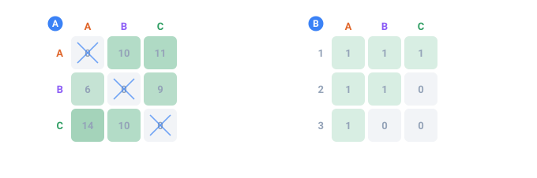

<a name="top"></a>

[English](../../constructs/unique-values.md#top) · [Русский](../../ru/constructs/unique-values.md#top) · **Español**

📖 **[Abrir en el sitio de documentación →](https://nickliapin.github.io/tdcv2/es/docs/constructs/unique-values)**

← Anterior: [Una fila por elemento (each)](./relational-tables.md#top) · **[Contenido](../README.md#top)** · Siguiente: [Configuraciones que se comprueban solas (assert)](./self-checking.md#top) →

---

# Valores únicos

Los datasets reales tienen dos reglas distintas de «sin duplicados», y TDC ofrece una
herramienta separada para cada una:

| Mecanismo    | Alcance         | Significado                                              |
| :----------- | :-------------- | :------------------------------------------------------- |
| `<distinct>` | una fila        | los campos **no son iguales entre sí** dentro de la fila |
| `uniq`       | todas las filas | la **combinación de campos** es única en todo el dataset |

Conviene verlas como gemelas sobre dos ejes. `<distinct>` trabaja en **horizontal** —
dentro de una sola fila, de modo que nunca sale `José José` ni «nació en París, vive en
París». `uniq` trabaja en **vertical** — a lo largo de todo el dataset, de modo que el
mismo par `(nombre, apellido)` nunca aparece dos veces. Use cualquiera de las dos, o
ambas en una misma configuración sobre campos **distintos**. Sobre los mismos campos la
combinación se rechaza (`TDC267`): `uniq` reordena las columnas ya terminadas y no sabe
qué pares descartó la reparación de `<distinct>`, así que la desharía.

> [!NOTE]
> **Las salidas de ejemplo son ilustrativas**
>
> Los valores de abajo son los que produce una corrida típica. Las extracciones exactas
> pueden cambiar según la versión del core y el `seed`; lo que queda fijo es la
> **estructura** que garantiza cada herramienta (ninguna colisión dentro de la fila para
> `<distinct>`, ninguna combinación repetida para `uniq`).



*Con qué frecuencia salió cada combinación de dos campos. En horizontal: el primer campo; en vertical: el segundo.*

- **A** — con distinct, sobre 60 filas: la diagonal queda vacía, porque una fila nunca puede repetir un valor entre sus campos
- **B** — con uniq, sobre 6 filas: ninguna celda pasa de 1, porque una combinación nunca puede repetirse entre filas — las celdas vacías son combinaciones a las que esta ejecución simplemente no llegó

## `<distinct>` — distintos dentro de una fila

Dos campos [`<gen>`](../generators/overview.md#top) que sacan de la **misma** lista corren
de forma independiente, así que tarde o temprano alguna fila toma el mismo valor dos
veces. Aquí un primer nombre y un segundo nombre vienen ambos de una lista corta de
cuatro nombres, así que las colisiones aparecen de inmediato:

```xml
<sequence name="Person">
    <gen name="First"  type="text" value="José,Antonio,Juan,Manuel"/>
    <gen name="Middle" type="text" value="José,Antonio,Juan,Manuel"/>
</sequence>
...
<data>${{Person.First}} ${{Person.Middle}}</data>
```

`./run person.tdc (8 rows)`

```
José Manuel
Antonio José
Manuel Juan
Juan Juan
Manuel Antonio
José José
Juan Antonio
Antonio Manuel
```

Las filas 4 y 6 son `Juan Juan` y `José José` — una persona con el mismo primer y
segundo nombre no debería existir en los datos.

**La solución.** Se envuelven ambos campos en `<distinct>` — todo lo demás queda igual,
incluso el `seed`:

```xml
<sequence name="Person">
    <distinct>
        <gen name="First"  type="text" value="José,Antonio,Juan,Manuel"/>
        <gen name="Middle" type="text" value="José,Antonio,Juan,Manuel"/>
    </distinct>
</sequence>
```

`./run person.tdc (8 rows)`

```
José Manuel
Antonio José
Manuel Juan
Juan José
Manuel Antonio
José Juan
Juan Antonio
Antonio Manuel
```

Las filas que no tenían colisión quedan **idénticas byte por byte** — el motor no las
tocó. Las dos colisiones se repararon: `Juan Juan` pasó a `Juan José` y
`José José` pasó a `José Juan`. Solo se volvió a extraer el segundo campo, y solo
donde hacía falta; el orden y el `seed` quedan intactos.

### Dos niveles

`<distinct>` funciona en dos lugares, con la misma regla en ambos: **los hijos directos
de `<distinct>` producen valores distintos en cada fila.**

**1. Dentro de una [`<sequence>`](../core-concepts/sequences.md#top)** — envuelve los
campos `<gen name="…">`. Se lee como «First ≠ Middle»:

```xml
<env count="6" seed="es" local="es">
    <sequence name="Person">
        <distinct>
            <gen name="First"  type="template" value="person.male.firstName"/>
            <gen name="Middle" type="template" value="person.male.firstName"/>
        </distinct>
    </sequence>
</env>
```

`./run person.tdc (6 rows)`

```
Gustavo Mateo
Esteban Máximo
Daniel Aurelio
Edgar Eleuterio
Elpidio Florencio
Jeremías José
```

Ambos campos sacan del mismo conjunto de nombres y, aun así, los dos valores de cada
fila siempre difieren.

**2. Dentro de [`<env>`](../core-concepts/configuration.md#top)** — envuelve bloques
`<sequence>` completos. Un caso clásico es «país de nacimiento» contra «país de
residencia»: dos extracciones independientes de la misma lista de países caen de vez en
cuando en el mismo país dentro de una fila.

```xml
<env count="100" seed="s" local="es">
    <distinct>
        <sequence name="Birth"><gen type="template" value="location.country"/></sequence>
        <sequence name="Live"><gen type="template" value="location.country"/></sequence>
    </distinct>
</env>
```

`./run migration.tdc (6 rows) — Birth -> Live`

```
Portugal -> Polonia
Vietnam -> Sudán del Sur
San Cristóbal y Nieves -> Hungría
Vanuatu -> Egipto
Samoa -> Siria
Antigua y Barbuda -> Isla de Navidad
```

Ahora el país de nacimiento y el país de residencia de una misma fila nunca coinciden.

### Cómo funciona, y los detalles

El motor genera los campos como siempre; si dos valores dentro de un grupo colisionan en
una fila, **vuelve a extraer** uno de ellos con el siguiente valor del generador hasta
que difieran. El determinismo se conserva — las reextracciones ocurren en un orden fijo,
así que la salida para un `seed` dado no cambia. Funciona igual en el motor en memoria
que en streaming.

Detalles que vale la pena conocer:

- **Se comparan los valores, no las fuentes.** Si dos campos leen de archivos distintos
  pero resulta que producen la misma palabra, `<distinct>` vuelve a extraer de todos
  modos.
- **Los grupos son independientes.** Un `<distinct>` para el primer y segundo nombre y
  otro aparte para otra cosa no se estorban; puede tener varios.
- **Los campos fuera de `<distinct>`** no conservan restricción alguna.
- **Con muy pocos valores falla de forma limpia.** Si una lista tiene menos valores
  distintos que la cantidad de campos que deben diferir (digamos, una palabra para dos
  campos), TDC lanza un error claro en vez de quedarse en un ciclo infinito.
- **En el nivel `<env>` el grupo acepta solo secuencias de un valor** — un `<gen>`
  simple, un [`<mix>`](mix.md#top) o un [`<switch>`](switch.md#top). Una secuencia compuesta
  (de varios campos) se rechaza ahí con el error `TDC129`.

## `uniq` — la combinación nunca se repite

`uniq="true"` en una [`<sequence>`](../core-concepts/sequences.md#top) **compuesta**
significa que la combinación de **todos** sus campos no se repite en ninguna parte del
dataset. `(José, García)` y `(José, Ruiz)` están bien; dos `(José, García)` no.

En una secuencia **simple** — un solo `<gen>` sin nombre — `uniq="true"` significa que
el propio valor no se repite: el sorteo corre **sin reemplazo**. Un pack ponderado
conserva su sentido (los nombres frecuentes tienen más probabilidad de entrar), pero
nada aparece dos veces. Cuando la fuente tiene menos valores distintos que registros, la
corrida se rehúsa por adelantado nombrando ambos números — nunca una repetición
silenciosa. Fuentes soportadas: listas `text`, packs `template`, columnas `file` y
rangos enteros simples (`value="1..100000"`); `increment`/`decrement` son únicos por
construcción. Un generador cuyos valores no pueden enumerarse (`regex`, `date`, …) se
rechaza con un mensaje que lo dice tal cual.

```xml
<sequence name="Person" uniq="true">
    <gen name="first" type="template" value="person.male.firstName"/>
    <gen name="last"  type="template" value="person.lastName"/>
</sequence>

<block>
    <line><data>${{Person.first}} ${{Person.last}}</data></line>
</block>
```

Ningún par `(first, last)` se repite. Con 200 nombres y 500 apellidos hay hasta 100 000
pares únicos; si pide más, obtiene un error honesto por adelantado (vea abajo).

### Antes y después, en un conjunto diminuto

Dos campos con conjuntos diminutos — `first ∈ {Ana, Beto}` y `last ∈ {Ruiz, León}` — dan
solo 4 pares posibles. Se piden 4 filas.

**Sin `uniq`** (cada campo aleatorio por su cuenta):

```xml
<sequence name="P">
    <gen name="first" type="text" value="Ana,Beto"/>
    <gen name="last"  type="text" value="Ruiz,León"/>
</sequence>
<block><line><data>${{P.first}} ${{P.last}}</data></line></block>
```

`./run p.tdc (4 rows, counted)`

```
Ana Ruiz    2
Beto León   2
```

Las combinaciones **se repiten**: `Ana Ruiz` y `Beto León` salieron dos veces cada una,
mientras que `Ana León` y `Beto Ruiz` no aparecieron nunca. El azar no sabe nada de
unicidad.

**Con `uniq="true"`** (la misma configuración, con un atributo añadido):

```xml
<sequence name="P" uniq="true">
    <gen name="first" type="text" value="Ana,Beto"/>
    <gen name="last"  type="text" value="Ruiz,León"/>
</sequence>
```

`./run p.tdc (4 rows, counted)`

```
Ana León    1
Ana Ruiz    1
Beto León   1
Beto Ruiz   1
```

Los 4 pares, una vez cada uno, sin repeticiones.

### Las proporciones se conservan

El motor solo **reacomoda** los valores de los campos entre filas; nunca cambia cuántos
hay de cada uno. Por eso una máscara [`percent`](../generators/text.md#top) sigue siendo
exacta — la unicidad y una distribución exacta conviven. `percent="70,30"` sigue
repartiendo 70/30 incluso mientras cada combinación se mantiene única.

### La verificación de viabilidad — antes de generar

Antes de renderizar, TDC calcula si siquiera es posible formar `count` combinaciones
únicas con sus datos. Si no lo es, obtiene un error **de inmediato**, no horas después:

`./run big.tdc`

```
tdcv2: uniq "Person" is infeasible — its data supports at most 5000 distinct rows,
but 10000 were requested. Widen a column's values or lower count.
```

El conjunto diminuto ilustra lo mismo. Solo existen 4 pares; si pide `count="5"`, TDC no
se pone a batallar: dice la verdad de inmediato:

`./run p5.tdc`

```
tdcv2: uniq "P" is infeasible — its data supports at most 4 distinct rows,
but 5 were requested. Widen a column's values or lower count.
```

> [!NOTE]
> **Deje un margen cómodo**
>
> El número máximo de combinaciones únicas está acotado por el producto de la cantidad de
> valores **distintos** de cada campo. Cuando un campo saca valores al azar
> ([`text`](../generators/text.md#top) sin `percent`), una muestra sesgada puede reducir el
> conjunto aprovechable. Para `uniq`, deje un margen cómodo (muchas más combinaciones
> posibles que el `count`), o fije `percent` para lograr un reparto parejo.

## `<uniq>` — entre secuencias separadas

Cuando los campos viven en secuencias **distintas**, envuélvalos en `<uniq>…</uniq>`: la
**combinación de los valores de esas secuencias** se vuelve única en todas las filas:

```xml
<uniq>
    <sequence name="First"><gen type="template" value="person.male.firstName"/></sequence>
    <sequence name="Last"><gen type="template" value="person.lastName"/></sequence>
</uniq>
<block><line><data>${{First}} ${{Last}}</data></line></block>
```

En el grupo solo pueden ir secuencias de un valor (un [`<gen>`](../generators/overview.md#top)
simple, un `<mix>` o un `<switch>`); una secuencia compuesta no puede.

#### Un `<switch>` en el grupo lo corta en bloques

Un valor conmutado responde al sujeto de su propia fila: un nombre masculino
pertenece a una fila masculina y a ninguna otra. Así que un grupo con un
`<switch>` queda dividido por ese sujeto —las filas masculinas se intercambian
entre sí, las femeninas entre sí— y el alcance del grupo es la suma de lo que
cabe en cada bloque, no el producto de todas las columnas.

Los demás miembros se mueven libremente, y ahora se **reparten entre los bloques
en proporción a su tamaño** antes de ordenar nada dentro de ellos. Importa más de lo que
parece. Una lista `text` se dispone en partes exactas sobre la columna entera; el
corte le entrega luego a un bloque los valores que allí cayeron. En una forma el
bloque masculino salió con siete de un valor, tres de otro y cuatro de un tercero
donde un reparto parejo es cinco, cinco y cuatro, y esa fue la diferencia entre
rechazar una corrida y generarla.

El multiconjunto no se toca, solo se distribuye, así que cada `percent=` que usted
declaró sobrevive exacto. Y nada cruza un bloque: la columna conmutada se queda
donde está, y el sujeto por el que se cortaron los bloques también.

#### Hasta dónde llega un grupo, y por qué el borde superior es irregular

Un grupo reordena los valores que sacó; no vuelve a sacarlos para que encajen.
Por eso el alcance depende de lo que ese `count` sacó, y la parte alta del rango
es irregular en vez de una línea limpia. Medido sobre una forma —dos sujetos,
tres nombres cada uno, cinco valores compartidos, con `seed="blocks"`:

| count | 2–23 | 24–28 | 29  | 30  | 31+ |
| ----- | ---- | ----- | --- | --- | --- |
|       | ✅   | ❌    | ✅  | ✅  | ❌  |

Todo count hasta 23 se genera; por encima, unos sí y otros no. Si un count cerca
del límite es rechazado, otro cercano puede funcionar — pero el arreglo honesto
es más valores en algún miembro, que mueve el rango entero en lugar de un punto.

El rechazo dice qué permitían los datos:

`./run tight.tdc`

```
tdcv2: uniq: group "G × F × L" cannot produce 24 unique combinations — the values
drawn for these sequences allow at most 11 distinct rows. Add more values to a
member (more distinct names, wider ranges…) or lower the count.
```

La cifra que informa es lo que permitió **el sorteo de esa corrida**, así que
puede quedar por debajo de un count que la misma configuración sí genera: este
grupo produce 23 filas distintas con `count="23"`, y el sorteo que le toca en 24
solo llega a 11. Léalo como «este sorteo tuvo mala suerte», no como el techo de
la configuración.

> [!NOTE]
> **No es un id único**
>
> Se trata de la unicidad de una **combinación de campos**, no de un contador. Para un
> número corrido, use [`increment`](../generators/counters.md#top).

### Cómo hacer único un valor _unido_

`uniq` es una propiedad del **sorteo**. Una secuencia cuyo valor se
[computa](../compute/overview.md#top), o se elige por fila con `if=`, no sale de ninguna
bolsa — no hay nada que tomar sin reposición —, así que `uniq=` sobre ella se rechaza
con [`TDC218`](../reference/errors.md#top) en vez de ignorarse en silencio.

Ponga `uniq` sobre las partes y únalas en la salida:

```xml
<uniq>
    <sequence name="Area"><gen type="number" value="900..999"/></sequence>
    <sequence name="Group"><gen type="number" value="1..99" length="2" first_zero="true"/></sequence>
    <sequence name="Serial"><gen type="number" value="1..9999" length="4" first_zero="true"/></sequence>
</uniq>
<block><line><data>${{Area}}${{Group}}${{Serial}}</data></line></block>
```

La terna `(Area, Group, Serial)` es única en cada fila y, como cada parte tiene un
**ancho fijo** — 3, 2 y 4 dígitos —, la cadena de nueve dígitos se puede volver a
partir en la terna de una sola manera. Una terna única da, pues, una cadena única.

Esa última frase es todo el truco, y también su límite. Si el ancho de una parte
variara, dos ternas distintas se unirían en la misma cadena: `9|15…` y `91|5…` se leen
igual cuando el límite ya no está.

## Volúmenes grandes

`uniq` corre en disco de forma predeterminada, sin banderas — pero **ninguna de sus formas
corre en el motor rápido de streaming**, y cuál de los otros dos la toma depende de cómo la
haya escrito:

- **`uniq="true"` sobre una sola columna sorteada** — el caso común — extrae sin
  reposición, y para eso hacen falta la bolsa y los valores ya tomados. Ese es el motor en
  memoria: la memoria crece con `count` y la corrida queda limitada por la RAM.
- **Un `uniq` compuesto, un `uniq` sobre un contador o un grupo `<uniq>` en el nivel env**
  van al motor exacto en disco: acomoda cada columna y luego **revisa las tuplas y repara
  las colisiones**. La memoria se mantiene acotada; el tiempo no.

[Qué motor corre su configuración](../guides/large-outputs.md#qué-motor-corre-su-configuración)
tiene el enrutamiento completo, incluidas las cuatro formas sin `uniq` que también acaban
en memoria.

> [!CAUTION]
> **`uniq` exacto sobre una salida enorme es LENTO — `uniq` + `percent` más que nada**
>
> La revisión de ordenar-y-reparar es exhaustiva, y su costo crece **más rápido que
> linealmente** con el número de filas. La memoria se mantiene acotada, pero el tiempo no —
> cientos de miles de filas únicas ya tardan **minutos**, y los millones pueden correr
> **horas o más**. Es el precio honesto de garantizar _ningún repetido_ en un archivo enorme.
>
> **`uniq` junto con `percent` sobre las mismas columnas es el peor caso que hay:**
> proporciones exactas y sin repetidos a la vez es un acomodo con restricciones encima del
> ordenamiento, más lento otra vez por un amplio margen. Si una corrida tarda una eternidad,
> soltar el `percent` o el `uniq` suele ser lo que lo arregla.
>
> Para unicidad a gran escala, prefiera las clases baratas por construcción — un
> [contador](../generators/counters.md#top) o un rango [`number`](../generators/number.md#top) lo
> bastante amplio como para que una colisión sea prácticamente imposible — y reserve
> `uniq="true"` sobre columnas numéricas/percent para los tamaños donde la revisión
> exhaustiva valga la espera.

La salida de emergencia `mode="memory"` (el motor pequeño en RAM) también soporta todas
las formas de `uniq` — exacto, pero acotado por la RAM. Vea **[Salidas grandes](../guides/large-outputs.md#top)**.

## Véase también

- **[Secuencias](../core-concepts/sequences.md#top)** — las secuencias compuestas y los
  campos, las estructuras sobre las que operan `uniq` y `<distinct>`.
- **[Determinismo y proporciones](../core-concepts/determinism.md#top)** — por qué `uniq`
  recalcula cuando cambia el `count`.

---

← Anterior: [Una fila por elemento (each)](./relational-tables.md#top) · **[Contenido](../README.md#top)** · Siguiente: [Configuraciones que se comprueban solas (assert)](./self-checking.md#top) →

📖 **[Abrir en el sitio de documentación →](https://nickliapin.github.io/tdcv2/es/docs/constructs/unique-values)**
