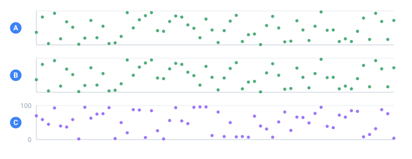

<a name="top"></a>

[English](../../core-concepts/determinism.md#top) · [Русский](../../ru/core-concepts/determinism.md#top) · **Español**

📖 **[Abrir en el sitio de documentación →](https://nickliapin.github.io/tdcv2/es/docs/core-concepts/determinism)**

← Anterior: [Salida y formato](./output-formatting.md#top) · **[Contenido](../README.md#top)** · Siguiente: [Un valor a la vez](./quick-api.md#top) →

---

# Determinismo y proporciones

Dos propiedades hacen confiables los datos de TDC: el mismo **seed** reproduce los mismos
datos byte por byte, y las partes caen en **proporciones exactas**. La promesa es precisa
sobre lo que tiene que coincidir: la misma configuración, el mismo seed, la misma versión
del núcleo y el mismo modo de salida. Si cambia cualquiera de esos cuatro, los bytes
pueden cambiar; el lenguaje desde el que se ejecuta no está en la lista, y por eso las
cinco implementaciones coinciden. Esta página cubre tres
atributos juntos —`seed`, `count` y `percent`— porque interactúan: `count` decide cuántos
registros se obtienen, `seed` decide _cuáles_, y `percent` fija sus proporciones.

> [!NOTE]
> Las salidas de ejemplo de abajo son ilustrativas: los nombres y números exactos pueden
> variar según la versión del núcleo, pero sus _propiedades_ (reproducibilidad, prefijos,
> conteos exactos) se mantienen.



*Tres ejecuciones de la misma configuración, de 60 filas cada una.*

- **A** — primera ejecución, un seed
- **B** — segunda ejecución, el mismo seed — idéntica valor por valor
- **C** — un seed distinto: datos de la misma forma, pero ningún número en común

## `seed` — aleatoriedad reproducible

Los datos de prueba deben parecer aleatorios pero ser **reproducibles**: si mañana ejecuta
la misma configuración debe obtener los mismos registros, o si no un reporte de bug y una
prueba de snapshot no tienen en qué apoyarse. El «azar» a secas no da eso: cada ejecución
es un conjunto nuevo. `seed` sí: el mismo seed y la misma configuración siempre producen
exactamente la misma salida.

> [!NOTE]
> **La misma salida, sea cual sea el motor**
>
> TDC tiene tres motores y elige uno según la configuración: el de streaming rápido por
> omisión, el exacto en disco para la unicidad, y el pequeño en RAM bajo `mode="memory"` y
> detrás del API de objetos. **Los tres producen los mismos valores con el mismo seed.** El
> valor de una fila se deriva de `(seed, nombre de la columna, número de fila)`, así que no
> depende de qué motor lo calculó, ni de lo que sacaron las columnas vecinas, ni de cuántos
> hilos escribieron el archivo.
>
> Conviene decirlo con claridad porque antes no era así: los motores sacaban los valores en
> distinto orden, y un mismo objeto respondía de forma distinta según llamaras a
> `toString()` o a `iterate()`. Ahora coinciden, y cada fixture compartido se comprueba en
> los tres. Cómo se elige el motor está en [Salidas grandes](../guides/large-outputs.md#top):
> es cuestión de velocidad y memoria, no de qué datos obtienes.

`seed` se define en [`<env>`](configuration.md#top). Su valor es cualquier string (una cadena
de texto): un hash, una palabra, un número escrito como texto; internamente se normaliza a
una clave de 128 bits con el algoritmo cyrb128. La opción `--seed` del CLI y la opción
`{ seed }` de la API tienen prioridad sobre el atributo.

```xml
<env count="4" seed="demo" local="en">
  <sequence name="Name"><gen type="template" value="person.male.firstName"/></sequence>
  <sequence name="Code"><gen type="number" value="1000..9999"/></sequence>
</env>
```

Tanto el nombre (de [`template`](../generators/template.md#top)) como el código (de
[`number`](../generators/number.md#top)) se ven aleatorios. Ejecute la configuración **dos
veces seguidas**: la salida es idéntica, byte por byte.

`./run demo.tdc  —  two consecutive runs`

```
ejecución 1        ejecución 2
Braylen #2004      Braylen #2004
Amiri #2900        Amiri #2900
Andre #2771        Andre #2771
Izaiah #5951       Izaiah #5951
```

Nada se corre de lugar. Mismo seed, misma configuración, mismo resultado: eso es
determinismo.

### Cambie el seed → un conjunto distinto, igual de estable

Cambie el seed por otra palabra y obtiene un conjunto _distinto_ que es igual de
reproducible. La misma configuración, solo con `seed="alpha"`:

`./run demo.tdc  (seed=alpha)`

```
Ryland #1695
Leonidas #8152
Jakobe #8337
Jase #3363
```

Así es como se mantienen lado a lado varios conjuntos de datos independientes pero
reproducibles: `seed="demo"` para una prueba, `seed="alpha"` para otra, cada uno estable
entre ejecuciones.

### Quite el seed → algo nuevo cada vez

Sin ningún `seed`, TDC elige uno al azar en cada ejecución y la salida es nueva cada vez.
Conviene cuando se quieren datos de muestra frescos y no hace falta reproducir una salida
específica, pero se pierde la posibilidad de señalar un resultado en particular más
adelante.

> [!NOTE]
> **Garantía entre lenguajes**
>
> El PRNG (cyrb128 + sfc32) se eligió de modo que el mismo `seed` y la misma configuración
> den resultados idénticos en todas las implementaciones. Esa
> portabilidad es una de las promesas centrales de TDC.

## `count` — cuántos registros

`count` es cuántas veces se renderiza el bloque. Se define en
[`<env>`](configuration.md#top), vale **10** por omisión y lo sobrescriben la opción
`--count` del CLI o la opción `{ count }` de la API. El valor es un entero positivo
escrito como cadena de texto.

```xml
<env count="1000" seed="demo" local="en">
  ...
</env>
```

```bash
# Sobrescribir desde el CLI:
./run config.tdc --count 50
```

La propiedad importante: **una ejecución corta es un prefijo honesto de una larga.** La
mayoría de los generadores —[`number`](../generators/number.md#top), un
[`template`](../generators/template.md#top) sin ponderar,
[`counter`](../generators/counters.md#top), [`regex`](../generators/regex.md#top)— calculan el
valor de cada fila a partir de su **número de fila** y del seed, no del total. Por eso las
tres primeras filas de `count="3"` son exactamente las tres primeras de `count="6"`:

`./run demo.tdc --count 3   vs   --count 6`

```
count=3        count=6
Braylen        Braylen
Amiri          Amiri
Andre          Andre
               Izaiah
               Zachariah
               Saul
```

`count` no _desplaza_ los datos, solo continúa la misma serie. Así que puede depurar con
`count="3"` sabiendo que los primeros registros serán idénticos con `count="1000"`.

### La excepción: los diseños que abarcan toda la ejecución

Los generadores que acomodan valores a lo largo de **toda** la ejecución se
**recalculan** cuando `count` cambia: sus columnas _no_ son un prefijo. Cuatro funciones
trabajan así: las proporciones exactas (`percent` en [`text`](../generators/text.md#top) y en
`<mix>`, por el método de Hamilton), la unicidad
([`uniq`](../constructs/unique-values.md#top)), un pack
[`template`](../generators/template.md#top) **ponderado**, y las **longitudes de lista** de
[`repeat="min..max"`](../constructs/multiple-values.md#top) — allí un rango es una cuota
sobre la corrida, no un dado por fila, así que 200 filas con `repeat="1..4"` salen
50 / 50 / 50 / 50 y 201 filas salen 51 / 50 / 50 / 50. Los packs de nombres y lugares
llevan frecuencias por valor, y TDC las reparte en una cuota exacta sobre todo el `count`,
la misma maquinaria que `percent`. Por eso `person.male.firstName` se rebaraja cuando
`count` cambia, mientras que una lista sin ponderar como `location.country` sigue siendo un
prefijo. Contar a partir del `count` completo es justamente lo que hace parejas las
proporciones y garantizada la unicidad en cualquier tamaño.

El recálculo se puede ver directamente. Con `percent="34,33,33"` sobre tres valores, una
ejecución de `count="4"` y una de `count="8"` **no** comparten prefijo:

`./run grade.tdc  —  percent layout is recomputed`

```
count=4:   C A A B
count=8:   A C A B A B B C
```

Las primeras cuatro filas difieren: el acomodo se rebalanceó para el nuevo total. Los
generadores posicionales (number, un template sin ponderar, counter, regex) sí seguirían
siendo un prefijo aquí; la maquinaria de proporciones, unicidad, packs ponderados y
longitudes de `repeat` se reacomoda.

La regla práctica: **una corrida pequeña le dice la forma, no las filas.** Depure con
`count="3"` para revisar el formato, las proporciones y que los campos concuerden — pero
si alguna de las cuatro funciones de arriba está en la configuración, no espere que la
fila 3 de la corrida pequeña sea la fila 3 de la grande.

### Nombres integrados que dependen del total

Las secuencias integradas que necesitan el tamaño de toda la ejecución también cambian con
`count`: `_total` (cuántas filas hay en total) y `_count` (el número de la fila actual). La
misma configuración renderizada como `${{_count}}/${{_total}}: ${{Name}}`:

`./run demo.tdc --count 3   vs   --count 6`

```
count=3            count=6
1/3: Braylen       1/6: Braylen
2/3: Amiri         2/6: Amiri
3/3: Andre         3/6: Andre
                   4/6: Izaiah
                   5/6: Zachariah
                   6/6: Saul
```

`_total` reporta honestamente `3` frente a `6`: por definición, se trata de toda la
ejecución.

## `percent` — proporciones exactas

Agregue `percent` a un generador [`text`](../generators/text.md#top) (o a un `<mix>`) y las
partes caen **exactamente**, acomodadas por el método de Hamilton (del resto mayor): se
garantiza que el número de apariciones de cada valor coincida con los porcentajes que
usted dio. La aleatoriedad queda solo en el _orden_ de las filas.

```xml
<sequence name="Gender">
  <gen type="text" value="Hombre,Mujer" percent="60"/>
</sequence>
```

Las primeras filas salen entremezcladas (el orden depende del seed):

`./run gender.tdc  —  first rows`

```
Mujer
Hombre
Mujer
Hombre
Mujer
Hombre
```

Pero cuente **las** 100 filas y el reparto es parejo hasta el último registro:

`./run gender.tdc  (count=100)`

```
Hombre   60
Mujer    40
```

Exactamente 60 y 40, no «como 60 %». Eso es el método de Hamilton: distribuye con
precisión y deja la aleatoriedad solo en el orden de las filas.

### Máscaras cortas — la lista de porcentajes puede ser más corta que la de valores

La máscara de arriba es apenas `percent="60"` y sin embargo hay dos valores. Una máscara
más corta que la lista [`value`](../generators/text.md#top) se expande: las posiciones llenas
fijan su porcentaje, y las posiciones vacías se reparten el resto hasta 100 en partes
iguales. Eso cubre la mayoría de los casos reales escribiendo muy poco:

| Máscara  | Para 2 / 4 / 5 valores se expande a |
| :------- | :---------------------------------- |
| `60`     | `60,40`                             |
| `,40`    | `60,40`                             |
| `,10,10` | `40,40,10,10`                       |
| `,,25,,` | `18.75,18.75,25,18.75,18.75`        |
| `46,`    | `46,13.5,13.5,13.5,13.5`            |

Las reglas: si la máscara está **completa**, sus números deben sumar 100. Si tiene
posiciones **vacías**, los números llenos deben sumar **no más de** 100 (el resto se
reparte entre los espacios en blanco).

### Partes que no se dividen de forma pareja

Tres calificaciones iguales sobre 100 filas son 33.33 % cada una, pero «un tercio de 100»
no es un número entero. Hamilton entrega el registro sobrante a la parte con el resto
mayor, así que el total sigue siendo exactamente `count`:

```xml
<sequence name="Grade"><gen type="text" value="A,B,C" percent=",,"/></sequence>
```

`./run grade.tdc  (count=100)`

```
A   34
B   33
C   33
```

`34 + 33 + 33 = 100`: ningún registro se pierde ni se cuenta dos veces. Las partes
explícitas se comportan igual de literalmente:

```xml
<sequence name="Tier"><gen type="text" value="gold,silver,bronze" percent="50,30,20"/></sequence>
```

`./run tier.tdc  (count=100)`

```
gold      50
silver    30
bronze    20
```

### Conteos pequeños — la suma se sostiene igual

Con un `count` pequeño las partes se redondean, pero su total siempre es igual a `count`.
Con `percent="50,50"` y `count="3"` obtiene 2 + 1 o 1 + 2 (cuál valor se lleva el extra
depende del seed), nunca 1 + 1 ni 2 + 2. La proporción se aproxima; el conteo nunca sale
mal.

### Dentro de un subconjunto — `percent` con un padre

Cuando la secuencia tiene un [`parent`](sequences.md#top), los porcentajes se miden **dentro
del subconjunto filtrado**, no a lo largo de toda la ejecución. Un reparto 70/30 de
usuarios activos es 70/30 _de las filas de ese padre_, calculado de forma independiente
por grupo. Ese es el fundamento de las
[dependencias jerárquicas](../guides/hierarchical-dependencies.md#top).

### En `<mix>`

`percent` también gobierna `<mix>`, donde la longitud de la máscara se compara contra el
número de ramas `<case>` anidadas en lugar de una lista de valores. Si se omite `percent`,
los casos se distribuyen de forma pareja.

## Véase también

- **[Text](../generators/text.md#top)** — `percent` a fondo, incluidas las
  [máscaras cortas](../generators/text.md#máscaras-percent-cortas).
- **[Dependencias jerárquicas](../guides/hierarchical-dependencies.md#top)** — proporciones dentro de un subconjunto.
- **[Valores únicos](../constructs/unique-values.md#top)** — el otro diseño de ejecución completa que se recalcula con `count`.
- **[Salidas grandes](../guides/large-outputs.md#top)** — cómo funcionan las proporciones exactas durante el streaming.

---

← Anterior: [Salida y formato](./output-formatting.md#top) · **[Contenido](../README.md#top)** · Siguiente: [Un valor a la vez](./quick-api.md#top) →

📖 **[Abrir en el sitio de documentación →](https://nickliapin.github.io/tdcv2/es/docs/core-concepts/determinism)**
