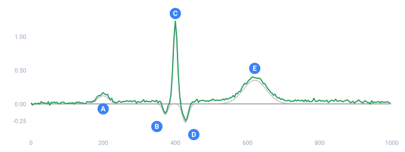
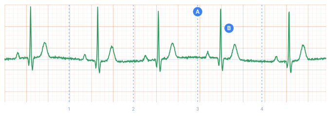

<a name="top"></a>

[English](../../guides/signals-from-formulas.md#top) · [Русский](../../ru/guides/signals-from-formulas.md#top) · **Español**

📖 **[Abrir en el sitio de documentación →](https://nickliapin.github.io/tdcv2/es/docs/guides/signals-from-formulas)**

← Anterior: [Rendimiento](./performance.md#top) · **[Contenido](../README.md#top)** · Siguiente: [Descripción general](../data-packs/overview.md#top) →

---

# Señales a partir de fórmulas — un latido dibujado con aritmética

Casi todas las columnas de una configuración se **sortean**: un nombre de un paquete, un
número de un rango, una fecha de una ventana. Una señal funciona de otra manera. Su valor en
cada instante no es una elección: se deduce del punto en el tiempo en el que está. Ese es el
trabajo de [`<gen type="formula">`](../generators/formula.md#top), y es la única construcción
que produce una forma en lugar de un saco de valores.

Esta guía construye un electrocardiograma sintético: un CSV de dos columnas que dibuja un
latido reconocible al graficarlo. El mismo método sirve para cualquier medición que se
repita — la vibración de una máquina, una curva diaria de temperatura, el tráfico por hora
en una carretera.

## Un latido son cinco campanas

Un latido son cinco jorobas seguidas, y cada joroba tiene la misma forma: una campana, alta
en el centro y que se desvanece hacia ambos lados. Tres números describen una campana: qué
altura tiene, dónde está su centro y cuánto se extiende:

```
altura * exp(-pow((posición - centro) / anchura, 2))
```

`exp` y `pow` son [funciones de expresión](../reference/expressions.md#top) corrientes, y se
comportan igual en las cinco implementaciones. Cambie el `centro` y la joroba se desplaza
por el eje del tiempo. Cambie la `anchura` y se vuelve más estrecha o más plana. No hace
falta nada más.

## El tiempo, y el latido al que pertenece

Dos columnas convierten el contador de filas en un reloj. Tome 250 muestras por segundo, que
es lo que hace un monitor real, así que cada fila son 4 milisegundos:

```xml
<sequence name="T"><gen type="formula" expr="(_count - 1) * 4"/></sequence>
<sequence name="N"><gen type="formula" expr="floor(T / 1000)"/></sequence>
```

`_count` es el número de fila, así que `T` es el tiempo en milisegundos.
`floor(T / 1000)` es el **número de latido**: se queda en 0 durante un segundo entero, luego
pasa a 1, luego a 2.

Esa segunda columna es la útil. Todo lo que se calcula a partir de `N` se mantiene quieto
durante todo el latido y solo cambia en el límite, y así un latido sale distinto del
siguiente sin que las jorobas de su interior tiemblen.

## Dónde empieza el latido

Un latido no tiene por qué empezar en el segundo exacto:

```xml
<sequence name="Onset"><gen type="formula" expr="N * 1000 + 45 * sin(N * 1.7)"/></sequence>
<sequence name="Phase"><gen type="formula" expr="T - Onset"/></sequence>
```

`Onset` es dónde empieza el latido `N`, corrido hasta 45 milisegundos a un lado u otro del
segundo redondo. `Phase` es cuánto ha avanzado la fila actual dentro de su propio latido, y
cada campana se coloca respecto a `Phase`, no respecto al reloj.

El corazón se acelera al inspirar y se frena al espirar, de modo que el hueco entre latidos
se mueve constantemente un pequeño porcentaje. Un registro sin esa variación se lee como un
dibujo de un latido, no como su medición.

## Las cinco campanas, con números reales

```xml
<sequence name="P"><gen type="formula" expr="0.12 * exp(-pow((Phase - 200) / 22, 2))"/></sequence>
<sequence name="Q"><gen type="formula" expr="-0.16 * exp(-pow((Phase - 372) / 10, 2))"/></sequence>
<sequence name="R"><gen type="formula" expr="Amp * exp(-pow((Phase - 400) / 8, 2))"/></sequence>
<sequence name="S"><gen type="formula" expr="-0.28 * exp(-pow((Phase - 428) / 12, 2))"/></sequence>
<sequence name="TW"><gen type="formula" expr="0.35 * exp(-pow((Phase - 620) / 45, 2))"/></sequence>
```

| Campana | Altura, mV | Centro, ms | Anchura, ms | Qué es                          |
| :------ | ---------: | ---------: | ----------: | :------------------------------ |
| P       |       0.12 |        200 |          22 | las aurículas se contraen       |
| Q       |      −0.16 |        372 |          10 | la caída previa al pico         |
| R       |       1.20 |        400 |           8 | los ventrículos se disparan     |
| S       |      −0.28 |        428 |          12 | la caída posterior              |
| T       |       0.35 |        620 |          45 | los ventrículos se recuperan    |

Dos de los números marcan el carácter del trazo. `R` mide ocho milisegundos de ancho frente
a un latido de mil, y por eso el pico sale casi vertical. `T` mide 45, y por eso la última
joroba es una colina larga y baja.



*Un latido, desarmado. Todos los valores salen de ejecutar la configuración de abajo.*

- **faint** — las cinco campanas, cada una su propia columna
- **made** — su suma, la única columna que llega al archivo
- **A** — P — las aurículas se contraen
- **B** — Q — la caída previa al pico
- **C** — R — los ventrículos se disparan
- **D** — S — la caída posterior
- **E** — T — los ventrículos se recuperan

El eje horizontal son milisegundos dentro de un latido; el vertical, milivoltios. **Cinco de
esas columnas nunca se imprimen.** Una secuencia que ningún `<block>` menciona sigue
participando en el cálculo, y eso es lo que permite que una configuración lleve encima sus
propias cuentas.

## Cómo darle vida

Dos columnas más impiden que cada latido sea una copia del anterior:

```xml
<sequence name="Amp"><gen type="formula" expr="1.20 + 0.07 * sin(N * 2.3)"/></sequence>
<sequence name="Drift"><gen type="formula" expr="0.05 * sin(_count / 95)"/></sequence>
<sequence name="Noise"><gen type="number" distribution="normal" mean="0" sd="0.012" decimals="4"/></sequence>
```

`Amp` varía la altura del pico de un latido a otro, porque lee `N`. `Drift` mece la línea de
base despacio, como el pecho que sube y baja moviendo los electrodos. `Noise` es la única
columna **sorteada** de esta página: normal, diminuta y distinta en cada fila, que es lo que
añade un sensor real.



*Cinco segundos. Los picos se alejan de las marcas de segundo y vuelven.*

- **mark** — los segundos exactos
- **made** — el trazo generado
- **A** — la marca del tercer segundo
- **B** — el pico que no llega a ella

Medido sobre diez segundos de esta salida, el hueco entre picos va de 932 a 1068
milisegundos — un pulso que oscila entre 56 y 64 latidos por minuto. Ese es el rango de un
adulto en reposo.

> [!NOTE]
> **Viva y aun así reproducible**
>
> En ese vaivén no hay nada aleatorio. `sin(N * 1.7)` es aritmética sobre el número de latido,
> así que la misma semilla da el mismo archivo, byte a byte, en cualquier implementación. Aquí
> la irregularidad es algo que se construye, no algo sobre lo que se pierde el control.

## La configuración completa

```xml
<tdc>
  <env count="2500" seed="ecg">
    <sequence name="T"><gen type="formula" expr="(_count - 1) * 4"/></sequence>
    <sequence name="N"><gen type="formula" expr="floor(T / 1000)"/></sequence>
    <sequence name="Onset"><gen type="formula" expr="N * 1000 + 45 * sin(N * 1.7)"/></sequence>
    <sequence name="Phase"><gen type="formula" expr="T - Onset"/></sequence>
    <sequence name="Amp"><gen type="formula" expr="1.20 + 0.07 * sin(N * 2.3)"/></sequence>

    <sequence name="P"><gen type="formula" expr="0.12 * exp(-pow((Phase - 200) / 22, 2))"/></sequence>
    <sequence name="Q"><gen type="formula" expr="-0.16 * exp(-pow((Phase - 372) / 10, 2))"/></sequence>
    <sequence name="R"><gen type="formula" expr="Amp * exp(-pow((Phase - 400) / 8, 2))"/></sequence>
    <sequence name="S"><gen type="formula" expr="-0.28 * exp(-pow((Phase - 428) / 12, 2))"/></sequence>
    <sequence name="TW"><gen type="formula" expr="0.35 * exp(-pow((Phase - 620) / 45, 2))"/></sequence>

    <sequence name="Drift"><gen type="formula" expr="0.05 * sin(_count / 95)"/></sequence>
    <sequence name="Noise"><gen type="number" distribution="normal" mean="0" sd="0.012" decimals="4"/></sequence>

    <sequence name="Sec"><gen type="formula" expr="T / 1000" decimals="3"/></sequence>
    <sequence name="MV"><gen type="formula" expr="P + Q + R + S + TW + Drift + Noise" decimals="4"/></sequence>

    <before><line><data>seconds,millivolts</data></line></before>
  </env>

  <block>
    <line><data>${{Sec}},${{MV}}</data></line>
  </block>
</tdc>
```

`./run ecg.tdc`

```
seconds,millivolts
0.000,0.0158
0.004,-0.0164
0.008,-0.0065
0.012,0.0089
0.016,-0.0052
0.020,0.0121
```

Diez segundos de registro son 2500 filas. Las primeras filas caen en el tramo plano anterior
al primer latido, que es justo el aspecto que tiene un trazo entre contracciones. Cargue el
archivo en una hoja de cálculo, grafique la columna B contra la columna A como línea y la
forma aparece.

## Los mandos que puede girar

| Para cambiar          | Edite                            | Efecto                                        |
| :-------------------- | :------------------------------- | :-------------------------------------------- |
| La frecuencia cardíaca| `1000` en `Onset` y `N`          | `600` da 100 latidos por minuto               |
| El muestreo           | `4` en `T`                       | `2` da 500 muestras por segundo               |
| La fuerza del pico    | `1.20` en `Amp`                  | la altura de R en milivoltios                 |
| La regularidad        | `45` en `Onset`                  | `0` deja cada latido exactamente en un segundo|
| La calidad del sensor | `sd` en `Noise`                  | más grande es un registro más ruidoso         |

Vale la pena poner el `45` a `0` una vez. El trazo sigue siendo correcto y empieza a parecer
fabricado, lo que enseña cuánto de «realista» vive en la irregularidad y no en la forma.

## Dónde más encaja esto

El método no va de corazones. Cualquier cosa que se repita con un período, varíe un poco en
cada ciclo y arrastre ruido se arma con las mismas tres piezas: `floor` para numerar los
ciclos, una fase dentro del ciclo, y campanas o senos colocados respecto a esa fase. La
vibración de una máquina, una curva diaria de temperatura y un conteo de tráfico por hora se
construyen igual.

Si en cambio la columna debe acumularse a lo largo de las filas, vea
[`running`](../generators/running.md#top). Si necesita una sola cifra calculada sobre toda la
ejecución, vea [`stat`](../generators/stat.md#top).

---

← Anterior: [Rendimiento](./performance.md#top) · **[Contenido](../README.md#top)** · Siguiente: [Descripción general](../data-packs/overview.md#top) →

📖 **[Abrir en el sitio de documentación →](https://nickliapin.github.io/tdcv2/es/docs/guides/signals-from-formulas)**
