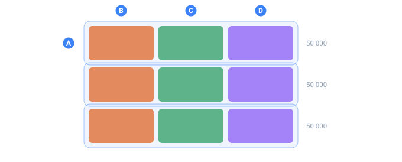

<a name="top"></a>

[English](../../guides/typed-output-parquet.md#top) · [Русский](../../ru/guides/typed-output-parquet.md#top) · **Español**

← Anterior: [Datos faltantes](./missing-data.md#top) · **[Contenido](../README.md#top)** · Siguiente: [Salidas grandes y streaming](./large-outputs.md#top) →

---

# Salida tipada y Parquet

**Se usa cuando** el archivo va rumbo al análisis — pandas, DuckDB, Spark, un data
warehouse — y usted necesita que cargue **tipos de columna reales** y un **NULL real**, y
no nada más texto que el lector tenga que adivinar. Póngale nombre a sus columnas
[`<data>`](../core-concepts/output-formatting.md#top), déle a la salida un nombre `.parquet`
y TDC escribe un archivo binario y tipado — sin bibliotecas externas, sin banderas extra.

Toda la salida vista hasta ahora en este sitio ha sido **texto**: CSV, JSON, SQL. Eso es
perfecto para una persona y para cualquier cosa que lea caracteres. Para el análisis de
datos tiene dos problemas que Parquet resuelve.

- **Sin tipos.** En un CSV todo es un string. Un científico de datos carga el archivo y
  tiene que volver a adivinar qué columna es número, cuál es fecha y cuál es texto plano
  — y adivina mal: `007` se vuelve `7`, y un número de documento queda corrompido en
  silencio.
- **Sin NULL.** Un espacio vacío entre dos comas: ¿es «texto vacío» o «no había valor»?
  [`missing`](../reference/attributes.md#top) emite un string vacío, y la distinción se
  pierde.

Parquet es el formato binario columnar en el que se estandarizan las herramientas
analíticas. Cada columna tiene un **tipo real** y un **NULL real**, y el archivo se abre
en una línea — `pd.read_parquet("data.parquet")` — sin nada que reparar después.

> [!NOTE]
> Las salidas de ejemplo de abajo son ilustrativas: los valores exactos pueden cambiar
> según la versión del core y el seed. Lo que importa es la **forma**: la línea de esquema
> por columna, y dónde aparece un `null` de verdad.



*Cómo queda acomodado en disco un archivo tipado. Esquemático.*

- **A** — un row group: una rebanada de filas que se arma, se escribe y se libera
- **B** — la primera columna de esa rebanada, guardada por separado
- **C** — la segunda columna
- **D** — la tercera — un lector que necesita una sola columna toca únicamente sus trozos

## Cómo activarlo

Son dos cosas: marcar cuáles etiquetas
[`<data>`](../core-concepts/output-formatting.md#top) son columnas, y nombrar el archivo
`.parquet`.

**Una columna es un `<data>` con un atributo `name`.** Sin `name`, la etiqueta se queda
como texto de formato ordinario y nunca llega al archivo. El tipo se fija con `type`.

```xml
<block>
  <line>
    <data name="id"         type="int64">${{Id}}</data>
    <data name="reading"    type="int64">${{Reading}}</data>
    <data name="is_outlier" type="bool">${{IsOutlier}}</data>
    <data name="city"       type="string">${{City}}</data>
    <data name="amount"     type="int64|null">${{Amount}}</data>
  </line>
</block>
```

El formato se elige **por la extensión del archivo** — no hay bandera nueva:

```bash
tdcv2 data.tdc -o data.parquet     # binario, tipado
tdcv2 data.tdc -o data.csv         # texto, exactamente como antes
```

Esto es lo que ve quien abre el archivo: un esquema (un tipo por columna) y luego las
filas:

`./run data.tdc -o data.parquet   (esquema + primeras filas)`

```
id          INT64       REQUIRED
reading     INT64       REQUIRED
is_outlier  BOOLEAN     REQUIRED
city        BYTE_ARRAY  REQUIRED  {"type":"STRING"}
amount      INT64       OPTIONAL

{"id":1,"reading":45, "is_outlier":false,"city":"Chicago","amount":2143}
{"id":2,"reading":54, "is_outlier":false,"city":"Chicago","amount":2328}
{"id":3,"reading":42, "is_outlier":false,"city":"Austin", "amount":5275}
{"id":4,"reading":42, "is_outlier":false,"city":"Denver", "amount":null}
{"id":5,"reading":540,"is_outlier":true, "city":"Denver", "amount":5787}
{"id":6,"reading":53, "is_outlier":false,"city":"Austin", "amount":3308}
```

Vale la pena detenerse en dos detalles. El `amount` de la fila 4 es un **`null` de
verdad** (la columna es `OPTIONAL`), no un string vacío —
[`missing`](../reference/attributes.md#top) por fin llegando como debe ser. Y `is_outlier`
es un `BOOLEAN` real: una columna marcadora de
[`anomaly_flag`](../reference/attributes.md#top), es decir, un dataset etiquetado listo para
poner a prueba un detector de anomalías.

## Los tipos que puede escribir

| `type=`          | Qué es                        | Cómo se lee desde texto            |
| :--------------- | :---------------------------- | :--------------------------------- |
| `bool`           | true / false                  | `true`/`false`, `1`/`0`            |
| `int32`          | entero de 32 bits             | `-42`                              |
| `int64`          | entero de 64 bits             | `9007199254740993` — exacto        |
| `double`         | flotante de 8 bytes           | `3.14`, `1e3`                      |
| `string`         | texto UTF-8                   | tal cual                           |
| `date`           | fecha de calendario           | `2020-05-14`                       |
| `timestamp`      | instante en el tiempo         | ISO-8601                           |
| `decimal(p,s)`   | decimal exacto (dinero)       | `123.45` — **sin redondeo**        |
| `uuid`           | UUID como 16 bytes            | forma canónica                     |
| `json`           | JSON                          | tal cual                           |
| `float`          | flotante de 4 bytes           | `3.14` — la mitad de espacio que `double`|
| `float16`        | flotante de 2 bytes           | `3.14` — ~3 dígitos significativos |
| `enum`           | texto enumerado               | `RED` — un string, pero etiquetado  |
| `uint8/16/32/64` | entero sin signo              | `255` — rechaza un negativo        |

Agregue `\|null` después del tipo para que la columna acepte nulos:
`type="int64\|null"`. Sin eso, un valor vacío es un **error** — una puerta de calidad
gratis: si una columna no debería quedar vacía, TDC se lo dice.

> [!NOTE]
> **`decimal` nunca redondea en silencio**
>
> `decimal(18,2)` con el valor `123.456` es un **error**, no un centavo perdido.

> [!NOTE]
> **Los flotantes angostos pierden precisión a propósito**
>
> `float` y `float16` **deliberadamente** renuncian a precisión — de eso se trata, ocupan
> menos espacio. `0.1` se vuelve `0.100000001490116` como `float` y `0.0999755859375` como
> `float16`. El valor guardado es exactamente el que verá el lector (TDC redondea de
> entrada, así que las estadísticas nunca describen números que el archivo no contiene).
> Salirse del rango (`1e40` para `float`, `100000` para `float16`) es un error, no un
> infinito silencioso.

> [!NOTE]
> **Enteros sin signo**
>
> `uint64` guarda números hasta 18 446 744 073 709 551 615 — más grandes que `int64`. Un
> valor negativo en una columna así es un error.

## Puede omitir `type=` — TDC lo infiere

El motor sabe **qué generador produjo cada columna**, así que en la mayoría de los casos
`type=` sale sobrando. Aquí hay una configuración **sin un solo `type=`**:

```xml
<sequence name="Id"><gen type="increment" value="1"/></sequence>
<sequence name="Price"><gen type="number" value="1..999" decimals="2"/></sequence>
<sequence name="Qty"><gen type="number" value="1..99" missing="0.4"/></sequence>
<sequence name="Born"><gen type="date" range="1990-01-01..2000-12-31" format="YYYY-MM-DD"/></sequence>
<sequence name="Key"><gen type="template" value="common.id.uuid"/></sequence>
<sequence name="R"><gen type="number" value="10..20" anomaly="0.4" anomaly_flag="Flag"/></sequence>
...
<data name="id">${{Id}}</data>
<data name="price">${{Price}}</data>
<data name="qty">${{Qty}}</data>
<data name="born">${{Born}}</data>
<data name="key">${{Key}}</data>
<data name="flag">${{Flag}}</data>
```

Lo que TDC dedujo por su cuenta:

`./run inferred.tdc -o inferred.parquet   (esquema inferido)`

```
id     INT64                REQUIRED
price  DOUBLE               REQUIRED
qty    INT64                OPTIONAL
born   INT32                REQUIRED  {"type":"DATE"}
key    FIXED_LEN_BYTE_ARRAY REQUIRED  {"type":"UUID"}
flag   BOOLEAN              REQUIRED

{"id":1,"price":230,"qty":63,  "born":"1996-05-25","key":"e96b21bc-...","flag":true}
{"id":2,"price":589,"qty":null,"born":"2000-05-01","key":"85caccad-...","flag":false}
```

Las reglas son simples: un [`number`](../generators/number.md#top) sin `decimals` → entero;
con `decimals` → flotante; un contador [`increment`](../generators/counters.md#top) →
entero; `common.id.uuid` → UUID; una columna marcadora de
[`anomaly_flag`](../reference/attributes.md#top) → booleano. Y muy convenientemente,
[`missing`](../reference/attributes.md#top) **hace la columna nullable por sí solo** (`qty`
quedó como `OPTIONAL`).

**El orden es:** `type=` explícito → inferido a partir del generador → **texto**. TDC
**nunca adivina un tipo a partir de los valores mismos** — eso es exactamente lo que
corrompe los CSV (`007` → `7`). Cuando TDC no está seguro, la columna se queda como
string: un string no rompe nada.

### Dos casos donde la inferencia se omite a propósito

- **Un [`date`](../generators/date.md#top) sin `format="YYYY-MM-DD"`.** Por omisión una
  fecha se imprime como `05/25/1996`, que no es ISO — declararla como `date` sería
  deshonesto.
- **Una [`mask`](masks-and-case.md#top) o un [`case`](masks-and-case.md#top) en el generador.**
  Estos reescriben el texto, así que un número deja de ser un número.

En ambos casos ponga `type=` a mano si sabe lo que está haciendo.

## Cuando un valor no cabe en su tipo

TDC nunca escribe un archivo corrupto: se detiene y dice exactamente dónde:

`./run bad.tdc -o bad.parquet`

```
tdc: column "n", row 1: "abc" is not an integer (int64)
```

Un error de dedo en el **nombre del tipo mismo** lo atrapa el validador **antes** de que
la generación siquiera empiece (código `TDC194`).

## Volúmenes grandes — row groups

El archivo se escribe en **row groups** (50 000 filas cada uno): un grupo se arma, se
escribe y se libera, así que la memoria no crece con el número de filas. 120 000 filas
son tres grupos, y un lector puede **saltarse grupos enteros** sin parsear el archivo de
punta a punta. Es el mismo comportamiento de streaming que mantiene planas en memoria las
[salidas grandes](large-outputs.md#top).

Esos mismos grupos le dan paralelismo. Los bytes de un grupo **no dependen de dónde queda
ubicado** en el archivo — los encabezados de página registran los tamaños y todos los
desplazamientos se juntan en el footer — así que los hilos arman grupos de forma
independiente y, al final, un coordinador los acomoda uno tras otro y escribe un solo
footer con los desplazamientos corregidos.

El trabajo se reparte **por grupo, no por fila**: si partiera un grupo a la mitad
obtendría grupos que una corrida de un solo hilo nunca produce. Por eso la salida es
idéntica **byte por byte** con cualquier número de hilos. Sobre un millón de filas:

`./run big.tdc -o big.parquet   (--jobs 1 / 4 / 8)`

```
--jobs 1    6.51 s
--jobs 4    2.51 s
--jobs 8    2.18 s      <- los archivos de las tres corridas son idénticos
```

Una condición: hace falta un archivo real ([`-o`](../reference/cli.md#top)). Hacia la salida
estándar, Parquet se escribe en un solo hilo — el coordinador tiene que saber dónde
aterrizó cada grupo. Fije el número de hilos con [`--jobs`](../reference/cli.md#top) si
quiere; los bytes son los mismos de cualquier forma.

## Listas

Una columna puede guardar una **lista de valores** en vez de uno solo:
`type="[]int64"`, o simplemente [`repeat`](../reference/attributes.md#top) en el generador —
y entonces el tipo se infiere. Las listas vacías y un `null` dentro de una lista se
registran con honestidad.

```xml
<data name="scores" type="[]int64">${{Scores}}</data>
```

`./run lists.tdc -o lists.parquet`

```
scores  INT64  OPTIONAL  (repeated)

{"scores":[45,52,61]}
{"scores":[]}
{"scores":[70,null,55]}
```

## Consultas rápidas — estadísticas por columna

Para cada columna TDC registra el **mínimo, el máximo y el conteo de NULL**. Eso le
permite a un lector **saltarse bloques enteros**: para una consulta como `amount > 500`,
mira el máximo de un bloque y, si es menor, ni siquiera parsea el bloque.

La comparación sigue las reglas **del formato**, no las de JavaScript: los strings se
comparan **por sus bytes UTF-8**. En ASCII una mayúscula va antes que una minúscula, así
que `"Apple" < "apple" < "zebra"`, y cualquier texto no ASCII va después de todo lo
ASCII — un orden estable y portable en el que todos los lectores de Parquet coinciden.

## Los valores repetidos se guardan una sola vez

Cuando una columna tiene pocos valores distintos — ciudades, estatus, categorías — TDC
los guarda con un **diccionario**: la lista de valores una vez, y en cada fila un número
chico que apunta a ella. La decisión es automática, tomada a partir de los datos. Sobre
50 000 filas:

| columna  | valores distintos | diccionario         | tamaño |
| :------- | :---------------- | :------------------ | :----- |
| `city`   | 5                 | **sí**              | 18 KB  |
| `status` | 3                 | **sí**              | 12 KB  |
| `uuid`   | 50 000            | no — no vale la pena | 781 KB |

A una columna de valores únicos un diccionario solo le haría daño, así que TDC no aplica
ninguno ahí. La regla es simple: use diccionario cuando la cantidad de valores distintos
sea la mitad del número de filas o menos.

## Compresión

Las páginas se comprimen con **snappy** — el estándar de Parquet que todo lector
entiende. Sobre un conjunto real de 50 000 filas y 14 columnas:

`ls -lh   (sin compresión vs. ahora)`

```
no compression, no dictionary:  5.70 MB
now:                            1.99 MB      <- casi la tercera parte del tamaño
```

La compresión se elige **por columna, y solo cuando conviene**. Snappy tiene bytes de
sobrecarga, y en una página muy chica cuestan más de lo que ahorran — TDC deja esa
columna sin comprimir. El archivo nunca crece por intentar encogerlo.

Está implementada en el propio código de TDC, sin bibliotecas de terceros — y no solo por
el bien de las dependencias: dos implementaciones de snappy pueden emitir bytes
**distintos** (igualmente válidos) para los mismos datos, y TDC garantiza que las
todas las implementaciones produzcan archivos idénticos byte por byte.

## Leerlo de vuelta en pandas

La recompensa está del lado del lector. Una línea, y el dataframe ya trae los dtypes
correctos y `NaN` de verdad donde el archivo tenía `null` — nada que limpiar:

```python
import pandas as pd

df = pd.read_parquet("data.parquet")
print(df.dtypes)
```

`python read.py   (dtypes)`

```
id             int64
reading        int64
is_outlier      bool
city           object
amount        float64
dtype: object
```

`id` y `reading` son enteros, `is_outlier` es un booleano genuino, `city` es texto, y
`amount` — la columna nullable — regresa como `float64` para poder guardar `NaN` en las
filas faltantes (pídale a pandas su backend nullable con
`pd.read_parquet(..., dtype_backend="numpy_nullable")` para que se quede como un `Int64`
nullable). El dataframe en sí:

`python read.py   (df.head)`

```
   id  reading  is_outlier     city  amount
0   1       45       False  Chicago  2143.0
1   2       54       False  Chicago  2328.0
2   3       42       False   Austin  5275.0
3   4       42       False   Denver     NaN
4   5      540        True   Denver  5787.0
```

El `amount` de la fila 4 es `NaN`, no un string vacío — el `null` sobrevivió el viaje de
ida y vuelta. Para la API completa de la biblioteca en cada lenguaje, vea
[Bindings de lenguajes](../bindings/python.md#top).

## Todavía no soportado

- **Compresión zstd / brotli** — snappy ya está; estas todavía no.
- **Los diccionarios para números de punto flotante** funcionan, pero la ganancia suele
  ser menor: las repeticiones entre flotantes son raras.
- **`MAP` y estructuras anidadas** dentro de una columna — las listas ya existen (vea
  [`repeat`](../reference/attributes.md#top)), pero `MAP` y las listas de listas no están
  soportadas.
- **Tipos geométricos** — se van agregando de uno en uno; cada uno es apenas una etiqueta
  sobre los mismos bytes.

> [!NOTE]
> `float`, `float16` y `enum` aparecían aquí como no implementados; ya funcionan y producen
> los tipos lógicos correctos (`FLOAT`, `FLOAT16`, `ENUM`).

## Vea también

- **[Formatos de salida (CSV, JSON, SQL…)](output-formats.md#top)** — el lado de texto del
  mismo bloque de salida, y dónde muerde la sintaxis de cada formato.
- **[Salida y formato](../core-concepts/output-formatting.md#top)** — `<block>`, `<line>` y
  `<data>` a detalle.
- **[Salidas grandes y streaming](large-outputs.md#top)** — row groups, `--jobs` y memoria
  plana a cualquier tamaño.
- **[CLI](../reference/cli.md#top)** — `-o`, `--jobs`, `--engine`.
- **[Máscaras y mayúsculas](masks-and-case.md#top)** — `mask` / `case`, que apagan la
  inferencia de tipos.
- **[Bindings de lenguajes](../bindings/python.md#top)** — leer y escribir desde Python,
  TypeScript y Java.

---

← Anterior: [Datos faltantes](./missing-data.md#top) · **[Contenido](../README.md#top)** · Siguiente: [Salidas grandes y streaming](./large-outputs.md#top) →
