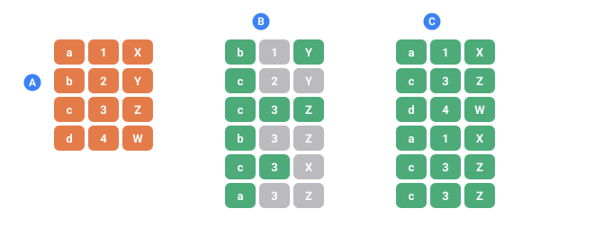

<a name="top"></a>

**English** · [Русский](../ru/generators/file.md#top) · [Español](../es/generators/file.md#top)

📖 **[Read this on the documentation site →](https://nickliapin.github.io/tdcv2/docs/generators/file)**

← Previous: [Template](./template.md#top) · **[Contents](../README.md#top)** · Next: [Date](./date.md#top) →

---

# The `file` generator

**Use it when** the values already live in a file — a list of cities, an export, a
CSV — and you don't want to paste them into the config. The [`src`](../reference/attributes.md#top)
attribute tells the generator where to read them from, and one more attribute,
[`column`](../reference/attributes.md#top), decides whether that file is a plain list or
a table.

Example outputs below are illustrative — the exact values are random and can differ
by core version; only the shape and the counts are the point.



*One CSV read twice, six rows each time.*

- **A** — the source file: four lines, three columns
- **B** — without row= every field picks its own line, so the record gets assembled from pieces that never belonged together (the gray cells)
- **C** — with row= all three fields read the same line, so every record is a real line of the file

## At a glance

| Attribute                                  | Required | What it does                                                        |
| :----------------------------------------- | :------- | :------------------------------------------------------------------ |
| [`src`](../reference/attributes.md#top)       | yes      | Where the file is — relative, `@data`, or absolute path             |
| [`column`](../reference/attributes.md#top)    | no       | Read one CSV column, by name or 1-based number (switches to CSV)    |
| [`delimiter`](../reference/attributes.md#top) | no       | Cell separator for CSV mode — comma by default                      |
| [`header`](../reference/attributes.md#top)    | no       | Skip the first line when a column is chosen **by number**           |
| [`row`](../reference/attributes.md#top)       | no       | Link several fields to the **same** CSV line (keeps a record whole) |

## `src` — where the file is

`src` is **required**. It can be a plain path or a resolver source:

| `src`                              | Resolves to                                      |
| :--------------------------------- | :----------------------------------------------- |
| `src="names.txt"`                  | Next to the `.tdc` config file                   |
| `src="@data/names.txt"`            | Searched in the folders passed via `--data-path` |
| `src="/absolute/path/names.txt"`   | An absolute path                                 |

The file is read as UTF-8. If the path can't be resolved, rendering stops with an
error instead of silently producing nothing.

## Two modes — list or CSV

The same `src` reads a file in one of two modes, and the mode is decided not by `src`
but by whether [`column`](../reference/attributes.md#top) is present:

- **without `column`** — the file is a plain list: each non-empty line is one value
- **with `column`** — the file is a CSV, and values come from the named column

### List mode — one line, one value

**Problem.** You need a pool of cities, but hard-coding a long list into `value="…"`
is awkward to edit and impossible to reuse.

**Tool.** Put one value per line in a file — `data/cities.txt`:

```text
Chicago
Austin
Denver
Boston
Seattle
```

```xml
<sequence name="City">
  <gen type="file" src="@data/cities.txt"/>
</sequence>
...
<data>${{City}}</data>
```

Pass the data folder at run time with `--data-path`:

```bash
./run example.tdc --data-path ./data
```

**Result.** Lines are chosen uniformly at random (with repeats — `Denver` came up
twice):

`./run example.tdc --data-path ./data`

```
Denver
Chicago
Boston
Denver
Austin
```

Empty lines are skipped in list mode. A blank CELL in column mode is a different thing and is refused: skipping it would take the whole row out of the pool, so the file's own proportions would stop being the run's. Fill it in, remove the row, or point `column=` at a column that is complete. For strict file order instead of random
picks, add `order="sequential"` — it emits the lines in exactly the order they
appear in the file (see [`order=` / `cycle=`](overview.md#top)).

> [!WARNING]
> **Past the end of the file, it starts again**
>
> `order="sequential"` walks the file and then **wraps back to the first line**, so a
> `count` larger than the file repeats rows — silently, with no warning. For a list of
> weekday names that is the point; for a file of real records it means duplicates in
> your output that nothing draws attention to.
>
> Add `cycle="false"` when running out of lines should stop the run rather than repeat
> it. It names the row that ran out and writes nothing.

### CSV mode — a value from a column

**Problem.** The file isn't a single column but a table, and you want just one
field — say only the email addresses. Let `data/users.csv` be:

```text
first_name,last_name,email,city
John,Smith,john.smith@example.com,Austin
Mary,Johnson,mary.johnson@example.com,Denver
James,Williams,james.williams@example.com,Boston
Emma,Brown,emma.brown@example.com,Seattle
```

**Tool.** The same `src`, plus [`column`](../reference/attributes.md#top) — its mere
presence switches the generator into CSV mode:

```xml
<sequence name="Email">
  <gen type="file" src="@data/users.csv" column="email"/>
</sequence>
...
<data>${{Email}}</data>
```

**Result.** The first line is treated as the header and never appears in the
output; values come only from the `email` column:

`./run example.tdc --data-path ./data`

```
john.smith@example.com
james.williams@example.com
john.smith@example.com
mary.johnson@example.com
john.smith@example.com
```

## `column` — by name or number

The presence of `column` is what turns the file from a line-per-value list into a
CSV. Without it, the generator would take the whole line
(`John,Smith,john.smith@example.com,Austin`) as a single value. You can address the
column in two ways.

### By name

Use a name from the header line. The header row is dropped automatically, and
values start from the second line:

```xml
<gen type="file" src="@data/users.csv" column="email"/>
```

`./run example.tdc --data-path ./data`

```
john.smith@example.com
james.williams@example.com
john.smith@example.com
mary.johnson@example.com
john.smith@example.com
```

### By number (1-based)

Give a 1-based index instead of a name. `column="2"` is the **second** column
(`last_name`) — numbering starts at one, so the first column is `column="1"`, never
`column="0"`. When you address by number, TDC has no header names to recognize, so
add [`header="true"`](../reference/attributes.md#top) to skip the header line:

```xml
<gen type="file" src="@data/users.csv" column="2" header="true"/>
```

`./run example.tdc --data-path ./data`

```
Johnson
Smith
Williams
Smith
Brown
```

The same file with `column="3"` reads the third column, `email` — identical data to
`column="email"`, just addressed by position. It needs `header="true"` for the same
reason `column="2"` did: when a column is addressed by number, TDC has no header to
recognize, and without it the word `email` itself gets drawn as a value.

```xml
<gen type="file" src="@data/users.csv" column="3" header="true"/>
```

`./run example.tdc (column=&quot;3&quot; header=&quot;true&quot;)`

```
james.williams@example.com
john.smith@example.com
john.smith@example.com
mary.johnson@example.com
mary.johnson@example.com
```

### Edge cases

- `column="0"` is **not** a valid index (numbering starts at 1) — it's read as the
  literal name `0`, which isn't in the header, so you get
  `error[TDC062]: file generator: CSV column "0" was not found in the header row`.
- A number past the last column (`column="9"` on a four-column file) fails with
  `error[TDC062]: file generator: CSV column "9" is past the last column — the file has 4`.
- If the file's separator isn't a comma, set [`delimiter`](../reference/attributes.md#top)
  — otherwise the whole line lands in one cell and no column is found.

## `delimiter` — how cells are separated

**Problem.** Not every table is comma-separated. Exports from spreadsheets often use
a semicolon or a tab. Tell TDC nothing and it splits on commas, finds no cells, and
treats the whole line as a single field — the column is never found.

`delimiter` takes either a single character (`delimiter=";"`) or one of these
name aliases:

| Value       | Separator                     |
| :---------- | :---------------------------- |
| `comma`     | comma `,` (the default)       |
| `semicolon` | semicolon `;`                 |
| `pipe`      | vertical bar                  |
| `tab`       | tab character (TSV files)     |
| `\t`        | tab character (same as `tab`) |

For a TSV file (tab-separated columns), `delimiter="tab"` and `delimiter="\t"` are
equivalent — both read the tab as the separator.

### Semicolon — the common case

Take the same users, but semicolon-separated — `data/users_semicolon.csv`:

```text
first_name;last_name;email;city
John;Smith;john.smith@example.com;Austin
Mary;Johnson;mary.johnson@example.com;Denver
James;Williams;james.williams@example.com;Boston
Emma;Brown;emma.brown@example.com;Seattle
```

**Without `delimiter`** (comma is assumed) the whole line is one cell, so the
`email` column can't be found:

```xml
<gen type="file" src="@data/users_semicolon.csv" column="email"/>
```

`./run example.tdc --data-path ./data`

```
error[TDC062]: file generator: CSV column "email" was not found in the header row
note: For CSV files, use a header name like column="email" or a 1-based index like column="2".
```

**With `delimiter="semicolon"`** (or `delimiter=";"`) the cells split correctly:

```xml
<gen type="file" src="@data/users_semicolon.csv" column="email" delimiter="semicolon"/>
```

`./run example.tdc --data-path ./data`

```
john.smith@example.com
james.williams@example.com
john.smith@example.com
mary.johnson@example.com
```

### Pipe

A file whose columns are separated by `|` reads with `delimiter="pipe"`:

```xml
<gen type="file" src="@data/users_pipe.csv" column="email" delimiter="pipe"/>
```

`./run example.tdc --data-path ./data`

```
mary.johnson@example.com
mary.johnson@example.com
john.smith@example.com
```

### Tab (TSV)

A tab-separated file reads with `delimiter="tab"` (or `delimiter="\t"`):

```xml
<gen type="file" src="@data/users.tsv" column="email" delimiter="tab"/>
```

`./run example.tdc --data-path ./data`

```
john.smith@example.com
james.williams@example.com
john.smith@example.com
```

## `header` — skip the header row for a numeric column

**Problem.** In a CSV the first line is usually a header (`first_name,last_name,…`).
When you pick a column **by name**, TDC knows the first line is the header and drops
it. But when you pick **by number**, there are no column names to recognize — TDC
can't tell a header from data, so by default it keeps everything, including the
header line, and junk like `first_name` leaks into the output.

`header` is `true` or `false` (default `false`). It only affects a **numeric**
`column`.

**Without `header`** — the header cell `first_name` is treated as an ordinary value
and shows up in the output:

```xml
<gen type="file" src="@data/users.csv" column="1"/>
```

`./run example.tdc --data-path ./data`

```
John
John
first_name
Emma
first_name
```

**With `header="true"`** — the first line is dropped, leaving only real values:

```xml
<gen type="file" src="@data/users.csv" column="1" header="true"/>
```

`./run example.tdc --data-path ./data`

```
Mary
John
James
John
Emma
```

### When `header` isn't needed

For a column chosen **by name** (`column="email"`), you never need `header="true"`:
a named column is always looked up in the first line, and data is read from the
second line on. `header` matters only for a numeric `column`.

## `row` — keep a record together

**Problem.** Several fields need to come from the **same** CSV line. Without `row`,
each `file` generator picks independently, so a record falls apart — the first name
from one line, the last name from another, the city from a third.

`row` takes any non-empty key, e.g. `row="user"`. Every `type="file"` generator that
shares the same `row` — with the same `src`, `delimiter`, and header mode — reads the
**same line** for each record. One line is chosen per record, and different `column`
values read different cells from it.

**Without `row`** — three independent generators, so the records don't line up
(Mary with Smith's last name, James in the wrong city):

```xml
<sequence name="User">
  <gen name="First" type="file" src="@data/users.csv" column="first_name"/>
  <gen name="Last"  type="file" src="@data/users.csv" column="last_name"/>
  <gen name="City"  type="file" src="@data/users.csv" column="city"/>
</sequence>
...
<data>${{User.First}} ${{User.Last}} — ${{User.City}}</data>
```

`./run example.tdc --data-path ./data`

```
Mary Smith — Denver
John Williams — Austin
Emma Brown — Boston
James Johnson — Seattle
John Brown — Austin
```

**With `row="user"`** — all three fields come from one line, so every record is
coherent:

```xml
<sequence name="User">
  <gen name="First" type="file" src="@data/users.csv" column="first_name" row="user"/>
  <gen name="Last"  type="file" src="@data/users.csv" column="last_name"  row="user"/>
  <gen name="City"  type="file" src="@data/users.csv" column="city"       row="user"/>
</sequence>
```

`./run example.tdc --data-path ./data`

```
Mary Johnson — Denver
James Williams — Boston
John Smith — Austin
John Smith — Austin
Emma Brown — Seattle
```

Now `first_name`, `last_name`, and `city` always come from one CSV line — the fields
can't drift apart. This works on **any** engine (the default is streaming, so memory
doesn't grow with the number of rows).

### Weighted rows — `row` + `weight`

By default the linked row is chosen **uniformly**. Add
[`weight="column"`](../reference/attributes.md#top) to one field in the group and the
row is drawn by a **weighted quota** from that column (exact, like `percent`), while
the other fields still read from the same chosen line. That way an item shows up at
its real sales frequency, and its price and category come from its own row —
`data/catalog.csv`:

```text
name,category,price,sales
Pen,Office,1.10,500
Coffee,Drinks,4.50,1200
Backpack,Bags,45.00,80
```

```xml
<sequence name="Item">
  <gen name="Name"  type="file" src="@data/catalog.csv" column="name"     row="i" weight="sales"/>
  <gen name="Price" type="file" src="@data/catalog.csv" column="price"    row="i"/>
  <gen name="Cat"   type="file" src="@data/catalog.csv" column="category" row="i"/>
</sequence>
...
<data>${{Item.Name}} | ${{Item.Cat}} | ${{Item.Price}}</data>
```

`./run example.tdc --data-path ./data`

```
Coffee | Drinks | 4.50
Pen | Office | 1.10
Coffee | Drinks | 4.50
```

**Engine note.** Without `weight`, a linked group runs on any engine. **With
`weight`**, the config always runs on the in-memory engine: a streaming engine can't
weight the row choice without first knowing the file's totals. If you force
`--engine 2`, TDC says so plainly rather than silently emitting incoherent columns.
The cost is that memory then grows with `count` — see [Which engine runs your
config](../guides/large-outputs.md#which-engine-runs-your-config). Linked groups
themselves are covered in **[Coherent & relational
data](../guides/coherent-data.md#top)**.

### Limitations (v1)

- `row` works only inside a `<sequence>`. The output block has no generators at all,
  so the question doesn't arise there.
- `row` requires [`column`](../reference/attributes.md#top) — it's a CSV feature, and a
  plain text list has nothing to link.
- The same `row` key with **different** sources does not link them: TDC keeps a
  separate row group for each combination of source, delimiter, and header mode.
  This is not an error, just something to be aware of.

## `read="quantile"` — a measured sample as a distribution

Everything above treats the file as a **bag of values**: pick one, put it in the
cell. That is exactly right when the values are countable — a city, a status, a
number of orders — and `weight=` even honours their shares to the row.

It is wrong for a **measurement**. A file of a thousand real transaction amounts,
read as a bag, gives a thousand distinct amounts no matter how many rows you ask
for. A million rows still hold a thousand values with nothing between them — a
comb. Real money is not shaped like a comb, and a model trained on the output
learns a structure the real data never had.

`read="quantile"` reads the same file the other way: sorted once, and treated as
a ruler. A row lands anywhere on it, and when it falls between two observations it
takes the value between them.

```text title="amounts.txt"
23.10
25.40
25.40
31.00
40.75
```

```xml
<sequence name="Amount"><gen type="file" src="amounts.txt" read="quantile"/></sequence>
```

Measured on a 951-value sample of transaction amounts, 100,000 rows:

| | source | `read="quantile"` | ordinary pick |
| :-- | --: | --: | --: |
| 10th percentile | 25.25 | 25.13 | 25.12 |
| median | 53.30 | 52.98 | 53.64 |
| 99th percentile | 227.66 | 227.39 | 231.52 |
| **distinct values** | **951** | **15,083** | **951** |

Three things follow from reading a file this way, and each of them is the reason
to prefer it for a measured quantity:

- **The resolution follows the mass, not the range.** A tail six orders of
  magnitude long costs no more points than a narrow hump, because the file's own
  density decides where the detail is.
- **A repeated value stays an atom.** `25.40` twice in the sample above is a flat
  shelf on the ruler, so it keeps exactly its own share of the run while
  everything around it stays continuous. Discrete and continuous live in one file.
- **Nothing beyond the sample is invented.** The generated range is exactly the
  observed one — a sample cannot support a claim about values it never saw.

**The precision is decided by your file, not by a guess.** Interpolating between
31 and 40 gives 35.4, which is right for money and wrong for a count of orders. So
the answer is written with as many decimal places as the source used: a
whole-number sample gives whole numbers, a sample written to the cent gives cents.
[`decimals`](../reference/attributes.md#top) overrides it when you want something else.

> [!NOTE]
> **What the quantile read does not promise**
>
>
> It reproduces the **shape**, not the share of any individual value. Interpolation
> takes mass from the observed points and gives it to the values in between — that
> is the whole cure for the comb, and it cannot be had without the trade. On a
> sample of twenty integers, the value `46` (one of twenty, so 5% of the sample)
> comes out in 0.4% of the rows; the rest went to 47, 48 and 49, which the sample
> never saw but the continuum it stands for certainly contains.
>
> What decides it is the DISTANCE to the next observation, not how often a value
> repeats. Measured on eight observations, every one of them appearing exactly once —
> four standing one apart and four far away:
>
> ```
> 10 → 12.500%   11 → 12.500%   12 → 12.500%   13 → 6.481%
> 40 → 0%        80 → 0%       160 → 0%       320 → 0%
> ```
>
> Each owes 12.5%. The three with a neighbour on both sides keep all of it; `13`
> keeps half, because one side is dense and the other is a gap; the far four
> dissolve into the values between them. A big atom survives for the same reason —
> 40% of the sample being exactly zero comes back as 39.997%, because its plateau
> dwarfs the ramps at its edges.
>
> So the check to run on your own file needs no generation at all:
>
> - **No gaps at the file's own step** — whole numbers in a row, amounts to the cent
>   in a row — and every share comes out exact. Measured on the integers 0…20 with
>   no gap: worst deviation 0.0003 percentage points across all 21 values.
> - **Gaps** — the shape is reproduced and an individual value's share spreads into
>   the gap, the wider the gap the more.
>
> And if the exact share of each listed value is the requirement, that is
> [`weight=`](#weighted-rows--row--weight) and its exact quota. The quantile read is
> for the case where the sample stands for something continuous.
>

### `sample="exact"` — reproduce the sample, without sampling noise

By default each row throws its own dice, so the shares wobble by the ordinary
amount any sample does. Add `sample="exact"` and no dice are thrown at all: row
`i` takes its own point on the ruler, and over the run the points cover it evenly.

```xml
<sequence name="Amount">
  <gen type="file" src="amounts.txt" read="quantile" sample="exact"/>
</sequence>
```

The same file and the same 100,000 rows, worst error across 99 percentiles:

| | worst error |
| :-- | --: |
| drawn (default) | 0.600% |
| `sample="exact"` | **0.024%** |

and the remaining 0.024% is rounding to the cent, not sampling.

The column does **not** come out sorted — the points are scattered by the same
seeded permutation [`uniq`](../constructs/unique-values.md#top) uses — and the run
stays reproducible, streamable and parallel: all three engines produce the same
bytes, and `--jobs 7` equals `--jobs 1`.

### Which reading to use

| your column | file | what to write |
| :-- | :-- | :-- |
| countable (city, status, number of orders) | `value,count` | [`weight="count"`](#weighted-rows--row--weight) — an exact quota |
| measured (money, weight, duration) | the raw sample, one per line | `read="quantile"`, plus `sample="exact"` to remove the noise |

`read="quantile"` cannot be combined with `weight=`, `row=` or
`order="sequential"` — each of those is a different way of reading the same file,
and asking for two at once is [`TDC297`](../reference/errors.md#top).

## See also

- [`src`](../reference/attributes.md#top), [`column`](../reference/attributes.md#top),
  [`delimiter`](../reference/attributes.md#top), [`header`](../reference/attributes.md#top),
  [`row`](../reference/attributes.md#top), and [`weight`](../reference/attributes.md#top) in
  the attribute reference.
- **[Files & CSV](../guides/files-and-csv.md#top)** — the end-to-end guide to loading
  external data.
- **[Coherent & relational data](../guides/coherent-data.md#top)** — linking whole
  records together and weighted rows.

---

← Previous: [Template](./template.md#top) · **[Contents](../README.md#top)** · Next: [Date](./date.md#top) →

📖 **[Read this on the documentation site →](https://nickliapin.github.io/tdcv2/docs/generators/file)**
