<a name="top"></a>

**English** · [Русский](../ru/generators/pattern.md#top) · [Español](../es/generators/pattern.md#top)

📖 **[Read this on the documentation site →](https://nickliapin.github.io/tdcv2/docs/generators/pattern)**

← Previous: [Time series](./timeseries.md#top) · **[Contents](../README.md#top)** · Next: [HTTP service](./http.md#top) →

---

# The `pattern` generator

**Use it when** a signal has a shape you can't describe with a formula — demand by
hour, a demographic wave, a screenshot of a stock chart, any "wiggly" line. You
**draw the picture**, and its shape is **stretched across all rows**: the horizontal
axis is the row number (first … last), the vertical axis is the value. The drawing
can be tiny; the rows can number in the millions.

Nothing is pre-rendered into a file. The picture is read **when the run starts**, and
each row computes its own point on it, so a million rows cost no more memory than ten.

Example outputs below are illustrative and can differ slightly by core version; the
_shape_ is what's guaranteed.

## Why draw a shape instead of picking a distribution

Ready-made distributions (`normal`, `poisson`, …) have a **fixed** shape — a bell, a
decaying tail. A real signal often needs a shape that isn't in that list: two humps
where the **right one is taller**, a plateau with a spike at the end, demand that
rises toward noon and falls at night. You can't get "two humps of different heights"
out of `normal`. `pattern` removes that limit — you draw the silhouette yourself, and
it's stretched across the rows as-is.

## How to turn it on

Every [`<gen>`](../reference/generators.md#top) with `type="pattern"` takes exactly
**one** source of shape. The usual one is a **file** — draw in any editor, or
screenshot a chart, and hand the file over:

```xml
<!-- a drawing you made: SVG or PNG -->
<gen type="pattern" src="chart.svg" y_range="0..40"/>
```

For a shape simple enough to type, the same generator accepts points inline — a
single line with `points`, or a band with `upper` / `lower`:

```xml
<gen type="pattern" points="0,5  20,40  40,8  60,45  80,15  100,5" y_range="0..40"/>
<gen type="pattern" upper="0,20 50,40 100,20" lower="0,5 50,10 100,5" y_range="0..40"/>
```

| Attribute         | What it sets                                                                                                    |
| :---------------- | :-------------------------------------------------------------------------------------------------------------- |
| `src`             | An **SVG** or **PNG** file — the usual way to give the shape                                                    |
| `points`          | Pairs `x,y` typed inline instead of a file: `x` across, `y` height                                              |
| `upper` / `lower` | Two boundary curves typed inline — a [corridor](#a-drawing-is-read-column-by-column)                            |
| `mode`            | `signal` (default) — a trajectory; `density` — a [distribution](#mode--the-two-questions-you-can-ask-a-drawing) |
| `y_range`         | `min..max` — the range of the values you get; the drawing is stretched into it                                  |
| `interp`          | `linear` (default) / `smooth` / `step` — how the line behaves between points                                    |
| `spread`          | Randomize every row by ±N in `y_range` units (default `0` — an exact line)                                      |
| `ink_threshold`   | `0..1` — how dark a PNG pixel must be to count as ink (default `0.5`)                                           |
| `decimals`        | Digits after the decimal point (default `0`)                                                                    |

## `src` — the picture is the config

Two formats are read, and both end up as the same thing internally — a vector
outline:

- **SVG** — read from its real geometry: `<path>`, `<polyline>`, `<line>`,
  `<rect>`, `<circle>`, `<ellipse>`. Bezier curves and arcs are followed as drawn,
  and `transform` on a shape or on any enclosing `<g>` is applied. Draw in
  Illustrator, Figma, Inkscape, or by hand — export and go.
- **PNG with a transparent background** — the drawn pixels are the shape and the
  transparency is empty space. That's what a screenshot cropped to a chart, or a
  brush stroke exported from any raster editor, looks like. A PNG with a solid
  background falls back to darkness instead: dark pixels are ink, light ones are
  background, and `ink_threshold` moves the cutoff.

An SVG's `y` axis grows **downward**, the way every drawing program stores it. TDC
flips it, so "higher on the screen" always means "a larger value".

### A whole example, end to end

This is a real file — 240×140 pixels, a stroke on a transparent background and
nothing else. No axes, no labels, no frame: everything opaque in the file is read
as part of the drawing.

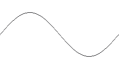

*line-input.png — the whole file. The white backing is only here so the stroke is visible; the file itself is transparent.*

```xml
<gen type="pattern" src="line-input.png" y_range="0..100"/>
```

Run it for 40 rows and plot the result against the drawing. The green dots are the
generated values; the orange line is the picture:

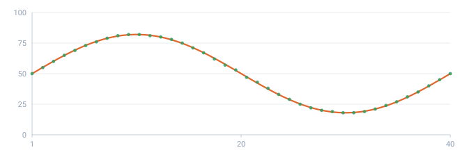

*Every row lands exactly on the stroke — a single line carries no randomness at all.*

- **drawn** — the line drawn in the file
- **made** — generated values (40 rows)

The picture is 240 px wide and the run is 40 rows, but neither number has to match
the other: ask for 40 rows or 4,000,000 and the same drawing is stretched across
them.

### The same thing from a vector file

An SVG is not approximated. This one is a single cubic Bezier inside a `<g>` that
flips the y axis — the two things a drawing program emits constantly:

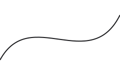

*curve-input.svg — one path, one transform.*

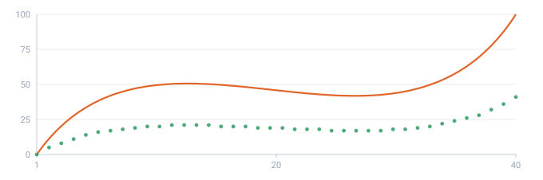

*The curve is followed as drawn: the Bezier is walked, the transform applied, the y axis flipped back.*

- **drawn** — the Bezier from the file, with its transform applied
- **made** — generated values (40 rows)

## A drawing is read column by column

TDC never guesses whether your picture is "one line" or "a band". It **measures**,
and the measurement answers the question on its own.

For each column of the drawing it takes two readings: **from the top down** to the
first mark it meets, and **from the bottom up** to the first mark it meets.

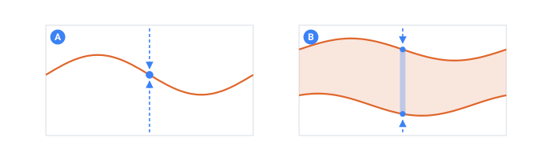

*The same two readings, on a single line and on a band. Nothing else is inspected.*

- **A** — the readings meet on one pixel — the value is exact
- **B** — the readings stand apart — the value is random between them
- **mark** — the readings themselves: top-down and bottom-up

- Both readings land on the **same** spot → that column is an **exact point** on the
  graph. Every row that falls there gets that one value, with no randomness.
- The readings land **apart** → that column is a **band**. A row falling there gets a
  random value between the two edges, fixed by the [`seed`](../core-concepts/determinism.md#top).

So a picture with two strokes is a **corridor**, and each row picks a random value
between them. Here is the input file and 300 rows generated from it:

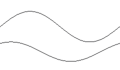

*tunnel-input.png — two strokes, nothing else.*

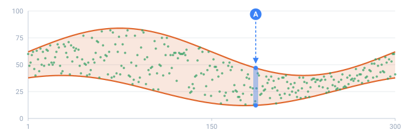

*Every value lands inside the band. Where the band is wide the spread is wide; where it narrows, so does the data.*

- **band** — the band drawn in the file
- **made** — generated values (300 rows)
- **A** — one column: the value is taken between its edges

Two consequences worth knowing:

- **One picture can be both.** A line that runs alone and then splits into two
  branches gives exact values while it's a single stroke, and random ones once it
  opens up — no attribute needed, no mode to pick.
- **Anything closed is a corridor.** Draw a car, a leaf, a blob: it has a top edge
  and a bottom edge, so it reads as a band between them. That is not a figure of
  speech — here is a car:


*car-input.png — a silhouette, painted solid.*

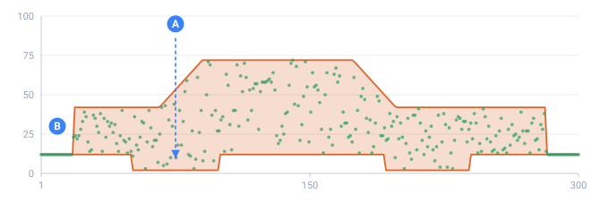

*The values fill the body between its top and bottom edges — and where the drawing is a single line (the ground before and after the car), they collapse to one exact value.*

- **band** — the drawn car
- **made** — generated values (300 rows)
- **A** — a wheel lowers the bottom edge of the body
- **B** — the ground before and after the car is a single line, so the values are exact

Here's a line that runs flat and then forks — one branch up, one branch down:

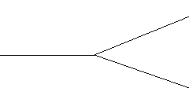

*split-input.png — a single stroke that becomes two.*

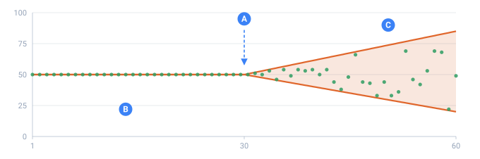

*Before the fork every row gets the same exact value; after it, a random one inside the widening band.*

- **drawn** — the lines from the file
- **made** — generated values (60 rows)
- **A** — the line forks here
- **B** — before the fork — the same exact value every time
- **C** — after it — random inside the widening band

The same run on two different seeds shows it plainly — the first half is identical,
the second half is not:

`./run split.tdc (11 rows, two seeds)`

```
seed A:  50  50  50  50  50  50  44  47  66  18  45
seed B:  50  50  50  50  50  51  57  61  60  81  35
```

## `y_range` — set the vertical scale

A drawing carries **no scale of its own**: `y_range="min..max"` says what its bottom
and top mean. The lowest point maps to `min` and the highest to `max`; everything in
between is stretched linearly. Use it whenever the numbers you want don't match the
picture's own coordinates — including **signed** or **fractional** output.

```xml
<gen type="pattern" src="chart.svg" y_range="0..40"/>
<gen type="pattern" src="chart.svg" y_range="-2..2"/>
```

Without `y_range` the raw `y` numbers are used as-is. Combine it with `decimals` when
you need continuous values rather than rounded integers.

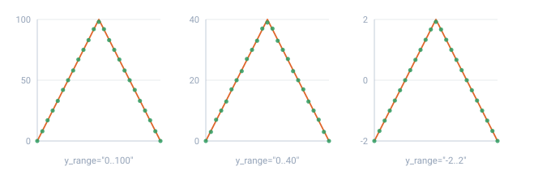

*One drawing, three scales. The shape is identical; only the numbers on the axis change.*

- **drawn** — the same drawn triangle
- **made** — generated values (25 rows)

`y_range` always means **the range of the values you get**. In `mode="density"` the
value axis is the drawing's width rather than its height, so there the range is
stretched across the picture from left to right — the attribute keeps its meaning
even though the axis changes.

## `decimals` — digits after the point

`decimals` sets how many fractional digits each value keeps (default `0`, i.e. whole
numbers). Reach for it when the curve feeds a price, a temperature, or any measured
quantity where rounding to integers would flatten the shape.

```xml
<gen type="pattern" points="0,0 50,100 100,0" y_range="-1..1" decimals="2"/>
```

`./run decimals.tdc (11 rows)`

```
-1.00   -0.60   -0.20   0.20   0.60   0.90   0.60   0.20   -0.20   -0.60   -1.00
```

The middle row sits on the apex and still reads `0.90` rather than `1.00`: a row covers a
**slice** of the drawing and reports the average over it, so the one point that touches the
top is averaged with everything beside it. [Stretching](#stretching--the-drawing-rarely-has-as-many-points-as-you-have-rows),
below, is that rule in full.

## Stretching — the drawing rarely has as many points as you have rows

Row `i` of `count` reads the drawing at `t = i / (count − 1)`. The drawing's width is
mapped onto the whole run, so the two sides of the mismatch are handled differently:

**Fewer rows than drawn detail → averaging.** A row doesn't sample a single spot; it
covers a **slice** of the drawing as wide as one row's share, and reports the average
over that slice. A five-tooth zigzag between 0 and 100 squeezed into 5 rows gives the
teeth's mean, not whichever tooth happened to sit under a sample point:

```xml
<gen type="pattern" points="0,0 10,100 20,0 30,100 40,0 50,100 60,0 70,100 80,0 90,100 100,0"
     y_range="0..100"/>
```

`./run saw.tdc (5 teeth into 5 rows)`

```
50   50   46   50   50
```

Widen the same run to 40 rows and the teeth come back, because now each row is
narrow enough to see them: `0  26  51  77  92  72  46  21  9  31  56  82 …`

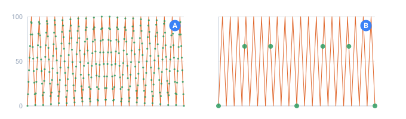

*The same zigzag. With rows to spare, the teeth come through; with six rows, each one reports the mean of everything it covers instead of whichever tooth sat under it.*

- **drawn** — the drawn zigzag
- **made** — generated values
- **A** — 300 rows — the teeth come through
- **B** — 6 rows — each reports the mean of the slice it covers

**More rows than drawn points → interpolation**, which is where `interp` comes in.

## `interp` — how the line behaves between two drawn points

Between two points drawn far apart there may be thousands of rows. Left alone, a
straight segment climbs by exactly the same amount every row — mathematically
correct and visibly synthetic. `interp` picks the behavior:

| Value              | What it does                                                             |
| :----------------- | :----------------------------------------------------------------------- |
| `linear` (default) | Straight segments — a constant rate between two points                   |
| `smooth`           | A curve through the points that **eases in and out**, never overshooting |
| `step`             | Holds each point's value until the next one — a staircase                |

`smooth` uses a monotone cubic: it rounds the corners and varies the rate, but it can
never take the line above or below the values you actually drew, so no phantom peak
appears out of a bend. The same three-point drawing over 11 rows:

`./run kink.tdc (11 rows, three modes)`

```
linear:  0   8  16  24  32  41  52  64  76  88  100
smooth:  0   8  15  23  31  40  50  62  75  88  100
step:    0   0   0   0   0  30  40  40  40  40   40
```

On a drawing with real corners the three are unmistakable — the dashed line is what
was drawn, the dots are what came out:

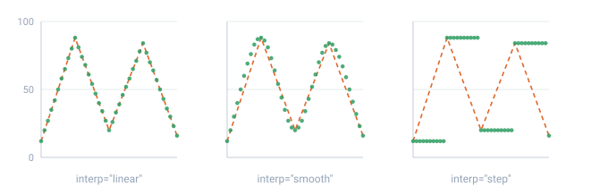

*linear rides the polyline exactly; smooth rounds every corner without ever leaving the drawn range; step holds each point until the next.*

- **dash** — what was drawn: a polyline through five points
- **made** — generated values (41 rows)

Look at the step sizes: `linear` repeats `8, 8, 8, 8` — perfectly predictable.
`smooth` goes `8, 7, 8, 8, 9, 10, 12, 13` — it leaves the point gently, accelerates,
and arrives gently.

## `spread` — turn one line into a tunnel

`spread="N"` randomizes every row by **±N**, in the units of your `y_range`. Default
`0`: the line is exact and 100% predictable. Set it, and the drawn line becomes the
**center of a band** — so you don't have to draw both edges of a corridor just to get
some wobble.

It follows whatever scale you declared: on `y_range="0..100"` a spread of `1` is one
point of noise; on `y_range="0..1"` you'd write `spread="0.001"` for the same
relative effect.

```xml
<gen type="pattern" src="ramp.svg" y_range="0..100" spread="5"/>
```

`./run ramp.tdc (11 rows)`

```
spread 0, seed A:   0  10  20  30  40  50  60  70  80  90  100
spread 5, seed A:   5  13  16  29  37  52  57  69  83  86   99
spread 5, seed B:   5  11  21  26  45  53  64  73  82  94   99
```

The single stroke of `line-input.png` again, this time with `spread="6"`:

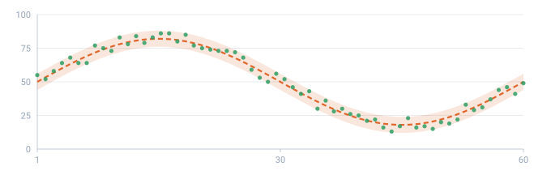

*One drawn line, a tunnel you never drew. The shape is untouched; each row just sits somewhere within ±6 of it.*

- **dash** — the drawn line — the center
- **band** — the ±6 corridor you never drew
- **made** — generated values (60 rows)

The trend is untouched; each row just sits somewhere inside ±5 of it. Like the
corridor, the scatter is **deterministic** — the same seed reproduces it exactly.
`spread` also works on a drawing that is already a band: it widens the band by `N` on
both sides.

## `ink_threshold` — the dark/light cutoff for PNGs

When a PNG has a solid background, ink is decided by darkness. `ink_threshold` is the
cutoff on a `0..1` scale (default `0.5`): a pixel counts as ink when it is **at or
darker than** the cutoff. So **raise** it toward `1` to take in faint, anti-aliased
edges and light gray, and **lower** it toward `0` to keep only near-black strokes. It
has no effect on a PNG drawn on transparency, where the alpha channel already says what
is drawn.

```xml
<gen type="pattern" src="faint-curve.png" ink_threshold="0.8" y_range="0..100"/>
```

This file has two strokes on a white canvas — one black, one light gray — and the
threshold decides whether the gray one exists at all:

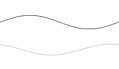

*threshold-input.png — two strokes on an opaque canvas.*

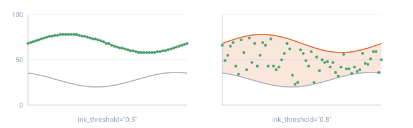

*At the default cutoff the gray stroke is background and the reading is a single exact line. Raise the cutoff and gray counts as ink too — now there are two edges, so the values fall randomly between them.*

- **drawn** — the black stroke
- **faint** — the light gray stroke
- **made** — generated values (60 rows)

## The signal is a trajectory, not a histogram

A row's value is the curve's height **at its position in order**. So the numbers come
out **along** the curve, like the trail of a pen — a **trajectory**, not "a pile of
values". If you took those same numbers and, ignoring their order, built a
**histogram** (how often each value occurs), it would **not** reproduce the curve's
shape. Here's the real histogram of a two-hump drawing over 300 rows:

`./run humps.tdc --count 300 | histogram`

```
0  | ################################## 29
3  | ######################################## 34
7  | ######################################## 34
10 | #################################### 31
13 | ######################### 21
17 | ########################## 22
20 | ################################# 28
23 | ########################## 22
27 | ######################### 21
30 | ################################## 29
33 | ################### 16
37 | ############### 13
```

No two humps — the histogram is nearly flat. That's not a bug: the signal **passes
through** each height about equally often, so the pile of its values doesn't look
like the drawing. When you want the drawing to set **frequency** instead, that's the
other reading — `mode="density"`, below.

## `mode` — the two questions you can ask a drawing

The same picture answers two different questions, and `mode` picks which one:

| Mode               | The question                             | What comes out                                                               |
| :----------------- | :--------------------------------------- | :--------------------------------------------------------------------------- |
| `signal` (default) | "what value does **this row** get?"      | `0, 20, 40, 70, 90, 100, 90, 70, 40, 20, 0` — walks along the line, in order |
| `density`          | "how **often** does this value come up?" | a pile of numbers clustered around the drawn hump, in random order           |

In `density` the axes swap meaning: the horizontal axis is the **value**, and the
curve's height is **how often** that value occurs. Draw a hump over the middle and
most numbers land in the middle; draw two humps of different heights and the taller
one gets proportionally more. It's "draw your own probability" instead of picking
`normal` / `poisson` off a list.

```xml
<!-- a triangle standing between x=25 and x=75 -->
<gen type="pattern" points="0,0 25,0 50,100 75,0 100,0" y_range="0..100" mode="density"/>
```

`./run density.tdc --count 6000 | histogram`

```
  0- 9 |
 10-19 |
 20-29 | ## 85
 30-39 | ########################### 901
 40-49 | ########################################################## 1911
 50-59 | ############################################################ 1955
 60-69 | ############################## 978
 70-79 | ##### 170
 80-89 |
 90-99 |
```

The values themselves come out shuffled — `60 57 36 49 48 40 67 53 …` — because a
distribution has no order. And nothing appears outside `25..75`: the drawing is flat
there, and a flat stretch means "never".

The same thing with a picture instead of typed points. Here is a hump drawn as a
filled shape:

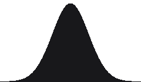

*hump-input.png — a hump painted with a brush, saved on transparency.*

```xml
<gen type="pattern" src="hump-input.png" y_range="0..100" mode="density"/>
```

Generate 6,000 rows from it and count how often each value came up:

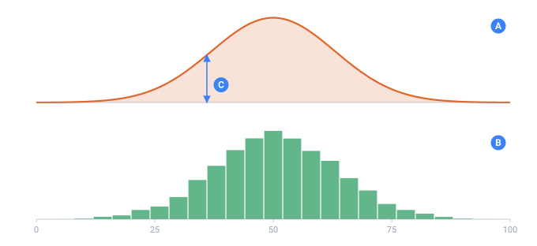

*Top: what was drawn. Bottom: how often each value actually came up. The horizontal axis is the same in both — and it is the value, not the row number.*

- **A** — what is drawn in the file
- **B** — histogram of 6000 generated values
- **C** — the height of the drawing here = how often that value comes up

That is the whole idea: the silhouette you paint becomes the histogram of the data.
No formula was chosen anywhere.

And the height is proportional, not just positional — draw one hump twice as tall as
the other and it takes about twice as many of the values:

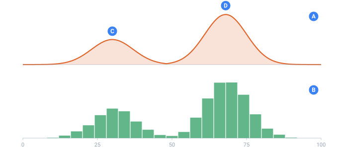

*Two humps, the right one twice as tall. The histogram below reproduces both, in proportion.*

- **A** — what is drawn: two humps of different height
- **B** — histogram of 6000 generated values
- **C** — the left hump
- **D** — the right one, twice as tall — and twice as many values

Things worth knowing about `density`:

- **Zero is the picture's floor.** For a PNG that's the bottom edge of the image; for
  an SVG or inline points it's the lowest point of the drawing. Wherever the curve is
  at its lowest, that value never occurs — so bring your curve down to the baseline at
  the edges of the range you want.
- **A band contributes its top edge.** If the drawing is a corridor, the outline is
  what shapes the distribution.
- **`interp` still applies** — `smooth` gives a rounded distribution rather than a
  polygonal one.
- **`spread` is refused here.** The drawing is already the scatter, so combining the
  two is a mistake rather than a feature.
- **A flat drawing means "no preference"** and gives a uniform spread across the
  range instead of an error.
- **Deterministic and streamable** like everything else: the same seed reproduces the
  same pile, at any row count.

## Details

- **Deterministic:** where the drawing is a single line, a row's value is the
  height there (no randomness at all); where it is a band — or where `spread` is set
  — the scatter is fixed by the [`seed`](../core-concepts/determinism.md#top). Same seed
  and config → same result.
- **Any size, either engine:** each row is computed from its own number, so memory
  doesn't grow. A million rows from a small drawing is fine on the
  [streaming engines](../guides/large-outputs.md#top).
- **The file is read once,** at the start of the run, and turned into geometry — the
  cost doesn't scale with the row count.

## Check it by hand

A few one-liners to build intuition:

- `points="0,0 50,100 100,0"` — a triangle: values rise to the middle and fall.
- `points="0,10 90,10 100,100"` — a flat line with a spike only in the last 10% of rows.
- `upper="0,0 50,40 100,0"` — a band: random from `0` up to a central peak.
- `src="chart.png" y_range="0..100"` — a drawn shape becomes data along its outline.
- add `spread="2"` to any of them — the same shape, now with wobble.
- add `mode="density"` instead — the same shape now decides how **often** each value
  comes up.

The spike case makes the "position = row number" idea obvious:

`./run spike.tdc (20 rows)`

```
rows 1–18: 10   (the flat stretch)
row 19: 55      (climbing)
row 20: 100     (the spike)
```

> [!NOTE]
> **Coming later**
>
> A front-end drawing tool that exports these very SVG/PNG files — so you can sketch a
> curve with the mouse instead of opening an editor.

## See also

- **[Time series](timeseries.md#top)** — when the shape is trend + season + noise.
- **[Number](number.md#top)** — for ranges and simple random integers.
- **[Determinism & proportions](../core-concepts/determinism.md#top)** — how `seed` fixes the scatter.
- **[Large outputs & streaming](../guides/large-outputs.md#top)** — millions of rows from one small drawing.

---

← Previous: [Time series](./timeseries.md#top) · **[Contents](../README.md#top)** · Next: [HTTP service](./http.md#top) →

📖 **[Read this on the documentation site →](https://nickliapin.github.io/tdcv2/docs/generators/pattern)**
