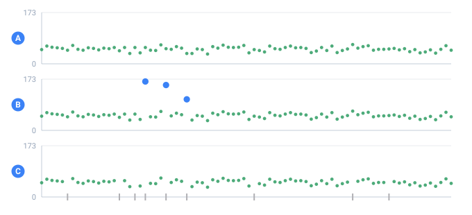

<a name="top"></a>

**English** · [Русский](../ru/guides/missing-data.md#top) · [Español](../es/guides/missing-data.md#top)

📖 **[Read this on the documentation site →](https://nickliapin.github.io/tdcv2/docs/guides/missing-data)**

← Previous: [Anomalies & outliers](./anomalies.md#top) · **[Contents](../README.md#top)** · Next: [Typed output & Parquet](./typed-output-parquet.md#top) →

---

# Missing data — `missing`

**Use it when** you need to test how your code copes with holes. Real data is
almost never complete: a phone number was never entered, an income went missing, a
field is just blank. If you only ever test on "perfect" rows, the first null in
production breaks everything. The `missing` attribute mixes blanks in **on purpose**
so you can see the failure before your users do.

`missing` is a cross-cutting attribute — it works on **any**
[`<gen>`](../generators/overview.md#top), whatever it generates.

Example outputs below are illustrative: the exact rows a given `seed` produces
can shift between core versions, but the behavior the attribute guarantees does
not.



*The same generator, 80 rows, with each modifier switched on in turn.*

- **A** — the clean series
- **B** — with anomaly= — the marked points are the injected outliers
- **C** — with missing= — the marks on the floor are rows that produced no value

## How to turn it on

Put `missing="p"` on a `<gen>`, where `p` is a fraction from `0` to `1` — the
share of values that become empty:

```xml
<gen type="number" value="30000..90000" missing="0.3"/>
```

Roughly 30% of the incomes come out empty; the rest are ordinary numbers.

Each value is dropped **independently** with that probability. In statistics this
is called **MCAR** — Missing Completely At Random — the blanks fall without regard
to any other field or to the value itself.

By default a missing value is an **empty string**. Want your own marker (`NULL`,
`NA`, `—`)? Set `missing_as` — [see below](#a-visible-marker--missing_as).

## Before and after — what a blank actually changes

**The problem.** Until you see the same field "whole" and "holey" side by side,
it's hard to tell what's happening: which value was lost, and which was never
there.

**The tool.** Take one list of cities and make **two** columns from it: `Full` as-is,
and `Holey` — the same list with `missing`.
[`order="sequential"`](masks-and-case.md#top) walks the list strictly in order, so
both columns line up row for row and you see exactly what dropped out:

```xml
<env count="8" seed="rec">
  <sequence name="Full"> <gen type="text" value="Austin,Denver,Boston,Seattle,Chicago,Dallas,Portland,Miami" order="sequential"/></sequence>
  <sequence name="Holey"><gen type="text" value="Austin,Denver,Boston,Seattle,Chicago,Dallas,Portland,Miami" order="sequential" missing="0.4"/></sequence>
</env>
...
<data>full=${{Full}} | holey=${{Holey}}</data>
```

`./run cities.tdc (count=8, seed=rec)`

```
full=Austin | holey=Austin
full=Denver | holey=
full=Boston | holey=
full=Seattle | holey=
full=Chicago | holey=Chicago
full=Dallas | holey=Dallas
full=Portland | holey=Portland
full=Miami | holey=Miami
```

Everything is in place on the left; on the right, the **same** rows — but `Denver`,
`Boston`, and `Seattle` have vanished. The value wasn't swapped for another one, and
nothing shifted up to fill the gap: the cell became empty. (On 8 rows at
`missing="0.4"` three dropped — the share is random, and on a small sample the spread
is wide.)

## A visible marker — `missing_as`

**The problem.** An empty string is invisible in an export: in a CSV it's just
"nothing between two commas," and you can't tell a blank from a short value by
looking. Real datasets usually flag a hole explicitly — `NULL`, `NA`, `—`.

**The tool.** `missing_as="marker"` prints your text where the blank would be.
The rows that go missing are **the same ones** (they're chosen by the `seed` and
the column name, not by the marker); only what fills the hole changes:

```xml
<sequence name="Holey">
  <gen type="text" value="Austin,Denver,Boston,Seattle,Chicago,Dallas,Portland,Miami"
       order="sequential" missing="0.4" missing_as="NULL"/>
</sequence>
```

`./run cities.tdc (missing_as=NULL)`

```
full=Austin | holey=Austin
full=Denver | holey=NULL
full=Boston | holey=NULL
full=Seattle | holey=NULL
full=Chicago | holey=Chicago
full=Dallas | holey=Dallas
full=Portland | holey=Portland
full=Miami | holey=Miami
```

The holes are on the same rows — 2, 3 and 4 — as before, where `Denver`, `Boston` and
`Seattle` were: adding the marker moved nothing. Set `missing_as="—"` or
`missing_as="NA"` and you get your own marker in the same places.

## How many holes — varying the rate

**The problem.** You want to know how the system behaves under "rare" blanks and
under "frequent" ones. A single rate won't show you that.

**The tool.** Change only `missing`, keep everything else the same. `X` is a value
in place, `[]` is a hole. Three columns, 20 rows:

```xml
<env count="20" seed="demo">
  <sequence name="A"><gen type="text" value="X" order="sequential" missing="0.1"/></sequence>
  <sequence name="B"><gen type="text" value="X" order="sequential" missing="0.3"/></sequence>
  <sequence name="C"><gen type="text" value="X" order="sequential" missing="0.6"/></sequence>
</env>
...
<data>0.1:[${{A}}]  0.3:[${{B}}]  0.6:[${{C}}]</data>
```

`./run rates.tdc (count=20, seed=demo)`

```
0.1:[X]  0.3:[X]  0.6:[]
0.1:[X]  0.3:[]  0.6:[X]
0.1:[X]  0.3:[X]  0.6:[X]
0.1:[X]  0.3:[]  0.6:[X]
0.1:[X]  0.3:[]  0.6:[]
0.1:[X]  0.3:[]  0.6:[X]
0.1:[X]  0.3:[X]  0.6:[]
0.1:[]  0.3:[X]  0.6:[]
0.1:[X]  0.3:[X]  0.6:[]
0.1:[X]  0.3:[X]  0.6:[X]
0.1:[]  0.3:[X]  0.6:[X]
0.1:[X]  0.3:[X]  0.6:[X]
0.1:[X]  0.3:[X]  0.6:[]
0.1:[X]  0.3:[X]  0.6:[]
0.1:[X]  0.3:[]  0.6:[]
0.1:[X]  0.3:[X]  0.6:[]
0.1:[X]  0.3:[X]  0.6:[X]
0.1:[X]  0.3:[X]  0.6:[X]
0.1:[X]  0.3:[X]  0.6:[]
0.1:[X]  0.3:[X]  0.6:[X]
```

Count the empty `[]` down each column: `0.1` → 2 holes out of 20, `0.3` → 5,
`0.6` → 10. Raise the rate and the holes multiply. You won't get exactly
2 / 6 / 12: because each value is dropped independently, the count over 20 rows
varies around the expected number.

## Missing across several fields

`missing` **combines with anything** — a plain range, a
[`template`](../generators/template.md#top), a [`regex`](../generators/regex.md#top)
pattern, a statistical distribution. Here's a record built from three fields: a
name (no blanks), a phone (`missing="0.3"`, marker `N/A`), and an income
(`missing="0.25"`, with the default empty marker):

```xml
<env count="8" seed="demo">
  <sequence name="Name">   <gen type="template" value="person.male.firstName"/></sequence>
  <sequence name="Phone">  <gen type="regex" value="\+1 \(555\) [0-9]{3}-[0-9]{4}" missing="0.3" missing_as="N/A"/></sequence>
  <sequence name="Income"> <gen type="number" value="30000..90000" missing="0.25"/></sequence>
</env>
...
<data>${{Name}} | phone: ${{Phone}} | income: ${{Income}}</data>
```

`./run record.tdc (count=8, seed=demo)`

```
Richard | phone: +1 (555) 226-8995 | income: 38370
David | phone: +1 (555) 067-4473 | income: 70315
Joseph | phone: N/A | income: 41008
William | phone: N/A | income: 85063
John | phone: +1 (555) 528-7933 | income: 
Michael | phone: +1 (555) 140-4007 | income: 48334
James | phone: N/A | income: 46153
Robert | phone: N/A | income: 33986
```

Some rows have `N/A` for the phone; row 5 has an empty income (the default marker
is nothing at all). The blanks in the two fields are **independent**: a hole in
one column tells you nothing about the other.

## Details

- **Deterministic.** The same `seed` produces the same blanks — see
  [Determinism & proportions](../core-concepts/determinism.md#top). One "holey"
  dataset reproduces byte for byte, run after run.
- **Both engines, any volume.** Blanks are decided by row number, so memory
  doesn't grow with the dataset — see
  [Large outputs & streaming](large-outputs.md#top).
- **`missing="0"`** means no blanks at all — exactly as if the attribute weren't
  there.

> [!NOTE]
> **What's next**
>
> Only **MCAR** is implemented today: blanks are equally likely and independent of
> everything else. On the roadmap are **MAR / MNAR** — where the chance of a hole
> depends on another field, or on the value itself.

## See also

- **[Sequences](../core-concepts/sequences.md#top)** — the columns you're punching
  holes in, and how `${{Name}}` reads them.
- **[Text](../generators/text.md#top)** and **[Number](../generators/number.md#top)** —
  the generators used in the examples above.
- **[Masks & case](masks-and-case.md#top)** — `order="sequential"` and the other
  cross-cutting generator attributes.

---

← Previous: [Anomalies & outliers](./anomalies.md#top) · **[Contents](../README.md#top)** · Next: [Typed output & Parquet](./typed-output-parquet.md#top) →

📖 **[Read this on the documentation site →](https://nickliapin.github.io/tdcv2/docs/guides/missing-data)**
