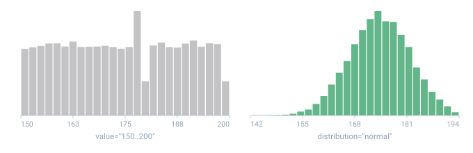
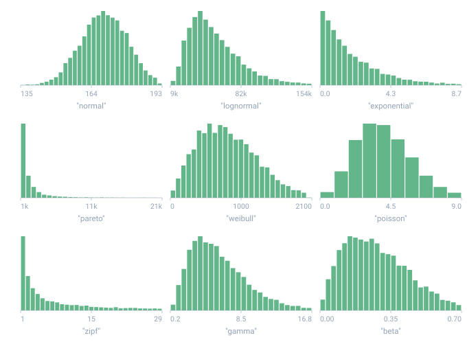
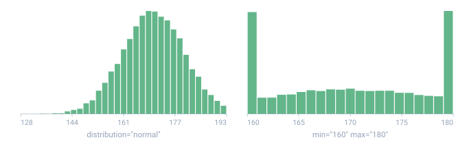

<a name="top"></a>

**English** · [Русский](../ru/guides/statistical-distributions.md#top) · [Español](../es/guides/statistical-distributions.md#top)

← Previous: [Masks & case](./masks-and-case.md#top) · **[Contents](../README.md#top)** · Next: [Anomalies & outliers](./anomalies.md#top) →

---

# Statistical distributions — numbers shaped like real life

A plain [`<gen type="number" value="150..200"/>`](../generators/number.md#top) draws
**uniformly** — `150` is exactly as likely as `175` or `199`. Real data almost never
looks like that. People's heights cluster around an average, salaries are skewed (lots
of middling ones, a few enormous), and wealth has a long, heavy tail. To generate
**believable** numbers, add a `distribution` attribute to the number generator.

## How to switch it on

There's no new tag — `distribution` is an attribute on the familiar
[`<gen type="number">`](../generators/number.md#top):

```xml
<gen type="number" distribution="normal" mean="170" sd="10"/>
```

The moment `distribution="..."` is present, the generator flips from **range** mode to
**distribution** mode. Leave it off and the generator behaves exactly as before.

Here are four columns, each drawn from a different distribution (seed `demo`, 8 rows):

```xml
<env count="8" seed="demo">
  <sequence name="Height"> <gen type="number" distribution="normal"      mean="170" sd="10"/></sequence>
  <sequence name="Salary"> <gen type="number" distribution="lognormal"   meanlog="10.8" sdlog="0.5"/></sequence>
  <sequence name="Pause">  <gen type="number" distribution="exponential" rate="0.5" decimals="1"/></sequence>
  <sequence name="Balance"><gen type="number" distribution="pareto"      alpha="1.5" xmin="1000"/></sequence>
</env>
```

`./run life.tdc (8 rows)`

```
156 cm | $29884  | 0.4 s | $1329
175 cm | $75675  | 0.0 s | $2337
179 cm | $35084  | 1.1 s | $3587
160 cm | $74516  | 3.2 s | $3130
178 cm | $65256  | 1.1 s | $3285
170 cm | $39817  | 0.4 s | $1664
159 cm | $107734 | 1.9 s | $8781
182 cm | $65121  | 1.4 s | $2924
```

Heights stay near 170, salaries skew to the right, pauses are almost always short, and
the balance never drops below 1000 but occasionally spikes.

> [!NOTE]
> **Example outputs are illustrative**
>
> The histograms and values below are what a typical run produces. Exact draws can differ
> by core version, but the **shape** each distribution guarantees is what stays fixed.
> Distributions are deterministic — same `seed`, same numbers.

## Uniform vs. "like real life" — visible on a histogram

**The problem.** Staring at a column of numbers won't tell you whether they're flat or
bunched up. Draw the shape instead: generate 300 "heights" two ways and sort them into
bins. Each histogram row is a range; the `#` bars show how many values landed in it (the
`n` / `min` / `max` footer gives the totals and the edges).

**A plain range** — `value="150..200"`. The numbers spread evenly across the whole range:
a height of 150 is as common as 175 or 199. That's not how people are built:

```xml
<gen type="number" value="150..200"/>
```

`./run uniform.tdc (300 rows)`

```
150 | ############################# 27
154 | ####################### 21
158 | ############################### 29
163 | ######################## 22
167 | ##################### 19
171 | ######################## 22
175 | ################### 18
179 | ################################## 31
183 | ############################# 27
188 | ##################################### 34
192 | ############## 13
196 | ######################################## 37
n=300  min=150  max=200
```

**The same range, but `distribution="normal"`** (center 175, spread 8). A bell appears:
most heights sit near the center and thin out toward the edges — just like real people:

```xml
<gen type="number" distribution="normal" mean="175" sd="8"/>
```

`./run normal.tdc (300 rows)`

```
157 | ### 5
161 | ############# 19
165 | ###################### 33
169 | ####################################### 57
172 | ######################################## 59
176 | ########################## 39
180 | ################################## 50
184 | ################# 25
188 | #### 6
192 | ## 3
195 | ## 3
199 | # 1
n=300  min=157  max=203
```



*The same 150–200 range, generated 20,000 times each way and counted.*

- **faint** — a plain range: every height about as likely as any other
- **made** — the same range with a normal distribution: a hill around the center

The span of values is nearly the same (~150–200), but the shape is completely different:
the uniform bars are all roughly the same height, while the normal ones form a hill
peaking near 175 with rare edges. That's the whole point — moving from "uniform
(unrealistic)" to "like real life."

All nine shapes, each generated with the attributes printed underneath. The
horizontal axis stops at the 99th percentile — a long tail would otherwise
squash every visible value into the first bar:



*Nine runs of 8000 values each, counted. This is what the names actually look like.*

- **made** — 20,000 generated values, counted into buckets

## `normal` — the bell curve

**What it is.** Values cluster around a center and get rarer the farther out you go,
symmetrically on both sides. The classic bell-shaped curve.

**Where it shows up.** Height, weight, temperature, exam scores, measurement error —
anything that wobbles around a typical value.

**Parameters.** `mean` — the center (average). `sd` — the spread (standard deviation: how
widely values fan out from the center). Rule of thumb: about two-thirds of values fall
within `mean ± sd`.

```xml
<gen type="number" distribution="normal" mean="170" sd="10"/>
```

`./run normal.tdc (300 rows)`

```
147 | #### 6
153 | ################# 28
159 | ################################## 55
164 | ######################################## 65
170 | ################################### 57
176 | #################################### 59
182 | ############# 21
188 | ### 5
193 | ## 3
199 | # 1
n=300  min=147  max=205
```

→ heights in centimeters: most between 160 and 180, rarely 150 or 190. A symmetric bell
peaking near 170.

**When to use it.** A column like "height", "weight", or "temperature" — any quantity
with a typical value and a symmetric spread around it.

## `lognormal` — skewed to the right

**What it is.** Like `normal`, but tilted to the right: lots of small values and a long
tail of large ones. Never negative.

**Where it shows up.** Salaries, prices, city sizes, session lengths — anywhere there's
"a lot of ordinary, a little enormous."

**Parameters.** `meanlog` and `sdlog` are the center and spread of the **logarithm** of
the value (that's how statisticians define this distribution). In practice: a larger
`meanlog` makes the typical value bigger; a larger `sdlog` makes the rich tail longer. A
useful anchor: the typical value is roughly `e^meanlog`, so `meanlog=10.8` puts it around
49,000.

```xml
<gen type="number" distribution="lognormal" meanlog="10.8" sdlog="0.5"/>
```

`./run lognormal.tdc (300 rows)`

```
 15633 | ######################################## 114
 41886 | ####################################### 110
 68140 | ################## 51
 94393 | ###### 17
120646 | # 3
146900 | # 1
173153 | # 2
199406 | # 1
225659 |  0
251913 | # 1
n=300  min=15633  max=278166
```

→ salary: a crowd around 50,000, a few earning far more. The peak is on the left with a
long tail stretching right (to ~278,000).

**When to use it.** "Salary", "price", "file size" — quantities that can't go negative and
skew toward large values.

## `exponential` — time between events

**What it is.** The gaps between random events: many short ones, the occasional long one.
Always non-negative.

**Where it shows up.** Time between orders, between clicks, between server failures,
between calls to a call center.

**Parameters.** `rate` (the Greek λ) — how many events happen on average per unit of time.
The mean wait is `1 / rate`. With `rate=0.5`, events arrive roughly once every 2 units, so
a typical pause is around 2.

```xml
<gen type="number" distribution="exponential" rate="0.5"/>
```

`./run exponential.tdc (300 rows)`

```
 0 | ############################ 70
 1 | ######################################## 98
 2 | ################### 47
 3 | ################ 38
 4 | ####### 17
 5 | ####### 18
 6 | # 3
 7 | # 3
 8 | # 2
 9 | # 1
10 | # 2
12 | # 1
n=300  min=0  max=12
```

→ "seconds to the next event": usually a little, sometimes a lot. The tallest bar is at
the low end and it falls off from there — short gaps are the most common.

**When to use it.** Any "how long until…" / "interval between…" column.

## `pareto` — the 80/20 rule, long tail

**What it is.** Extreme skew: nearly every value is small, but the rare ones are huge.
This is the "20% of causes produce 80% of effects" principle.

**Where it shows up.** Wealth (a few people own almost everything), video views, file
sizes, city populations, follower counts.

**Parameters.** `xmin` — the smallest possible value (nothing falls below it). `alpha` —
the tail thickness: the **smaller** `alpha` is, the **fatter** the tail (more rare giants).
Around `alpha` 1–2 the tail is very pronounced.

```xml
<gen type="number" distribution="pareto" alpha="1.5" xmin="1000"/>
```

`./run pareto.tdc (300 rows)`

```
 1002 | ######################################## 259
 4234 | #### 23
 7466 | # 8
10698 | # 5
13930 | # 1
17162 |  0
20393 | # 1
23625 | # 2
26857 |  0
30089 | # 1
n=300  min=1002  max=33321
```

→ "account balance": everyone has at least 1000, but a handful have many times more.
Almost all of it (259 of 300) sits in the first bin, while rare giants stretch out to
~33,000 — the classic long tail.

**When to use it.** Quantities where a few instances dominate the rest: money,
popularity, sizes.

## `weibull` — time to failure, reliability

**What it is.** A flexible "time to an event" distribution: unlike `exponential` (where
risk is constant), here risk can **rise** or **fall** over time. One parameter sets the
shape.

**Where it shows up.** How long a part lasts before it breaks, time to equipment failure,
wind speeds, particle sizes.

**Parameters.** `shape`: `shape < 1` is "infant mortality" (fails early or lasts a long
time); `shape = 1` behaves like `exponential` (constant risk); `shape > 1` is wear-out
(the longer it runs, the likelier it fails). `scale` — the characteristic time scale
(roughly the typical time to failure).

```xml
<gen type="number" distribution="weibull" shape="1.5" scale="1000"/>
```

`./run weibull.tdc (300 rows)`

```
  30 | ########################## 57
 358 | ######################################## 88
 687 | ##################### 47
1015 | ######################## 52
1343 | ########## 21
1672 | ########## 23
2000 | ### 6
2328 | # 2
2656 | # 3
2985 | # 1
n=300  min=30  max=3313
```

→ "hours to failure": usually hundreds to thousands, with wear-out. At `shape=1.5` the
peak isn't pinned at zero (as it is for `exponential`) — it's shifted right: risk climbs
first, then the tail falls off.

**When to use it.** Any "time in service until failure" / "time to an event" where risk
isn't constant over time.

## `poisson` — event counts

**What it is.** How many random events happened in an interval. A whole number. Values
cluster around the average, but these are **counts** (0, 1, 2, 3…), not a continuous
quantity.

**Where it shows up.** Calls to a call center per hour, defects per batch, emails per
day, goals per match, visitors per minute.

**Parameters.** `lambda` — the average number of events per interval. With `lambda=4` you
usually get 2–6 events, occasionally 0 or 8+.

```xml
<gen type="number" distribution="poisson" lambda="4"/>
```

`./run poisson.tdc (300 rows)`

```
 0 | #### 5
 1 | ############ 17
 2 | #################################### 50
 3 | ####################################### 53
 4 | ##################################### 51
 5 | ######################################## 55
 6 | #################### 28
 7 | ############### 21
 8 | ########## 14
 9 | ### 4
10 | # 2
n=300  min=0  max=10
```

→ "calls per hour": 3, 0, 7, 5, 3… These are counts (integers), peaking at the average
`lambda=4`, spreading out both ways but never below 0.

**Limitation.** `lambda` is capped at 700. For very large averages, use `normal` with
`mean=lambda` and `sd` ≈ the square root of `lambda` — the standard approximation.

**When to use it.** Any "how many times did it happen in a period" column.

## `zipf` — ranked data, "stars and a long tail"

**What it is.** A few "stars" (rank 1, 2, 3…) appear very often, while a huge tail of rare
ones almost never does. It returns a **rank number** (1, 2, … n).

**Where it shows up.** Word frequency in a language, website popularity, cities by
population, follower counts, product sales.

**Parameters.** `n` — how many ranks there are (say 100 products). `s` — the "steepness":
a larger `s` skews harder toward the first ranks. At `s≈1` this is the classic Zipf's law.

```xml
<gen type="number" distribution="zipf" n="100" s="1.1"/>
```

`./run zipf.tdc (300 rows)`

```
 1 | ######################################## 174
11 | ########## 42
20 | ###### 27
30 | ### 12
39 | # 4
49 | ### 11
59 | ## 7
68 | ## 8
78 | ## 9
87 | # 6
n=300  min=1  max=97
```

→ "product rank": #1–#5 most often, #58 or #37 rarely. The first ranks take almost
everything (174 of 300 are ranks 1–10); the other 90 positions are a rare long tail.

**When to use it.** When you need to model "the top dominates" — a pick from a numbered
list where the first few positions account for nearly everything.

## `gamma` — total waiting time

**What it is.** A generalization of `exponential`: if `exponential` is the time until
**one** event, `gamma` is the total time until **several**. Always non-negative, skewed
to the right.

**Where it shows up.** Time to accumulate N events, insurance payouts, rainfall totals,
queue sizes, service response times (a sum of stages).

**Parameters.** `shape` (k) — "how many stages/events are summed" (a larger `shape` makes
the peak more symmetric and pushes it right). `scale` (θ) — the scale. The mean is roughly
`shape · scale`.

```xml
<gen type="number" distribution="gamma" shape="2" scale="1000"/>
```

`./run gamma.tdc (300 rows)`

```
  71 | ############################ 53
 803 | ######################################## 77
1534 | ############################# 56
2266 | ############################# 55
2997 | ######### 18
3729 | ######### 17
4460 | ###### 11
5192 | #### 8
5923 | # 2
6655 | ## 3
n=300  min=71  max=7386
```

→ "milliseconds of waiting": usually around 2000 (2·1000), with a tail. Unlike
`exponential`, the peak isn't pinned to zero — it's shifted right, because it's the sum of
two stages.

**When to use it.** Total times or volumes that are the sum of several random
contributions.

## `beta` — fractions and probabilities (a number from 0 to 1)

**What it is.** The only distribution here whose values are always **between 0 and 1**.
Two parameters set the shape (where the peak sits, how symmetric it is).

**Where it shows up.** Fractions, percentages, probabilities, conversion rates, 0–1
ratings, defect rates.

**Parameters.** `alpha` and `beta` pull mass toward 1 and toward 0 respectively.
`alpha = beta` is symmetric around 0.5; `alpha < beta` skews toward zero (like a low
conversion rate); `alpha > beta` skews toward one. The mean is roughly
`alpha / (alpha + beta)`.

```xml
<gen type="number" distribution="beta" alpha="2" beta="8" decimals="3"/>
```

Because the values all sit between 0 and 1, the bin labels on the left round to `0` —
check the `min`/`max` footer for the real span (`0.008..0.583`):

`./run beta.tdc (300 rows)`

```
0 | ######################## 35
0 | ######################################## 59
0 | ################################# 49
0 | ############################### 46
0 | ################################# 48
0 | ############## 21
0 | ############ 18
0 | ######### 14
0 | #### 6
1 | ### 4
n=300  min=0.008  max=0.583
```

→ "conversion rate": usually 0.05–0.4 (mean ≈ 0.2). Everything is clamped to 0..1, the
peak is near 0.2, and almost nothing reaches 1. Because the values are fractional, set
`decimals` — otherwise they round to 0 or 1.

**When to use it.** Any fraction in the 0..1 range: a probability, a percentage, a
conversion rate, a rating.

## Controlling the output: `decimals`, `min`, `max`

### `decimals` — digits after the decimal point

The default is `0` — the value rounds to a whole number (a height of "170", not
"170.4213"). Ask for fractions explicitly:

```xml
<gen type="number" distribution="exponential" rate="1" decimals="3"/>   <!-- e.g. 0.693 -->
```

This matters most for `beta` (whose values live in 0..1) and for any time or ratio where
whole-number rounding would flatten the detail.

### `min` / `max` — clipping to bounds

Distributions occasionally emit extreme values (a `normal` with a small `mean` can go
negative). `min` / `max` keep the value inside bounds: anything below `min` is pinned to
`min`, anything above `max` is pinned to `max`.

```xml
<gen type="number" distribution="normal" mean="30" sd="20" min="0"/>   <!-- age is never negative -->
```

You can see it on the histogram. **Without `min`**, a `normal` with `mean=30 sd=20` dips
into negative territory (`min=-16`):

`./run age-raw.tdc (300 rows)`

```
-16 | ### 6
 -4 | ############### 27
  7 | ############################## 52
 19 | ################################## 60
 30 | ######################################## 70
 42 | ############################### 55
 53 | ############ 21
 65 | ## 4
 76 | ## 4
 88 | # 1
n=300  min=-16  max=99
```

**With `min="0"`**, everything that was below zero is pinned to zero — the left edge is
exactly `0`, and the zero bin swells (it absorbs the former negatives):

`./run age-clipped.tdc (300 rows)`

```
 0 | ################################# 46
10 | ################################# 46
20 | ####################################### 53
30 | ######################################## 55
40 | ####################################### 54
50 | ####################### 31
59 | ###### 8
69 | ## 3
79 | ## 3
89 | # 1
n=300  min=0  max=99
```

Both attributes are optional. Without them you get the raw distribution. Use them when a
column has a hard floor or ceiling — an age, a percentage capped at 100, a non-negative
amount.



*The same generator, unbounded and bounded. Values that fall outside are pinned to the nearest bound, so the edges gain a spike.*

- **made** — left: no bounds; right: the same run bounded to 160 and 180

## What you can't combine

`distribution` **replaces** the ordinary number mode, so you can't put it on the same
generator as a range or percentages — TDC reports it plainly:

- `value` (a range), `percent`, `length`, `include`, and `exclude` are all incompatible
  with `distribution` — error `TDC088`:

`./run bad.tdc`

```
error[TDC088]: <gen type="number" distribution="..."> cannot be combined with "value"
note: A distribution replaces the range/percent. Remove "value", or drop "distribution" to use a range.
```

- An unknown distribution name, or a missing required parameter (e.g. `normal` without
  `sd`), is error `TDC089` with a hint about what's needed:

`./run bad.tdc`

```
error[TDC089]: distribution "normal": "sd" is required and must be a number
note: Distributions: normal (mean, sd), lognormal (meanlog, sdlog), exponential (rate), pareto (alpha, xmin). Optional: decimals, min, max.
```

## Determinism and scale

Like everything in TDC, distributions are **deterministic**: the same `seed` gives the
same result. And they work at **any volume** — each row's value is computed from its row
number, so memory doesn't grow with the number of rows (see
[Large outputs](../guides/large-outputs.md#top)). A billion lognormal "salaries" is no
problem.

**All nine distributions are ready:** `normal`, `lognormal`, `exponential`, `pareto`,
`weibull`, `poisson`, `zipf`, `gamma`, and `beta` — exact, deterministic, and streamable
at any scale.

## See also

- **[Number](../generators/number.md#top)** — the range and digit-string modes this
  attribute replaces.
- **[Large outputs](../guides/large-outputs.md#top)** — why distributions stay cheap at a
  billion rows.
- **[Coherent data](../guides/coherent-data.md#top)** — keeping generated fields consistent
  within a row.

---

← Previous: [Masks & case](./masks-and-case.md#top) · **[Contents](../README.md#top)** · Next: [Anomalies & outliers](./anomalies.md#top) →
