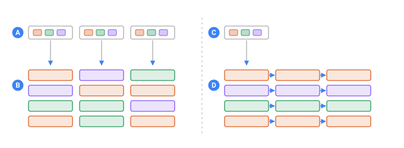
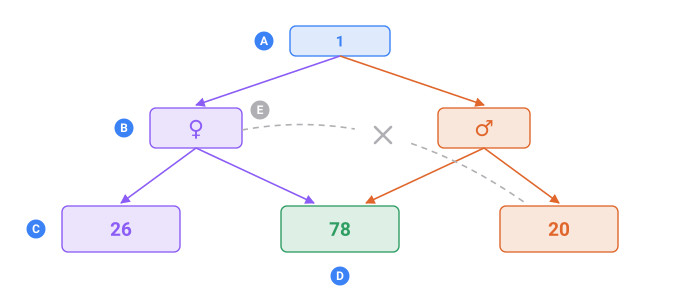

<a name="top"></a>

**English** · [Русский](./ru/intro.md#top) · [Español](./es/intro.md#top)

📖 **[Read this on the documentation site →](https://nickliapin.github.io/tdcv2/docs/intro)**

**[Contents](./README.md#top)** · Next: [Installation](./getting-started/installation.md#top) →

---

# TDC — The Data Constructor

> [!NOTE]
> **TDC and `tdcv2` — two names, two things**
>
> **TDC** is the language. It is what a `.tdc` file contains, what the `TDC001`-style
> codes in error messages refer to, and what this documentation teaches.
>
> **`tdcv2`** is the package and the command that run it — `npm install tdcv2`,
> `pip install tdcv2`, `npx tdcv2 …`. The name carries a `v2` for a dull reason:
> `tdc` was already taken on npm and PyPI by unrelated packages. It is not the
> version of the language, and it does not move when the version does — `tdcv2`
> will still be the package name at 1.0.

> [!IMPORTANT]
> **This documentation**
>
> Covers TDC **0.2.2**, last updated **26 August 2026** — the date of the newest
> change to any page, not the date this site was built.

TDC generates internally consistent test data. Within each row, names match gender
categories, cities belong to the correct countries, and diagnoses fit patient profiles.
Run TDC again with the same seed and core version, and it produces the same rows, byte
for byte.

A conventional fake-data library generates each field independently. That distinction is
the foundation of everything that follows.

## The problem with independent fields

When fields are generated independently, every value can be valid in isolation while the
record they form is invalid as a whole. In practice, this creates several kinds of
problems:

- A generated patient is female and 34 years old but is assigned 'benign prostatic
  hyperplasia' — a diagnosis that conflicts with the demographic data in the same record.
  The resulting failure looks like an application bug until someone inspects the fixture.
- A seeded generator creates a million orders by pairing cities and countries at random.
  The address validator rejects a third of them, so the load test measures the error path
  instead of the feature.
- A test fails in CI. When you rerun it, the generator produces different data and the
  test passes. There is no way to tell whether the bug has actually been fixed.

Independently generated fields have no shared context.



*The same three sources, wired two different ways.*

- **A** — three sources, each holding values from every group
- **B** — the records that result: every field was drawn on its own, so nothing in a row matches
- **C** — one source starts the record
- **D** — every later field is drawn from what the earlier one picked, so the row agrees with itself

## How TDC solves the problem

A sequence can reference a parent branch. It then draws only from the data available in
the branch selected for the current row.

Once a row is assigned `Female`, TDC does not draw from male-only lists and filter the
results afterward. Those lists are never reachable from the selected branch.



*The numbers are the sizes of the English medical lists.*

- **A** — one record being built
- **B** — the branch it lands in
- **C** — the list only that branch reaches: 26 conditions specific to women, 20 to men
- **D** — the list both branches share: 78 conditions anyone can have
- **E** — the edge that cannot exist, because a record never leaves its branch

Everything else in this documentation builds on this mechanism.

## This is not XML

Read the next example before this sentence and you will assume you are looking at XML.
You are not. **TDC is its own format.** It borrows the shape of angle-bracket tags
because that shape reads well for nested, named things — and the resemblance ends
there. No XML parser reads a `.tdc` file, and no XML rule applies to one.

What people expect from XML and do **not** get here:

| XML has | TDC |
| :--- | :--- |
| entities — `&lt;` becomes `<` | **nothing is expanded.** `&lt;` is four characters. Write `<` |
| namespaces, `xmlns:` | no such concept |
| a DTD or an XSD to validate against | the engine validates, against its own rules |
| `<![CDATA[…]]>` | not a thing; `<data>` already holds raw text |
| `<?xml …?>` | tolerated and ignored |
| `<!DOCTYPE …>` | a parse error |
| attribute values are just text | attribute values are **TDC expressions** — `if="Age >= 18"` is parsed and evaluated |

The `<` and `>` you write inside `<data>` are plain characters and stay plain, which is
exactly what lets a config emit JSON, SQL or HTML without fighting an escaping layer.

> [!NOTE]
> **Why the examples say `xml`**
>
>
> The code blocks on this site are tagged `xml` so your browser colours the tags and
> attributes — a syntax highlighter's best guess, not a statement about the format.
>
> In your own editor you get the real thing: a TDC grammar and a language server with live
> error checking, completion and navigation. See
> [Editor support](getting-started/editor-support.md#top).
>

## A basic example

The following configuration generates ten people with a 60/40 gender split. Their names
come from gender-specific lists, and their ages fall within a defined range:

```xml title="people.tdc"
<tdc>
    <env count="10" seed="demo">
        <sequence name="Gender">
            <gen type="text" value="Male,Female" percent="60,40"/>
        </sequence>

        <sequence name="MaleName" parent="Gender.Male">
            <gen type="template" value="person.male.firstName"/>
        </sequence>
        <sequence name="FemaleName" parent="Gender.Female">
            <gen type="template" value="person.female.firstName"/>
        </sequence>

        <sequence name="Age">
            <gen type="number" value="18..65"/>
        </sequence>
    </env>

    <block>
        <line>
            <data>${{_count}}. ${{Gender}} — ${{MaleName}}${{FemaleName}}, age ${{Age}}</data>
        </line>
    </block>
</tdc>
```

`./run people.tdc`

```
1. Male — Robert, age 59
2. Female — Mary, age 18
3. Male — James, age 53
4. Male — John, age 24
5. Male — Michael, age 28
6. Male — David, age 34
7. Female — Elizabeth, age 57
8. Female — Jennifer, age 58
9. Female — Patricia, age 52
10. Male — William, age 56
```

Three properties of this output are worth noting.

**Exact allocation:** `percent="60,40"` produces six men and four women. This is not an
approximation based on independent random draws: TDC uses the Hamilton method to
determine group sizes.

**Consistent names:** every name matches its gender category. Each name sequence points
to the corresponding branch of the gender sequence, so a female row cannot access the
male name list.

**Reproducible output:** the same seed and core version produce the same ten people. A
different seed produces a different set of ten people while preserving the 6-to-4
allocation.

The `<block>` section controls the output format. `<line>` defines a line, and `<data>`
defines its contents. By changing this section, you can render the same records as
[CSV, JSON, SQL, or another format](guides/output-formats.md#top).

## Dependencies can be nested

Suppose half of the men have no car, while one quarter of the women do. This requires two
additional sequences; the rest of the configuration remains unchanged:

```xml
<sequence name="MaleCar" parent="Gender.Male">
    <gen type="text" value="has a car,no car" percent="50,50"/>
</sequence>
<sequence name="FemaleCar" parent="Gender.Female">
    <gen type="text" value="has a car,no car" percent="75,25"/>
</sequence>
```

`./run people.tdc`

```
1. Male — Robert — has a car
2. Female — Mary — no car
3. Male — James — no car
4. Male — John — has a car
5. Male — Michael — has a car
6. Male — David — no car
7. Female — Elizabeth — has a car
8. Female — Jennifer — has a car
9. Female — Patricia — has a car
10. Male — William — no car
```

Each percentage is applied within its parent group. In this example, 3 of the 6 men and 1
of the 4 women have no car. Dependencies can be
[nested to any depth](guides/hierarchical-dependencies.md#top) required by the data model.

## Example outputs are illustrative

TDC produces deterministic output for a given seed and core version. Because the engine is
still evolving, the names and numbers produced by the current version may differ from
those shown here.

The important part is the behavior — in this example, the exact 60/40 allocation — not a
byte-for-byte match with the output shown above.

## What TDC does

- **Deterministic allocation.** [`percent="60,40"`](reference/attributes.md#top) calculates
  whole-row group sizes using the Hamilton method instead of relying on independent random
  draws.

- **[Hierarchical dependencies](guides/hierarchical-dependencies.md#top).** A field can
  depend on its parent's value, with dependencies nested to any required depth.

- **[Coherent related fields](guides/coherent-data.md#top).** Related values — such as a
  product name, price, and category — can be drawn from the same source row.

- **[A cast that exists before the rows do](pools/overview.md#top).** A `<pool>` builds a
  small world once — clinics, then doctors who each work at one of them — and every row
  draws a whole member of it, so this doctor is at that clinic in every row that mentions
  them. `filter=` then holds one row together: this patient's nurse works where this
  patient's doctor does.

- **[Unique values](constructs/unique-values.md#top).** Values can be generated without
  duplicates within a column.

- **[External data sources](guides/files-and-csv.md#top).** Individual values or complete
  linked rows can be read from your own data sources.

- **[A column that follows another one](generators/formula.md#top).** A weight that follows
  a height, a total that follows a price and a quantity, a rate driven by the traffic
  beside it. `<gen type="formula" expr="…">` computes a column from the others in its row,
  and a [distribution parameter](guides/statistical-distributions.md#a-parameter-can-follow-another-column)
  can be an expression too. Independent columns are what a model cannot learn anything
  from; these move together.

- **[The shape of a real sample](generators/file.md#readquantile--a-measured-sample-as-a-distribution).**
  `read="quantile"` treats your file of measurements as a distribution rather than a bag
  of values, so a thousand recorded amounts stretch to a million rows without becoming a
  comb of a thousand repeats. `sample="exact"` reproduces the sample with no sampling
  noise at all.

- **[Flexible output formats](guides/output-formats.md#top).** Generate CSV, JSON, SQL,
  YAML, or a custom format of your own.

- **[Large datasets](guides/large-outputs.md#top).** Stream millions of rows without holding
  the entire dataset in memory.

- **[One value, without a config](core-concepts/quick-api.md#top).** `tdc.person.lastName()`
  — the job a faker does, answered from the same packs a config draws on. In all five
  implementations, and the same seed gives the same value in each.

- **[Locale and country packs](data-packs/overview.md#top).** Generate data for people,
  places, medical records, and documents in 86 languages. Country packs
  also support national ID formats for 152 countries, with the
  appropriate check-digit rule for each format.

## Where TDC is used

- **Test automation.** Generate internally consistent fixtures, and include the seed in a
  bug report to reproduce the exact dataset in which a test failed. TDC is available both
  as a [library](bindings/typescript.md#top) and as a [command-line tool](reference/cli.md#top),
  so tests can consume generated rows directly instead of relying on fixture files that
  must be kept in sync:

```typescript
import { test, expect } from '@playwright/test';
import { TDC } from 'tdcv2';

const users = new TDC({ configFile: 'users.tdc' }).toArray();

for (const user of users) {
  test(`sign up ${String(user.Name)}`, async ({ page }) => {
    await page.goto('/signup');
    await page.fill('#name', String(user.Name));
    await page.fill('#age', String(user.Age));
    await page.click('#submit');
    await expect(page.getByText('Welcome')).toBeVisible();
  });
}
```

- **Load and performance testing.** Output is streamed rather than held entirely in
  memory, so large datasets do not need to fit in RAM.

- **Development.** Create demo environments, sandboxes, and seed scripts with coherent
  data that can be reproduced exactly.

- **Research and data work.** Build synthetic datasets with controlled proportions without
  relying on production data.

## When not to use TDC

- **Loose values are all you will ever need.** TDC answers those too —
  `tdc.person.lastName()`, no config and no file, through
  [the one-value API](core-concepts/quick-api.md#top) — but a dedicated faker carries a
  larger ready-made catalogue in the box, where TDC ships a starter set and downloads the
  rest. TDC earns its keep when the fields of a record have to agree with each other.

- **You need a synthetic copy of a production database.** TDC invents plausible data; it
  does not learn the joint distribution of your production tables. That is a different
  problem.

- **You need to de-identify production data.** TDC generates new records; it does not mask
  or transform existing production data.

- **You need a fixed five-row fixture.** For a dataset of only a few static records,
  writing the data directly in JSON is usually simpler.

- **You need to generate load.** TDC produces test data; tools such as k6, JMeter, and
  Locust generate and send requests.

## Availability

All five are published. Equal version numbers mean the same engine: the
five are held to one contract by a shared fixture suite, so `0.1.6` from any
registry produces the same bytes for the same config and seed.

| Implementation                            | Registry      | Install                      | Version |
| :---------------------------------------- | :------------ | :--------------------------- | :------ |
| **[TypeScript](bindings/typescript.md#top)** | npm           | `npm i tdcv2`                | 0.2.2   |
| **[Python](bindings/python.md#top)**         | PyPI          | `pip install tdcv2`          | 0.2.2   |
| **[Rust](bindings/rust.md#top)**             | crates.io     | `cargo add tdcv2`            | 0.2.2   |
| **[C#](bindings/csharp.md#top)**             | NuGet         | `dotnet add package Tdcv2`   | 0.2.2   |
| **[Java](bindings/java.md#top)**             | Maven Central | `io.github.nickliapin:tdcv2` | 0.2.2   |

Every published package carries a starter set of data packs, so it works with
nothing else installed; the other 86 languages and
152 country packs are
[a download away](data-packs/installing-packs.md#top).

## Where to start

- **[Installation](getting-started/installation.md#top)** — requirements, and how to run a config.
- **[Your first dataset](getting-started/first-data.md#top)** — a short walkthrough.

> [!NOTE]
> These docs describe what is implemented in the current version. Anything still in
> development is marked where it appears.

---

**[Contents](./README.md#top)** · Next: [Installation](./getting-started/installation.md#top) →

📖 **[Read this on the documentation site →](https://nickliapin.github.io/tdcv2/docs/intro)**
