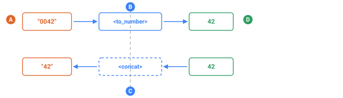

<a name="top"></a>

[English](../../compute/arithmetic.md#top) · **Русский** · [Español](../../es/compute/arithmetic.md#top)

📖 **[Открыть на сайте документации →](https://nickliapin.github.io/tdcv2/ru/docs/compute/arithmetic)**

← Назад: [Обзор](./overview.md#top) · **[Оглавление](../README.md#top)** · Вперёд: [Списки и перебор](./lists.md#top) →

---

# Арифметика

Целочисленная математика внутри [`<compute>`](overview.md#top). Каждая операция — это
отдельный тег; вкладывая их друг в друга, вы строите дерево выражения. Это
арифметические операторы языка TDC — они живут в
[`<sequence>`](../core-concepts/sequences.md#top) прямо рядом с
[`<gen>`](../generators/overview.md#top), и в вашем собственном конфиге, и внутри
встроенных пакетов данных для идентификаторов.

| Тег                       | Что делает                                            | Пример → результат         |
| :------------------------ | :--------------------------------------------------- | :------------------------- |
| [`<add>`](#add)           | сумма всех детей (пусто → `0`)                        | `add(2, 3, 4)` → `9`       |
| [`<subtract>`](#subtract) | первое минус сумма остальных                          | `subtract(10, 3, 2)` → `5` |
| [`<multiply>`](#multiply) | произведение всех детей (пусто → `1`)                 | `multiply(2, 3, 4)` → `24` |
| [`<divide>`](#divide)     | целочисленное деление в сторону −∞ (ровно 2 ребёнка) | `divide(7, 2)` → `3`       |
| [`<mod>`](#mod)           | остаток, всегда ≥ 0 (ровно 2 ребёнка)                | `mod(17, 5)` → `2`         |

Для **всех** них верны два правила:

- **Только целые числа.** Односимвольная строка (`"7"`) приводится к числу
  автоматически, а **многосимвольная** строка вроде значения последовательности
  (`"342"`) — **нет**: её нужно сначала обернуть в [`<to_number>`](#to_number). Это
  сделано намеренно — чтобы «сложить два значения как числа» не путалось со «склеить
  две строки» ([`<concat>`](strings.md#top)).
- **Переполнение — это ошибка.** Переполнение 64 бита сообщается, а не «тихо»
  оборачивается по кругу: вы узнаёте о нём до того, как в данные попадёт мусор.

Примеры вывода на этой странице иллюстративны: конкретные значения зависят от сида
и версии ядра, но показанная арифметика всегда верна.

## `<add>`

**Принимает** любое число детей → **отдаёт** число. Без детей даёт `0`. Односимвольная строка приводится сама; многозначной сначала нужен [`<to_number>`](#to_number).

`<add>` складывает всех своих детей по порядку и возвращает целое число. **Без**
детей возвращает `0` (нейтральный элемент сложения). **Применяйте**, когда нужна
производная сумма — итог заказа, суммарный балл — или накопитель внутри свёртки.

### Сумма двух полей

Значения последовательностей — строки, поэтому каждое поле оборачивается в
[`<to_number>`](#to_number):

```xml
<sequence name="Base"><gen type="number" value="100..900"/></sequence>
<sequence name="Tax"><gen type="number" value="10..90"/></sequence>
<sequence name="Total">
  <compute>
    <result>
      <add>
        <to_number><field name="Base"/></to_number>
        <to_number><field name="Tax"/></to_number>
      </add>
    </result>
  </compute>
</sequence>
```

`./run add.tdc — ${{Base}} + ${{Tax}} = ${{Total}}`

```
742 + 55 = 797
318 + 61 = 379
560 + 24 = 584
193 + 88 = 281
607 + 39 = 646
```

### Сумма цифр внутри свёртки

Внутри [`<reduce>`](lists.md#top) `<add>` накапливает результат:
[`<current/>`](lists.md#top) — очередная цифра (односимвольная строка, приводится к
числу сама по себе), а [`<acc/>`](lists.md#top) — текущий накопитель. `<to_number>` тут
не нужен, потому что каждый элемент — одна цифра.

```xml
<sequence name="Pin"><gen type="number" value="1000..9999"/></sequence>
<sequence name="DigitSum">
  <compute>
    <result>
      <reduce>
        <over><field name="Pin"/></over>
        <init><int v="0"/></init>
        <do><add><acc/><current/></add></do>
      </reduce>
    </result>
  </compute>
</sequence>
```

`./run digitsum.tdc — ${{Pin}} -> сумма ${{DigitSum}}`

```
4821 -> сумма 15
3067 -> сумма 16
9145 -> сумма 19
5530 -> сумма 13
7284 -> сумма 21
```

`4+8+2+1 = 15`, `3+0+6+7 = 16` и так далее. Эта форма «сначала взвесить, потом
сложить» — сердцевина любой схемы контрольной цифры (см. [`<mod>`](#mod)).

## `<subtract>`

**Принимает** любое число детей → **отдаёт** число: первое минус сумма остальных.

`<subtract>` берёт **первого** ребёнка и вычитает из него **сумму всех остальных**,
возвращая целое число. Ему нужен **хотя бы один** ребёнок (иначе ошибка `TDC183`);
с единственным ребёнком он возвращает это значение без изменений (`subtract(9)` →
`9`). **Применяйте**, когда нужна разность — остаток на счёте, сдача, оставшиеся
места или возраст как «текущий год минус год рождения».

### Остаток на счёте

```xml
<sequence name="Deposit"><gen type="number" value="500..900"/></sequence>
<sequence name="Withdrawal"><gen type="number" value="100..400"/></sequence>
<sequence name="Balance">
  <compute><result>
    <subtract>
      <to_number><field name="Deposit"/></to_number>
      <to_number><field name="Withdrawal"/></to_number>
    </subtract>
  </result></compute>
</sequence>
```

`./run balance.tdc — ${{Deposit}} - ${{Withdrawal}} = ${{Balance}}`

```
830 - 245 = 585
655 - 190 = 465
719 - 302 = 417
588 - 137 = 451
742 - 168 = 574
```

### Первое минус сумма остальных

С **тремя** детьми `<subtract>` берёт первое минус *сумму* двух других — удобно,
когда несколько статей уменьшают один бюджет:

```xml
<sequence name="A"><gen type="number" value="10..40"/></sequence>
<sequence name="B"><gen type="number" value="10..40"/></sequence>
<sequence name="Left">
  <compute><result>
    <subtract>
      <int v="100"/>
      <to_number><field name="A"/></to_number>
      <to_number><field name="B"/></to_number>
    </subtract>
  </result></compute>
</sequence>
```

`./run left.tdc — 100 - ${{A}} - ${{B}} = ${{Left}}`

```
100 - 22 - 31 = 47
100 - 15 - 28 = 57
100 - 34 - 19 = 47
100 - 27 - 27 = 46
100 - 11 - 40 = 49
```

`100 − (22 + 31) = 47` — вычитается именно **сумма** всего, что стоит после первого
ребёнка. Шаг `11 − остаток` во многих схемах контрольной цифры записывается через
`<subtract>` вместе с [`<mod>`](#mod).

## `<multiply>`

**Принимает** любое число детей → **отдаёт** число. Без детей даёт `1`.

`<multiply>` перемножает всех своих детей по порядку и возвращает целое число.
**Без** детей возвращает `1` (нейтральный элемент умножения). **Применяйте**, когда
нужно производное произведение — площадь, объём, «цена × количество» — или, чаще
всего, чтобы взвесить цифру по её позиции при вычислении контрольной цифры.

### Площадь

```xml
<sequence name="W"><gen type="number" value="2..9"/></sequence>
<sequence name="H"><gen type="number" value="2..9"/></sequence>
<sequence name="Area">
  <compute><result>
    <multiply>
      <to_number><field name="W"/></to_number>
      <to_number><field name="H"/></to_number>
    </multiply>
  </result></compute>
</sequence>
```

`./run area.tdc — ${{W}} x ${{H}} = ${{Area}}`

```
6 x 7 = 42
3 x 9 = 27
8 x 4 = 32
5 x 5 = 25
2 x 8 = 16
```

### Взвешенная сумма цифр внутри свёртки

Главная роль `<multiply>` — умножать каждую цифру на её **вес** при вычислении
контрольной цифры (Луна, ISBN, IBAN). Внутри [`<reduce>`](lists.md#top) каждая цифра
[`<current/>`](lists.md#top) — односимвольная строка, приводится к числу сама по себе —
умножается на вес, взятый из списка по позиции через [`<at>`](lists.md#top) /
[`<current_index/>`](lists.md#top):

```xml
<sequence name="Base"><gen type="number" value="100000000..999999999"/></sequence>
<sequence name="Weighted">
  <compute><result>
    <reduce>
      <over><field name="Base"/></over>
      <init><int v="0"/></init>
      <do>
        <add>
          <acc/>
          <multiply>
            <current/>
            <at><in><list v="1,3,1,3,1,3,1,3,1"/></in>
                <index><current_index/></index></at>
          </multiply>
        </add>
      </do>
    </reduce>
  </result></compute>
</sequence>
```

`./run weighted.tdc — ${{Base}} -> взвешенно ${{Weighted}}`

```
384019267 -> взвешенно 86
512700483 -> взвешенно 62
907316258 -> взвешенно 69
146829035 -> взвешенно 86
673540192 -> взвешенно 79
```

Каждая цифра умножается на свой вес (`1,3,1,3,…`), а [`<add>`](#add) накапливает
сумму произведений. Эту взвешенную сумму дальше обычно берут по
[`<mod>`](#mod) некоторой базы — ровно так и получается контрольная цифра.

## `<divide>`

**Принимает** ровно двух детей → **отдаёт** **целое** число. Остаток отбрасывается, поэтому 7 на 2 — это 3, а 1 на 3 — 0. Нулевой делитель отклоняется.

`<divide>` делит **первого** ребёнка на **второго** и возвращает целое число —
дробная часть отбрасывается. Ему нужно **ровно два** ребёнка (иначе ошибка
`TDC183`), а деление на `0` — ошибка. **Применяйте**, когда делите величину на
равные части (цена за единицу, среднее на человека, копейки → рубли через `÷ 100`)
или «отщипываете» цифры от числа вместе с [`<mod>`](#mod).

### Сколько на каждого

```xml
<sequence name="Total"><gen type="number" value="100..900"/></sequence>
<sequence name="Count"><gen type="number" value="3..7"/></sequence>
<sequence name="Per">
  <compute><result>
    <divide>
      <to_number><field name="Total"/></to_number>
      <to_number><field name="Count"/></to_number>
    </divide>
  </result></compute>
</sequence>
```

`./run per.tdc — ${{Total}} / ${{Count}} = ${{Per}}`

```
645 / 5 = 129
480 / 3 = 160
733 / 6 = 122
218 / 4 = 54
591 / 7 = 84
```

`218 ÷ 4 = 54` — остаток (`2`) отбрасывается. Если нужен именно остаток —
используйте [`<mod>`](#mod).

### Округление в сторону −∞

Важная деталь: деление округляет **вниз** (к меньшему, floor), а не в сторону нуля.
На положительных операндах это привычный результат (`7 ÷ 2 = 3`); на
отрицательных — уходит ниже:

```xml
<sequence name="D1"><compute><result><divide><int v="-7"/><int v="2"/></divide></result></compute></sequence>
<sequence name="D2"><compute><result><divide><int v="7"/><int v="2"/></divide></result></compute></sequence>
<sequence name="D3"><compute><result><divide><int v="-8"/><int v="4"/></divide></result></compute></sequence>
<sequence name="D4"><compute><result><divide><int v="-1"/><int v="2"/></divide></result></compute></sequence>
```

`./run floor.tdc — -7/2=${{D1}}  7/2=${{D2}}  -8/4=${{D3}}  -1/2=${{D4}}`

```
-7/2=-4   7/2=3   -8/4=-2   -1/2=-1
```

`−7 ÷ 2` даёт `−4` (округление вниз), а `−1 ÷ 2` даёт `−1`. Точное деление вроде
`−8 ÷ 4` остаётся `−2`. `<divide>` и [`<mod>`](#mod) — согласованная пара, ровно то,
чего ожидают алгоритмы контрольных сумм.

## `<mod>`

**Принимает** ровно двух детей → **отдаёт** число от `0` до `делитель-1`. Никогда не отрицательное — в отличие от `%` в C, Java и JavaScript.

`<mod>` возвращает **остаток** от деления первого ребёнка на второго — целое число,
**всегда неотрицательное**. Ему нужно **ровно два** ребёнка (иначе ошибка `TDC183`),
а деление на `0` — ошибка. Остаток **евклидов**: всегда в `[0, |делитель|)`, поэтому
он **никогда не отрицателен**, даже если делимое отрицательное (`−3 mod 5 = 2`, а не
`−3`). Это отличается от `%` в некоторых языках, где остаток несёт знак делимого.

**Применяйте**, когда вычисляете контрольную цифру (сердце любой схемы валидации),
разбиваете число на цифры или заворачиваете индекс в границы списка.

### Последняя цифра и чётность

`n mod 10` извлекает последнюю цифру; `n mod 2` отвечает на вопрос «чётное или
нечётное» (`0` — чётное, `1` — нечётное):

```xml
<sequence name="N"><gen type="number" value="1000..9999"/></sequence>
<sequence name="Last">
  <compute><result><mod><to_number><field name="N"/></to_number><int v="10"/></mod></result></compute>
</sequence>
<sequence name="Parity">
  <compute><result><mod><to_number><field name="N"/></to_number><int v="2"/></mod></result></compute>
</sequence>
```

`./run mod.tdc — ${{N}}: цифра=${{Last}}, чётность=${{Parity}}`

```
4827: цифра=7, чётность=1
9060: цифра=0, чётность=0
3514: цифра=4, чётность=0
6288: цифра=8, чётность=0
7135: цифра=5, чётность=1
```

### Остаток всегда ≥ 0

На отрицательных делимых видно, что `<mod>` евклидов — результат никогда не уходит
в минус:

```xml
<sequence name="M1"><compute><result><mod><int v="-3"/><int v="5"/></mod></result></compute></sequence>
<sequence name="M2"><compute><result><mod><int v="3"/><int v="5"/></mod></result></compute></sequence>
<sequence name="M3"><compute><result><mod><int v="-13"/><int v="10"/></mod></result></compute></sequence>
```

`./run modneg.tdc — -3 mod 5=${{M1}}  3 mod 5=${{M2}}  -13 mod 10=${{M3}}`

```
-3 mod 5=2   3 mod 5=3   -13 mod 10=7
```

`−3 mod 5` даёт `2` (потому что `−3 = −1·5 + 2`), а `−13 mod 10` даёт `7`. Результат
всегда попадает в `[0, делитель)`. Именно поэтому взвешенная сумма цифр, взятая по
`mod 11`, `mod 97` или через Луна, даёт стабильную положительную контрольную цифру —
полный разобранный пример есть в [обзоре compute](overview.md#top).

## `<to_number>`

**Принимает** одну строку → **отдаёт** число. Это граница между двумя мирами, и большинство ошибок с первого раза — как раз пропущенный переход.



*Одна граница, два перехода: один пишете вы, другой случается сам.*

- **A** — сторона строк: значение из <field>, пусть даже из одних цифр
- **B** — переход, который надо написать самому, — <to_number>
- **C** — переход, который случается сам: число внутри <concat> становится своими цифрами
- **D** — сторона чисел, где живёт арифметика

`<to_number>` превращает **строку из цифр** в **целое число**. Это рабочая лошадка
арифметики: без неё нельзя сложить, вычесть, умножить или разделить многосимвольные
значения последовательностей. Ведущий `-` допускается (`"-42"` → `-42`); строка с
нецифровым символом — ошибка.

Причина, по которой он существует, — приведение типов. Значение
последовательности ([`<field name="…"/>`](overview.md#top)) и любое значение `${{…}}` —
это **строка**. Арифметика принимает только целые: **односимвольную** строку (`"7"`)
она приводит сама, а **многосимвольную** — нет, это ошибка. `<to_number>` —
единственный способ сказать «разбери эту строку из цифр в число», и то, что он явный,
не даёт «сложить как числа» перепутаться со «склеить как строки»
([`<concat>`](strings.md#top)).

### Без него — ошибка

Сложение двух многосимвольных полей напрямую падает ещё до генерации данных:

```xml
<sequence name="A"><gen type="number" value="10..90"/></sequence>
<sequence name="B"><gen type="number" value="10..90"/></sequence>
<sequence name="Sum">
  <compute><result><add><field name="A"/><field name="B"/></add></result></compute>
</sequence>
```

`./run bad.tdc — ошибка до генерации`

```
tdc: expected an integer in <add>, got the string "10" — wrap it in <to_number> to convert a multi-digit string
```

`"10"` — двузначная строка и сама по себе не приводится к числу. Сообщение об ошибке
прямо указывает на решение.

### С ним — работает

Обёрните каждое поле — и сложение считается:

```xml
<sequence name="A"><gen type="number" value="10..90"/></sequence>
<sequence name="B"><gen type="number" value="10..90"/></sequence>
<sequence name="Sum">
  <compute><result>
    <add>
      <to_number><field name="A"/></to_number>
      <to_number><field name="B"/></to_number>
    </add>
  </result></compute>
</sequence>
```

`./run sum.tdc — ${{A}} + ${{B}} = ${{Sum}}`

```
10 + 76 = 86
67 + 30 = 97
61 + 75 = 136
54 + 27 = 81
51 + 53 = 104
```

### Когда он не нужен

Односимвольная строка приводится к числу сама. Поэтому внутри обхода цифр
([`<reduce>`](lists.md#top), [`<each>`](lists.md#top)) элемент [`<current/>`](lists.md#top) —
**односимвольная** строка, и её можно складывать или умножать без обёртки, — вот
почему в примерах «сумма цифр» и «взвешенная сумма» выше `<to_number>` пропущен.
Обёртка нужна, только когда число **многосимвольное**: целое значение поля,
`${{…}}` или кусок из [`<slice>`](strings.md#top).

## `<encode as="…">`

**Принимает** одну **односимвольную** строку плюс `as=` → **отдаёт** строку.

`<encode as="…">` превращает **один символ** в его числовой код, возвращая результат
как **строку**. Атрибут `as` выбирает таблицу. **Применяйте**, когда схема взвешивает
буквы как числа — например, mod-97 у IBAN заменяет каждую букву её значением в
base-36 перед взятием остатка.

Чтобы получить один символ для передачи в него, возьмите элемент строки:
[`<current/>`](lists.md#top) внутри обхода, [`<slice>`](strings.md#top) или литерал
`<str v="A"/>`.

| `as`      | Что даёт                                                        |
| :-------- | :------------------------------------------------------------- |
| `base36`  | `0`–`9` → `0…9`, буквы `A`–`Z`/`a`–`z` → `10…35` (десятичные)   |
| `ascii`   | десятичный код, только `0`–`127` (иначе ошибка)                |
| `unicode` | десятичный код, без ограничения `127`                          |
| `hex`     | код символа в системе с основанием 16                          |
| `octal`   | код символа в системе с основанием 8                           |
| `binary`  | код символа в системе с основанием 2                           |

Неизвестное значение `as` ловится до запуска (ошибка `TDC186`).

### `base36` — буква в число

Обойдите строку символ за символом через [`<each>`](lists.md#top), закодируйте каждый в
`base36` и склейте результаты через [`<join>`](lists.md#top):

```xml
<sequence name="Codes">
  <compute><result>
    <join sep=" ">
      <each>
        <over><str v="A9z"/></over>
        <do><encode as="base36"><current/></encode></do>
      </each>
    </join>
  </result></compute>
</sequence>
```

`./run base36.tdc — A9z -> ${{Codes}}`

```
A9z -> 10 9 35
```

`A` → `10`, цифра `9` → `9`, `z` → `35` (регистр не важен). Обратите внимание: это
**десятичные** веса, а не «цифры в base-36». Это ровно та таблица, которую IBAN
использует перед взятием `mod 97`.

### Один символ во всех системах

Один и тот же символ `A` (кодовая точка 65) через каждую таблицу:

```xml
<sequence name="Asc"><compute><result><encode as="ascii"><str v="A"/></encode></result></compute></sequence>
<sequence name="Uni"><compute><result><encode as="unicode"><str v="A"/></encode></result></compute></sequence>
<sequence name="Hex"><compute><result><encode as="hex"><str v="A"/></encode></result></compute></sequence>
<sequence name="Oct"><compute><result><encode as="octal"><str v="A"/></encode></result></compute></sequence>
<sequence name="Bin"><compute><result><encode as="binary"><str v="A"/></encode></result></compute></sequence>
```

`./run bases.tdc — A: ascii/unicode/hex/octal/binary`

```
ascii    65
unicode  65
hex      41
octal    101
binary   1000001
```

`ascii`/`unicode` дают десятичное `65`; `hex`/`octal`/`binary` дают ту же кодовую
точку в системе с основанием 16/8/2. Результат — строка; чтобы продолжать вычисления
над ним, оберните его в [`<to_number>`](#to_number) (хотя один символ `base36`
подаётся в арифметику напрямую, ведь односимвольная строка приводится к числу сама).

## Ограничения

- **Никаких строк-выражений** — каждая операция это отдельный тег.
- **Только целые числа** — ни дробных, ни «истина/ложь»; переполнение 64 бита это
  ошибка, а не «тихое» оборачивание по кругу.
- **Имена тегов пишутся через `_`**: `to_number`, `current_index` и так далее.
- **Ошибки в дереве ловятся до запуска** (коды `TDC180`–`TDC187`): неизвестный тег,
  неверное число детей, несвязанная [`<var>`](overview.md#top) и тому подобное.

## Смотрите также

- **[Списки и перебор](lists.md#top)** — просуммировать или взвесить целый список через `<reduce>`.
- **[Условия](conditionals.md#top)** — ветвление по `<greater_than>` / `<mod>` в контрольной цифре.
- **[Обзор compute](overview.md#top)** — полный пример Луна / контрольной цифры.
- **[Справочник функций compute](../reference/compute.md#top)** — алфавитный каталог.

---

← Назад: [Обзор](./overview.md#top) · **[Оглавление](../README.md#top)** · Вперёд: [Списки и перебор](./lists.md#top) →

📖 **[Открыть на сайте документации →](https://nickliapin.github.io/tdcv2/ru/docs/compute/arithmetic)**
