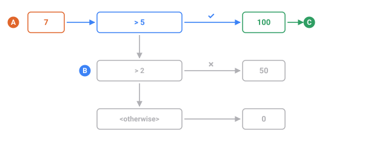
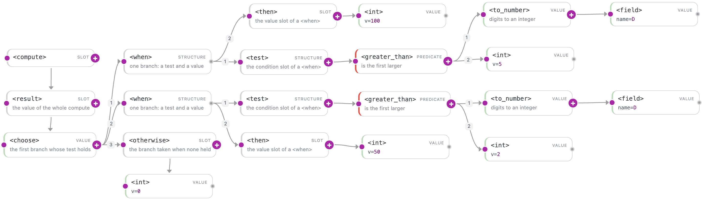

<a name="top"></a>

[English](../../compute/conditionals.md#top) · **Русский** · [Español](../../es/compute/conditionals.md#top)

← Назад: [Строки и форматирование](./strings.md#top) · **[Оглавление](../README.md#top)** · Вперёд: [Разбор пака построчно](./walkthrough.md#top) →

---

# Условия

Алгоритмы контрольных сумм ветвятся — «если удвоенная цифра больше 9, вычесть 9»
(Луна), «если остаток равен 10, взять 0» (mod-11). Раскладка по корзинам тоже
ветвится — «меньше 30 — низкий, меньше 80 — средний, иначе высокий».
[`<compute>`](overview.md#top) выражает каждое из этих правил одним тегом-условием,
`<choose>`, и небольшим набором предикатов «да/нет».

`<choose>` — та же идея условия, что и у тега верхнего уровня `<switch>`, но если
`<switch>` — это простая таблица «ключ → значение», то `<choose>` вычисляет
значение **внутри** `<compute>` и умеет проверять любое условие — сравнение,
остаток, «это цифра?» — а не только совпадение ключа.

## Из чего это состоит

| Тег           | Что делает                                                        |
| :------------ | :--------------------------------------------------------------- |
| `<choose>`    | первая ветка `<when>`, чей `<test>` истинен; иначе `<otherwise>` |
| `<when>`      | одна ветка: предикат `<test>` и значение `<then>`                |
| `<test>`      | держит ровно один предикат, даёт «да/нет»                        |
| `<then>`      | значение, которое вернётся, когда `<test>` этой ветки истинен    |
| `<otherwise>` | ветка «иначе» — **обязательна**                                  |

Предикаты живут **только** внутри `<test>` и возвращают «да/нет» (никогда не
значение):

| Предикат          | Истинен, когда                |
| :---------------- | :---------------------------- |
| `<equals>`        | два целых равны               |
| `<greater_than>`  | A &gt; B (строго)             |
| `<less_than>`     | A &lt; B (строго)             |
| `<is_digit>`      | символ — цифра `0`–`9`        |

Отдельного логического типа в языке нет: «да/нет» существует только на время
работы `<test>`. Значение ветки всегда берётся из `<then>` или `<otherwise>`.

## `<choose>` — выбрать первую подходящую ветку

**Принимает** одну или несколько веток `<when>` плюс один `<otherwise>` → **отдаёт** значение первой ветки, чьё условие выполнилось. Ветки перебираются в порядке записи, так что порядок — это решение, а не формальность.



*Про 7 срабатывает первая же проверка; до нижних веток дело не доходит.*

- **A** — значение, о котором спрашивают ветки
- **B** — проверки, перебираются в том порядке, в каком записаны
- **C** — значение первой сработавшей ветки — до бледных дело не доходит

`<choose>` обходит свои дочерние `<when>` **сверху вниз** и возвращает `<then>`
первой ветки, чей `<test>` истинен. Если ни одна не подошла — возвращает
`<otherwise>`. Побеждает первое совпадение, поэтому порядок веток важен, а
`<otherwise>` обязателен: `<choose>` всегда обязан суметь выдать значение.

`<choose>` не принимает атрибутов; всё выражается через его ветки `<when>` и
обязательный `<otherwise>`.

### Пример — «вычесть 9» по Луну

Классический шаг Луна: удвоить каждую цифру, и если результат больше 9 — вычесть 9.
Здесь [`<each>`](lists.md#top) обходит цифры, [`<current/>`](lists.md#top) — обрабатываемая
цифра, а `<choose>` решает, применять ли вычитание.

```xml
<sequence name="Num"><gen type="number" value="100000..999999"/></sequence>
<sequence name="Doubled">
  <compute>
    <result>
      <join sep=" ">
        <each>
          <over><field name="Num"/></over>
          <do>
            <let name="x"><multiply><current/><int v="2"/></multiply></let>
            <choose>
              <when>
                <test><greater_than><var name="x"/><int v="9"/></greater_than></test>
                <then><subtract><var name="x"/><int v="9"/></subtract></then>
              </when>
              <otherwise><var name="x"/></otherwise>
            </choose>
          </do>
        </each>
      </join>
    </result>
  </compute>
</sequence>
```

`./run luhn.tdc`

```
692481 -> 3 9 4 8 7 2
730544 -> 5 6 0 1 8 8
815209 -> 7 2 1 4 0 9
428170 -> 8 4 7 2 5 0
903622 -> 9 0 6 3 4 4
```

Примеры вывода на этой странице иллюстративны — конкретные значения зависят от
сида и версии ядра. Для `692481`: `6*2=12` больше 9, поэтому `12-9=3`; `2*2=4` не
больше, поэтому остаётся `4`; и так далее. Ветка `<otherwise>` берёт на себя
обычный случай, когда `<test>` не сработал.



*Та же развилка на канвасе Studio — цифры на связях это порядок перебора веток, а хвост — третья ветка.*

### Пример — диапазоны (порядок веток важен)

Несколько идущих подряд веток `<when>` читаются как лесенка «if … else if …».
Поскольку побеждает первое совпадение, пороги пишут по возрастанию, чтобы каждой
ветке оставалось лишь отсечь то, что выше неё. Значение последовательности — строка,
поэтому его один раз оборачивают в [`<to_number>`](arithmetic.md#top) через
[`<let>`](overview.md#top), чтобы сравнивать как целое.

```xml
<sequence name="Score"><gen type="number" value="0..100"/></sequence>
<sequence name="Grade">
  <compute>
    <let name="s"><to_number><field name="Score"/></to_number></let>
    <result>
      <choose>
        <when>
          <test><less_than><var name="s"/><int v="30"/></less_than></test>
          <then><str v="low"/></then>
        </when>
        <when>
          <test><less_than><var name="s"/><int v="80"/></less_than></test>
          <then><str v="mid"/></then>
        </when>
        <otherwise><str v="high"/></otherwise>
      </choose>
    </result>
  </compute>
</sequence>
```

`./run grade.tdc`

```
96  -> high
25  -> low
58  -> mid
34  -> mid
7   -> low

```

`25` меньше 30, поэтому берёт `low`. `34` не меньше 30, но меньше 80, поэтому
побеждает вторая ветка со значением `mid`. `96` проходит все пороги, поэтому
срабатывает `<otherwise>` со значением `high`.

### `<otherwise>` обязателен — ошибка `TDC184`

Один `<otherwise>` закрывает весь `<choose>`, а не каждый `<when>`. Это единственный хвост, который срабатывает, когда не совпала ни одна ветка, и его отсутствие — ошибка, а не пустой результат: конфиг, молча выдающий пустоту для строк, о которых никто не подумал, — ровно тот отказ, который здесь запрещён.

Уберите `<otherwise>` — и конфиг не загрузится. Движок не может доказать, что
какая-то ветка совпадёт всегда, а `<choose>` обязан всегда выдавать значение,
поэтому он отклоняет дерево **до** запуска:

```xml
<choose>
  <when>
    <test><greater_than><to_number><field name="D"/></to_number><int v="5"/></greater_than></test>
    <then><str v="big"/></then>
  </when>
</choose>
```

`./run no-otherwise.tdc`

```
error[TDC184]: <choose> requires an <otherwise> branch
```

Добавьте `<otherwise>` с запасным значением — и конфиг загрузится. Это одна из
проверок дерева на этапе компиляции (`TDC180`–`TDC187`), которые ловят структурные
ошибки до генерации данных.

## `<when>` — одна ветка

**Принимает** слоты `<test>` (условие) и `<then>` (значение) → **сам по себе не отдаёт ничего**. `<when>` существует только внутри `<choose>` и требует оба слота.

`<when>` — это одна ветка `<choose>`: условие в паре со значением. У неё ровно два
ребёнка — `<test>` (условие) и `<then>` (значение, которое вернётся, когда условие
выполнено). Оба обязательны; пропуск любого из них — ошибка `TDC187`. `<choose>`
может держать сколько угодно веток `<when>`, и они проверяются по порядку.

`<when>` никогда не пишут в одиночку — она всегда стоит внутри `<choose>`, рядом с
соседними ветками и обязательным `<otherwise>`.

### Пример — порог по сумме цифр

Одна ветка: «если сумма цифр больше 18 — high, иначе low».
[`<reduce>`](lists.md#top) складывает цифры, а единственный `<when>` внутри `<choose>`
выбирает ответ.

```xml
<sequence name="Pin"><gen type="number" value="1000..9999"/></sequence>
<sequence name="Sum">
  <compute>
    <result>
      <reduce>
        <over><field name="Pin"/></over>
        <init><int v="0"/></init>
        <do><add><acc/><current/></add></do>
      </reduce>
    </result>
  </compute>
</sequence>
<sequence name="Bucket">
  <compute>
    <result>
      <choose>
        <when>
          <test><greater_than><to_number><field name="Sum"/></to_number><int v="18"/></greater_than></test>
          <then><str v="high"/></then>
        </when>
        <otherwise><str v="low"/></otherwise>
      </choose>
    </result>
  </compute>
</sequence>
```

`./run bucket.tdc`

```
3115  sum=10  -> low
9917  sum=26  -> high
5120  sum=8   -> low
5815  sum=19  -> high
9444  sum=21  -> high
```

`<test>` проверяет `sum > 18`, а `<then>` возвращает `high`. Там, где сумма 18 или
меньше (`10`, `8`), `<when>` не срабатывает и `<otherwise>` отвечает `low`.

## `<test>` — место для условия

**Принимает** один предикат → **отдаёт** истину или ложь окружающему `<when>`. Значений-логических в языке нет: предикат может стоять здесь и больше нигде.

`<test>` — это «слот условия» ветки `<when>`. Он держит **ровно один предикат** и
превращает его в «да/нет», по которому `<choose>` решает, брать ли эту ветку. Он не
вычисляет ни число, ни строку — он лишь называет ту часть `<when>`, где живёт
условие (вторая часть — `<then>`, значение). `<test>` пишется первым, до `<then>`,
и обязателен внутри `<when>` (иначе `TDC187`).

Предикаты работают **только** внутри `<test>` — где-либо ещё они недопустимы,
потому что дают «да/нет», а не значение.

### Пример — чётность через остаток

Здесь `<test>` держит предикат `<equals>`: «остаток от деления на 2 равен 0». Если
да — число чётное.

```xml
<sequence name="N"><gen type="number" value="1000..9999"/></sequence>
<sequence name="Parity">
  <compute>
    <result>
      <choose>
        <when>
          <test>
            <equals>
              <mod><to_number><field name="N"/></to_number><int v="2"/></mod>
              <int v="0"/>
            </equals>
          </test>
          <then><str v="even"/></then>
        </when>
        <otherwise><str v="odd"/></otherwise>
      </choose>
    </result>
  </compute>
</sequence>
```

`./run parity.tdc`

```
8452  -> even
9083  -> odd
4216  -> even
5734  -> even
3005  -> odd
```

Внутри `<test>` стоит один предикат, `<equals>`. Он сравнивает остаток
[`<mod>`](arithmetic.md#top) с нулём и даёт «да/нет»; `3005` нечётно (остаток 1),
поэтому срабатывает `<otherwise>`.

Служебные слоты (`<test>`, `<then>` и обёртки перебора `<over>` / `<do>` /
`<init>` / `<in>` / `<index>`) существуют для того, чтобы тег из нескольких частей
называл каждую часть явно, а не угадывал её по порядку детей.

## Предикаты

Каждый предикат возвращает «да/нет» и допустим только внутри `<test>` (или `<valid>`,
см. ниже). Все четыре берут целые операнды; символ принимается там, где имеется в
виду значение его цифры.

### `<equals>` — два целых равны

**Принимает** два значения → **отдаёт** истину или ложь. Сравнение нестрогое по типам: `5` и `"5"` равны.

Истинен, когда оба ребёнка вычисляются в одно и то же целое. Строительный блок для
«остаток равен нулю», «контрольная цифра совпала», «это ровно N».

```xml
<sequence name="V"><gen type="number" value="1..1000"/></sequence>
<sequence name="Kind">
  <compute>
    <result>
      <choose>
        <when>
          <test><equals><mod><to_number><field name="V"/></to_number><int v="10"/></mod><int v="0"/></equals></test>
          <then><str v="round"/></then>
        </when>
        <otherwise><str v="other"/></otherwise>
      </choose>
    </result>
  </compute>
</sequence>
```

`./run equals.tdc`

```
40   -> round
417  -> other
250  -> round
83   -> other
900  -> round
```

**Применяйте, когда** значение должно точно совпасть с целевым — сошедшаяся
контрольная сумма, точный ключ корзины, кратность некоторой базе.

### `<greater_than>` — строго `A > B`

**Принимает** два числа → **отдаёт** истину или ложь. Строго: равные значения дают ложь.

Истинен, когда первый ребёнок строго больше второго (`A > B`, не `>=`). Это тест
Луна «больше 9» и любая ветка «выше порога».

```xml
<sequence name="M"><gen type="number" value="1..1000"/></sequence>
<sequence name="Level">
  <compute>
    <result>
      <choose>
        <when>
          <test><greater_than><to_number><field name="M"/></to_number><int v="500"/></greater_than></test>
          <then><str v="high"/></then>
        </when>
        <otherwise><str v="low"/></otherwise>
      </choose>
    </result>
  </compute>
</sequence>
```

`./run greater.tdc`

```
742  -> high
318  -> low
906  -> high
88   -> low
651  -> high
```

**Применяйте, когда** ветка срабатывает выше порога. Поскольку сравнение строгое,
само пороговое значение уходит в следующую ветку — выбирайте `>` или `<` на
границах осознанно.

### `<less_than>` — строго `A < B`

**Принимает** два числа → **отдаёт** истину или ложь. Строго: равные значения дают ложь.

Истинен, когда первый ребёнок строго меньше второго (`A < B`). Естественный способ
писать лесенки порогов по возрастанию и защита, которую использует проверка mod-11
`<valid>` ниже.

```xml
<sequence name="K"><gen type="number" value="0..99"/></sequence>
<sequence name="Width">
  <compute>
    <result>
      <choose>
        <when>
          <test><less_than><to_number><field name="K"/></to_number><int v="10"/></less_than></test>
          <then><str v="single"/></then>
        </when>
        <otherwise><str v="double"/></otherwise>
      </choose>
    </result>
  </compute>
</sequence>
```

`./run less.tdc`

```
7   -> single
42  -> double
3   -> single
88  -> double
15  -> double
```

**Применяйте, когда** ветка срабатывает ниже порога или вы строите лесенку
диапазонов `low → high` (см. пример с оценками выше).

### `<is_digit>` — символ `0`–`9`

**Принимает** одну **односимвольную** строку → **отдаёт** истину или ложь. Строка длиннее даёт ложь, поэтому `"12"` не проходит.

Истинен, когда его единственный аргумент-символ — десятичная цифра. Полезен при
классификации символов смешанного буквенно-цифрового кода. Здесь
[`<slice>`](strings.md#top) берёт первый символ, а `<is_digit>` проверяет его.

```xml
<sequence name="Code"><gen type="regex" value="[A-Z0-9]{5}"/></sequence>
<sequence name="First">
  <compute>
    <result>
      <choose>
        <when>
          <test><is_digit><slice from="0" to="1"><field name="Code"/></slice></is_digit></test>
          <then><str v="numeric-first"/></then>
        </when>
        <otherwise><str v="alpha-first"/></otherwise>
      </choose>
    </result>
  </compute>
</sequence>
```

`./run isdigit.tdc`

```
7F2QK  -> numeric-first
KP83M  -> alpha-first
90ZTR  -> numeric-first
BQ4L1  -> alpha-first
5MHW2  -> numeric-first
```

**Применяйте, когда** правило зависит от того, цифра ли символ — проверка ведущего
знака, разделение букв и цифр, ветвление по каждому символу.

## `<valid>` — отбросить и повторить

`<valid>` — это проверка **«отбросить и повторить»**, применяемая в
[пакетах данных](../data-packs/writing-your-own.md#top) генераторов. Она держит **один
предикат**; после того как пакет породил свои базовые значения, движок проверяет
предикат и, если он **ложен**, перегенерирует базу и пробует снова — повторяя, пока
результат не пройдёт (с предохранителем, чтобы невозможное условие завершалось
ошибкой, а не крутилось вечно). Предикаты — те же четыре, что и в `<choose>`.

В отличие от `<choose>`, `<valid>` пишется **рядом** с генераторами пакета и его
выводом `<data>`, а не внутри `<compute>`. Это часть механики пакетов, поэтому в
обычном конфиге она не встречается — там значение выводят формулой и ничего не
перерисовывают.

`<valid>` не принимает атрибутов; условие — его единственный дочерний предикат.

### Пример — оставить только чётные числа

Небольшой самодостаточный пакет данных: сгенерировать число в `10..99`, посчитать его остаток
по модулю 2 и через `<valid>` **отбросить нечётные**. До вывода доходят только
чётные.

```xml
---
address: common.demo.even_only
description: демо — только чётные числа (нечётные отбрасываем через <valid>)
generator: tdc
---
<sequence name="base"><gen type="number" value="10..99"/></sequence>
<sequence name="rest"><compute><result>
  <mod><to_number><field name="base"/></to_number><int v="2"/></mod>
</result></compute></sequence>
<valid><equals><field name="rest"/><int v="0"/></equals></valid>
<data>${{base}}</data>
```

Вызывается как `<gen type="template" value="common.demo.even_only"/>`:

`./run even.tdc`

```
84
90
42
26
30
46
90
46
```

Диапазон `10..99` даёт и чётные, и нечётные числа, но `<valid>` пропускает только
строки, где `rest == 0`. Ни одного нечётного числа нет — движок перерисовывал базу,
пока не выпадало чётное.

### Пример — ISBN-10, у которого контрольная цифра остаётся числовой

Контрольное значение ISBN-10, равное 10, обычно записывают буквой `X`. Если поле
должно оставаться чисто числовым, такие строки приходится выбрасывать. Этот пакет
считает взвешенную контрольную сумму mod-11 и требует, чтобы она была **меньше 10**;
всё остальное перегенерируется. Ту же гарантию дают встроенные пакеты ISBN.

```xml
<sequence name="base"><gen type="regex" value="[0-9]{9}"/></sequence>
<sequence name="check"><compute><result>
  <mod>
    <subtract>
      <int v="11"/>
      <mod>
        <reduce>
          <over><field name="base"/></over>
          <init><int v="0"/></init>
          <do><add><acc/><multiply><current/>
            <at><in><list v="10,9,8,7,6,5,4,3,2"/></in><index><current_index/></index></at>
          </multiply></add></do>
        </reduce>
        <int v="11"/>
      </mod>
    </subtract>
    <int v="11"/>
  </mod>
</result></compute></sequence>
<valid><less_than><to_number><field name="check"/></to_number><int v="10"/></less_than></valid>
<data>${{base}}${{check}}</data>
```

`./run isbn.tdc`

```
4188261811
8761685496
2444206142
8745782784
0357781341
```

Каждое выданное значение — десять чистых цифр: среди тысяч строк ни у одной
контрольное значение не равно 10, потому что `<valid>` отбрасывает такие базы и
тянет заново.

**Применяйте, когда** корректное значение всё же может быть *недопустимым* для
предметной области — запрещённая контрольная цифра, невыпущенный диапазон — и вы
хотите, чтобы пакет гарантировал только хорошие строки, не усложняя формулу.

## Ошибки и ограничения

- **`TDC184`** — `<choose>` без `<otherwise>`. Каждый `<choose>` обязан суметь
  вернуть значение, поэтому пропущенное «иначе» ловится до запуска.
- **`TDC187`** — `<when>` без `<test>` или `<then>` (либо оставленный пустым
  служебный слот). Каждой ветке нужны и условие, и значение.
- Предикаты допустимы **только** внутри `<test>` или `<valid>`; логического
  значения где-либо ещё в языке нет.
- Сравнения идут по **целым** — числовая строка сперва переводится через
  [`<to_number>`](arithmetic.md#top) (как в примерах с оценками и чётностью). Дробных
  чисел нет.
- `<greater_than>` и `<less_than>` **строгие**: само граничное значение проваливается
  в следующую ветку. Выбирайте оператор с оглядкой на границу.

## Смотрите также

- **[Обзор compute](overview.md#top)** — где условия встают в полную контрольную сумму.
- **[Арифметика](arithmetic.md#top)** — `<mod>`, `<subtract>` и `<to_number>`,
  использованные в тестах выше.
- **[Списки и перебор](lists.md#top)** — `<each>` и `<reduce>`, циклы, внутри которых
  работает `<choose>` по каждой цифре.
- **[Справочник функций compute](../reference/compute.md#top)** — полный каталог тегов.

---

← Назад: [Строки и форматирование](./strings.md#top) · **[Оглавление](../README.md#top)** · Вперёд: [Разбор пака построчно](./walkthrough.md#top) →
