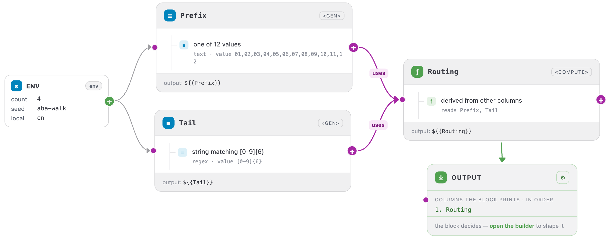
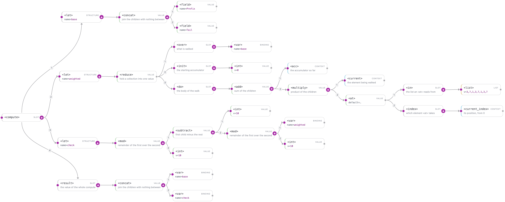

<a name="top"></a>

[English](../../compute/walkthrough.md#top) · **Русский** · [Español](../../es/compute/walkthrough.md#top)

← Назад: [Условия](./conditionals.md#top) · **[Оглавление](../README.md#top)** · Вперёд: [Иерархические зависимости](../guides/hierarchical-dependencies.md#top) →

---

# Разбор пака построчно

Остальные страницы вводят по одному тегу за раз. Эта идёт с другой стороны: настоящий
генератор целиком, где объяснена каждая строка. Ничего нового здесь не появляется — если
вы прочли [Списки](lists.md#top) и [Арифметику](arithmetic.md#top), все теги ниже вам уже
знакомы.

Предмет разбора — американский банковский routing number, девять цифр в левом нижнем углу
чека. Восемь из них произвольные. Девятая — контрольная: первые восемь умножают по очереди
на веса 3, 7, 1, 3, 7, 1, 3, 7, складывают произведения и подбирают последнюю цифру так,
чтобы сумма попала на кратное десяти.

## Целиком

```xml
<tdc>
    <env count="4" seed="aba-walk" local="en">
        <sequence name="Prefix"><gen type="text" value="01,02,03,04,05,06,07,08,09,10,11,12"/></sequence>
        <sequence name="Tail"><gen type="regex" value="[0-9]{6}"/></sequence>

        <sequence name="Routing">
            <compute>
                <let name="base"><concat><field name="Prefix"/><field name="Tail"/></concat></let>
                <let name="weighted">
                    <reduce>
                        <over><var name="base"/></over>
                        <init><int v="0"/></init>
                        <do>
                            <add>
                                <acc/>
                                <multiply>
                                    <current/>
                                    <at><in><list v="3,7,1,3,7,1,3,7"/></in><index><current_index/></index></at>
                                </multiply>
                            </add>
                        </do>
                    </reduce>
                </let>
                <let name="check">
                    <mod><subtract><int v="10"/><mod><var name="weighted"/><int v="10"/></mod></subtract><int v="10"/></mod>
                </let>
                <result><concat><var name="base"/><var name="check"/></concat></result>
            </compute>
        </sequence>
    </env>
    <block><line><data>${{Routing}}</data></line></block>
</tdc>
```

`./run routing.tdc`

```
107718758
096763296
073800334
052259744
```

Каждый из этих четырёх проходит настоящую проверку: взвесьте первые восемь цифр весами
3, 7, 1, 3, 7, 1, 3, 7, прибавьте девятую — сумма делится на десять.



*Конфиг как граф: две разыгранные колонки кормят одну вычисленную, и на каждой стрелке видно, кто кем пользуется.*

## Кто рисует, а кто вычисляет

Две последовательности рисуют, одна вычисляет.

В `Prefix` и `Tail` стоят `<gen>`, и это единственные места, где происходит что-то
случайное. В `Routing` стоит `<compute>`, поэтому он ничего не выдумывает — он читает две
разыгранные колонки и выводит из них следствие. Поменяйте сид: первые две изменятся, а
третья изменится только потому, что изменились её входы.

Это разделение и есть форма любого пака-идентификатора. Случайность — в частях, правила —
в вычислении.



*Тот же compute деревом, на канвасе Studio. Он шире этой колонки — нажмите, чтобы открыть в полный размер и подвигаться по нему.*

## Построчно

### Основа: восемь цифр из двух колонок

```xml
<let name="base"><concat><field name="Prefix"/><field name="Tail"/></concat></let>
```

`<field>` втягивает уже существующую колонку, `<concat>` склеивает две строки в одну
восьмисимвольную, `<let>` даёт этой строке имя `base`.

Дальше `base` читается как `<var name="base"/>` до конца этого `<compute>` — и только
после этой строки. Имя связывается один раз, читается вперёд и не переприсваивается.

### Взвешенная сумма: свёртка с таблицей внутри

```xml
<reduce>
    <over><var name="base"/></over>
    <init><int v="0"/></init>
    <do>
        <add>
            <acc/>
            <multiply>
                <current/>
                <at><in><list v="3,7,1,3,7,1,3,7"/></in><index><current_index/></index></at>
            </multiply>
        </add>
    </do>
</reduce>
```

Три слота, каждый в своей всегдашней роли. `<over>` — это полка: `base` строка, поэтому
обход идёт по одному символу, восемь шагов. `<init>` кладёт в банку `0`. `<do>` выполняется
на каждом шаге.

Внутри `<do>` читайте от середины наружу:

1. `<current_index/>` — номер шага, считая с нуля.
2. `<at>` берёт по нему нужный вес из списка на восемь элементов. Это таблица подстановки
   вместо восьми веток условия.
3. `<multiply>` умножает цифру в руке на этот вес.
4. `<add>` прибавляет произведение к тому, что уже в банке, — к `<acc/>`.

Проходим первые восемь цифр числа `07718758` — `0 7 7 1 8 7 5 8` — против весов
3, 7, 1, 3, 7, 1, 3, 7:

| Шаг | `<current/>` | вес | произведение | в банке после |
| ---: | ---: | ---: | ---: | ---: |
| 1 | 0 | 3 | 0 | 0 |
| 2 | 7 | 7 | 49 | 49 |
| 3 | 7 | 1 | 7 | 56 |
| 4 | 1 | 3 | 3 | 59 |
| 5 | 8 | 7 | 56 | 115 |
| 6 | 7 | 1 | 7 | 122 |
| 7 | 5 | 3 | 15 | 137 |
| 8 | 8 | 7 | 56 | 193 |

То есть `weighted` для этой записи равен 193.

### Контрольная цифра: сколько не хватает до круглого десятка

```xml
<mod><subtract><int v="10"/><mod><var name="weighted"/><int v="10"/></mod></subtract><int v="10"/></mod>
```

Читайте изнутри наружу. `193 mod 10` — это 3, насколько сумма уже перевалила за кратное
десяти. `10 - 3` — это 7, сколько ей ещё нужно. Внешний `<mod>` закрывает единственный
случай, где эта арифметика сбоит: если сумма уже оканчивается на 0, то `10 - 0` даёт 10, а
контрольная цифра обязана быть одной цифрой — `10 mod 10` возвращает её к 0.

Внешний `<mod>` — из тех строк, которые выглядят лишними ровно до той записи из десяти,
которой они нужны.

### Ответ

```xml
<result><concat><var name="base"/><var name="check"/></concat></result>
```

Восемь цифр и девятая, склеенные. `<result>` — это конец `<compute>`: он один, и его
значение печатается как `${{Routing}}`.

## Что отсюда забрать

Форма переносится на любую схему с контрольной цифрой:

1. Разыграйте произвольную часть через `<gen>`, в одной или нескольких последовательностях.
2. Дайте ей имя через `<let>`, чтобы остальной блок мог её прочитать.
3. Сверните её через `<reduce>`, взяв `<at>` для повесовых коэффициентов вместо веток.
4. Превратите сумму в цифру арифметикой с `<mod>`.
5. Склейте части через `<concat>` и отдайте в `<result>`.

Луна, ISBN, mod-97 у IBAN и схемы национальных идентификаторов во встроенных паках — всё
это та же форма из пяти шагов с другими весами и другим последним шагом.

## Смотрите также

- **[Обзор](overview.md#top)** — труба, слоты и теги, чьи имена вводят в заблуждение.
- **[Списки и перебор](lists.md#top)** — откуда берётся список и `<reduce>` по шагам.
- **[Арифметика](arithmetic.md#top)** — целочисленное деление, `<mod>` и граница строка-число.
- **[Свой пакет данных](../data-packs/writing-your-own.md#top)** — как выпустить такой генератор.

---

← Назад: [Условия](./conditionals.md#top) · **[Оглавление](../README.md#top)** · Вперёд: [Иерархические зависимости](../guides/hierarchical-dependencies.md#top) →
