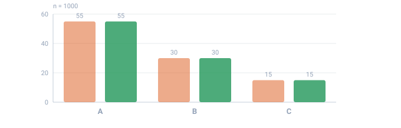

<a name="top"></a>

[English](../../constructs/mix.md#top) · **Русский** · [Español](../../es/constructs/mix.md#top)

📖 **[Открыть на сайте документации →](https://nickliapin.github.io/tdcv2/ru/docs/constructs/mix)**

← Назад: [Обзор](./overview.md#top) · **[Оглавление](../README.md#top)** · Вперёд: [Таблицы соответствий (switch)](./switch.md#top) →

---

# Блок `<mix>`

**Когда использовать** — когда доли в столбце не равны _и_ каждая доля больше
одного слова. Настоящие данные перекошены: большинство заказов — «оплачено», а
«отменено» — единицы; большинство аккаунтов бесплатные, премиум — редкость. Нужен
столбец, где варианты идут в **фиксированной пропорции** — не поровну и не
случайным шумом.

`<mix>` — это **распределение**: именованный источник, который раскладывает свои
варианты — ветки [`<case>`](#именованное-распределение) — по строкам в точных
процентах. По сути это [`<sequence>`](../core-concepts/sequences.md#top), значения
которой распределены по `percent`, только каждая ветка может быть целым набором
литералов и генераторов, а не одним простым значением. Раскладка детерминирована
для заданного [`seed`](../core-concepts/determinism.md#top).

Примеры вывода ниже иллюстративны — конкретные значения, которые даёт тот или иной
`seed`, могут меняться между версиями ядра, но **количества**, которые гарантирует
маска `percent`, — никогда.



*Заявленное против полученного на 1000 строках. Не «примерно» — количества попадают в заявленные доли точно.*

- **band** — проценты, написанные в конфиге
- **made** — доля, которая получилась на самом деле

## Именованное распределение

`<mix>` стоит **прямо в [`<env>`](../core-concepts/configuration.md#top)**, рядом с
`<sequence>` — обёртка не нужна, достаточно задать `name`. К значению обращаются
через `${{Имя}}`, как к любому другому именованному источнику:

```xml
<env count="100" seed="demo" inject="${{%}}">
    <mix name="Code" percent="25,70">
        <case><gen type="text" value="A"/></case>
        <case><gen type="text" value="B"/></case>
        <case><gen type="text" value="C"/></case>
    </mix>
</env>
<block>
    <line><data>${{Code}}</data></line>
</block>
```

Первые строки ничего не говорят — пропорции видны только на всей выборке:

`./run code.tdc (первые 6 строк)`

```
A
B
A
B
B
A
```

Посчитаем все 100 строк — раскрой точный:

`./run code.tdc (count=100, с подсчётом)`

```
A   25
B   70
C    5
```

Ровно `25 / 70 / 5`. Маска задаёт первые две доли; третья ветка получает
**остаток**, `100 − 25 − 70 = 5`. Это не «примерно 25 %», а точная раскладка
методом Хэмилтона (наибольших остатков) — тем же, что управляет
[`percent`](../generators/text.md#top) у генератора `text`.

### Поменяли проценты — поменялись доли

Тот же набор веток `A/B/C`, но `percent="60,30"`:

```xml
<mix name="Code" percent="60,30">
    <case><gen type="text" value="A"/></case>
    <case><gen type="text" value="B"/></case>
    <case><gen type="text" value="C"/></case>
</mix>
```

`./run code.tdc (count=100, с подсчётом)`

```
A   60
B   30
C   10
```

`60 / 30`, а остаток `10` уходит третьей ветке. Одно число в маске перекраивает
весь столбец.

## Когда нужен `<mix>`, а когда достаточно `text`

Для простого распределения готовых строк `<mix>` избыточен: генератор
[`text`](../generators/text.md#top) уже раскладывает точные доли через `percent`.

```xml
<sequence name="Gender">
    <gen type="text" value="Мужчина,Женщина" percent="50,50"/>
</sequence>
```

`./run gender.tdc (count=20, с подсчётом)`

```
Мужчина  10
Женщина  10
```

`<mix>` оправдывает себя только тогда, когда ветки **составные** — когда каждый
вариант собирается из своей смеси литерального текста и генераторов. Именно к
этому случаю подводят следующие разделы.

## Атрибуты

| Атрибут   | Обязательный | Что делает                                                                                  |
| :-------- | :----------- | :------------------------------------------------------------------------------------------ |
| `name`    | **да**       | Имя для интерполяции через `${{Имя}}`                                                       |
| `percent` | нет          | Доля каждого `<case>`; опустите — получите равномерное деление                              |
| `parent`  | нет          | Родительская последовательность — доли считаются внутри её подмножества                     |
| `flag`    | нет          | Добавляет колонку-ответ, отмечающую ветку-выброс (см. [ниже](#пометка-выбросов-через-flag)) |
| `comment` | нет          | Свободная заметка для автора конфига; в вывод не попадает                                   |

В `<mix>` должна быть хотя бы одна **[`<case>`](#составные-ветки)** — одна ветка.
Всё остальное необязательно.

## `percent` — необязательный, и короткие маски

Опустите `percent` полностью — и ветки поделятся **равномерно**. Три кейса на 99
строк дают по 33 в каждом:

```xml
<mix name="Bucket">
    <case><gen type="text" value="low"/></case>
    <case><gen type="text" value="mid"/></case>
    <case><gen type="text" value="high"/></case>
</mix>
```

`./run bucket.tdc (count=99, с подсчётом)`

```
low    33
mid    33
high   33
```

Если маску всё-таки задаёте, она подчиняется **той же грамматике**, что и
[`percent` у `text`](../generators/text.md#top): число фиксирует долю своей ветки, а
каждая **пустая позиция** — голая запятая внутри маски (`"25,,70"`) или хвостовая
запятая (`"25,70,"`) — делит остаток от 100 поровну. Оба примера в начале страницы
уже опираются на это правило: `percent="25,70"` оставляет третьей ветке остаток.

## `parent` — распределение внутри подмножества

Задайте `<mix>` атрибут `parent` — и проценты считаются против
**отфильтрованного подмножества** строк, а не всего `count`. Это то же правило,
что управляет зависимой [`<sequence>`](../core-concepts/sequences.md#top). Здесь
платные аккаунты получают разбивку по уровням, а бесплатные оставляют столбец
пустым:

```xml
<sequence name="Segment">
    <gen type="text" value="Free,Paid" percent="70,30"/>
</sequence>

<mix name="Tier" parent="Segment.Paid" percent="60,30">
    <case><gen type="text" value="Silver"/></case>
    <case><gen type="text" value="Gold"/></case>
    <case><gen type="text" value="Platinum"/></case>
</mix>
```

При `count="100"` строк `Paid` получается 30. Маска `60 / 30` применяется
**к этим 30 строкам**, поэтому `Tier` делится `18 / 9 / 3`:

`./run tier.tdc (только строки Paid, с подсчётом)`

```
Silver     18
Gold        9
Platinum    3
```

`18 + 9 + 3 = 30` — всё платное подмножество, а не процент от общей сотни. Это
сердце иерархической модели; полный разбор, с вложенными уровнями, — в статье
**[Иерархические зависимости](../guides/hierarchical-dependencies.md#top)**.

### `<mix>` вкладываются друг в друга

Внутри `<case>` может стоять вложенный `<mix>`, и вложенное деление считается
против строк, выбравших **внешнюю** ветку — то же правило подмножества, на уровень
глубже. Здесь треть всех строк — `error`, и внутри них внутренний `<mix>` градуирует
тяжесть:

```xml
<mix name="Status" percent="34,33">
    <case>
        <gen type="text" value="ok"/>
    </case>
    <case>
        <gen type="text" value="warn"/>
    </case>
    <case>
        <mix percent="70,20">
            <case><data>error/minor</data></case>
            <case><data>error/major</data></case>
            <case><data>error/fatal</data></case>
        </mix>
    </case>
</mix>
```

При `count="100"` внешнее деление — `34 ok / 33 warn / 33 error`. Внутренняя маска
`70 / 20` затем делит **эти 33 строки error** на `23 / 7 / 3`:

`./run status.tdc (count=100, с подсчётом)`

```
ok            34
warn          33
error/minor   23
error/major    7
error/fatal    3
```

`23 + 7 + 3 = 33` — ровно подмножество ошибок.

То же верно уровнем выше: `<mix>`, записанный внутри ветки
[`<switch>`](./switch.md#доля-внутри-ветки), берёт квоту по строкам, которые эта
ветка совпала, а не по всему прогону.

## Доля меньше одной записи

У правила подмножества есть край, о котором лучше узнать заранее. Процент — это
доля **строк, которые доходят до ветки**, а не вероятность, разыгрываемая для
каждой строки. Когда эта доля оказывается меньше одной целой строки, ветка может
дать значение, а может не дать ничего.

Этот конфиг ставит диагноз каждой записи. Десять процентов каждого пола получают
диагноз, специфичный именно для этого пола, остальные — общий:

```xml
<env count="10" seed="demo" local="en">
    <sequence name="Gender">
        <gen type="text" value="Male,Female" percent="50,50"/>
    </sequence>
    <switch name="Diagnosis" on="Gender">
        <case is="Male">
            <mix percent="10,90">
                <case><gen type="template" value="medical.diagnosisMale"/></case>
                <case><gen type="template" value="medical.diagnosis"/></case>
            </mix>
        </case>
        <case is="Female">
            <mix percent="10,90">
                <case><gen type="template" value="medical.diagnosisFemale"/></case>
                <case><gen type="template" value="medical.diagnosis"/></case>
            </mix>
        </case>
    </switch>
</env>
```

`./run diagnosis.tdc (count=10, seed=demo)`

```
Female,Coronary Artery Disease
Female,Tuberculosis
Male,Attention Deficit Hyperactivity Disorder
Male,Osteoarthritis
Male,Hypothyroidism
Male,Celiac Disease
Female,Anemia
Female,Postpartum Hemorrhage
Female,Tinnitus
Male,Obstructive Sleep Apnea
```

Женская половина сработала: `Postpartum Hemorrhage` в строке 8 пришёл из
`medical.diagnosisFemale`. А из `medical.diagnosisMale` не пришло ничего — все
пять мужских строк несут общие заболевания.

Данные верны, конфиг верен, и разбиение тоже верно. Посчитайте мужские строки:
их **пять**. Десять процентов от пяти строк — это **полстроки**.

> [!CAUTION]
> **Доля меньше одной строки — это не малый шанс, а невидимый бросок монеты**
>
> `percent="10"` на подмножестве из пяти строк просит 0.5 записи. Половину записи
> движок выдать не может, поэтому выдаёт одну или ни одной, и решает это
> исключительно `seed`. Прогону выше не «не повезло». Оставьте конфиг и смените
> только seed — специфичный мужской диагноз появится примерно в половине прогонов.
>
> Как только доля мала, умножьте её на число строк, которые до неё дойдут. Меньше
> 1 — и колонка становится броском монеты.

Монету бросают один раз, когда вы выбираете seed, а не заново на каждом прогоне.
Конфиг выше будет возвращать те же десять записей всегда: пустая колонка
останется пустой, и перезапуск ничего не докажет. Это работает
[детерминизм](../core-concepts/determinism.md#top), ровно как обещано, — и именно
поэтому ловушку трудно заметить. Вывод устойчив, воспроизводим и при этом не
соответствует запрошенной доле.

### Плавной середины здесь нет

Тот же конфиг, изменено одно число; замерено по 30 seed-ов на строку:

| `percent` | Запрошено строк из 5 | Специфичных мужских диагнозов |
| :-------- | :------------------- | :---------------------------- |
| `5`       | 0.25                 | 0 при каждом seed             |
| `9`       | 0.45                 | 0 при каждом seed             |
| **`10`**  | **0.5**              | **0 или 1 — решает seed**     |
| `11`      | 0.55                 | 1 при каждом seed             |
| `16`      | 0.8                  | 1 при каждом seed             |
| `20`      | 1.0                  | 1 при каждом seed             |

Ничто не нарастает постепенно. Ниже 10 % ветка не срабатывает никогда, выше 10 %
срабатывает ровно один раз, и 10 % — единственное значение в этом промежутке,
которое вообще колеблется.

Причина — в методе раздачи. Сначала каждая ветка забирает целые строки, которые
покрывает её доля, затем оставшиеся строки уходят веткам с наибольшей дробной
частью. При `percent="11"` доли равны 0.55 и 4.45, поэтому единственная остаточная
строка достаётся первой ветке при любом seed. При `percent="9"` доли равны 0.45 и
4.55, и остаток уходит второй ветке — тоже при любом seed. И только при
`percent="10"` обе дробные части равны 0.5, разделить их нечем, и ничья решается
через seed.

### Два способа получить определённость

**Поднять долю** — чтобы дробная часть выиграла без ничьей. Меняется один символ:

```xml
<mix percent="20,80">
```

`./run diagnosis.tdc (count=10, seed=demo, percent=20,80)`

```
Female,Coronary Artery Disease
Female,Tuberculosis
Male,Attention Deficit Hyperactivity Disorder
Male,Spermatocele
Male,Hypothyroidism
Male,Celiac Disease
Female,Anemia
Female,Postpartum Hemorrhage
Female,Tinnitus
Male,Obstructive Sleep Apnea
```

В строке 4 появился `Spermatocele`. Больше в колонке не сдвинулось ничего.

**Либо поднять count**, сохранив те же 10 %. При `count="20"` мужское подмножество
держит десять строк, а 10 % от десяти — ровно одна:

`./run diagnosis.tdc (count=20, seed=demo, только мужские строки)`

```
Male,Osteoarthritis
Male,Hypothyroidism
Male,Obesity
Male,Vitamin D Deficiency
Male,Cryptorchidism
Male,Obstructive Sleep Apnea
Male,Varicose Veins
Male,Vitamin D Deficiency
Male,Attention Deficit Hyperactivity Disorder
Male,Cholecystitis
```

Один `Cryptorchidism` на десять мужских строк — при любом seed. Как только
запрошенное число строк становится целым, счёт точен, а seed решает лишь то,
каким именно строкам оно достанется.

## Составные ветки

Вот что даёт `<mix>` и чего не даст голый список строк: `<case>` может собрать своё
значение из нескольких кусков — литерального фрагмента
[`<data>`](../core-concepts/output-formatting.md#top), одного или нескольких
[генераторов](../generators/overview.md#top) и вложенных `<mix>`. В этом контексте
`<data>` — просто **литеральный кусок значения** («клей»), а не форматирование
вывода; о форматировании см. [Маски и регистр](../guides/masks-and-case.md#top).

```xml
<mix name="Charge" percent="10,12,34,">
    <case><data>возврат: </data><gen type="number" value="1..10"/></case>
    <case><data>чарджбэк: </data><gen type="number" value="11..20"/></case>
    <case><gen type="number" value="21..40"/></case>
    <case><gen type="number" value="41..100"/><data> (помечено)</data></case>
</mix>
```

`./run charge.tdc (первые 8 строк)`

```
36
возврат: 4
чарджбэк: 18
66 (помечено)
возврат: 8
возврат: 1
73 (помечено)
82 (помечено)
```

Каждая ветка собрала свою форму: `возврат: 4` — это литерал `возврат: ` плюс
[`number`](../generators/number.md#top) в диапазоне `1..10`; `66 (помечено)` — число из
`41..100`, за которым идёт литерал ` (помечено)`; третья ветка — голое число без
всякой обёртки. Свернём 100 строк по веткам — доли по-прежнему точны:

`./run charge.tdc (count=100, с подсчётом по веткам)`

```
возврат     10
чарджбэк    12
чистое      34
помечено    44
```

`10 / 12 / 34 / 44`. У последней ветки нет собственного процента — хвостовая
запятая в `percent="10,12,34,"` оставляет её открытой, поэтому она берёт остаток,
`44`.

## Распределение генерирует — оно не форматирует

`<mix>` **порождает данные**, поэтому живёт только в `<env>`. Поставить его в блок
вывода нельзя: `<mix>` прямо в `<line>` отклоняется ещё до запуска с ошибкой
`TDC132`, потому что [блок вывода](../core-concepts/output-formatting.md#top) отвечает
только за раскладку. Объявите `<mix name="…">` в `<env>` и подставьте `${{Имя}}`
там, где нужно значение.

Если нужен выбор **не по проценту**, его покрывают два соседа:

- **`<switch>`** выбирает по **ключу** — таблица соответствий, вроде
  `страна → валюта`.
- [`<sequence>`](../core-concepts/sequences.md#top) с условными ветками
  [`<gen if="…">`](../core-concepts/sequences.md#top) выбирает по **произвольному
  условию** — побеждает первая истинная ветка.

## Пометка выбросов через `flag`

Ветку можно объявить аномальной — `<case anomaly="true">` — и попросить у mix
колонку-ответ через `flag`. В результате получается набор данных, на котором можно
**проверить детектор аномалий**: и выбросы есть, и соседний столбец записывает,
на какие именно строки они пришлись.

```xml
<mix name="Temp" percent="75,25" flag="Bad">
    <case><gen type="number" value="20..24"/></case>
    <case anomaly="true"><gen type="number" value="90..99"/></case>
</mix>
```

`${{Bad}}` равно `true` ровно на тех строках, что пришли из помеченной ветки —
на 25 % строк, — и `false` на всех остальных. Метка выводится из **того же
решения**, которым выбиралась ветка, поэтому разойтись со значением она не может.
`anomaly="true"` — всего лишь ярлык: сам выброс — это то, что выдаёт генератор
ветки, поэтому вы полностью управляете тем, как он выглядит. Это лишь уголок более
широкой темы — инъекция выбросов и колонка `flag` получают полный разбор в
руководстве по аномалиям.

## Дальше

- **[Генератор text](../generators/text.md#top)** — точные доли `percent` для простого
  списка вариантов, когда ветки — отдельные слова.
- **[Последовательности](../core-concepts/sequences.md#top)** — именованный источник, рядом с
  которым стоит `<mix>`, и модель `parent`, которую они делят.
- **[Иерархические зависимости](../guides/hierarchical-dependencies.md#top)** — полная
  история про `parent`, со вложенными процентами на нескольких уровнях.

---

← Назад: [Обзор](./overview.md#top) · **[Оглавление](../README.md#top)** · Вперёд: [Таблицы соответствий (switch)](./switch.md#top) →

📖 **[Открыть на сайте документации →](https://nickliapin.github.io/tdcv2/ru/docs/constructs/mix)**
