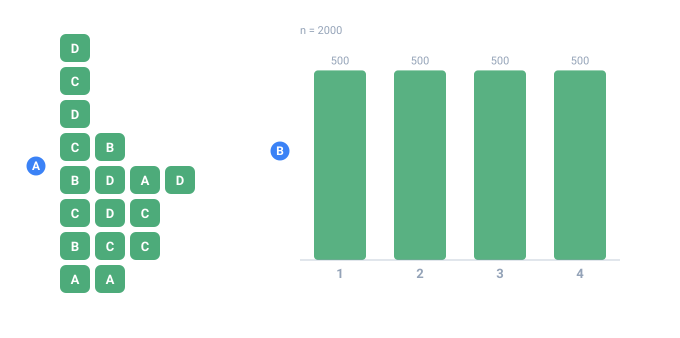

<a name="top"></a>

[English](../../constructs/multiple-values.md#top) · **Русский** · [Español](../../es/constructs/multiple-values.md#top)

← Назад: [Условный вывод (if)](./conditional-output.md#top) · **[Оглавление](../README.md#top)** · Вперёд: [Строка на элемент (each)](./relational-tables.md#top) →

---

# Несколько значений в ячейке (`repeat`)

**Когда пригодится** — когда поле не всегда содержит одно значение. В заказе один
товар или пять. У статьи один тег или четыре. Датчик за раз отдаёт три показания.
`repeat` заставляет один [`<gen>`](../generators/overview.md#top) выдать в ячейку
**несколько** значений вместо одного — и количество может меняться от строки к
строке.

Раньше поле переменной длины приходилось изображать пятью отдельными
последовательностями, половину строк оставляя пустыми. Теперь это один атрибут на
генераторе.

Примеры вывода ниже — иллюстративные: конкретные значения при заданном `seed`
могут сдвинуться между версиями ядра, но **структура**, которую гарантирует
каждая форма (сколько значений попадёт в ячейку и чем они склеены), не меняется.



*Первые восемь строк прогона на 2000 строк и длина каждого списка в нём.*

- **A** — одна ячейка на строку, в ней от одного до четырёх значений
- **B** — сколько строк вышло с каждой длиной — это точная квота, а не приближение

## Кратко

| Запись          | Что означает                                   |
| :-------------- | :--------------------------------------------- |
| `repeat="3"`    | ровно три значения                             |
| `repeat="1..5"` | от одного до пяти — каждой длине достаётся точная доля строк |
| `repeat="0..3"` | может выпасть и ноль — ячейка останется пустой  |
| `separator=" "` | чем склеивать; по умолчанию запятая            |

Верхняя граница — **64**. `separator` без `repeat` — ошибка: склеивать нечего.

> [!NOTE]
> **Диапазон — это квота, а не подбрасывание монетки**
>
> `repeat="1..4"` **не** кидает кубик на каждую строку. TDC выдаёт каждой длине точную
> долю прогона — так же, как это делает [`percent`](../generators/text.md#top): 200 строк
> выходят 50 / 50 / 50 / 50, а 201 строка — 51 / 50 / 50 / 50. Именно поэтому и
> пропорции значений остаются точными — см. раздел «Списки слов и точные пропорции» ниже.
>
> Плата та же, что и у любой раскладки на весь прогон: **поменяете `count` — длины
> разложатся заново**, и короткий прогон не будет началом длинного. См.
> [Детерминизм и пропорции](../core-concepts/determinism.md#top).

## `repeat="1..5"` — количество, меняющееся от строки к строке

Это повседневный случай. Строка заказа должна содержать столько товаров, сколько
в заказе оказалось. Здесь каждая корзина берёт от одного до четырёх артикулов,
склеенных пробелами:

```xml
<env count="8" seed="basket-7">
    <sequence name="Id"><gen type="increment" value="1"/></sequence>
    <sequence name="Items">
        <gen type="regex" value="SKU-[0-9]{4}" repeat="1..4" separator=" "/>
    </sequence>
</env>
<block>
    <line><data>заказ ${{Id}}: ${{Items}}</data></line>
</block>
```

`./run basket.tdc (count=8)`

```
заказ 1: SKU-5365 SKU-2241 SKU-0758 SKU-9382
заказ 2: SKU-2033 SKU-3412 SKU-3799
заказ 3: SKU-3278
заказ 4: SKU-3984 SKU-4578
заказ 5: SKU-5351 SKU-5903
заказ 6: SKU-3412
заказ 7: SKU-0258 SKU-3326 SKU-1157
заказ 8: SKU-3205 SKU-4821 SKU-3618 SKU-2450
```

Размер корзины гуляет от одного товара до четырёх — как в реальных заказах.
**Почему:** любое поле, реальная кратность которого меняется (товары в заказе,
теги, телефоны, адреса), напрямую ложится на диапазон `min..max`.

## `repeat="3"` — фиксированное количество значений

Задайте одно целое число — и каждая ячейка будет содержать ровно столько
значений. Удобно для токенов фиксированной формы: код из трёх групп, тройка
(x, y, z), набор из трёх показаний:

```xml
<sequence name="Code">
    <gen type="regex" value="[A-Z]{2}" repeat="3" separator="-"/>
</sequence>
```

`./run code.tdc (count=6)`

```
QR-LM-ZP
BX-TT-KD
WM-AE-RH
NP-CC-JU
FL-GO-VS
DK-HY-QN
```

**Почему:** когда форма фиксирована и меняются только значения, `repeat="3"`
понятнее, чем три отдельных поля, склеенные в блоке вывода.

## `repeat="0..3"` — можно и ноль

Диапазон, который начинается с `0`, позволяет ячейке выйти **пустой**. Это как
раз то, что нужно для необязательного списка: у части статей тегов нет вовсе.

```xml
<sequence name="Tags">
    <gen type="text" value="news,tech,sport,food,travel" repeat="0..2" separator=", "/>
</sequence>
```

`./run tags.tdc (count=6)`

```
статья 1: tech, news
статья 2:
статья 3: sport
статья 4:
статья 5: travel, food
статья 6: news
```

Статьи 2 и 4 вытянули длину ноль, поэтому их ячейка пустая — не какое-то особое
значение, просто пустой список. **Почему:** «иногда есть, иногда нет» — реальная
форма данных, и `0..n` описывает её без второй последовательности.

## `separator=` — чем склеиваются значения

Без `separator` значения склеиваются запятой. Задайте любую строку под формат,
который вы собираете: пробел, вертикальную черту, `" | "`, `"; "` — что нужно
колонке.

```xml
<sequence name="Letters">
    <gen type="text" value="a,b,c,d,e" repeat="3"/>          <!-- по умолчанию запятая -->
</sequence>
<sequence name="Piped">
    <gen type="text" value="a,b,c,d,e" repeat="3" separator=" | "/>
</sequence>
```

`./run sep.tdc (count=3) — по умолчанию и через черту`

```
d,a,c        d | a | c
b,e,b        b | e | b
a,c,e        a | c | e
```

**Почему:** склеенная ячейка — это просто текст, поэтому разделитель — это то,
чем вы подгоняете её под колонку CSV, под встроенный JSON-подобный список или под
читаемую человеком строку.

## `accumulate=` — нарастающий итог по списку

Значения в ячейке часто оказываются шагами одного и того же, а не тремя независимыми
розыгрышами: строки чека, отрезки маршрута, минуты сессии. `accumulate=` заменяет список
его нарастающим итогом.

```xml
<gen type="number" value="150..900" decimals="2" repeat="3" separator=", " accumulate="sum"/>
```

`./run cart.tdc`

```
792.47, 325.07, 563.18   →   459.93, 1277.62, 1909.65
814.04, 304.59, 456.76   →   495.46, 984.22, 1420.44
471.89, 479.67, 795.74   →   718.26, 1309.23, 1948.80
```

Слева тот же генератор без `accumulate=`, справа — с ним. Последний элемент это итог, а
каждый перед ним — промежуточная сумма на этом шаге.

| `accumulate=` | Каждый элемент становится |
| :------------ | :------------------------- |
| `sum` | суммой всего до него включительно |
| `max` | наибольшим из встреченных — «рекорд на этот момент» |
| `min` | наименьшим из встреченных |

`./run peaks.tdc`

```
пик 22,22,22,83,83
пик 11,48,54,54,54
пик 57,60,62,62,93
```

**Арифметика точная, включая копейки.** Сумма считается на целых числах, умноженных на
самую широкую дробь списка, и ни разу не на плавающей точке — поэтому `19.99 + 0.01` это
`20.00`, а не `20.000000000000004`, и это одно и то же `20.00` во всех пяти реализациях.

**`min` и `max` возвращают уже существующий элемент**, поэтому его написание сохраняется.
Значение, разыгранное как `007`, остаётся `007`, а не превращается в `7`.

**Пустой элемент пропускается.** [`missing=`](../guides/missing-data.md#top) обнуляет часть
ячеек, и пустая оставляет аккумулятор в покое, а не считается нулём: «в этот день
показаний не снимали» не должно обнулять счётчик.

`accumulate=` нужен список, то есть нужен `repeat=` (`TDC237`), а операция — одна из этих
трёх (`TDC238`).

> [!NOTE]
> **А если нужно по колонке**
>
> Здесь накопление идёт **внутри одной записи**. Для итога, который переносится со строки на
> строку — остаток на счёте, счётчик, который только растёт, — это другая конструкция:
> [`<gen type="running">`](../generators/running.md#top).

## Пропуски, аномалии и форматирование работают **поэлементно**

Это главное, что стоит запомнить: раз `repeat` стоит на **генераторе**, всё, что
генератор делает, происходит с **каждым значением по отдельности**, а не с ячейкой
целиком. Пропуски-пустышки, впрыск аномалий и
[форматирование вывода](../guides/masks-and-case.md#top) работают элемент за элементом.

Практическая выгода видна на колонке-метке. Когда генератор помечает аномалии,
его поле-флаг становится списком **той же длины**, что и показания — по одному
флагу на показание, выровненные ровно:

`./run sensors.tdc (показания -> флаги аномалий)`

```
5,500,100     ->   false,true,true
800,200,1     ->   true,true,false
6,8,7         ->   false,false,false
100,300,900   ->   true,true,true
```

Флаг стоит ровно там, где выброс. Детектор можно проверять не на грубом уровне
«в этой пачке что-то было не так», а точно — **какой именно замер сломался**.

Если же нужно «испорчена вся карточка целиком», это другая задача для другого
инструмента: ветка [`<mix>`](../generators/overview.md#top) с флагом на уровне
записи, а не `repeat`.

## Списки слов и точные пропорции

Самый частый список — набор тегов, и `repeat` работает прямо на генераторе
[`text`](../generators/text.md#top):

```xml
<sequence name="Tags">
    <gen type="text" value="news,tech,sport,food,travel" repeat="1..3" separator=", "/>
</sequence>
```

`./run tags.tdc (count=6)`

```
статья 1: [food]
статья 2: [tech, news]
статья 3: [news, tech, travel]
статья 4: [sport, tech]
статья 5: [travel, travel, news]
статья 6: [sport]
```

Вот тонкий момент. [`text`](../generators/text.md#top) раскладывает значения по
**точным** пропорциям через маску [`percent`](../generators/text.md#top), а не по
приблизительным — и эта гарантия **сохраняется** при `repeat`, и для
фиксированного количества, и для диапазона.

Работает это потому, что TDC **сначала решает все длины** (тоже точной квотой) и
только потом наполняет получившиеся места. Раз длины известны заранее, известно и
общее число мест — ничего не генерируется впустую и никакая квота не пропадает.

Проверено на 120 000 строк с `repeat="1..4"` и `percent="40,30,20,10"`:

`./run tags-big.tdc (count=120000, с подсчётом)`

```
длины строк:   30000 x1    30000 x2    30000 x3    30000 x4     (ровно по четверти)
значения:     120000 news   90000 tech   60000 sport  30000 food   (ровно 40/30/20/10)
```

Всего 300 000 мест, и распределение сошлось точно. Запустите с `--jobs 7` — те же
числа, файл байт в байт тот же.

> [!NOTE]
> **Значения внутри ячейки могут повторяться**
>
> `[travel, travel, news]` выше — это нормально, не ошибка. Каждое место
> заполняется независимо, поэтому одно значение может попасться дважды: два
> показания `40` или две одинаковые покупки в корзине — обычные данные. Встроенного
> «сделай их разными» для `repeat` нет; если это нужно — это другое ограничение.

## Где `repeat` работать не будет

Несколько генераторов привязывают каждое значение к **номеру строки**, и `repeat`
к ним неприменим:

| Генератор                                                       | Почему нельзя                               |
| :-------------------------------------------------------------- | :------------------------------------------ |
| [`increment`](../generators/counters.md#top), `decrement`          | значение зависит от позиции строки          |
| [`timeseries`](../generators/timeseries.md#top), [`pattern`](../generators/pattern.md#top) | то же — значение привязано к позиции         |

У них индекс элемента зависел бы от того, какой длины оказались **все предыдущие
строки** — а это случайная величина. Тогда строку нельзя было бы посчитать без
соседей, и сломались бы потоковый режим и `--jobs`. TDC откажет с понятной
ошибкой (`TDC204`), а не сделает молча не то.

## Что ещё TDC не пропустит

| Что написали                                   | Что скажет                                                          |
| :--------------------------------------------- | :----------------------------------------------------------------- |
| `repeat="много"`, `repeat="1.5"`               | `TDC195` — нужно целое число                                        |
| `repeat="-1"`, `repeat="5..2"`                 | `TDC195` — минимум не может быть отрицательным или больше максимума |
| `repeat="1..65"`                               | `TDC195` — верхняя граница 64                                       |
| `separator=";"` без `repeat`                   | `TDC198` — склеивать нечего                                         |
| `repeat` или `separator` на `<mix>`            | `TDC196` — mix выбирает одну ветку, а не составляет список          |

Про последнее: `<mix>` **выбирает** из веток, поэтому «повторить его» не имеет
определённого смысла. Если нужен список внутри ветки — ставьте `repeat` на
[`<gen>`](../generators/overview.md#top) внутри `<case>`.

## На больших объёмах

`repeat` не мешает ни потоковому режиму, ни `--jobs`: строка по-прежнему
считается независимо от соседей. Работают на это две разные вещи, и их легко
перепутать:

- **Длину** списка каждая строка берёт из квоты на весь прогон (см. выше). Строка
  узнаёт свою длину по собственному номеру — соседи не нужны.
- **Значения** после этого тянутся на **максимум** (для `repeat="1..5"` — на пять),
  а лишние выбрасываются, поэтому позиция в потоке случайных чисел зависит только от
  номера строки и никогда — от того, какой длины вышли предыдущие.

Именно это позволяет посчитать строку, не считая предыдущие, и поэтому многопоточный
вывод совпадает с однопоточным байт в байт.

Отсюда и ограничение в 64: большой `repeat` — это реально потраченная работа,
даже если в строке в итоге окажется два элемента. См.
**[Большие объёмы](../guides/large-outputs.md#top)**.

## В Parquet — настоящий список

При выгрузке в Parquet колонка с `repeat` становится **настоящим списком**, а не
склеенной строкой. Тип элемента выводится автоматически:

`схема parquet`

```
id       INT64       REQUIRED
items    LIST of BYTE_ARRAY (UTF8)
prices   LIST of INT64
city     BYTE_ARRAY  REQUIRED
```

`строки parquet (как JSON)`

```
{"id":1,"items":["хлеб","сыр"],           "prices":[262],         "city":"Москва"}
{"id":3,"items":["сыр","молоко"],         "prices":[469,241,188], "city":"Москва"}
{"id":6,"items":["молоко","хлеб","кофе"], "prices":[81,262],      "city":"Париж"}
```

Пустой список остаётся пустым списком — он не пропадает. А пропуск внутри списка
даёт **настоящий `null`** на месте элемента: в тексте это неотличимо от пустой
строки, но Parquet фиксирует это точно.

`parquet — элемент null`

```
{"t":[6,5,null]}
```

Тип можно задать и вручную: `type="[]int64"`, `type="[]decimal(18,2)"`. Запись
`type="[]int64|null"` означает «список, **элемент** которого может быть null» —
ровно то, что даёт поэлементный пропуск.

## Смотрите также

- **[`text`](../generators/text.md#top)** — списки через запятую и точные пропорции
  `percent`, которые `repeat` сохраняет.
- **[Счётчики](../generators/counters.md#top)** — `increment` / `decrement`,
  привязанные к позиции генераторы, к которым `repeat` неприменим.
- **[Маски и регистр](../guides/masks-and-case.md#top)** — поэлементное форматирование,
  которое применяется к каждому значению в ячейке с `repeat`.
- **[Большие объёмы](../guides/large-outputs.md#top)** — почему `repeat` остаётся безопасным
  для потока и идентичным при разном `--jobs`.

---

← Назад: [Условный вывод (if)](./conditional-output.md#top) · **[Оглавление](../README.md#top)** · Вперёд: [Строка на элемент (each)](./relational-tables.md#top) →
