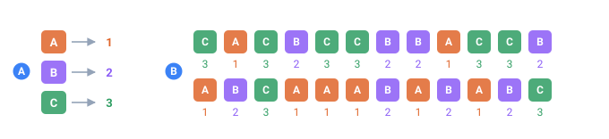

<a name="top"></a>

[English](../../constructs/switch.md#top) · **Русский** · [Español](../../es/constructs/switch.md#top)

📖 **[Открыть на сайте документации →](https://nickliapin.github.io/tdcv2/ru/docs/constructs/switch)**

← Назад: [Выбор между значениями (mix)](./mix.md#top) · **[Оглавление](../README.md#top)** · Вперёд: [Условный вывод (if)](./conditional-output.md#top) →

---

# Таблицы соответствий — `<switch>`

**Когда это нужно** — когда одно поле должно **выводиться из другого**, а не
разыгрываться само по себе. Есть столбец `Country`, и рядом нужен `Currency`,
который _всегда_ согласован с ним: `US` → `USD`, `JP` → `JPY`. Второй случайный
генератор тут ровно во вред — он выдаст валюту, не совпадающую со страной. Нужна
**таблица соответствий**: прочитать одно поле и вернуть значение, привязанное к
нему по ключу.

Это и есть `<switch>`. Для каждой строки он берёт значение одной
последовательности-«субъекта» ([sequence](../core-concepts/sequences.md#top), названной в
атрибуте `on`) и подставляет результат, найденный по этому ключу. В отличие от
[`<mix>`](../reference/tags.md#top), который раскладывает поле **случайно по
процентам**, `<switch>` **детерминирован** — результат однозначно определяется
значением субъекта.

```xml
<tdc>
  <env count="8" seed="demo" local="en">
    <sequence name="Country">
      <gen type="text" value="US,FR,DE,JP" percent="40,25,20,15"/>
    </sequence>

    <switch name="Currency" on="Country">
      <map>US:USD, FR:EUR, DE:EUR, JP:JPY</map>
    </switch>
  </env>
  <block><line><data>${{Country}} -> ${{Currency}}</data></line></block>
</tdc>
```

`./run currency.tdc`

```
US -> USD
US -> USD
FR -> EUR
DE -> EUR
US -> USD
JP -> JPY
FR -> EUR
DE -> EUR
```

> [!NOTE]
> **Вывод иллюстративный**
>
> Значения ниже получены с фиксированным `seed`, поэтому воспроизводимы, но точные
> строки могут отличаться между версиями ядра. Считайте их примерами _формы_, а не
> гарантией.

Каждая строка: TDC читает `Country` и возвращает валюту, привязанную к нему по
ключу. Это и есть задача «вывести одно поле из другого», которую
[`<mix>`](../reference/tags.md#top) (случайный) и `if`-цепочки (многословные)
делают неудобно.



*Таблица из трёх строк и 24 строки, сгенерированные через неё.*

- **A** — таблица: у каждого ключа одно значение
- **B** — сгенерированные строки — один и тот же ключ всегда приносит то же число

## Кратко

`<switch>` стоит **прямо в `<env>`**, рядом с
[`<sequence>`](../core-concepts/sequences.md#top) и
[`<mix>`](../reference/tags.md#top). Он принимает два атрибута и содержит одну или
несколько веток.

| Атрибут   | Обязательный | Что делает                                              |
| :-------- | :----------- | :------------------------------------------------------ |
| `name`    | да           | Имя для интерполяции `${{name}}`                        |
| `on`      | да           | Последовательность-субъект, чьё значение ищут в таблице |
| `comment` | нет          | Свободный комментарий                                   |

| Дочерний тег    | Что это такое                                             |
| :-------------- | :-------------------------------------------------------- |
| `<map>`         | Компактная таблица **литералов** `КЛЮЧ:ЗНАЧЕНИЕ`          |
| `<case is="…">` | Ветка, чьё значение — **генератор или составное**         |
| `<default>`     | Ветка «иначе» — срабатывает, когда ни один ключ не совпал |

Нужен **хотя бы один** вариант (строка в `<map>` или `<case>`).

## Субъект — `on`

`on` называет **субъект**: последовательность, чьё значение ищут в таблице на каждой
строке. Он **обязателен** на `<switch>` и должен ссылаться на последовательность,
[объявленную раньше](../core-concepts/sequences.md#top) в том же `<env>` (обычную
последовательность, поле составной последовательности `Parent.Field` или встроенную вроде
`_count`). Необъявленный субъект — ошибка `TDC134`.

```xml
<sequence name="Country">
  <gen type="text" value="US,CA,MX,FR,DE,JP"/>
</sequence>

<switch name="Currency" on="Country">
  <case is="US|CA|MX"><data>USD</data></case>
  <case is="FR|DE"><data>EUR</data></case>
  <case is="JP"><data>JPY</data></case>
</switch>
```

`./run currency.tdc`

```
CA -> USD
MX -> USD
FR -> EUR
JP -> JPY
US -> USD
JP -> JPY
FR -> EUR
DE -> EUR
```

Какое значение выпало у `Country` на строке — то и решает результат: `JP` всегда
даёт `JPY`, любая из `US/CA/MX` — `USD`. **Почему это важно:** субъект — это
единственный вход. Смените `on` на другую последовательность — и та же таблица начнёт читать
уже _её_ значения; логика поиска переиспользуется.

## `<map>` — компактная таблица литералов

Когда каждое значение — простой литерал, не пишите стопку почти одинаковых
веток — сверните их в один `<map>`. Его содержимое — **типизированный текст**
(как у [`<data>`](../reference/tags.md#top)): не разметка, а записи `КЛЮЧ:ЗНАЧЕНИЕ`.

```xml
<switch name="Currency" on="Country">
  <map>US:USD, FR:EUR, DE:EUR, JP:JPY</map>
</switch>
```

Это **байт-в-байт** эквивалентно четырём отдельным веткам
`<case is="US"><data>USD</data></case>` — просто короче. Правила формата:

- Записи разделяются **запятой** `,`.
- Ключ и значение разбиваются по **первому двоеточию** `:` — так что двоеточия
  _внутри_ значения сохраняются (`US:Down : Left` → `Down : Left`).
- **Несколько ключей → одно значение** через `|`: `CA|MX:USD` совпадает и для
  `CA`, и для `MX`.
- Пробелы и переносы строк вокруг записей игнорируются — таблицу можно разбивать
  на строки для читаемости.
- Значение — **всегда литерал**. Нужен генератор? Тогда это
  [`<case>`](../reference/tags.md#top), а не строка `<map>`.

```xml
<switch name="Currency" on="Country">
  <map>
    US:USD, FR:EUR, DE:EUR, JP:JPY,
    CA|MX:USD
  </map>
</switch>
```

`./run currency.tdc`

```
FR -> EUR
DE -> EUR
JP -> JPY
MX -> USD
US -> USD
MX -> USD
JP -> JPY
CA -> USD
```

Мультиключ `CA|MX:USD` совпадает и для `CA`, и для `MX` — оба печатают `USD`.

> [!NOTE]
> **Одно ограничение: запятые**
>
> Значение, содержащее запятую, в `<map>` не поместится (запятая — разделитель
> записей). Для таких случаев используйте [`<case is="…">`](../reference/tags.md#top).
> Строка без двоеточия вообще не становится записью, и валидатор предупредит
> (`TDC136`).

## `<case>` — ветка с генератором

Строка `<map>` умеет только литерал. Когда ветке нужно **сгенерировать**
значение — случайную сумму, счётчик, префикс плюс генератор — берите `<case>`.
Его содержимое собирается слева направо из литералов
[`<data>`](../reference/tags.md#top) и генераторов
[`<gen>`](../generators/overview.md#top), ровно как ветка
[последовательности](../core-concepts/sequences.md#top).

Внутри `<switch>` для `<case>` нужен `is` — ключ(и), с которыми он совпадает.
Здесь уровень клиента задаёт _диапазон_ скидки — то, что плоская таблица выразить
не может:

```xml
<sequence name="Tier">
  <gen type="text" value="gold,silver,bronze" percent="20,30,50"/>
</sequence>

<switch name="Discount" on="Tier">
  <case is="gold"><gen type="number" value="15..25"/></case>
  <case is="silver"><gen type="number" value="5..10"/></case>
  <default><data>0</data></default>
</switch>
```

`./run discount.tdc`

```
silver -> 7
gold   -> 22
bronze -> 0
gold   -> 18
silver -> 5
bronze -> 0
```

`gold` разыгрывает новое число в `15..25` на каждой совпавшей строке, `silver` —
в `5..10`, а `bronze` проваливается в литерал `0` из `<default>`. **Почему это
важно:** значение вычисляется на каждой строке, а не берётся из фиксированной
строки — ради этого `<case>` и существует рядом с `<map>`.

### Ключи совпадения — `is`

`is` задаёт `<case>` его ключ(и): значения субъекта, при которых ветка
срабатывает.

- **Обязателен** на `<case>` внутри `<switch>` — без него ветка ни с чем не
  совпадёт (ошибка `TDC137`).
- **Несколько ключей** через `|`: `is="US|CA|MX"` совпадает, если субъект равен
  **любому** из них, сворачивая целую группу значений в одну ветку.
- Сравнение — **строковое**, со значением субъекта.

```xml
<switch name="Currency" on="Country">
  <case is="US|CA|MX"><data>USD</data></case>
  <case is="FR|DE"><data>EUR</data></case>
  <case is="JP"><data>JPY</data></case>
</switch>
```

`./run currency.tdc`

```
CA -> USD
MX -> USD
FR -> EUR
JP -> JPY
US -> USD
DE -> EUR
```

> [!NOTE]
> **Внутри `<mix>` нет `is`**
>
> Тот же тег [`<case>`](../reference/tags.md#top) используется и внутри
> [`<mix>`](../reference/tags.md#top), но там ветки выбираются **случайно по
> проценту** и не несут `is`. `<case>` никогда не поддерживает `if` или `default`
> ни в одном из родителей — для произвольных условий используйте
> [последовательность](../core-concepts/sequences.md#top) с ветками `<gen if="…">`.

## `<default>` — запасное значение

`<default>` — это ветка «иначе»: её значение подставляется, когда субъект не
совпал **ни с одним** ключом. Это тег, а не атрибут, именно затем, чтобы в него
можно было положить генератор — то же содержимое `<data>` / `<gen>`, что и у
`<case>`.

Без `<default>` несовпавший ключ даёт **пустое** значение (скобки ниже нужны лишь
затем, чтобы дыру было видно):

```xml
<switch name="Currency" on="Country">
  <map>US:USD, FR:EUR</map>
</switch>
```

`./run currency.tdc`

```
FR -> [EUR]
FR -> [EUR]
JP -> []
GB -> []
US -> [USD]
GB -> []
DE -> []
JP -> []
```

Пять строк из восьми — пустые: молчаливый брак в реальной выгрузке. Добавьте
`<default>`, чтобы покрыть всех, кого таблица не поймала:

```xml
<switch name="Currency" on="Country">
  <map>US:USD, FR:EUR</map>
  <default><gen type="text" value="XXX"/></default>
</switch>
```

`./run currency.tdc`

```
FR -> EUR
FR -> EUR
JP -> XXX
GB -> XXX
US -> USD
GB -> XXX
DE -> XXX
JP -> XXX
```

Те же несовпавшие ключи (`DE`, `JP`, `GB`) теперь дают `XXX` — дыр не осталось.
Если запасное значение — просто литерал, кладите его в `<data>`:
`<default><data>Other</data></default>`.

- Ставьте `<default>` **последним**, где его ищет глаз (как в `switch` из
  программирования).
- Он **необязателен.** Если `<default>` нет и ключ не совпал — значение на этой
  строке пустое.

## Доля внутри ветки

`<case>` может содержать [`<mix>`](./mix.md#top), и его проценты — это квота по
строкам **этой ветки**, а не по всему прогону. Двадцать процентов мужских записей
остаются двадцатью процентами мужских записей, какую бы долю прогона мужчины ни
составили.

```xml
<tdc>
  <env count="10" seed="clinic" local="en">
    <sequence name="Sex">
      <gen type="text" value="male,female" percent="50,50"/>
    </sequence>

    <switch name="Diagnosis" on="Sex">
      <case is="male">
        <mix percent="20,80">
          <case><data>prostatitis</data></case>
          <case><data>influenza</data></case>
        </mix>
      </case>
      <case is="female"><data>influenza</data></case>
    </switch>
  </env>
  <block><line><data>${{Sex}} -> ${{Diagnosis}}</data></line></block>
</tdc>
```

`./run clinic.tdc`

```
male -> influenza
female -> influenza
male -> influenza
male -> influenza
male -> influenza
female -> influenza
male -> prostatitis
female -> influenza
female -> influenza
female -> influenza
```

Пять записей мужские, и одна из них несёт мужской диагноз. Увеличьте `count` — доля
сохранится: 20% мужских записей при любом размере прогона.

`./run clinic.tdc (count=100, подсчёт)`

```
female -> influenza    50
male -> influenza      40
male -> prostatitis    10
```

Не «примерно десять» — счёт одинаков на любом seed.

**Почему это важно:** знаменатель — это ветка. Доля, отмеренная от всего прогона,
раздала бы 20 значений `prostatitis` на сотню записей, а потом отбросила бы те,
что попали на женские. Вышло бы около десяти и никогда не ровно десять.

### Ветки на несколько ключей и `<default>`

Правило то же для доли внутри ветки, совпадающей с несколькими ключами, и внутри
`<default>`. Здесь 30% североамериканских записей уходят экспрессом:

```xml
<sequence name="Country">
  <gen type="text" value="US,CA,MX,DE" percent="25,25,25,25"/>
</sequence>

<switch name="Shipping" on="Country">
  <case is="US|CA|MX">
    <mix percent="30,70">
      <case><data>express</data></case>
      <case><data>standard</data></case>
    </mix>
  </case>
  <default><data>international</data></default>
</switch>
```

`./run shipping.tdc (count=120, подсчёт)`

```
express          27
standard         63
international    30
```

Девяносто записей совпадают с `US|CA|MX`, и `27 + 63 = 90` — 30% ветки, до
записи. Эти две формы стоят вам потокового движка, см.
[Детерминированность на всех движках](#детерминированность-на-всех-движках).

## `<switch>` внутри `<case>`

Ветка может содержать целый второй поиск. Это нужно, когда значение зависит от двух полей, а
второе имеет значение лишь для части значений первого — национальный идентификатор, форма
которого зависит от пола, а для одного пола ещё и от региона.

```xml
<tdc>
  <env count="8" seed="clinic-id" local="en">
    <sequence name="Sex"><gen type="text" value="male,female" percent="50,50"/></sequence>
    <sequence name="Region"><gen type="text" value="north,south" percent="50,50"/></sequence>

    <switch name="Id" on="Sex">
      <case is="male"><data>M-</data><gen type="number" value="100..199"/></case>
      <case is="female">
        <switch on="Region">
          <case is="north"><data>FN-</data><gen type="number" value="200..299"/></case>
          <case is="south"><data>FS-</data><gen type="number" value="300..399"/></case>
        </switch>
      </case>
    </switch>
  </env>
  <block><line><data>${{Sex}}/${{Region}} -> ${{Id}}</data></line></block>
</tdc>
```

`./run ids.tdc`

```
male/south -> M-156
male/north -> M-118
male/north -> M-177
male/north -> M-129
female/south -> FS-371
female/north -> FN-212
female/south -> FS-358
female/south -> FS-353
```

Мужская запись до внутреннего switch не доходит. Женская читает `Region` и берёт ветку по
нему. **Почему это важно:** иначе пришлось бы объявить по последовательности на каждое
сочетание и выражение для выбора между ними — три объявления ради одной мысли, и ничто их не
связывает.

Вложенная форма не принимает `name`: она отдаёт значение окружающей ветке, и её нельзя
подставить, так что имя не назвало бы ничего (ошибка `TDC245`). Всё остальное — как на
верхнем уровне: субъект должен быть последовательностью, объявленной выше, `<map>` работает,
а `<default>` покрывает строки ИМЕННО ЭТОЙ ветки, не совпавшие ни с одним внутренним ключом.

Тот же `<case>` есть и внутри [`<mix>`](./mix.md#top), так что вложенный `<switch>` работает и
там: mix решает, счёт это или чек, а switch — какой налог назвать.

> [!NOTE]
> **Доля во вложенной ветке не стримится**
>
> Ветка вложенного switch покрывает пересечение двух разбиений — строк окружающей ветки и
> внутреннего субъекта, — а его потоковые движки не могут пронумеровать по одной строке за раз.
> [Доля](#доля-внутри-ветки), записанная там, точна, и TDC направляет конфиг на движок в
> памяти, чтобы она такой и осталась.

## Правила выбора

- Побеждает **первая** совпавшая ветка. Сначала проверяются строки `<map>` (в
  порядке записи), затем ветки `<case>`. Если ключ есть и там и там — берётся
  тот, что выше, то есть строка `<map>`.
- Ключи сравниваются как **строки** со значением субъекта.
- Мультиключ `A|B|C` совпадает, когда субъект равен любому из `A`, `B` или `C`.

Крошечная демонстрация приоритета — один и тот же ключ `CA` и в строке `<map>`,
и в `<case>`:

```xml
<switch name="Label" on="Country">
  <map>CA:from-map</map>
  <case is="CA"><data>from-case</data></case>
</switch>
```

`./run precedence.tdc`

```
CA -> from-map
CA -> from-map
CA -> from-map
```

Строка `<map>` побеждает, потому что строки `<map>` проверяются раньше веток
`<case>`.

## Собираем всё вместе

Все три вида веток в одном `<switch>` — таблица литералов, генерируемая ветка и
запасное значение:

```xml
<switch name="Currency" on="Country">
  <!-- 1. Литералы — компактно, мультиключ через | -->
  <map>
    US:USD, FR:EUR, DE:EUR, JP:JPY,
    CA|MX:USD
  </map>

  <!-- 2. Ветка, чьё значение генерируется -->
  <case is="TR|BR"><data>REG-</data><gen type="number" value="100..999"/></case>

  <!-- 3. Запасное значение, когда ничего не совпало -->
  <default><gen type="text" value="XXX"/></default>
</switch>
```

`./run currency.tdc (субъект из US,FR,CA,MX,TR,BR,GB)`

```
GB -> XXX
CA -> USD
GB -> XXX
TR -> REG-473
US -> USD
BR -> REG-208
MX -> USD
TR -> REG-819
FR -> EUR
MX -> USD
```

`CA` и `MX` разрешаются через строку `CA|MX:USD` из `<map>`, `TR`/`BR` собирают
генерируемый код `REG-###`, а `GB` — ни в одной ветке — проваливается в
`<default>`.

## Детерминированность на всех движках

`<switch>`, у которого все ветки — литералы, это **чистая функция** от субъекта:
одно и то же значение субъекта на строке даёт один и тот же результат каждый раз.
Никакого разыгрывания на строке, которое пришлось бы синхронизировать, здесь нет.

Ветка, которая **генерирует** своё значение, разыгрывает его как любой другой
генератор. Результат по-прежнему закреплён `seed`, и все три движка (память /
стрим / диск) выдают одни и те же строки, но значение уже определяется не одним
только субъектом.

Одна форма лишает вас потокового движка: **доля** внутри ветки, совпадающей более
чем с одним ключом (`is="US|CA|MX"`), либо внутри `<default>`. Эти строки —
объединение подмножеств или то, что осталось после всех остальных веток, и
потоковый движок не может пронумеровать их по одной строке за раз, а точной доле
нужна именно нумерация. TDC сам направляет такой конфиг на движок в памяти: вы
получаете точную долю и плату за то, что прогон держится в памяти. Ветка на
**один** ключ работает потоково как обычно.

Принудительный потоковый движок на таком конфиге скажет об этом прямо, а не
выдаст приближение:

`./run shipping.tdc (принудительный engine=&quot;2&quot;)`

```
tdcv2: stream mode: a percentage inside <case is="US|CA|MX"> of <switch on="Country">
("Shipping") is not supported yet — run without mode="stream" (the in-memory engine
handles it), or remove it.
```

См. [Большие объёмы вывода](../guides/large-outputs.md#top) про потоковый путь и
[Детерминированность](../core-concepts/determinism.md#top) про саму гарантию.

## `<switch>` — это генерация, а не форматирование

Как и [`<mix>`](../reference/tags.md#top), `<switch>` **порождает значение** и живёт
**только в `<env>`**. В блоке вывода (`<line>`) он **не разрешён** — это ошибка
`TDC132`. Объявите его в `<env>`, дайте `name` и подставьте `${{name}}` там, где
он нужен.

Одна строчка на память об отличии:

- [`<mix>`](../reference/tags.md#top) выбирает **случайно, по проценту** — для
  реалистичных пропорций.
- `<switch>` выбирает **детерминированно, по ключу** — для значения, выведенного
  из другого поля.

## Смотрите также

- **[Связанные и согласованные данные](../guides/coherent-data.md#top)** — другой способ
  держать два поля согласованными: дочерняя последовательность, читаемая из файла на
  каждого родителя.
- **[Последовательности](../core-concepts/sequences.md#top)** — объявление субъекта и
  остальных полей.
- **[Текст](../generators/text.md#top)** и **[Число](../generators/number.md#top)** —
  генераторы, применяемые внутри `<case>` и `<default>`.
- **[Справочник тегов](../reference/tags.md#top)** — `<mix>`, `<case>` и полный
  список тегов.

---

← Назад: [Выбор между значениями (mix)](./mix.md#top) · **[Оглавление](../README.md#top)** · Вперёд: [Условный вывод (if)](./conditional-output.md#top) →

📖 **[Открыть на сайте документации →](https://nickliapin.github.io/tdcv2/ru/docs/constructs/switch)**
