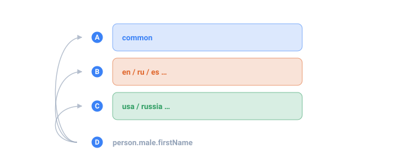

<a name="top"></a>

[English](../../data-packs/overview.md#top) · **Русский** · [Español](../../es/data-packs/overview.md#top)

📖 **[Открыть на сайте документации →](https://nickliapin.github.io/tdcv2/ru/docs/data-packs/overview)**

← Назад: [Производительность](../guides/performance.md#top) · **[Оглавление](../README.md#top)** · Вперёд: [Установка пакетов данных](./installing-packs.md#top) →

---

# Пакеты данных (data packs)

**Пакет данных** — это самоописывающий файл со списком значений (имена, фамилии,
цвета, что угодно), который TDC подхватывает автоматически и делает доступным по
короткому **адресу через точку**. Новые данные добавляются **не трогая код** —
достаточно положить файл в папку данных.

> Выводы ниже — иллюстративные: точные значения могут меняться между версиями
> ядра, но форма и пропорции сохраняются.



*Три независимые оси и один адрес, который тянется в каждую из них.*

- **A** — международные данные, одинаковые в любой локали
- **B** — языковая ось: как пишутся имена и слова
- **C** — страновая ось: то, что специфично для одной страны
- **D** — один адрес — какой набор на него ответит, зависит от прогона, а не от адреса

## Главные правила

- **Один файл = один однородный список = один адрес.** Мужские и женские имена —
  это разные списки, каждый в своём файле.
- **Только данные и декларативные генераторы — никакого исполняемого кода.** Пакет —
  это либо «взять значение из списка», либо генератор на собственном DSL TDC (см.
  [Свой пакет данных](writing-your-own.md#top)). Никакого произвольного кода — это
  сохраняет гарантию TDC об одинаковом результате на всех языках и делает чужие
  пакеты безопасными для скачивания и запуска.
- **Обычный UTF-8, по значению на строку.** Расширение не важно (`.txt`, `.csv`
  или вовсе без него).

## Как получается адрес

Есть два способа, и они сочетаются.

### Из структуры папок (по умолчанию)

Адрес — это путь к файлу относительно папки данных, без расширения:

```text
data/packs/ru/person/male/firstName.txt   →   ru.person.male.firstName
data/packs/es/person/lastName.txt         →   es.person.lastName
```

Имена папок становятся сегментами адреса через точку. Ничего описывать не надо —
само расположение **и есть** адрес. Подходит для всего, что укладывается в
аккуратное дерево папок; для большинства пакетов этого достаточно.

### Из шапки файла (переопределение)

Если файл лежит «россыпью» или ему нужен адрес, не совпадающий с папкой, в начале
файла ставится **шапка**, огороженная строками `---`:

```text
---
description: Названия цветов
address: common.color.name
---
chrome
plasma-blue
void-black
```

Тогда TDC берёт адрес из `address:`, а не из пути. Первый сегмент по-прежнему
должен быть кодом локали или `common`. Используйте это, когда адрес и раскладка на
диске не могут совпадать — общий файл, чужой список, сгенерированный пакет.

### Поля шапки

Все поля шапки необязательны. Те, что формируют или задают источник адреса,
описаны ниже; поля, меняющие способ чтения тела (взвешенные списки, внешние файлы,
генераторы), разобраны на отдельных примерах в
[Свой пакет данных](writing-your-own.md#top).

| Поле          | Значение                                              | Где описано                               |
| :------------ | :---------------------------------------------------- | :---------------------------------------- |
| `description` | Человеческое описание — «что это»                     | ниже                                      |
| `address`     | Явный адрес, переопределяющий вычисленный из пути     | ниже                                      |
| `locale`      | На каком языке говорит пакет (`ru`, `es`, `en`…)      | ниже                                      |
| `file`        | Ссылка на внешний файл данных вместо встроенного тела | ниже                                      |
| `column`      | С `file`: взять именованную/номерную колонку из CSV   | ниже                                      |
| `delimiter`   | Разделитель колонок/значений (по умолчанию `,`)       | ниже                                      |
| `weight`      | Сделать пакет взвешенным: колонка с частотой          | [Свой пакет данных](writing-your-own.md#top) |
| `weighted`    | `true` — тело в форме строк `значение,вес`            | [Свой пакет данных](writing-your-own.md#top) |
| `generator`   | `tdc` — тело это `<gen>`, а не список                 | [Свой пакет данных](writing-your-own.md#top) |
| `inject`      | Свой маркер интерполяции для генератора               | [Свой пакет данных](writing-your-own.md#top) |

#### `description` — метаданные

Свободный текст с описанием пакета. На вывод не влияет — он для людей и для будущего
автодополнения в редакторе, которое его прочитает (см. раздел «Что пока не
сделано» ниже). Держите его коротким: «города России», «HTTP-коды статусов».

#### `address:` — переопределить вычисленный путь

`address:` заменяет адрес, выведенный из пути. Файл ниже лежит «россыпью», но
разрешается по адресу `common.color.name`:

```text
---
address: common.color.name
---
chrome
plasma-blue
void-black
```

```xml
<gen type="template" value="common.color.name"/>
```

`./run colors.tdc (4 строки)`

```
plasma-blue
void-black
chrome
plasma-blue
```

Берите это, когда файл не может лежать там, где указывает его адрес — общий список
или пакет, который вы раскладывали не сами.

#### `locale:` — на каком языке говорит пакет

`locale:` помечает язык пакета, чтобы локале-зависимое разрешение адреса могло его
найти. Один и тот же логический путь разрешается в разные данные по локали:
под локалью `ru` адрес `person.lastName` даёт русские фамилии, а
`en.person.lastName` — английские.

```xml
<gen type="template" value="person.lastName"/>
```

`./run last-ru.tdc (4 строки)`

```
Кузнецов
Попов
Козлов
Лебедев
```

```xml
<gen type="template" value="es.person.lastName"/>
```

`./run last-es.tdc (4 строки)`

```
Garcia
Fernandez
Rodriguez
Lopez
```

Ставьте его, когда данные пакета привязаны к языку, а в адресе сегмента локали ещё
нет. Как один и тот же путь раскладывается по локалям — см. генератор
[`template`](../generators/template.md#top).

`locale:` ещё и **подставляет сегмент, которого не хватает пути**. Файл, положенный
прямо в вашу собственную папку — без дерева локалей над ним — даёт адрес `gadget`,
который начинается не с локали и потому не принадлежит никуда. Его собственная шапка
решает это:

```text
---
description: мой собственный список
locale: en
---
Blender
Grinder
```

```xml
<gen type="template" value="gadget"/>
```

Пакет регистрируется по адресу `en.gadget`, и `value="gadget"` под `en` его находит.
То есть файл попадает на свой адрес одним из трёх путей: `address:`, если он указан в
шапке, иначе **путь на диске**, а `locale:` дописывает локаль, когда одного пути не
хватает. Все три работают одинаково во всех реализациях.

Файл, до которого не дотянулся ни один из трёх — есть шапка, но нет ни `address:`, ни
`locale:`, и путь начинается не с локали, страны или `common` — адреса не получает и
пропускается. CLI говорит об этом при загрузке предупреждением `TDC171`, а не молчит.

#### Внешний файл как тело — `file:`, `column:`, `delimiter:`

Вместо встроенного тела шапка может указывать на существующий файл — удобно для
больших списков или чтобы переиспользовать готовый CSV. `file:` — это путь
(относительно файла пакета), `column:` выбирает колонку по имени или номеру, а
`delimiter:` задаёт разделитель (символ или алиас: `tab`, `semicolon`, `pipe`).

```text
---
description: Названия городов России
file: ../../sources/ru/cities.csv
column: name
delimiter: ,
---
```

```xml
<gen type="template" value="russia.city.name"/>
```

`./run cities.tdc (4 строки)`

```
Казань
Самара
Воронеж
Красноярск
```

У пакета нет встроенных значений — телом служит именованная колонка того CSV. Те же
три поля несут и **взвешенный** список; этот вариант разобран в
[Свой пакет данных](writing-your-own.md#top).

## Как использовать адрес

Обращайтесь к адресу как к любому генератору
[`template`](../generators/template.md#top). Вытяните нужные части в именованные
[последовательности](../core-concepts/sequences.md#top) и соберите их в `.tdc`:

```xml
<tdc>
    <env count="4" seed="demo" local="ru">
        <sequence name="First"><gen type="template" value="person.male.firstName"/></sequence>
        <sequence name="Last"><gen type="template" value="person.lastName"/></sequence>
    </env>
    <block><line><data>${{First}} ${{Last}}</data></line></block>
</tdc>
```

`./run people.tdc (4 строки)`

```
Мирон Кузьменко
Виктор Кузьменко
Эдуард Петренко
Василий Седых
```

Адрес `person.lastName` — это просто файл `ru/person/lastName.txt` в папке данных;
вызов генератора `template` на нём возвращает значения из этого списка.

### Форму записи собираете сами

Пакет даёт части; **форму** записи вы строите в `.tdc` сами. Русское «Имя Отчество
Фамилия» и испанское «Имя Фамилия Фамилия» — это просто разные компоновки пакетов
одного и того же рода:

```xml
<tdc>
    <env count="4" seed="es">
        <sequence name="First"><gen type="template" value="es.person.male.firstName"/></sequence>
        <sequence name="Last1"><gen type="template" value="es.person.lastName"/></sequence>
        <sequence name="Last2"><gen type="template" value="es.person.lastName"/></sequence>
    </env>
    <block><line><data>${{First}} ${{Last1}} ${{Last2}}</data></line></block>
</tdc>
```

`./run es-people.tdc (4 строки)`

```
Anselmo León Muñoz
Simón Redondo Casas
Félix Muñiz Ramos
Isaías Zurita Rendón
```

Последняя строка тянет **одну и ту же** фамилию дважды (`Rodriguez Rodriguez`):
`Last1` и `Last2` — две независимые вытяжки из одного списка, без встроенного
запрета на совпадение. Когда два поля в строке обязаны различаться, оберните их в
[`<distinct>`](../constructs/unique-values.md#top) — механика разобрана в
[Свой пакет данных](writing-your-own.md#top).

## Не только списки

Пакет не ограничен плоским списком. Он также может быть:

- **взвешенным** списком — реальной частотой значения, разложенной точно тем же
  методом Гамильтона, что и [`percent`](../generators/text.md#top);
- небольшим **генератором** на DSL — заготовкой [`regex`](../generators/regex.md#top),
  именем, собранным из соседних списков, или [`<mix>`](../reference/tags.md#top),
  который делит по точному проценту.

По соглашению файлы-генераторы используют расширение `.tdc` (обычные данные
остаются `.txt`), чтобы их было легко отличать. Оба вида безопасно поставлять и
скачивать — генератор это разобранный, изолированный DSL, а не произвольный код —
и оба разобраны от и до в [Свой пакет данных](writing-your-own.md#top).

## Где лежат пакеты данных

- **Встроенный набор** поставляется в репозитории в `data/packs/` и сканируется
  автоматически при запуске.
- **Свои папки** добавляются флагом CLI `--data-path <папка>` (повторяемым) или
  параметром библиотеки `dataPaths`. Про процесс `tdcv2 init` / `tdcv2 pack` см.
  [Установка пакетов данных](installing-packs.md#top).

## Ошибки

Проблемы ловятся на этапе загрузки, **до** запуска генерации:

- **Файл пакета, который не попал никуда** — есть шапка, но ничего не даёт ему первым
  сегментом локаль, страну или `common` → `TDC171`, предупреждение с именем файла.
  Добавьте `address:` или `locale:` либо переместите файл в папку локали.
- **Два файла на один адрес** → `TDC170`, с указанием обоих файлов. Переименуйте
  или переместите один.
- **Опечатка в адресе** в конфиге (`value="person.male.firstNam"`) → `TDC071`,
  `unknown template path`.

`./run typo.tdc`

```
TDC071: unknown template path 'person.male.firstNam'
  did you mean 'person.male.firstName'?
```

Скрытые файлы (начинающиеся с `.`), а также `README` / `LICENSE` / `CHANGELOG`
сканером игнорируются.

## Что пока не сделано

- **Автодополнение адресов** в редакторе (по шапкам `description:`) — следующий
  шаг.
- **Пакетный манифест** на всю папку (лицензия, автор, версия) — на будущее.

## См. также

- **[Установка пакетов данных](installing-packs.md#top)** — `tdcv2 init` и `tdcv2 pack`.
- **[Свой пакет данных](writing-your-own.md#top)** — шапки, генераторы, взвешенные пакеты.
- **[Генератор `template`](../generators/template.md#top)** — вызов адресов и
  разрешение по локали.

---

← Назад: [Производительность](../guides/performance.md#top) · **[Оглавление](../README.md#top)** · Вперёд: [Установка пакетов данных](./installing-packs.md#top) →

📖 **[Открыть на сайте документации →](https://nickliapin.github.io/tdcv2/ru/docs/data-packs/overview)**
