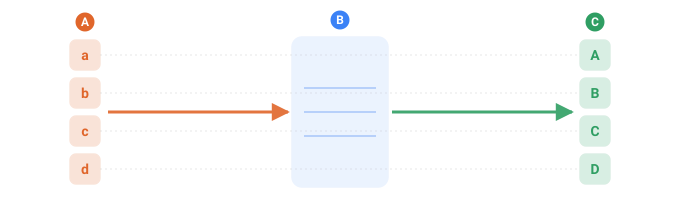
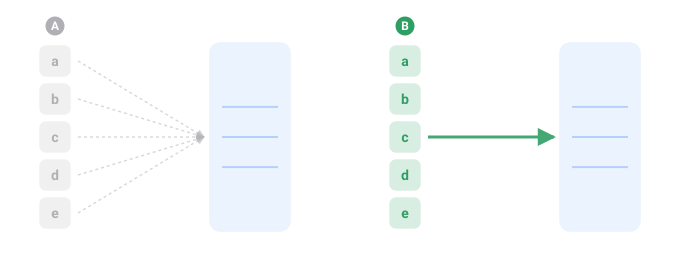

<a name="top"></a>

[English](../../generators/http.md#top) · **Русский** · [Español](../../es/generators/http.md#top)

📖 **[Открыть на сайте документации →](https://nickliapin.github.io/tdcv2/ru/docs/generators/http)**

← Назад: [Кривая (pattern)](./pattern.md#top) · **[Оглавление](../README.md#top)** · Вперёд: [Нарастающий итог](./running.md#top) →

---

# Генератор `http`

**Когда применять** — когда значение должно прийти из логики, которой у TDC нет:
настоящий алгоритм контрольной цифры, который вы уже написали, обращение к своей базе,
любой расчёт, который тяжело выразить в конфиге. Вы поднимаете небольшой сервис, а TDC
к нему обращается: движок становится **клиентом** вашего сервиса, а не хостом вашего
кода. Это и есть точка расширения — всё, что вы спрячете за HTTP-адрес, становится
частью ваших данных.

## Два режима: он генерирует или он обрабатывает

Какой из них — решает один атрибут, и это по-настоящему разные работы:

| | `in` | что получает ваш сервис | что он делает |
| :-- | :-- | :-- | :-- |
| **Источник** | нет | ничего, кроме счётчика | придумывает значения сам — работает как генератор |
| **Обработчик** | есть | ваши значения, по одному на строку | преобразует присланное и возвращает обратно |

Оба сразу, к одному и тому же сервису — первую колонку отдают и получают изменённой,
вторая берётся из ниоткуда:

```xml
<sequence name="City">
  <gen type="text" value="Paris,Berlin,Tokyo" order="sequential"/>
</sequence>

<sequence name="Handled">
  <gen type="http" src="http://127.0.0.1:5599/gen" in="City"/>   <!-- обработчик -->
</sequence>

<sequence name="Made">
  <gen type="http" src="http://127.0.0.1:5599/gen"/>             <!-- источник -->
</sequence>
```

`./run modes.tdc`

```
Paris  ->  [Paris ok]    |  Made: SRC-000
Berlin ->  [Berlin ok]   |  Made: SRC-001
Tokyo  ->  [Tokyo ok]    |  Made: SRC-002
```

Режим обработчика — более полезный из двух, и его легче всего не заметить: он позволяет
сервису, который у вас уже есть, **доделать** значение, начатое TDC, — проверить,
добавить контрольную цифру, найти по справочнику, перевести, — вместо того чтобы
заменять генератор целиком.

Ваш сервис отличает режимы по телу запроса: **пустое тело — это режим источника**, а
заголовок `X-TDC-Count` говорит, сколько значений придумать.

> [!TIP]
> **Как написать сам сервис**
>
> Полный рабочий сервис — на **Node, Python и Java**, с обоими режимами — и как сделать его
> воспроизводимым от сида, вынесены на отдельную страницу:
> **[Как написать сервис-генератор](../guides/writing-a-service.md#top)**.



*Колонка входных значений уходит одним запросом; ответ приходит по значению на строку, в том же порядке. Здесь сервис приводит каждое значение к верхнему регистру (a → A).*

- **A** — колонка входа — значения, которые дала ваша последовательность
- **B** — ваш сервис: TDC только обращается к нему, но не запускает
- **C** — ответ — одно значение на строку, в порядке отправки

## Атрибуты

| Атрибут    | Что задаёт |
| :--------- | :--------- |
| `src`      | адрес сервиса — `http://127.0.0.1:5566/gen` (локально, быстро) или внешний хост. `https` тоже работает |
| `in`       | последовательность, чьё значение уходит на каждой строке, — именно это делает сервис **обработчиком**. Без него сервис — **источник**: ничего не получает и придумывает каждое значение |
| `on_error` | `fail` (по умолчанию) — остановиться с внятным сообщением; `empty` — оставить ячейку пустой и продолжить |
| `timeout`  | сколько секунд ждать один ответ, прежде чем сдаться. По умолчанию 30 |

`in` называет **более раннюю** последовательность — уходит то значение, что она дала на
каждой строке.

## Контракт, который реализует ваш сервис

Движок говорит по одному маленькому протоколу и ничего сверх него не ждёт:

- **`POST`** на `src`, с заголовком **`X-TDC-Count: N`** — сколько значений нужно.
- **Тело** — это `N` входных значений, **по одному на строку**, в порядке строк. Без
  `in` тело пустое, а `N` берётся из заголовка.
- **Ответ** должен быть ровно **`N` строк**, в том же порядке — строка _i_ отвечает на
  вход _i_. Обычный текст.

Всё структурное — забота вашего сервиса. Если внутри он работает с JSON, наружу отдаёт
то одно поле, что вам нужно, текстом — TDC внутри держит всё строками.

**Один запрос на колонку, а не на строку.** Движок шлёт всю пачку разом, поэтому тысяча
строк — это один запрос. Сервис, написанный «строка на входе — строка на выходе», тоже
работает: он просто идёт циклом по строкам одного полученного запроса.



*Почему тысяча строк — это один запрос. Построчная форма (слева) была бы тысячей обращений; TDC шлёт всю колонку одним (справа).*

- **A** — по запросу на строку — так TDC НЕ делает; это был бы вызов на каждое значение
- **B** — один запрос на всю колонку — вся пачка, один обход по сети

Именно это держит скорость: цена — один обход по сети плюс работа самого сервиса, а не
обход на каждое значение. Поэтому же `http` работает на in-memory движке, и его лучше
держать для сервиса на вашей машине или для прогона, размер которого вы прикинули
нарочно, — а не для миллиарда строк к далёкому адресу.

## Целый сервис на пяти языках

Каждый из них полон и отвечает на **оба** режима: оборачивает то, что вы прислали, и
придумывает значения, когда тело пустое. Выбирайте язык — ведут себя одинаково.

#### Node.js

```js
import { createServer } from 'node:http';

createServer((req, res) => {
  const chunks = [];
  req.on('data', (c) => chunks.push(c));
  req.on('end', () => {
    const count = Number(req.headers['x-tdc-count'] ?? '0');
    const sent = Buffer.concat(chunks).toString('utf8');

    const out =
      sent === ''
        ? Array.from({ length: count }, (_, i) => 'SRC-' + String(i).padStart(3, '0')) // source
        : sent.split('\n').map((line) => '[' + line + ' ok]'); // handler

    const body = out.join('\n');
    res.writeHead(200, { 'Content-Type': 'text/plain', 'Content-Length': Buffer.byteLength(body) });
    res.end(body);
  });
}).listen(5801, '127.0.0.1');
```

#### Python

```python
from http.server import BaseHTTPRequestHandler, HTTPServer


class H(BaseHTTPRequestHandler):
    def do_POST(self):
        n = int(self.headers.get("Content-Length", 0))
        sent = self.rfile.read(n).decode() if n else ""
        count = int(self.headers.get("X-TDC-Count", "0"))

        if sent == "":
            out = [f"SRC-{i:03d}" for i in range(count)]          # source
        else:
            out = [f"[{line} ok]" for line in sent.split("\n")]   # handler

        body = "\n".join(out).encode()
        self.send_response(200)
        self.send_header("Content-Length", str(len(body)))
        self.end_headers()
        self.wfile.write(body)


HTTPServer(("127.0.0.1", 5802), H).serve_forever()
```

#### Java

```java
import com.sun.net.httpserver.HttpServer;
import java.io.OutputStream;
import java.net.InetSocketAddress;
import java.nio.charset.StandardCharsets;
import java.util.ArrayList;
import java.util.List;

public class S3 {
    public static void main(String[] args) throws Exception {
        HttpServer server = HttpServer.create(new InetSocketAddress("127.0.0.1", 5803), 0);
        server.createContext("/", exchange -> {
            String sent = new String(exchange.getRequestBody().readAllBytes(),
                                     StandardCharsets.UTF_8);
            String raw = exchange.getRequestHeaders().getFirst("X-TDC-Count");
            int count = Integer.parseInt(raw == null ? "0" : raw);

            List<String> out = new ArrayList<>();
            if (sent.isEmpty()) {
                for (int i = 0; i < count; i++) out.add(String.format("SRC-%03d", i));  // source
            } else {
                for (String line : sent.split("\n", -1)) out.add("[" + line + " ok]");  // handler
            }

            byte[] body = String.join("\n", out).getBytes(StandardCharsets.UTF_8);
            exchange.sendResponseHeaders(200, body.length);
            try (OutputStream os = exchange.getResponseBody()) { os.write(body); }
        });
        server.start();
    }
}
```

#### C#

```csharp
using System.Net;
using System.Text;

var server = new HttpListener();
server.Prefixes.Add("http://127.0.0.1:5804/");
server.Start();

while (true)
{
    HttpListenerContext ctx = server.GetContext();
    using var reader = new StreamReader(ctx.Request.InputStream, Encoding.UTF8);
    string sent = reader.ReadToEnd();
    int count = int.Parse(ctx.Request.Headers["X-TDC-Count"] ?? "0");

    IEnumerable<string> lines = sent.Length == 0
        ? Enumerable.Range(0, count).Select(i => $"SRC-{i:D3}")     // источник
        : sent.Split('\n').Select(line => $"[{line} ok]");          // обработчик

    byte[] body = Encoding.UTF8.GetBytes(string.Join("\n", lines));
    ctx.Response.ContentLength64 = body.Length;
    ctx.Response.OutputStream.Write(body);
    ctx.Response.Close();
}
```

#### Rust

```rust
use std::io::{BufRead, BufReader, Read, Write};
use std::net::TcpListener;

fn main() -> std::io::Result<()> {
    let listener = TcpListener::bind("127.0.0.1:5805")?;
    for stream in listener.incoming() {
        let mut stream = stream?;
        let mut reader = BufReader::new(stream.try_clone()?);

        let (mut length, mut count) = (0usize, 0usize);
        loop {
            let mut line = String::new();
            if reader.read_line(&mut line)? == 0 || line == "\r\n" {
                break;
            }
            let lower = line.to_ascii_lowercase();
            if let Some(v) = lower.strip_prefix("content-length:") {
                length = v.trim().parse().unwrap_or(0);
            } else if let Some(v) = lower.strip_prefix("x-tdc-count:") {
                count = v.trim().parse().unwrap_or(0);
            }
        }

        let mut sent = vec![0u8; length];
        reader.read_exact(&mut sent)?;
        let sent = String::from_utf8_lossy(&sent);

        let out: Vec<String> = if sent.is_empty() {
            (0..count).map(|i| format!("SRC-{i:03}")).collect()             // source
        } else {
            sent.split('\n').map(|line| format!("[{line} ok]")).collect()   // handler
        };

        let body = out.join("\n");
        write!(
            stream,
            "HTTP/1.1 200 OK\r\nContent-Type: text/plain\r\nContent-Length: {}\r\n\r\n{body}",
            body.len()
        )?;
    }
    Ok(())
}
```

Никаких крейтов: в стандартной библиотеке есть TCP-слушатель, а HTTP-запрос —
это несколько строк заголовков и тело за ними.

Запустите любой, направьте `src` на его порт и прогоните конфиг из раздела
[Два режима](#два-режима-он-генерирует-или-он-обрабатывает) — все пять дадут один и тот же вывод.

> [!CAUTION]
> **Прочитайте это, прежде чем писать свой, — это не опционально**
>
> Сервисы выше — самое короткое, что работает. Они **невоспроизводимы**: прогоните конфиг
> дважды, и придуманные значения будут какими вздумается сервису.
>
> **[→ Как написать сервис-генератор](../guides/writing-a-service.md#top)** — вот страница,
> которая важна. Там, с рабочим кодом на всех языках:
>
> - **как сделать прогон воспроизводимым** через `X-TDC-Seed`, который шлёт TDC, — то
>   единственное, что возвращает этому генератору его гарантию;
> - **почему `значение(сид, i)`, а не `next()`** — сервис не может обещать порядок вызовов,
>   и итератор тихо ломается при повторах и одновременных запросах;
> - **ловушка 32 бит**, из-за которой наивный перенос на Python молча расходится с Node и Java;
> - список перед стартом: точное число строк, порядок, переносы, одновременность, пачка.
>
> Пропустите — и данные будут выглядеть нормально, но не будут воспроизводимыми. Это самый
> дорогой вид «неправильно».

## Когда что-то ломается

Сервис вне контроля TDC, поэтому отказы обрабатываются, а не прячутся:

- **`on_error="fail"`** (по умолчанию) останавливает прогон с сообщением, называющим
  последовательность и сервис — `http service for sequence "Checked" at … returned 500`.
  Пустая колонка в готовом файле — сюрприз хуже, чем внятная остановка.
- **`on_error="empty"`** оставляет затронутую колонку пустой и доводит прогон до конца —
  для случая, когда нужен вывод «как получится». Дырки проверяете вы.
- **`429` (слишком много запросов) всегда останавливает**, даже при `empty`. «Притормози»
  и «отдать целую колонку потоком» несовместимы, а продолжение тихо обрезало бы данные.
- Сервис, который **не отвечает**, отсекается по `timeout`, а не вешает прогон.
- Сервис, который **заливает** — отвечает сильно больше, чем по значению на строку, —
  обрезается на 64 МБ с ошибкой, а не читается в память до конца.

## Чего он не обещает

Это единственный генератор, который жертвует гарантиями, которые остальной TDC держит. Проговорите
их себе, прежде чем тянуться к нему:

- **Невоспроизводимо.** Значения решает сервис, поэтому `seed` ничего не гарантирует, и
  **повторный прогон даёт другие данные**. Конфиг с `http` никогда не считается
  воспроизводимым.
- **Порядок следует сервису**, а не сиду.
- **Локально или скромные объёмы.** Через интернет большой прогон — это большое число
  обращений наружу; это для сервиса на вашей машине или для прогона, размер которого вы
  прикинули нарочно. Не для миллиарда строк к публичному адресу.

## См. также

- [Как написать сервис-генератор](../guides/writing-a-service.md#top) — рабочие сервисы на Node, Python и Java
- [Обзор генераторов](../generators/overview.md#top)
- [Коды ошибок](../reference/errors.md#top) — `TDC065`–`TDC068` и отказы во время прогона

---

← Назад: [Кривая (pattern)](./pattern.md#top) · **[Оглавление](../README.md#top)** · Вперёд: [Нарастающий итог](./running.md#top) →

📖 **[Открыть на сайте документации →](https://nickliapin.github.io/tdcv2/ru/docs/generators/http)**
