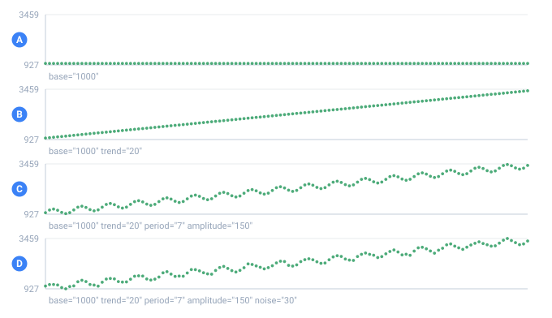

<a name="top"></a>

[English](../../generators/timeseries.md#top) · **Русский** · [Español](../../es/generators/timeseries.md#top)

📖 **[Открыть на сайте документации →](https://nickliapin.github.io/tdcv2/ru/docs/generators/timeseries)**

← Назад: [Счётчики (increment / decrement)](./counters.md#top) · **[Оглавление](../README.md#top)** · Вперёд: [Кривая (pattern)](./pattern.md#top) →

---

# Генератор `timeseries`

**Когда нужен.** Когда значения должны двигаться как настоящий сигнал во времени —
продажи по дням, показания датчика, веб-трафик. Реальные ряды — это не плоский шум и
не одно распределение: это **слои** — общий тренд (рост или спад), повторяющаяся
сезонность (недельная, годовая) и случайный шум сверху. Генератор `timeseries`
собирает значение строки именно так:

```text
значение(i) = base + trend·i + amplitude·sin(2π·i / period) + noise·случайное
```

где `i` — номер строки (ось времени), считается с нуля: первая строка (`i = 0`) равна
ровно `base`.

Выводы ниже иллюстративны: точные цифры зависят от версии ядра и `seed`, но важна
именно форма — тренд, волна, дрожание.



*Один и тот же генератор четыре раза, с добавлением одного атрибута на каждом шаге — по 120 строк на панель.*

- **A** — только base: ровная линия
- **B** — добавлен trend: линия пошла вверх
- **C** — добавлены period и amplitude: поверх тренда легла волна
- **D** — добавлен noise: волна перестала быть идеальной

## Зачем это, а не просто случайные числа

Обычный генератор [`number`](number.md#top) выдаёт **белый шум** — значения скачут вокруг
среднего без всякой памяти. Вот `number` с нормальным распределением, центрированным
на `1000`:

```xml
<sequence name="Шум"><gen type="number" distribution="normal" mean="1000" sd="120"/></sequence>
```

`./run noise.tdc`

```
День 1     841
День 2     1341
День 3     1047
День 4     1010
День 5     1086
День 6     1077
День 7     862
День 8     1072
День 9     1114
День 10    782
День 11    979
День 12    1014
```

Ни роста, ни спада, ни повтора — каждый день всё топчется около 1000. На реальные
метрики это не похоже: у продаж есть тренд (бизнес растёт), есть недельный ритм (в
выходные иначе, чем в будни), и уже _поверх этого_ — случайные отклонения. Именно эти
три слоя и добавляет `timeseries`.

## Атрибуты

```xml
<gen type="timeseries" base="1000" trend="20" period="7" amplitude="150" noise="30"/>
```

| Атрибут     | Что задаёт                                            |
| :---------- | :---------------------------------------------------- |
| `base`      | Стартовый уровень (по умолчанию `0`)                  |
| `trend`     | Наклон: на сколько растёт значение каждый шаг         |
| `period`    | Период сезонной волны (в строках), напр. `7` — неделя |
| `amplitude` | Высота сезонной волны                                 |
| `peak_at`   | На какой строке волна пикует (по умолчанию — на четверти периода) |
| `noise`     | Сила случайного шума (стандартное отклонение)         |
| `decimals`  | Знаков после запятой (по умолчанию `0` — целое)       |

Любой слой необязателен. Разделы ниже разбирают их по одному — что каждый делает и
когда его брать.

### `base` — стартовый уровень

`base` фиксирует значение самой первой строки (`i = 0`) и уровень, от которого
отсчитывается всё остальное. Сам по себе — без `trend`, волны и `noise` — это просто
прямая линия.

```xml
<gen type="timeseries" base="500"/>
```

`./run base.tdc`

```
500
500
500
500
500
```

Используйте, чтобы закрепить метрику на реалистичном уровне — магазин со средними 500
заказами в день, датчик, простаивающий на 20 градусах, — прежде чем добавлять
движение.

### `trend` — направление

`trend` — это наклон: каждая строка добавляет `trend` к предыдущей. Положительный —
растёт, отрицательный — падает. С одними лишь `base` + `trend` получается мёртвая
прямая.

```xml
<gen type="timeseries" base="1000" trend="20"/>
```

`./run trend.tdc`

```
1000
1020
1040
1060
1080
```

Используйте для роста или спада, который хочется видеть явно, — число подписчиков,
прибавляющее 20 в день, батарея, теряющая фиксированный заряд за цикл.

### `period` и `amplitude` — сезонная волна

Эти два работают в паре, и по отдельности ни один ничего не делает. `period` — сколько
строк занимает один полный цикл (`7` — недельный ритм, `365` — годовой); `amplitude` —
насколько волна отклоняется вверх и вниз от линии тренда. Вместе они кладут
повторяющуюся волну `sin` на то, что дают `base` + `trend`.

```xml
<gen type="timeseries" base="1000" trend="20" period="7" amplitude="150"/>
```

`./run season.tdc`

```
1000
1137
1186
1125
1015
954
1003
```

Внутри каждого окна в 7 строк значение поднимается к пику и опускается ко дну, затем
повторяется. Поскольку тренд всё время приподнимает линию, каждый цикл сидит выше
предыдущего — волна едет вверх по склону. Используйте для всего, что живёт по
календарю: трафик «будни против выходных», спрос «лето против зимы».

### `peak_at` — на какой строке волна выше всего

`period` и `amplitude` говорят, какой длины волна и как далеко она качается. Они не
говорят, **когда** она пикует, и ответ по умолчанию застаёт врасплох: волна стартует с
середины размаха и идёт вверх, поэтому пик приходится на **четверть периода**.

На двенадцати месячных строках это строка 3 — апрель. Конфиг писался ради «летом
теплее», а апрель — это не оно:

```xml
<gen type="timeseries" base="15" amplitude="10" period="12" decimals="1"/>
```

`./run temp.tdc — самая высокая строка четвёртая`

```
15.0
20.0
23.7
25.0
23.7
20.0
15.0
10.0
6.3
5.0
6.3
10.0
```

`peak_at` называет строку напрямую. Строки считаются с нуля, поэтому июль — это строка 6:

```xml
<gen type="timeseries" base="15" amplitude="10" period="12" peak_at="6" decimals="1"/>
```

`./run temp.tdc — самая высокая строка седьмая`

```
5.0
6.3
10.0
15.0
20.0
23.7
25.0
23.7
20.0
15.0
10.0
6.3
```

Больше ничего не сдвинулось: те же `base` и `amplitude`, тот же двенадцатистрочный
цикл. Изменился только месяц, на который приходится максимум.

**Это строка, а не угол.** `period` уже считается в строках — значит и `peak_at` тоже:
182 из 365 это первое июля, и такое число берут из календаря, а не из радиан. Значение
за пределами периода заворачивается, поэтому `peak_at="18"` при `period="12"` — это то
же самое, что `6`; дробь допустима, когда пик приходится между строками.

`peak_at="0"` стоит знать отдельно: он заставляет волну **начаться** с максимума — форма,
которую простой синус не даст ни при какой амплитуде.

> [!NOTE]
> **Если вы потянулись к `phase`**
>
> Это название из обработки сигналов, и в TDC его нет. `peak_at` делает ту же работу в той
> единице, которой пользуется весь остальной генератор. Написанный `phase=` — ошибка,
> которая это и говорит.

`peak_at` требует `period`: у волны сначала должна появиться длина, и только потом —
высшая точка. Без неё это `TDC253`.

### `noise` — шероховатость реального мира

`noise` — это стандартное отклонение случайного колебания, добавляемого к каждой
строке. Это разница между учебниковой кривой и настоящим замером.

```xml
<gen type="timeseries" base="1000" trend="20" period="7" amplitude="150" noise="30"/>
```

`./run noise-layer.tdc`

```
1048
1152
1210
1093
1017
978
991
```

Сравните с чистой волной выше: форма та же, но каждая точка слегка дрожит
(`1000 → 985`). Прибавьте шума для шумного датчика, убавьте — для гладкого агрегата.
Дрожание воспроизводимо — см. [Детали](#детали).

### `decimals` — дробные значения

По умолчанию вывод округляется до целого. `decimals` оставляет столько знаков после
запятой — для температур, цен или любой измеренной величины.

```xml
<gen type="timeseries" base="20" trend="0.5" noise="0.3" decimals="1"/>
```

`./run decimals.tdc`

```
20.5
20.6
21.2
21.2
22.0
```

## Собираем ряд по слоям

Лучший способ прочувствовать генератор — включать слои по одному. Ниже три колонки
[`<sequence>`](../core-concepts/sequences.md#top) бегут по одним и тем же «дням»:
**тренд** (только `trend`), **+сезон** (добавили `period` + `amplitude`) и **+шум**
(добавили `noise`).

```xml
<sequence name="A"><gen type="timeseries" base="1000" trend="20"/></sequence>
<sequence name="B"><gen type="timeseries" base="1000" trend="20" period="7" amplitude="150"/></sequence>
<sequence name="C"><gen type="timeseries" base="1000" trend="20" period="7" amplitude="150" noise="30"/></sequence>
...
<data>День ${{День}}   тренд=${{A}}   +сезон=${{B}}   +шум=${{C}}</data>
```

`./run series.tdc`

```
День   тренд   +сезон   +шум
01     1000     1000     985
02     1020     1137     1087
03     1040     1186     1192
04     1060     1125     1107
05     1080     1015     936
06     1100     954      966
07     1120     1003     1031
08     1140     1140     1087
09     1160     1277     1311
10     1180     1326     1347
11     1200     1265     1261
12     1220     1155     1126
```

Читаем по колонкам:

- **тренд** — мёртвая прямая: `+20` каждый день, `1000, 1020, 1040 …`. Направление
  есть, но живого сигнала нет.
- **+сезон** — на прямую легла недельная волна (`period="7"`). Внутри каждой недели
  значение поднимается к пику и опускается ко дну: пики приходятся на дни **3** и
  **10** (1186 → 1326), провал — на день **6** (954). Пики и провалы повторяются
  через 7 строк, и каждый следующий выше предыдущего ровно на
  `trend · period = 20 · 7 = 140` — волна едет вверх по тренду.
- **+шум** — тот же рисунок, но слегка дрожит (`1000 → 985`), как у настоящих замеров.

Каждый следующий столбец — это предыдущий плюс **один** атрибут: сначала направление,
потом ритм, потом живая шероховатость. Так и собирается реалистичный ряд.

## Детали

- **Детерминированно:** тот же `seed` даёт тот же ряд. Шум тоже воспроизводим — он
  считается по номеру строки, а не «броском монеты» на лету.
- **Любой объём, оба движка:** значение считается по номеру строки, поэтому память не
  растёт (см. [Большие выгрузки](../guides/large-outputs.md#top)). Миллиард точек — не
  проблема.
- Ось времени — это номер строки. Она естественно сочетается с
  [`increment`](counters.md#top) (счётчик дней) или колонкой [`date`](date.md#top) рядом,
  так что каждое значение несёт реальную дату.

> [!NOTE]
> **В планах**
>
> Сейчас — один тренд + одна сезонная волна + шум. В планах: несколько сезонностей
> сразу (недельная **и** годовая) и AR-шум (коррелированный во времени).

## См. также

- **[Number](number.md#top)** — одиночные случайные значения со статистическими
  распределениями.
- **[Pattern](pattern.md#top)** — когда форму нельзя описать через тренд + сезон.
- **[Counters](counters.md#top)** / **[Date](date.md#top)** — индекс дня или реальная дата,
  чтобы поставить рядом с рядом.

---

← Назад: [Счётчики (increment / decrement)](./counters.md#top) · **[Оглавление](../README.md#top)** · Вперёд: [Кривая (pattern)](./pattern.md#top) →

📖 **[Открыть на сайте документации →](https://nickliapin.github.io/tdcv2/ru/docs/generators/timeseries)**
