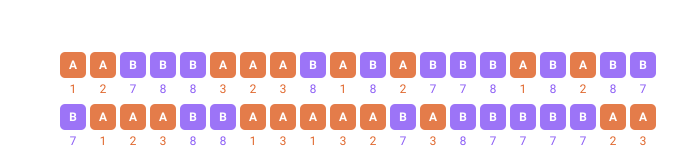

<a name="top"></a>

[English](../../guides/hierarchical-dependencies.md#top) · **Русский** · [Español](../../es/guides/hierarchical-dependencies.md#top)

📖 **[Открыть на сайте документации →](https://nickliapin.github.io/tdcv2/ru/docs/guides/hierarchical-dependencies)**

← Назад: [Разбор пака построчно](../compute/walkthrough.md#top) · **[Оглавление](../README.md#top)** · Вперёд: [Связные данные](./coherent-data.md#top) →

---

# Иерархические зависимости

Это главная отличительная черта TDC. Обычные fake-генераторы заполняют каждое поле
независимо. TDC умеет связывать [последовательности](../core-concepts/sequences.md#top)
отношением **родитель → потомок**: значения потомка вычисляются **только на тех
строках, где родитель принял указанное значение**, а любые проценты внутри потомка
считаются от размера этого **отфильтрованного подмножества**, а не от общего `count`.

Именно это позволяет моделировать реальные зависимые распределения — «мужские имена
только у мужчин», «диагноз зависит от пола», «у детей нет супругов» — одним
декларативным описанием.

> [!NOTE]
> Примеры вывода ниже — иллюстративные. Конкретные _значения_, которые выдаёт генератор,
> могут меняться между версиями ядра и сидами; гарантируются же **количества** и
> **структурные правила** (какие строки заполнены, а какие остаются пустыми).



*40 настоящих строк. Родитель выдаёт A или B; у каждого значения родителя свой набор потомков, и ни в одной строке они не перемешиваются.*

- **drawn** — строки, где родитель выбрал A — потомок под ними всегда 1, 2 или 3
- **alt** — строки, где родитель выбрал B — потомок всегда 7 или 8

## Проблема: независимые поля дают невозможные пары

Чтобы понять, зачем нужен [`parent`](../reference/attributes.md#top), посмотрим, что
происходит **без** него. Две [текстовые](../generators/text.md#top) последовательности —
страна и город — объявлены независимо:

```xml
<env count="8" seed="demo">
    <sequence name="Country"><gen type="text" value="Russia,France" percent="50,50"/></sequence>
    <sequence name="City"><gen type="text" value="Moscow,Paris" percent="50,50"/></sequence>
</env>
<block><line><data>${{Country}}: ${{City}}</data></line></block>
```

`./run demo.tdc`

```
Russia: Moscow
Russia: Moscow
France: Paris
France: Paris
Russia: Moscow
France: Paris
Russia: Paris
France: Moscow
```

Каждое поле «бросает свой кубик». Проблема — в последних двух строках: **Russia: Paris
и France: Moscow** — Париж в России, Москва во Франции. Для теста, который проверяет,
что «город принадлежит стране», такие данные — мусор, и чем больше строк, тем больше
невозможных пар.

## Решение: `parent`

Заведём по одному «городскому» генератору на каждую страну и повесим фильтр
`parent="Country.Значение"`. Теперь город выбирается **только** на строках нужной
страны:

```xml
<env count="8" seed="demo">
    <sequence name="Country"><gen type="text" value="Russia,France" percent="50,50"/></sequence>
    <sequence name="CityRU" parent="Country.Russia"><gen type="text" value="Moscow,Kazan"/></sequence>
    <sequence name="CityFR" parent="Country.France"><gen type="text" value="Paris,Lyon"/></sequence>
</env>
<block><line><data>${{Country}}: ${{CityRU}}${{CityFR}}</data></line></block>
```

`./run demo.tdc`

```
Russia: Moscow
Russia: Moscow
France: Lyon
France: Lyon
Russia: Kazan
France: Paris
Russia: Kazan
France: Paris
```

Столбец `Country` тот же самый (одинаковый [`seed`](../core-concepts/determinism.md#top)),
но город теперь всегда согласован: у России только `Moscow`/`Kazan`, у Франции только
`Paris`/`Lyon`. Невозможные пары исчезли. На каждой строке активен ровно один из двух
городских генераторов, а второй пуст, поэтому `${{CityRU}}${{CityFR}}` даёт один город.

## Механика

1. Объявляем **родителя** с распределением
   ([`text`](../generators/text.md#top) с [`percent`](../generators/text.md#top),
   [`template`](../generators/template.md#top) или любой другой тип).
2. Объявляем **потомка** с атрибутом
   [`parent="Parent.Value"`](../reference/attributes.md#top).
3. Потомок материализуется **только на строках, где `Parent == Value`**. На остальных
   строках его значение не определено — в
   [интерполяции](../core-concepts/output-formatting.md#top) это пустая строка.
4. Любые проценты внутри потомка считаются от числа **активных** строк — от
   отфильтрованного подмножества.

> [!NOTE]
> **Сравнение идёт с тем значением, которое родитель ВЫТЯНУЛ**
>
>
> `parent="Parent.Value"` решается до [слоя форматирования](../guides/masks-and-case.md#top),
> поэтому сравнивается со значением, которое выдал генератор родителя, а не с тем, что
> печатает строка. Родитель, написанный как
> `<gen type="text" value="alpha,beta" case="upper"/>`, печатает `ALPHA`, а потомок за ним
> всё равно должен говорить `parent="Kind.alpha"`. Напечатанное написание не совпадает
> молча, а останавливает прогон: _filters on parent value "Kind.ALPHA", which the parent
> never produces_. То же самое верно для `mask=`.
>

## Имена по полу

Классический случай: мужчинам нужны мужские имена, женщинам — женские. Один общий
генератор имён так не умеет — он не знает про пол строки. Два именных генератора,
каждый под своим `parent`, умеют:

```xml
<env count="8" seed="demo" local="ru">
    <sequence name="Gender"><gen type="text" value="Мужчина,Женщина" percent="60,40"/></sequence>
    <sequence name="MaleName" parent="Gender.Мужчина"><gen type="template" value="person.male.firstName"/></sequence>
    <sequence name="FemaleName" parent="Gender.Женщина"><gen type="template" value="person.female.firstName"/></sequence>
</env>
<block><line><data>${{Gender}}: ${{MaleName}}${{FemaleName}}</data></line></block>
```

`./run demo.tdc`

```
Женщина: Анна
Мужчина: Пётр
Мужчина: Иван
Мужчина: Алексей
Мужчина: Дмитрий
Мужчина: Сергей
Женщина: Мария
Женщина: Елена
```

- `Gender` при `count="8"` даёт 5 `Мужчина` + 3 `Женщина` (60/40 от восьми, округление
  методом наибольшего остатка — см. [`percent`](../core-concepts/determinism.md#top)). При
  `count="100"` вышло бы ровно 60 + 40.
- `MaleName` заполняется **только** на мужских строках (шаблон `person.male.firstName`
  берёт имя из мужского справочника); на женских строках он пуст.
- `FemaleName` симметрично заполняется только на женских строках.
- Склейка `${{MaleName}}${{FemaleName}}` оставляет ровно одно имя на строку, и оно
  всегда соответствует полу — никогда не `Мужчина: Мария`.

## Вероятность внутри подмножества

«30 % болельщиков» — 30 % **от кого**? Если болеть могут только россияне, а вы считаете
30 % от всех, реальная доля болельщиков-россиян уменьшится вдвое. Поставьте
[`percent`](../generators/text.md#top) на потомка — и он применится к отфильтрованным
строкам:

```xml
<env count="100" seed="demo">
    <sequence name="Country"><gen type="text" value="RU,US" percent="50,50"/></sequence>
    <sequence name="FootballFan" parent="Country.RU"><gen type="text" value="Yes,No" percent="30,70"/></sequence>
</env>
<block><line><data>${{Country}} -> [${{FootballFan}}]</data></line></block>
```

`./run demo.tdc  (первые 10 строк)`

```
RU -> [Yes]
RU -> [Yes]
US -> []
RU -> [No]
RU -> [No]
US -> []
US -> []
RU -> [No]
RU -> [No]
RU -> [No]
```

На US-строках `FootballFan` пуст — генератор там не срабатывает. Подсчёт по всем 100
строкам, столбец за столбцом:

| Что считаем                      | Результат          |
| :------------------------------- | :----------------- |
| `Country`                        | 50 RU + 50 US      |
| `FootballFan` среди **RU**-строк | 15 `Yes` + 35 `No` |
| `FootballFan` среди **US**-строк | 50 пустых          |

Распределение 30/70 посчиталось от **50** RU-строк — «30 % россиян болеют за футбол»,
а не «30 из всех 100» (это дало бы 30 `Yes`).

### Вариация — другой процент, то же подмножество

Меняем только маску потомка на `percent="50,50"`:

```xml
<sequence name="FootballFan" parent="Country.RU"><gen type="text" value="Yes,No" percent="50,50"/></sequence>
```

`./run demo.tdc  (подсчёт по 100 строкам)`

```
FootballFan среди RU-строк:  25 Yes + 25 No
FootballFan среди US-строк:  50 пустых
```

Теперь среди тех же 50 RU-строк получается ровно **25 `Yes` + 25 `No`** — половина
подмножества, а не половина `count`. US-строки остаются пустыми. Вот почему процент
живёт на потомке: он всегда масштабируется к срезу, отфильтрованному родителем.

## Порядок объявления

Родитель **обязан** быть объявлен раньше потомка в документе. Объявите их в обратном
порядке — и рендер падает сразу:

```xml
<env count="8" seed="demo">
    <sequence name="City" parent="Country.Russia"><gen type="text" value="Moscow,Kazan"/></sequence>
    <sequence name="Country"><gen type="text" value="Russia,France" percent="50,50"/></sequence>
</env>
```

`./run demo.tdc`

```
error[TDC035]: parent sequence "Country" is not declared before this sequence
 --> demo.tdc:3:35
  |
3 |     <sequence name="City" parent="Country.Russia">…
  |                                   ^^^^^^^^^^^^^^
  |
note: Parent sequences must be declared earlier in the same <env>. Forward references and cycles are not supported.
```

Ошибка называет строку и столбец. Циклические зависимости и опережающие ссылки не
поддерживаются — граф зависимостей разрешается сверху вниз, так что родители всегда
идут первыми.

## `parent` без значения

`parent="Parent"` — **без точки и значения** — означает «любая строка, где у родителя
вообще есть значение», независимо от того, _какое_ именно. На первом уровне это нужно
редко (у верхнего родителя значение есть всегда), но это инструмент для более глубоких
цепочек, где промежуточная последовательность сама отфильтрована и вам нужен внук
только там, где сработал этот промежуточный уровень.

Здесь `Country` выбирает US-строки, `USCity` заполняет только их, а `USZip` должен
появляться везде, где **есть** город США — любой из них, — поэтому используется форма
без значения:

```xml
<env count="8" seed="demo">
    <sequence name="Country"><gen type="text" value="US,UK" percent="50,50"/></sequence>
    <sequence name="USCity" parent="Country.US"><gen type="text" value="New York,Chicago"/></sequence>
    <sequence name="USZip" parent="USCity"><gen type="regex" value="[0-9]{5}"/></sequence>
</env>
<block><line><data>${{Country}} | ${{USCity}} ${{USZip}}</data></line></block>
```

`./run demo.tdc`

```
US | New York 10021
US | Chicago 60614
UK |
UK |
US | New York 10021
UK |
US | Chicago 60614
UK |
```

`USZip` срабатывает на каждой US-строке и больше нигде — `parent="USCity.New York"`
ограничило бы его одним только Нью-Йорком. Форма без значения говорит «унаследуй фильтр
родителя, не добавляй свой», что как раз и нужно для поля, которое висит на том, что бы
ни выдал родитель.

> [!CAUTION]
> **`missing=` у родителя потомка не останавливает**
>
>
> «Любая строка, где у родителя вообще есть значение» читается как **любая строка, которую
> пропустил собственный фильтр родителя**, а не как «любая строка, где родитель вышел
> непустым». Родитель, стирающий часть своих строк через
> [`missing=`](../guides/anomalies.md#top), считает эти строки своими, и потомок их заполняет:
>
> ```
> P=[]  C=[child]
> P=[b] C=[child]
> P=[]  C=[child]
> ```
>
> Если потомок должен исчезать вместе с пустыми, скажите это условием — `if="P"` истинно
> ровно тогда, когда `P` что-то выдал, — а не рассчитывайте на `parent=` без значения.
>

## Взаимодействие с `if`

[Выражения `if`](../reference/attributes.md#top) вычисляются по значениям текущей строки.
На отфильтрованной строке значение потомка не определено — трактуется как пустое, то
есть как ложь. Поэтому условие на столбце-потомке автоматически исключает строки, где
этот потомок не сработал, без явной проверки родителя:

```xml
<env count="8" seed="demo">
    <sequence name="Country"><gen type="text" value="RU,US" percent="50,50"/></sequence>
    <sequence name="FootballFan" parent="Country.RU"><gen type="text" value="Yes,No" percent="30,70"/></sequence>
</env>
<block><line>
    <data>${{Country}} ${{FootballFan}}</data>
    <data if="FootballFan == Yes"> BUY</data>
</line></block>
```

`./run demo.tdc`

```
RU Yes BUY
RU No
US
US
RU No
US
RU No
US
```

`Ticket` рендерится только там, где `FootballFan == Yes`. У US-строк `FootballFan`
пуст, и сравнение читает его как ложь, поэтому они проходят мимо без `Ticket` — и вам
ни разу не пришлось писать `Country == RU` в условии.

## Дерево в данных, а не в конфиге

`parent` связывает одну **последовательность** с другой. Почти так же часто возникает
другая задача: запись, которая ссылается _на другую запись того же вида_. Сотрудник, чей
начальник — сотрудник. Комментарий, отвечающий на комментарий. Категория внутри
категории.

Это столбец, а не конструкция, и вся сложность в одном слове: **циклы**. Цепочка
начальников, которая закольцевалась, повесит всё, что попробует её отрисовать, и
перерозыгрышем это не лечится — проблема в форме, а не в отдельном значении.

Лечится арифметикой, и ничего нового не нужно. Пусть каждая запись ссылается на **id
меньше своего**:

```xml
<env count="10" seed="tree" local="en">
    <sequence name="Id"><gen type="increment" value="1"/></sequence>
    <sequence name="Back"><gen type="number" value="1..4"/></sequence>
    <sequence name="ParentId"><compute><result>
        <choose>
            <when>
                <test><less_than><subtract><to_number><field name="Id"/></to_number><to_number><field name="Back"/></to_number></subtract><int v="1"/></less_than></test>
                <then>
                    <choose>
                        <when><test><equals><to_number><field name="Id"/></to_number><int v="1"/></equals></test><then><int v="0"/></then></when>
                        <otherwise><int v="1"/></otherwise>
                    </choose>
                </then>
            </when>
            <otherwise><subtract><to_number><field name="Id"/></to_number><to_number><field name="Back"/></to_number></subtract></otherwise>
        </choose>
    </result></compute></sequence>
    <sequence name="Author"><gen type="template" value="person.lastName"/></sequence>
</env>
<block>
    <line><data>${{Id}},${{ParentId}},${{Author}}</data></line>
</block>
```

`./run tree.tdc`

```
1,0,Smith
2,1,Jones
3,1,Miller
4,1,Garcia
5,3,Davis
6,5,Williams
7,5,Brown
8,7,Johnson
9,7,Martinez
10,7,Rodriguez
```

Читается как `id, parent_id, автор`. `Back` — на сколько строк вверх цепляется запись, от
одной до четырёх, а две ветки `<choose>` разбирают начало файла: запись 1 получает `0`,
это корень, а всё, что дотянулось бы выше него, цепляется к корню.

Что это гарантирует по построению, а не по везению:

- **Циклов нет.** Каждая стрелка указывает на меньшее число, поэтому обход всегда
  заканчивается.
- **Корень один.** Без родителя только запись 1.
- **Форма живая.** У записи 1 здесь трое детей, а у записи 2 ни одного, потому что `Back`
  разыгрывается на каждой строке. Расширьте до `1..20` — дерево станет плоским и широким;
  сузьте до `1..2` — глубоким и узким.

Тот же столбец годится на оргструктуру, дерево комментариев, спецификацию изделия или
вложенные категории. А что записи _говорят_ — вопрос отдельный: текст комментария это
просто [`text.paragraph`](../generators/template.md#top), и связного разговора он изображать
не обязан, чтобы дерево осталось деревом.

## См. также

- **[Последовательности](../core-concepts/sequences.md#top)** и
  [`parent`](../reference/attributes.md#top) — механика, стоящая за фильтром.
- **[Детерминизм и пропорции](../core-concepts/determinism.md#top)** — как
  [`seed`](../core-concepts/determinism.md#top) и
  [`percent`](../core-concepts/determinism.md#top) остаются точными.
- **[Связные и реляционные данные](coherent-data.md#top)** — родитель → потомок через
  поиск по имени.

---

← Назад: [Разбор пака построчно](../compute/walkthrough.md#top) · **[Оглавление](../README.md#top)** · Вперёд: [Связные данные](./coherent-data.md#top) →

📖 **[Открыть на сайте документации →](https://nickliapin.github.io/tdcv2/ru/docs/guides/hierarchical-dependencies)**
