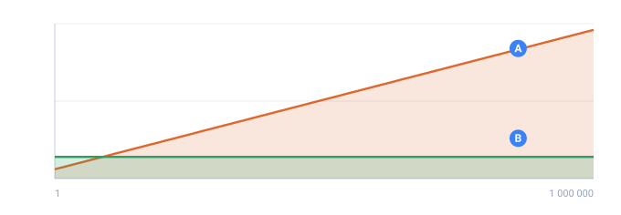

<a name="top"></a>

[English](../../guides/large-outputs.md#top) · **Русский** · [Español](../../es/guides/large-outputs.md#top)

📖 **[Открыть на сайте документации →](https://nickliapin.github.io/tdcv2/ru/docs/guides/large-outputs)**

← Назад: [Типизированный вывод и Parquet](./typed-output-parquet.md#top) · **[Оглавление](../README.md#top)** · Вперёд: [Как написать сервис-генератор](./writing-a-service.md#top) →

---

# Большие объёмы и стриминг

**По умолчанию TDC генерирует прямо на диск** и работает на любом объёме — хоть
миллиарды строк. Память при этом **не растёт** с числом строк: каждая строка
считается «на лету» по своему номеру, а не хранится в массиве. Никакой
специальной настройки не нужно — так работает обычный запуск. Несколько форм
конфига — исключение; они перечислены в разделе [Какой движок запустит ваш
конфиг](#какой-движок-запустит-ваш-конфиг).

Примеры вывода на этой странице иллюстративные и могут отличаться от версии к
версии ядра; там, где страница называет точную цифру («ровно 70/30», «стабильные
128 МБ»), смотрите на форму результата, а не на конкретные байты.



*Память против количества выданных строк. Схема, не замер — важна форма кривой, а не её высота.*

- **A** — держать все строки в памяти: расход растёт вместе с прогоном
- **B** — потоково: за раз одно окно, поэтому расход не растёт, сколько бы строк ни было

## Два дисковых движка — программа выбирает сама

Под «диском» работают два движка, и TDC выбирает между ними **по вашему конфигу**:

- **Быстрый потоковый движок** — берётся почти для всего. Ленивый,
  многопоточный (см. [`--jobs`](../reference/cli.md#top)), память O(числа полей).
  Точные проценты, [`parent`](hierarchical-dependencies.md#top)-зависимости,
  [`<mix>`](../reference/tags.md#top), [`<distinct>`](../constructs/unique-values.md#top) — всё «на лету».
- **Точный движок на диске** — для обещания про **готовый** столбец, а не про текущую
  строку: env-уровневая группа [`<uniq>`](../constructs/unique-values.md#top),
  [`uniq="true"`](../constructs/unique-values.md#top) на составной последовательности или на
  счётчике, [`parent`](hierarchical-dependencies.md#top), у которого родитель — не текстовая
  последовательность, и взвешенный [`advanced_regex`](../generators/advanced-regex.md#top) —
  `(?%{…})`. Результат он гарантирует точно, и платит за это проверкой данных
  через внешнюю сортировку и проход починки — проверкой, которая **резко замедляется с
  ростом числа строк** (см. предупреждение ниже).

  Ограниченную память это руководство когда-то обещало и больше не обещает. Перемерено,
  в один поток: составной `uniq` перевалил за 1 ГБ уже на 400 тыс. строк, а на 800 тыс.
  держал больше 1,4 ГБ и продолжал расти — двадцать три минуты спустя. ~1 ГБ — это размер
  куска внешней сортировки, а не потолок прогона. Числа в таблице ниже; память здесь растёт
  с числом строк у всех форм, и ничто об этом не предупреждает.

  Уникальность — обещание про **готовый набор данных**, а не про отдельную строку, и
  решить его построчно нельзя. По той же причине `--jobs` отказывается делить такой
  конфиг: рабочий поток видит только свой диапазон строк и не отличит дубликат за его
  пределами от значения, которого он никогда не видел.

У дискового режима есть и третье назначение, и как раз о нём стоит знать: восемь форм
конфига отправляют прогон обратно на маленький in-memory движок, где память растёт вместе
с `count`. Одна из них — самый обычный способ написать `uniq`. [Какой движок запустит ваш
конфиг](#какой-движок-запустит-ваш-конфиг) перечисляет все восемь.

Выбор **детерминированный — по содержимому конфига, а не по железу**, так что один и
тот же конфиг даёт один и тот же результат на любой машине (воспроизводимость между
машинами — базовая гарантия TDC).

## Какой движок запустит ваш конфиг

`mode="disk"` просит ограниченную память. Получает он её не всегда. Сначала TDC читает
конфиг, и восемь форм уводят прогон на **маленький in-memory движок**, память которого
растёт вместе с числом строк. Проверяются они в таком порядке.

| Форма                                                                                                                                                        | Почему это нельзя считать потоком                                                                                                              |
| :----------------------------------------------------------------------------------------------------------------------------------------------------------- | :--------------------------------------------------------------------------------------------------------------------------------------------- |
| `value` у [`template`](../generators/template.md#top), в который подставляется поле — `common.vehicle.model.${{Brand}}`                                         | Адрес неизвестен, пока у соседнего столбца нет значения, поэтому его приходится разрешать на каждой строке по другим последовательностям.      |
| [`weight=`](../generators/file.md#top) и [`row=`](../generators/file.md#top) на одном генераторе `file`                                                            | Чтобы взвесить связанный выбор строки до точной квоты, нужны итоги по всему файлу заранее. **Один `weight=` сам по себе потоковый** — в память уходит только пара.                                                     |
| [Генератор в паке, который сам объявляет доли](../data-packs/writing-your-own.md#точные-проценты-внутри-генератора--mix--percent) — `percent=` в файле пака | Доля — это квота на весь столбец. Посчитанная построчно, она превращается в квоту на одну строку, и каждая строка уходит в самую большую долю. |
| `uniq="true"` на одном разыгрываемом столбце, отдельно или рядом с литеральным текстом                                                                       | Розыгрыш идёт **без возвращения**, поэтому и пул значений, и множество уже занятых охватывают весь столбец.                                    |
| [`type="http"`](../generators/http.md#top) — сетевой вызов                                                                                                      | Он не воспроизводим и не синхронен и разрешается отдельным асинхронным проходом, уже после того как собран остальной реестр.                   |
| `percent=` внутри ветки [`<switch>`](../constructs/switch.md#доля-внутри-ветки), совпадающей с несколькими ключами — `is="US\|CA\|MX"` — или внутри `<default>` | Доля — это квота по собственным строкам ветки, а эти строки суть объединение подмножеств либо остаток после всех прочих веток. Ни то ни другое нельзя пронумеровать по одной строке за раз. |
| Колонка, **производная от другой колонки** — [нарастающий итог](../generators/running.md#top), [статистика](../generators/stat.md#top), [дата, отмеренная от другой колонки](../generators/date.md#top), формула | Каждая читает колонку, которая должна существовать раньше, и потоковый построитель отказывает по имени. |
| Голый [`parent="Имя"`](../guides/hierarchical-dependencies.md#top) без значения | Он сужает колонку до строк, где родитель что-то произвёл, а это неизвестно без всей родительской колонки. |

Всё остальное, что спрашивает про готовый столбец, идёт на точный движок на диске, а
прочее считается потоково.

Поэтому `uniq` попадает на два разных движка — смотря как он написан:

| Как написан `uniq`                                                                  | Движок          | Память                  |
| :---------------------------------------------------------------------------------- | :-------------- | :---------------------- |
| `uniq="true"` на одном разыгрываемом столбце — `text`, `number`, `date`, `template` | in-memory       | растёт вместе с `count` |
| `uniq="true"` на столбце из разыгрываемой части и литералов `<data>`                | in-memory       | растёт вместе с `count` |
| `uniq="true"` на [счётчике](../generators/counters.md#top)                             | точный на диске | растёт с `count`        |
| `uniq="true"` на составной последовательности (именованные поля `<gen>`)            | точный на диске | растёт с `count`        |
| env-уровневая группа [`<uniq>`](../constructs/unique-values.md#top)                    | точный на диске | растёт с `count`        |

**Не ограничена ни одна из трёх**, а таблица обещала это всем. ~1 ГБ — это порция внешней
сортировки, а не потолок прогона. Измерено в один поток, пиковая резидентная память:

```
uniq на счётчике     200 тыс  168 МБ    4 млн  822 МБ   10 млн  1,9 ГБ   20 млн  3,0 ГБ
uniq на составной    100 тыс  160 МБ  400 тыс  990 МБ  800 тыс  1,4 ГБ и продолжает расти
```

По этим строкам люди подбирают машину, поэтому в них стоит быть точными.

На составной форме сильнее всего бьёт и предупреждение о медленности выше: тот прогон на
800 тыс. занял больше 23 минут на одном ядре и не закончился к моменту остановки. Берите
её, когда нужна точность, а не когда нужны строки.

**Ни одна форма `uniq` не работает на быстром потоковом движке.** Он отказывает `uniq`
прямо по имени, поэтому конфиг, попросивший стриминг, получает отказ, а не данные с тихими
повторами:

`./run uniq.tdc --engine 2`

```
tdcv2: stream mode: uniq (a whole-column rearrangement) ("K") is not supported yet — run without mode="stream" (the in-memory engine handles it), or remove it.
```

Обычно такого сообщения вы не видите. Движок выбирает маршрутизатор сам, и отказ
всплывает только тогда, когда конфиг _называет_ потоковый движок и тем самым просит
сказать ему прямо.

Такой откат — не баг. Каждая из восьми форм — это обещание про целый столбец, а движок,
который отвечал бы на него по одной строке, выдал бы данные, которые выглядят правильными
и таковыми не являются. Цена — память: на in-memory движке весь столбец держится целиком,
поэтому прогон с одной из этих форм упирается в ОЗУ, а не в диск.
[`preflight()`](#preflight--оценка-риска-по-памяти) оценивает это до запуска.

Список выше решается **до** прогона, и для `--jobs` это важно: параллельный прогон
выдаёт каждому воркеру форсированный потоковый движок, а воркеру откатываться некуда.
Страховка на крайний случай всё же есть — на редкий пограничный случай с
`uniq`/`distinct`/`parent`, которого список не видит: дисковый прогон, выбранный
автоматически, откатывается на in-memory движок, а не падает. Принудительный `--engine 2`
всё равно упадёт — ради этого его и форсируют:

`./run report.tdc --engine 2`

```
tdcv2: a statistic ("Avg") is computed over every row of the run, including the ones after this one, so it cannot be computed one row at a time; the in-memory engine handles it (run without a forced streaming engine)
```

### Что стримится, хотя кажется, что не должно

Две конструкции читают соседние колонки и всё равно стримятся — потому что каждой нужна
только СВОЯ строка, а одну строку ленивый реестр как раз и умеет отдать:

| Конструкция                                                                                | Стримится? | Почему                                                                       |
| :------------------------------------------------------------------------------------------ | :--------- | :--------------------------------------------------------------------------- |
| [`<gen type="formula">`](../generators/formula.md#top)                                        | **да**     | Строка i вычисляется из строки i. Предыдущие не участвуют.                   |
| [Параметр распределения](statistical-distributions.md#параметр-может-следовать-за-другой-колонкой), записанный выражением | **да**     | Он меняет значение, в которое превращаются броски, а не их число.            |
| [`read="quantile"`](../generators/file.md#top) на файле                                       | **да**     | Файл сортируется один раз, дальше строка берёт на нём одну точку.            |
| [`<gen type="running">`](../generators/running.md#top)                                         | нет        | Строка 900 000 000 И ЕСТЬ сумма всего, что было до неё.                      |
| [`<gen type="stat">`](../generators/stat.md#top)                                               | нет        | Строки ПОСЛЕ этой — часть ответа.                                            |

Граница проходит не по «вытянуто или вычислено», а по тому, нужна ли для ответа
какая-то строка, кроме этой.

> [!CAUTION]
> **`uniq` на огромном выводе — ЭТО МЕДЛЕННО, а `uniq` + `percent` — самое медленное, что делает TDC**
>
> Гарантировать, что **ни одна строка не повторится** на огромном файле — принципиально
> дорого: точный движок генерирует, затем **сортирует весь вывод и чинит каждую коллизию**,
> и эта работа растёт **быстрее, чем линейно**, с числом строк. Уже сотни тысяч уникальных
> строк считаются **минутами**; миллионы могут идти **часами и дольше**. Память остаётся
> плоской — **время нет**.
>
> **Худший случай с огромным отрывом — `uniq` и `percent` на одних столбцах.** Попасть в
> точные доли _и_ обеспечить отсутствие повторов одновременно — это задача раскладки с
> ограничениями поверх сортировки, поэтому она ещё драматически медленнее: прогон, который
> без одного из них был бы быстрым, с обоими может считаться неразумно долго. Если можете
> отказаться от точности (пусть доли будут приблизительными) или от уникальности — откажитесь.
>
> Для уникальности на масштабе берите то, что даётся дёшево **по построению**:
> [счётчик](../generators/counters.md#top) или диапазон [`number`](../generators/number.md#top),
> достаточно широкий, чтобы коллизия была исчезающе редка. `uniq="true"` — и особенно
> `uniq` + `percent` — оставьте для объёмов, где можете позволить себе ожидание. Обычный
> (без `uniq`) прогон любого размера остаётся быстрым.

> [!NOTE]
> **Запасные выходы для продвинутых**
>
> Прежний `mode="disk"` теперь стоит по умолчанию — флаг не нужен. `mode="memory"`
> гоняет **маленький** движок целиком в ОЗУ (точный, но не масштабируется) — тот
> же, что стоит за объектным API
> ([`toArray`/`iterate`/`getAt`](../bindings/typescript.md#top)). Форсировать
> конкретный движок можно через [`--engine 1|2|3`](../reference/cli.md#top);
> `--stream` — легаси-алиас быстрого потокового движка.

## Миллиард строк

```xml
<env count="1000000000" seed="s">
  <sequence name="Gender"><gen type="text" value="M,F" percent="70,30"/></sequence>
  <sequence name="Id"><gen type="increment" value="1"/></sequence>
</env>
```

Вот первые восемь строк этого прогона:

`./run big.tdc   (первые 8 строк из миллиарда)`

```
M,1
F,2
M,3
M,4
F,5
M,6
M,7
M,8
```

> [!WARNING]
> **Не уменьшайте `count`, чтобы посмотреть прогон с `percent`**
>
> Поменяете `count="1000000000"` на `count="8"`, чтобы глянуть побыстрее, — и получите
> **другие строки**: `M M M M M M F F`, а не те восемь, что выше. `percent` — это точная
> квота, разложенная на **весь** `count`, поэтому уменьшение прогона перекладывает всю
> колонку заново; маленький прогон не является началом большого. Шесть M и две F — это
> ровно 70/30 от восьми, и в этом всё дело: квота соблюдается на любом размере, а значит
> префиксом она быть не может. То же самое с `uniq` и со взвешенным паком — см.
> [Детерминизм и пропорции](../core-concepts/determinism.md#top), раздел про раскладку на
> весь набор.
> Так что маленький `count` — правильный способ проверить **форму** (формат, пропорции,
> что поля согласованы) и неправильный способ узнать, какое значение окажется в пятой
> строке настоящего прогона.

Здесь TDC берёт быстрый потоковый движок (тяжёлого uniq нет). Он **не
материализует реестр значений**: значение каждой строки считается «на лету» по её
номеру, поэтому память **O(числа полей)**, а не O(количества строк), и проценты
остаются **точными** (ровно 70/30, никакого массива в памяти). Результат
детерминирован.

**Быстрый движок тянет почти всё:** простые и составные
[`<sequence>`](../core-concepts/sequences.md#top), независимые генераторы
([`text`](../generators/text.md#top), [`number`](../generators/number.md#top),
[`date`](../generators/date.md#top), [`regex`](../generators/regex.md#top),
[`symbol`](../generators/symbol.md#top), [`template`](../generators/template.md#top)),
точный [`percent`](../reference/attributes.md#top),
[счётчики](../generators/counters.md#top),
[встроенные](../reference/builtins.md#top) (`_count`/`_first`/`_last`/`_total`),
[`parent`](hierarchical-dependencies.md#top)-зависимости (любой глубины),
[`<distinct>`](../constructs/unique-values.md#top) и
[`<mix>`](../reference/tags.md#top) — всё «на лету», точно и параллельно. Чего он не делает —
так это любой формы [`uniq`](../constructs/unique-values.md#top). Уникальность — это обещание
про готовый столбец, а этот движок всегда видит только одну строку, поэтому любой `uniq`
уходит в другое место: на точный движок на диске или на in-memory, смотря как он написан.
[Какой движок запустит ваш конфиг](#какой-движок-запустит-ваш-конфиг) говорит, куда именно.

(В быстром движке `parent` работает, только если родитель — последовательность с конечным
списком значений (последовательность [`text`](../generators/text.md#top)). Наследование от
числового диапазона уводит конфиг на точный движок.)

### Parent-зависимости в стриминге

Дочерняя последовательность с [`parent="Родитель.Значение"`](hierarchical-dependencies.md#top)
активна ровно на тех строках, где родитель выдал это значение, и её проценты
**точны внутри подмножества**. Вложенность любой глубины (родитель → ребёнок →
внук).

```xml
<env count="1000" seed="s">
  <sequence name="Пол"><gen type="text" value="М,Ж" percent="70,30"/></sequence>
  <sequence name="Мужчина" parent="Пол.М"><gen type="text" value="Иван,Павел,Олег" percent="50,30,20"/></sequence>
  <sequence name="Женщина" parent="Пол.Ж"><gen type="text" value="Анна,Ольга" percent="60,40"/></sequence>
</env>
```

На строках `М` заполнено поле `Мужчина`, на строках `Ж` — `Женщина`. Первые 6 строк
из 1000:

`./run parent.tdc   (первые 6 из 1000)`

```
Ж,,Анна
М,Иван,
Ж,,Ольга
Ж,,Анна
М,Олег,
М,Иван,
```

Распределение точно на каждом уровне — без массивов, каждая строка считается по
своему номеру:

`./run parent.tdc   (подсчёт по 1000 строкам)`

```
Пол      М       700
Пол      Ж       300
Мужчина  Иван    350
Мужчина  Павел   210
Мужчина  Олег    140
Женщина  Анна    180
Женщина  Ольга   120
```

Ровно 700 `М` и 300 `Ж`; внутри 700 мужских — ровно 350/210/140 (50/30/20 от
700), внутри 300 женских — ровно 180/120 (60/40 от 300). На «чужих» строках
дочернее поле пустое: `Мужчина` пусто на женских строках, `Женщина` — на мужских.

### Уникальность по всему датасету (`uniq`)

[`uniq="true"`](../constructs/unique-values.md#top) на составной последовательности делает **кортеж всех её
полей уникальным по всему датасету**. Это обещание про готовый столбец, поэтому считает
его точный движок на диске, а не потоковый. Каждый столбец раскладывается по своей точной
квоте, а потом кортежи сверяются друг с другом; если один столбец сам по себе уже даёт
каждой строке своё значение, проверка пропускается.

```xml
<env count="6" seed="s">
  <sequence name="Combo" uniq="true">
    <gen name="Letter" type="text" value="A,B,C"/>
    <gen name="Digit" type="text" value="1,2"/>
  </sequence>
</env>
```

Все 6 строк разные — это всё пространство `3 × 2` целиком:

`./run uniq.tdc   (все 6 строк)`

```
C,2
A,1
B,2
A,2
C,1
B,1
```

То же работает и для env-уровневого [`<uniq>`](../constructs/unique-values.md#top), где уникальный
кортеж строится из **отдельных** последовательностей, а не из полей одной:

```xml
<env count="6" seed="s">
  <uniq>
    <sequence name="A"><gen type="text" value="x,y,z"/></sequence>
    <sequence name="B"><gen type="text" value="m,n"/></sequence>
  </uniq>
</env>
```

`./run env-uniq.tdc   (все 6 комбинаций 3 x 2)`

```
z,n
x,n
x,m
y,n
y,m
z,m
```

Память в обоих случаях остаётся ограниченной: столбцы считаются по номеру строки, а
проверка на дубликаты идёт снаружи, а не держит датасет в памяти. Платить приходится
временем, а не ОЗУ — см. предупреждение выше.

**Ёмкость проверяется до старта.** Если запрошено больше уникальных строк, чем могут
дать данные, TDC честно падает сразу с понятной ошибкой — а не через восемь часов на
середине файла:

`./run oversized-uniq.tdc`

```
tdcv2: uniq: group "K1 × K2" cannot produce 10000000 unique combinations — the values drawn for these sequences allow at most 100 distinct rows. Add more values to a member (more distinct names, wider ranges…) or lower the count.
```

> [!NOTE]
> **Она успевает при любом размере**
>
> Проверка идёт **до того, как построена хоть одна строка**, по одной только конфигурации:
> список из десяти имён даёт десять значений, целочисленный диапазон `1..100` — сотню, а их
> произведение и есть предел того, сколько разных строк группа вообще может удержать.
> Поэтому `count=` в миллиардах получает ответ за миллисекунды, а не после того, как прогон
> потянулся за памятью, которой не получит.
>
> Единственное, чего она не делает, — не гадает. Если ёмкость какого-то члена по его записи
> не вычислить (регулярка, розыгрыш из пака, файл), группа здесь считается неограниченной, и
> ответ приходит от проверки по уже построенным колонкам, ровно как раньше. Отказ — всегда
> доказательство.

### `<mix>` в стриминге

[`<mix>`](../reference/tags.md#top) выбирает кейс для каждой строки по **точному
проценту** (та же математика, что и у `percent`), а затем собирает содержимое
кейса: текст, генераторы и **вложенные `<mix>`** любой глубины. Генератор или
вложенный `<mix>` внутри кейса работают **на подмножестве** строк этого кейса —
счётчик считает внутри кейса, а вложенные проценты точны внутри подмножества.

```xml
<env count="1000" seed="s">
  <mix name="Status" percent="20,50,30">
    <case><data>new</data></case>
    <case><data>active-</data><gen type="number" value="1..3"/></case>
    <case><data>closed</data></case>
  </mix>
</env>
```

Первые 6 строк из 1000:

`./run mix.tdc   (первые 6 из 1000)`

```
active-1
new
active-3
closed
active-1
closed
```

На 1000 строк разбивка точна: 200 `new`, 500 `active-N`, 300 `closed`. `<mix>`
сочетается и с [`parent`](hierarchical-dependencies.md#top) — тогда он активен
только на строках родителя.

## Почему `percent` + `uniq` — дорогая пара

Точные проценты раскладываются на весь столбец; уникальность проверяется по всему
столбцу. По отдельности каждое посильно. Просьба сделать оба сразу — это задача
раскладки с ограничениями поверх проверки, а это либо полная материализация, либо
NP-трудный перебор. Точный движок на диске всё равно делает это на любом объёме: держит
раскладку и чинит найденные коллизии — корректно и намного медленнее, чем любое из двух
ограничений по отдельности.

## Параллельность — автоматически

Генерация упирается в **процессор**, а не в диск (запись в сотни раз быстрее,
чем счёт строк), а строки в потоковом движке независимы (каждая по своему
номеру), поэтому TDC считает их на нескольких ядрах — «бесплатно» по
архитектуре.

**Указывать ничего не надо.** Если конфиг разбивается (быстрый движок, без
встроенных генераторов) и файл достаточно большой, TDC берёт `ядра − 1`
(7 на 8-ядерной машине); иначе тихо считает на одном ядре:

```bash
npx tdcv2 customers.tdc -o customers.csv
```

Результат **байт-в-байт одинаков независимо от числа ядер** (при том же сиде):
каждое ядро считает свой непрерывный диапазон строк во временный файл, а потом
они склеиваются строго по порядку. Число потоков — это только про скорость, на
данные оно не влияет.

Автоматическое число ещё и урезается под память — и это обычный ответ на вопрос «почему
не быстрее?». На каждого воркера считается 120 МБ плюс **50×** размер на диске каждого
файла из `src=`, который он будет разбирать, и сумма не должна превышать половину
физической памяти. Поэтому конфиг, читающий большой CSV, получает заметно меньше
воркеров, чем есть ядер. О сокращении сообщается, только если `--jobs` задан явно;
автоматический прогон делает это молча.

Замер: 1 000 000 строк, шесть полей (счётчик, два шаблонных имени, колонка
`percent`, нормальное распределение, дата), файл 74 МБ, 12-ядерная машина:

| `--jobs` |  время | ускорение |
| :------- | -----: | --------: |
| 1        | 6.93 с |        ×1 |
| 2        | 4.04 с |      ×1.7 |
| 4        | 2.27 с |      ×3.1 |
| 8        | 1.57 с |  **×4.4** |
| 12       | 1.72 с |      ×4.0 |
| авто     | 1.69 с |      ×4.1 |

Два вывода. **Больше потоков не всегда быстрее:** двенадцать потоков на
двенадцати ядрах проигрывают восьми — они конкурируют за те же ядра и за диск. И
**настраивать обычно нечего:** авто берёт `ядра − 1` и промахивается мимо
лучшего результата примерно на 8%, что не стоит возни.

Ускорение зависит от того, насколько дорога строка. На совсем дешёвом конфиге
(два поля — счётчик и `M,F`) выигрыш всего около ×1.6: запуск потоков сам по себе
стоит времени, и на лёгкой работе этот оверхед съедает почти всю выгоду. Цифра
ускорения без конфига рядом бесполезна.

Задать число потоков вручную можно через [`--jobs N`](../reference/cli.md#top)
(`--jobs 1` принудительно один поток); вывод в любом случае одинаков:

```bash
npx tdcv2 customers.tdc --jobs 8 -o customers.csv
```

Иногда параллельность **не** включается. Разбивать прогон по ядрам умеет только быстрый
потоковый движок, поэтому всё, что [ушло с него](#какой-движок-запустит-ваш-конфиг) —
любой `uniq`, генератор `http`, взвешенная связка строк, — считается в один поток. Авто
про это молчит, но если вы попросили `--jobs` явно, TDC честно скажет почему. Вывод в
любом случае корректный.

**И не включается ниже 100 000 строк.** Меньше этого числа поднять потоки и склеить куски
дороже, чем выигрыш от разбиения, — авто остаётся на одном. Число стоит знать по одной
причине: это единственное, что меняется между прогоном на 99 999 строк и на 100 000. Если
эти два прогона когда-нибудь разойдутся не только длиной — смотреть надо на разбиение.

## Движок выбирается по конфигу, а не по железу

Какой из трёх движков запустить, TDC решает **по содержимому конфига**, а не по машине. Это важно: если бы выбор зависел от «сколько сейчас
свободно памяти», то **один и тот же конфиг с одним сидом выдавал бы разные
данные на разных компьютерах** — а воспроизводимость между машинами это
центральная гарантия TDC. Поскольку маршрутизация зависит только от конфига,
один конфиг всегда идёт по одному движку и даёт один результат везде.

Оценка по памяти (`preflight()`, ниже) — это только **совет**; она ничего не
переключает и не меняет вывод. Форсировать конкретный движок можно через
[`--engine 1|2|3`](../reference/cli.md#top) (продвинутое); `mode="memory"` —
маленький in-RAM движок для небольших данных.

Тот же переключатель есть **внутри конфига** — атрибут `engine` на `<env>`, то есть
флаг без командной строки:

```xml
<env count="1000" seed="s" engine="1">
```

`1` — in-RAM, `2` — потоковый, `3` — точный на диске; любое другое значение это ошибка.
Предпочитайте `mode="memory"` / `mode="disk"`: они говорят, чего вы хотите, а не какая
реализация это даст. Номера движков — аварийный выход, чтобы воспроизвести конкретное
поведение, и конфиг, прибитый к номеру, не получит выгоды от будущей маршрутизации.
Если заданы оба, `engine` перевешивает `mode`; `--engine` или `--mode` в командной
строке перевешивают любой из них.

## Терминальные методы (библиотека)

Текстовый вывод (`toString`/`toIterator`/`toStream`/`writeFile`/CLI) идёт через
диск и **не материализует реестр значений** — память O(числа полей). Объектные методы
(`toArray`/`iterate`/`getAt`) возвращают JS-объекты через маленький in-RAM движок,
поэтому держат данные в памяти (это нормально для небольших наборов, ради которых
объектное API и существует).

| Метод          | Текстовый вывод            | Память                        | Когда использовать                  |
| :------------- | :------------------------- | :---------------------------- | :---------------------------------- |
| `toString()`   | Собирается целиком         | O(полей) + весь текст целиком | Маленькие / средние результаты      |
| `toIterator()` | По одной строке за раз     | O(числа полей)                | Большие текстовые результаты        |
| `toStream()`   | Node `Readable`            | O(числа полей)                | Направить в файл / HTTP / архиватор |
| `writeFile()`  | Пишет фрагменты в файл     | O(числа полей)                | Самый простой большой файл          |
| CLI            | Пишет фрагменты            | O(числа полей)                | Командная строка                    |
| `toArray()`    | Объектные строки целиком   | Материализуется в ОЗУ         | Маленькие / средние фикстуры        |
| `iterate()`    | Объектные строки по одному | Материализуется в ОЗУ         | Объектный вывод, по строке          |
| `getAt(index)` | Одна объектная строка      | Материализуется на вызов      | Точечный доступ, не массовый        |

Для больших файлов берите CLI, `writeFile()`, `toIterator()` или `toStream()`:

```ts
const tdc = new TDC({ configFile: "./customers.tdc" });
tdc.writeFile("./customers.csv");
```

Или через stream:

```ts
import { createWriteStream } from "node:fs";

tdc.toStream().pipe(createWriteStream("./customers.csv"));
```

### Проверка на деле: полмиллиона строк, память не растёт

Красивые слова про «O(числа полей)» стоят дороже на реальных цифрах. Возьмём
конфиг на 500 000 строк и погоняем терминалы.

**`writeFile()` — файл на диске.** Пишет фрагменты по мере генерации:

`node writeFile.js   (500 000 строк)`

```
bytes: 4388895        // ~4.4 МБ, 500 000 строк
M,1
M,2
M,3
```

**`toIterator()` — проходим все строки, память стоит на месте.** Замер RSS
процесса на контрольных точках по мере роста числа строк:

`node measure.js`

```
rows=100000  RSS=128 MB
rows=200000  RSS=128 MB
rows=300000  RSS=128 MB
rows=400000  RSS=128 MB
rows=500000  RSS=128 MB
```

Линия **плоская**: 128 МБ на 100 000 строк и те же 128 МБ на 500 000. Смотрите на
ровность линии, а не на абсолютное число (RSS зависит от машины и версии Node —
здесь Apple M2 Max, Node 20); плоской линия обязана быть везде.

**`toStream()` равен `writeFile()` байт-в-байт.** Оба идут по одному потоковому
пути:

```ts
new TDC({ configFile: "./customers.tdc" })
  .toStream()
  .pipe(createWriteStream("out2.csv"));
// md5(out2.csv) === md5(out.csv)  →  true
```

## `preflight()` — оценка риска по памяти

`preflight()` оценивает риск по памяти до генерации, сравнивая прикидку с
**общим** объёмом ОЗУ машины (а не с «сколько свободно прямо сейчас» —
операционная система отдаёт память процессу по мере надобности, так что
мгновенно-свободное число обманчиво).

```ts
const diagnostic = tdc.preflight();
```

На обычном (дисковом) запуске даже полмиллиона строк — не риск, `preflight()`
возвращает `undefined`. Он предупреждает только при явном `mode="memory"` на
большом `count`, где данные действительно материализуются:

```ts
// диск (по умолчанию), 500 000 строк:
new TDC({ configFile: "./customers.tdc" }).preflight();
//  →  undefined

// mode="memory", 50 000 000 строк — возвращается Diagnostic:
const d = new TDC({
  configFile: "./customers.tdc",
  mode: "memory",
  count: 50_000_000,
}).preflight();
```

`node preflight.js`

```
d.severity  warning
d.code      TDC200
d.message   estimated memory need (~20981 MB) is a large share of this
            machine's RAM (32768 MB) — may lean on swap and slow down
d.hint      This will still run; for very large datasets mode="disk"
            keeps memory flat regardless of count.
```

Так что на обычном дисковом запуске preflight почти никогда не срабатывает:
потоковый движок держит O(числа полей), а не O(количества строк), поэтому
миллиард строк проходит спокойно — он для этого и создан. Оценка — только
**совет**; она не переключает движок и не меняет вывод.

Если вы точно будете потреблять потоковый вывод через `toString()`, назовите
сценарий явно:

```ts
const diagnostic = tdc.preflight({ output: "streaming" });
```

## Что материализуется в ОЗУ

Оба дисковых движка ничего лишнего в памяти не держат. Материализация происходит у
**маленького in-RAM движка** — до него доводят объектное API
(`toArray`/`iterate`/`getAt`), явный `mode="memory"` и любая из [восьми форм конфига,
которые возвращают дисковый прогон обратно в память](#какой-движок-запустит-ваш-конфиг).
В этом случае заранее держатся:

- встроенные `_count`, `_first`, `_last`, `_total`;
- каждая простая `<sequence>`;
- каждое поле составной последовательности;
- parent-filtered массивы значений или `undefined`;
- планы связывания строк CSV для связанных внешних данных.

Грубая оценка: `count × число слотов последовательностей`. Например, такая составная
последовательность:

```xml
<sequence name="Person">
  <gen name="FirstName" type="template" value="person.female.firstName"/>
  <gen name="LastName" type="template" value="person.female.lastName"/>
</sequence>
```

`./run person.tdc   (${{Person.FirstName}} ${{Person.LastName}})`

```
Елена Кузьмина
Елена Андреева
Ульяна Николаева
Евгения Ткаченко
Юлия Иванова
```

занимает два слота последовательности: `Person.FirstName` и `Person.LastName`.

## Практические правила

- Для файла любого размера просто используйте `writeFile()` или CLI — диск по
  умолчанию, память не растёт с числом строк.
- Перед очень большим прогоном сверьте конфиг с [восемью формами, которые возвращают его
  в память](#какой-движок-запустит-ваш-конфиг). Главная из них — простой `uniq="true"`.
- Чтобы ускорить много строк, добавьте [`--jobs N`](../reference/cli.md#top) (на
  быстром движке).
- `toString()` удобен для тестов и маленьких результатов, но собирает весь текст
  в одну строку — не для больших файлов.
- `toArray()`/`iterate()`/`getAt()` материализуют object rows в ОЗУ, поэтому не
  заменяют потоковый вывод в файл — это для небольших наборов.

## Смотрите также

- **[CLI](../reference/cli.md#top)** — `--jobs`, `--mode`, `--engine`.
- **[Уникальные значения](../constructs/unique-values.md#top)** — `uniq`, `<uniq>`, `<distinct>`
  подробно.
- **[Иерархические зависимости](hierarchical-dependencies.md#top)** — `parent`
  подробно.
- **[Языковые привязки](../bindings/typescript.md#top)** — библиотечное API целиком.

---

← Назад: [Типизированный вывод и Parquet](./typed-output-parquet.md#top) · **[Оглавление](../README.md#top)** · Вперёд: [Как написать сервис-генератор](./writing-a-service.md#top) →

📖 **[Открыть на сайте документации →](https://nickliapin.github.io/tdcv2/ru/docs/guides/large-outputs)**
